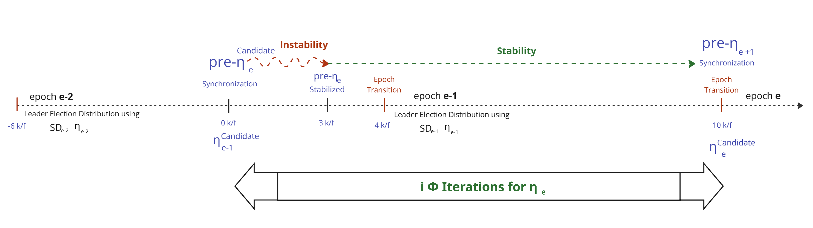
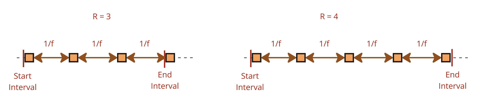
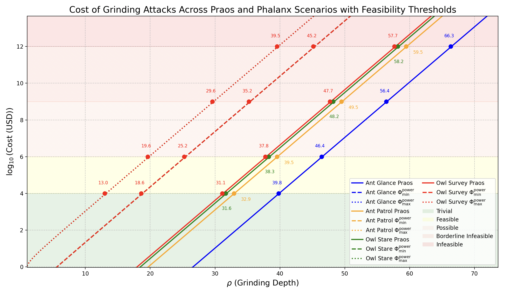

## Table of Contents

- [Abstract](#abstract)
- [Motivation: Why is this CIP necessary?](#motivation-why-is-this-cip-necessary)
- [Specification / The Φalanx Sub-Protocol](#specification--the-phalanx-sub-protocol)
  - [1. High-Level Changes Relative to Praos](#1-high-level-changes-relative-to-praos)
  - [2. The Streams](#2-the-streams)
    - [2.1 The η stream](#21-the-eta-stream)
    - [2.2 The pre-η Synchronizations](#22-the-pre-eta-synchronizations)
    - [2.3 The φ stream](#23-the-phi-stream)
    - [2.4 The η Generations](#24-the-eta-generations)
  - [3. Distribution of Φ Iterations](#3-distribution-of-phi-iterations)
    - [3.1 Challenge to solve](#31-challenge-to-solve)
    - [3.2 Solution Properties S.C.A.L.E](#32-solution-properties-scale)
    - [3.3 Computation Participation](#33-computation-participation)
    - [3.4 Slot Leader Schedule Visibility & pre-η Instability](#34-slot-leader-schedule-visibility--pre-eta-instability)
    - [3.5 The Algorithm](#35-the-algorithm)
    - [3.8 Agda Mechanization](#38-agda-mechanization)
  - [4. The Φ Cryptographic Primitive](#4-the-phi-cryptographic-primitive)
    - [4.1 Verifiable Delayed Functions](#41-verifiable-delayed-functions)
      - [4.1.1 Wesolowski's VDF](#411-wesolowskis-vdf)
      - [4.1.2 VDF's integration](#412-vdfs-integration)
  - [5. Recommended Parameterization](#5-recommended-parameterization)
- [Rationale: How This CIP Achieves Its Goals](#rationale-how-this-cip-achieves-its-goals)
  - [1. Φ_power & Adversarial Cost Overhead](#1-phi-power--adversarial-cost-overhead)
    - [1.1 Cost Overhead of a Grinding Attempt](#11-cost-overhead-of-a-grinding-attempt)
    - [1.2 Cost Overhead of a Grinding Attack](#12-cost-overhead-of-a-grinding-attack)
      - [1.2.1 Formula](#121-formula)
      - [1.2.2 Estimated Formula Using Mainnet Cardano Parameters](#122-estimated-formula-using-mainnet-cardano-parameters)
      - [1.2.3 Φ_power & Scenarios](#123-phi_textpower--scenarios)
  - [2. Adaptive Strategies for Efficient Φ Computation](#2-adaptive-strategies-for-efficient-phi-computation)
    - [2.4.3 Block-based approach](#243-block-based-approach)
  - [3. Performance Impacts on Consensus & Ledger Repository](#3-performance-impacts-on-consensus--ledger-repository)
  - [4. Maintainability](#4-maintainability)
  - [5. Cryptographic primitives](#5-cryptographic-primitives)
    - [5.1 Requirements](#51-requirements)
    - [5.2 Primitive selection](#52-primitive-selection)
      - [5.2.1 RSA solutions](#521-rsa-solutions)
      - [5.2.2 ECC solutions](#522-ecc-solutions)
      - [5.2.3 Class group solutions](#523-class-group-solutions)
      - [5.2.4 OWF solutions](#524-owf-solutions)
    - [5.3 Primitive recommendation](#53-primitive-recommendation)
- [Path to Active](#path-to-active)
  - [Acceptance Criteria](#acceptance-criteria)
  - [Implementation Plan](#implementation-plan)
- [References](#references)
- [Copyright](#copyright)

## Abstract

<!-- A short (\\\~200 word) description of the proposed solution and the technical issue being addressed. \-->

Addressing the "[Ouroboros Randomness Manipulation](../CPS/README.md)" **Problem**,  **Ouroboros Φalanx (Pronounced Phalanx)** enhances **Ouroboros Praos** to mitigate grinding attacks by **increasing the cost of leader election manipulation**. It extends **nonce generation from 1 epoch to 2**, introducing a **computationally intensive function** that remains efficient for honest participants but makes it **significantly more costly for adversaries to bias the process**.

A [**Phalanx**](https://en.wikipedia.org/wiki/Phalanx) is an **Ancient Greek military formation** where soldiers **stand in a tightly packed unit**, shielding and reinforcing one another to create a nearly impenetrable defense. This strategy made it far more difficult for enemies to break through compared to fighting individual soldiers.


In **Φalanx Protocol**, we apply this idea cryptographically by **enhancing the VRF-based randomness generation sub-protocol** with a cryptographic primitive that is **efficient for honest participants** but **computationally expensive for adversaries** attempting to bias leader election. While it won’t eliminate grinding attacks entirely, it **significantly increases their cost**, and our work focuses on **precisely quantifying this added expense**.

Please refer to the CPD "[Ouroboros Randomness Generation Sub-Protocol – The Coin-Flipping Problem](../CPS/CPD/README.md)" for a detailed understanding of **randomness generation, leader election in Praos, and the coin-flipping dilemma in consensus protocols**. Moving forward, we will **dive into the core details**, assuming you have the **relevant background** to understand the proposal.

## Motivation: why is this CIP necessary?

<!-- A clear explanation that introduces the reason for a proposal, its use cases and stakeholders. If the CIP changes an established design then it must outline design issues that motivate a rework. For complex proposals, authors must write a Cardano Problem Statement (CPS) as defined in CIP-9999 and link to it as the \`Motivation\`. -->

The "[Ouroboros Randomness Generation Sub-Protocol – The Coin-Flipping Problem](../CPS/CPD/README.md)" CPD reveals a significant vulnerability in **Ouroboros Praos**: adversaries controlling a substantial portion of stake can execute **grinding attacks** to manipulate leader election, compromising the protocol’s fairness and security. As detailed in [CPD Section 3.2 - Entry Ticket: Acquiring Stake to Play the Lottery](../CPS/CPD/README.md#32-entry-ticket-acquiring-stake-to-play-the-lottery), an adversary with **20% or more of the total stake** gains an exponential advantage in influencing randomness, with attack feasibility increasing rapidly as stake grows. This critical threshold is further explored in [CPD Section 3.6 - Grinding Power Computational Feasibility](../CPS/CPD/README.md#36-grinding-power-computational-feasibility), which shows that grinding attacks become computationally viable for well-resourced adversaries, particularly in the "Owl Survey" scenario, where costs remain within the "Possible" range (up to $\$1$ billion USD) for grinding depths ($\rho$) between 34 and 48.

The CPD analysis in [Section 3.5 - Scenarios](../CPS/CPD/README.md#35-scenarios) quantifies this vulnerability across four scenarios—Ant Glance, Ant Patrol, Owl Stare, and Owl Survey—highlighting the ranges of $\rho$ where attacks are feasible. The table below summarizes these ranges, showing the intervals where grinding attacks transition from trivial to infeasible:

| **Feasibility Category**                  | **🔵 Ant Glance**   | **🟠 Ant Patrol**   | **🟢 Owl Stare**   | **🔴 Owl Survey**   |
|--------------------------------------------|---------------------|---------------------|--------------------|--------------------|
| **🟢 🌱 Trivial for Any Adversary**        | $0 \to 39.8$        | $0 \to 32.9$        | $0 \to 31.6$       | $0 \to 31.1$       |
| **🟡 💰 Feasible with Standard Resources** | $39.8 \to 46.4$     | $32.9 \to 39.5$     | $31.6 \to 38.3$    | $31.1 \to 37.8$    |
| **🟠 🏭 Large-Scale Infrastructure Required** | $46.4 \to 56.4$  | $39.5 \to 49.5$     | $38.2 \to 48.2$    | $37.8 \to 47.7$    |
| **🔴 🚫 Borderline Infeasible**            | $56.4 \to 66.3$     | $49.5 \to 59.5$     | $48.2 \to 58.2$    | $47.7 \to 57.7$    |
| **🔴 🚫 Infeasible**                      | $66.3 \to 256$      | $59.5 \to 256$      | $58.2 \to 256$     | $57.7 \to 256$     |

This vulnerability is visually depicted in the graph below, which plots the logarithmic cost (in USD) of grinding attacks against grinding depth ($\rho$) for each scenario. The shaded feasibility layers indicate the economic thresholds where attacks become trivial, feasible, possible, borderline infeasible, or infeasible. The consistent gap of $\Delta \log_{10}(\text{Cost (USD)}) \approx 2.6$ between the least (Ant Glance) and most (Owl Survey) resource-intensive scenarios highlights how evaluation complexity ($T_{\text{eval}}$) and observation scope ($w_T$) significantly amplify attack costs :

<div align="center">

</div>

These findings indicate that, under current protocol parameters, grinding attacks are computationally viable at lower $\rho$ values for adversaries with significant resources. However, as highlighted in [CPD Section 3.2](../CPS/CPD/README.md#32-entry-ticket-acquiring-stake-to-play-the-lottery), executing such attacks requires a substantial upfront investment—acquiring 20% of the total stake, equivalent to over 4.36 billion ADA as of March 1, 2025—and the ability to operate covertly to avoid detection. Publicly observable grinding attempts expose adversarial stake pool operators (SPOs) to severe economic and social consequences, such as loss of trust, delegator withdrawals, or protocol-level countermeasures, which could devalue their stake and undermine their efforts. Despite these barriers, the potential for well-funded adversaries to bias randomness remains a threat to Cardano’s decentralized ethos, as it could skew block production and transaction settlement in their favor.

This CIP addresses the critical question: **Can we increase the computational cost of grinding attempts to shrink these vulnerable intervals, thereby deterring adversaries effectively?** Φalanx proposes a solution by introducing a computationally intensive mechanism that disproportionately burdens attackers while remaining manageable for honest participants. By elevating the resource threshold required for successful attacks, as analyzed in [CPD Section 3.4 - Cost of a Grinding Attack](../CPS/CPD/README.md#34-cost-of-a-grinding-attack), this CIP aims to shift the feasibility curve, making randomness manipulation prohibitively expensive and strengthening the protocol’s resilience against such threats.

## Specification / The Φalanx Sub-Protocol

<!-- The technical specification should describe the proposed improvement in sufficient technical detail. In particular, it should provide enough information that an implementation can be performed solely on the basis of the design in the CIP. This is necessary to facilitate multiple, interoperable implementations. This must include how the CIP should be versioned, if not covered under an optional Versioning main heading. If a proposal defines structure of on-chain data it must include a CDDL schema in its specification.-->

The core principle of the proposed protocol change is to **substantially escalate the computational cost of each grinding attempt for an adversary**. 

To achieve this, every honest participant is required to perform a designated computation for each block they produce over an epoch (**21,600 blocks**). Consequently, an adversary attempting a grinding attack must **recompute these operations for every single attempt**, while being **constrained by the grinding window**, which dramatically increases the resource expenditure. 

By enforcing this computational burden, we **drastically reduce the feasible number of grinding attempts** an adversary with a fixed resource budget can execute, making randomness manipulation **more expensive and significantly less practical**.
 

### 1. High-Level Changes Relative to Praos

In **Φalanx** , the randomness generation and leader election flows are modified as follows:


1. The **stake distribution stabilization phase** is shifted **back by one epoch :** The **active** **stake distribution** *SDe* used for leader election is now derived from the **end of $epoch_\text{e-3}$** instead of **$epoch_\text{e-2}$**  as in the original Praos protocol.  
2. The **honest contribution inclusion phase**, which originally resulted in a **ηₑ candidate**, is also **shifted back by one epoch**, aligning with the adjusted **stake distribution stabilization**. This value is now referred to as the **pre-ηₑ candidate**, signifying its role as an **intermediate randomness nonce** in the sub-protocol.  
3. The **ηₑ (randomness eta nonce)** undergoes an **additional sequence of incremental hashing** using a **new deterministic** **cryptographic primitive Φ (Phi)**, applied over a duration equivalent to a full epoch.


### 2. The Streams 

The Randomness Generation sub-protocol operates with two parallel streams: $`\eta^\text{stream}`$ and $`\phi^\text{stream}`$, which synchronize at the conclusion of the **Include Honest Contribution** Phase (akka Phase 2) :  


#### 2.1 **The $`\eta^\text{stream}`$** 
   - Already present in Praos and retained in Phalanx 
   - Updated with every block produced in the blockchain tree, a $`\eta^\text{stream}`$ captures intermediate values $`\eta^\text{evolving}_t`$ in the block headers, defined as follows:

```math
   \eta^{\text{evolving}}_{t+1} =
   \begin{cases}
   \text{ProtocolParameter}_\text{extraEntropy} & \text{when } t = 0, \\
   \eta^{\text{evolving}}_{t} ⭒ VRF^\text{Output}_\text{t+1} & \text{when BlockProduced}(t) \\
   \eta^{\text{evolving}}_{t}  & \text{otherwise.}
   \end{cases}
   
```
```math 
\text{BlockProduced}(t) = 
\begin{cases} 
true & \text{if a block is produced at time } t, \\
false & \text{otherwise.}
\end{cases}
```

| **where** ||
|---------------|-----------------|
| $`\text{ProtocolParameter}_\text{extraEntropy} `$ | The evolving nonce is initialized using the extraEntropy field defined in the protocol parameters.|
| $` VRF^\text{Output}_\text{i} `$ | The **VRF output** generated by the $` \text{slot}_\text{i} `$ Leader and included in the block header |
| $a⭒b$    | The concatenation of $a$ and $b$ , followed by a BLAKE2b-256 hash computation.


#### 2.2 The $`\text{pre-}\eta`$ Synchronizations  

- To generate $`\eta_\text{e}`$ for epoch $`e`$, the stream $`\phi^\text{stream}`$ is reset with the value of $`\eta^\text{stream}`$ at the end of Phase 2 in $`\text{epoch}_{e-2}`$. 
- This specific value of $`\eta^\text{stream}`$ is referred to as **$`\text{pre-}\eta_e`$**.


#### 2.3 The $`\phi^\text{stream}`$

- The stream depends on the selected cryptographic primitive and it is parametrizable with $i$, the total number of $`\Phi`$ iterations,
- The stream $`\phi^\text{stream}`$ is reset during each $`\text{pre-}\eta`$ synchronization.  
- At the synchronization point $`\text{pre-}\eta_{e+1}`$, the stream must guarantee delivery of $`\phi^\text{evolving}_e`$, defined as:
  
```math
  \phi^\text{evolving}_e = \Phi^i(\text{pre-}\eta_e)
```
- Between 2 consecutive resets, a subset of the blocks produced must append to their block header a unique intermediate value $\phi^\text{evolving}_x$, where $x \in {0, 1, \dotsc, i-1}$ denotes the progression index of the $\Phi$ computation(See the [**Distribution of Φ Iterations Approach**](#3-distribution-of-phi-iterations) below).


#### 2.4 The $`\eta`$** Generations
   - This is the final nonce $`\eta_\text{e}`$ used to determine participant eligibility during epoch $`e`$.  
   - It originates from the operation ⭒ with  $`\phi^{\text{stream}}_{t}`$ at $`\text{pre-}\eta_\text{e+1}`$ Synchronization and $`\eta^\text{stream}_t`$ $`\text{when } t = \text{end of epoch}_\text{e-3}`$   

```math
\eta_\text{e} = \eta^\text{stream}_{epoch_\text{e-3}} ⭒ \phi^\text{evolving}_e , \quad \text{when } t = \text{pre-}\eta_\text{e+1}\text{ synchronization } 
```
**Note** : $`\text{pre-}\eta_\text{e+1}`$ synchronization occurs $`\text{when } t = \text{end of phase 2 at epoch}_\text{e-1}`$


### 3. Distribution of $\Phi$ Iterations

#### 3.1 Challenge to solve 

**How can we ensure that, for a given epoch $e$, Stake Pool Operators (SPOs) can efficiently perform the $i$ iterations of $`\Phi`$ required to deterministically produce $`\phi^\text{evolving}_e`$, thereby enabling a more secure computation of $`\eta_e`$ than in the current Praos protocol?**

<div align="center">

</div>

#### 3.2  Solution Properties S.C.A.L.E

To ensure robust and efficient production of $`\phi^\text{evolving}_e`$,  $k(\text{pre-η},t)$ should aim to satisfy the following **SCALE** properties — prioritized in the order shown:

- **S**uccess Probability — Maximize the likelihood of deterministically producing $`\phi^\text{evolving}_e`$ without falling back to the Praos protocol.  
- **C**ompactness — Minimize block header size increase.  
- **A**vailability — Minimize additional latency in block diffusion.  
- **L**ightweight Execution — minimize redundant or wasteful iterations of $`\Phi`$ among the SPOs.  
- **E**agerness — Better to compute sooner than later.

These properties define the design space for secure, performant execution of $`\Phi`$ in each epoch.

**How can we ensure that each SPO uphold the **SCALE** properties and in particular neither compromises the Availability property nor fails to produce their block on time due to the added Phalanx computation?**


#### 3.3 Computation Participation

Regarding SPO participation in the protocol, we identify three possible models:

- **Centralized**: A single entity is responsible for the entire process. This model is strongly discouraged, as it introduces a textbook case of a single point of failure, undermining both resilience and decentralization.
- **Federated**: A selected subset of SPOs participates in the process. While this model improves over the centralized approach, it raises concerns of collusion, particularly the possibility of intentionally omitting the final iteration and reverting to the default Praos protocol. Additionally, participants could become targeted by adversaries, and governance mechanisms must be introduced to manage entry and exit from this privileged role.
- **Decentralized**: All SPOs participate in the additional computation phase. Unsurprisingly in our context, this is the most robust model, leveraging the existing infrastructure of SPOs who are already running the network and receiving rewards. 

Taking the decentralized approach, SPOs are expected to collectively compute the $i^{\text{th}}$ iteration of $\Phi$. 
The key question, then, is **how can we design effective incentives to ensure that this task is performed reliably and in a timely manner?**

#### 3.4 Slot Leader Schedule Visibility & $\text{pre-}\eta_e$ instability

**Regardless of the chosen approach**, each SPO knows their complete private schedule for $`\Phi`$ computation as soon as the slot leader distribution is revealed. Within this epoch-sized period:
- **During the interval $[0, \frac{3k}{f})$:**
  - SPOs are still operating in $`epoch_{\text{e-2}}`$, which means they know their schedule **$\frac{6k}{f}$ slots in advance**.
  - However, at this point, $\text{pre-}\eta_e$ remains a *candidate value* — not yet finalized. Multiple forks may still exist, each potentially initiating a distinct instance of $\Phi$.
  - As such, early iterations of $\Phi$ are **speculative**. If the canonical chain later stabilizes on a different fork than the one used during early computations, the associated $\text{pre-}\eta_e$ will change, and the corresponding $\Phi$ computation must be **discarded and restarted**.
  - **In short**, the closer we approach the fork stabilization point, the **higher the probability** that the selected $\text{pre-}\eta_e$ will remain, but rollback is still possible within this window.

- **During the interval $[\frac{3k}{f},\frac{4k}{f})$:**
  - SPOs are still operating in $`epoch_{\text{e-2}}`$, which means they know their schedule **$\frac{6k}{f}$ slots in advance**.
  - From this slot onward, $\text{pre-}\eta_e$ is fully stable, and all SPOs will execute $\Phi$ using the same seed, ensuring deterministic and aligned computations.
  - The slot leader distribution is finalized at $\frac{3k}{f}$-th slot, which means they know their schedule **$\frac{k}{f}$ slots in advance** for the next interval.

- **During the interval $[\frac{4k}{f}, \frac{10k}{f})$:**
  - SPOs are now in $`epoch_{\text{e-1}}`$.
  - Full visibility and full stability
  
The following visual highlights this situation:

<div align="center"></div>


#### 3.5 The Algorithm 

We will reuse the existing game-theoretic framework for block production in Praos (No Timely Iteration, No Block Reward) and require each stake pool operator (SPO), upon producing a block, to provide **a proof of computation performed—specifically, a proof that they have computed the *x*‑th iteration of $\Phi$**. 
In this approach, we divide the epoch-size equivalent period into $y$ intervals defined by the **redundancy parameter $R$**, which specifies the expected number of blocks per interval as follows:

<div align="center"></div> 

Each interval is characterized by:

- a **size** (in slots), derived from the redundancy parameter `R` and the active slot coefficient `f`:
    ```math
    \text{Interval size} = \frac{R}{f}
    ```

- a **start slot** and **end slot** for a given slot `t`, defined as:
    ```math
    \text{startInterval}(t) = \left\lfloor \frac{t}{\text{Interval size}} \right\rfloor \cdot \text{Interval size}
    ```
    ```math
    \text{endInterval}(t) = \left( \left\lfloor \frac{t}{\text{Interval size}} \right\rfloor + 1 \right) \cdot \text{Interval size} - 1
    ```

The core of the algorithm lies in how we distribute the iterations of $\Phi$ across these intervals. Ideally, we want to remain resilient—even in extreme cases such as a global outage causing **36 hours** (**30% of an epoch**) of consecutive downtime (see the [Cardano Disaster Recovery Plan](https://iohk.io/en/research/library/papers/cardano-disaster-recovery-plan)). To be optimal in the face of such rare but impactful events, we will adopt the strategy : **"Better Sooner Compute than Later."** 

In practice, this means **front-loading the computation** as much as possible during the early intervals of the computation phase. If a sequence of blockless intervals occurs, it is the responsibility of the **next non-blockless interval** to publish the proof corresponding to the $x^{\text{th}}$ iteration—where $x - 1$ was the index of the last successfully revealed proof before the interruption.

Let’s define a reasonable upper bound for each interval: **allocate at most half of its duration** to the computation of a single iteration of $`\Phi`$ : 
- $T_\phi^\text{max} = T_\phi =\frac{\text{Interval Size}}{2}$
- For instance, if $R = 10$, then the interval size is $\text{IntervalSize} = \frac{R}{f} = \frac{10}{1/20} = 200 \text{ slots} \approx 200\text{s}$ and we set a single iteration of $\Phi$ at $T_\phi = 100\text{s}$ from the very first interval.
- To **prevent an adversary from withholding a block** in the last interval (thus delaying the delivery of $`\phi^\text{evolving}_e`$), we define the final interval to be longer than the others—**long enough to ensure with 128-bit confidence** that **at least one block will be produced**. This requires approximately **1735 slots** of redundancy. We will call this interval the **Seal Interval**

<br>
<details>
<summary>🔍 Why 1735 Slots for the Seal Interval?</summary>
<p> 

To **prevent an adversary from withholding a block** in the final interval—thus **delaying the delivery of** $`\phi^\text{evolving}_e`$—we extend the final interval's duration. This phase, which we refer to as the **Cool-Down Phase**, must be long enough to ensure with overwhelming probability that **at least one honest block is produced**.

To quantify this requirement, we compute the minimum number of slots needed such that the **probability of observing at least one honest block** is greater than $1 - 2^{-128}$. This gives us **128-bit confidence**, matching common cryptographic security levels.

Let $p_h$ be the probability that a slot contains at least one honest leader. The probability that all $n$ slots in a window fail to produce a single honest leader is:

<div align="center">
$(1 - p_h)^n$
</div>

We want this to be less than $2^{-128}$:

<div align="center">
$(1 - p_h)^n < 2^{-128}$
</div>

Taking natural logarithms on both sides:

<div align="center">
$n \cdot \ln(1 - p_h) < -128 \cdot \ln(2)$
</div>

Solving for $n$:

<div align="center">
$n > \frac{-128 \cdot \ln(2)}{\ln(1 - p_h)}$
</div>

Assuming a typical $p_h \approx 0.05$ (derived from the active slot coefficient $f = 1/20$ and a high honest participation rate), we get:

<div align="center">
$n > \frac{-128 \cdot \ln(2)}{\ln(0.95)} \approx \frac{88.72}{-(-0.05129)} \approx 1730.8$
</div>

We round this up to **1735 slots** to ensure the bound is satisfied.

</p> 
</details>
<br><br>

Let's define then a parameter $\Phi_{\text{power}} \in [0, 1]$, which quantifies the proportion of the maximum allowable computational budget that is actually exercised by the network.

* $\Phi_{\text{power}} = 0$: no additional computation (no overhead),
* $\Phi_{\text{power}} = 1$: corresponds to the maximum cost we will impose on an adversary.

The total time allocated to all $\Phi$ computations across the computation phase is given by:

$$
T_\Phi = \Phi_{\text{power}} \cdot \frac{1}{2} \cdot ((1-0.3) \cdot \text{Computation Phase} - \text{Seal Interval}  ) = \Phi_{\text{power}} \cdot \frac{1}{2} \cdot (\frac{7k}{f} - 1735)
$$

To help visualize the computational implications of different $\Phi_{\text{power}}$ values, the table below provides:

- the total accumulated computation time $T_\Phi$ expressed as a human-readable duration (1 slot ~ 1 sec),
- the corresponding number of non-blockless intervals required to cover that budget, for various interval sizes $R$.
- Each cell in the table indicates how many intervals are needed to cover $T_\Phi$, relative to the total available intervals of that size within the computation phase.

| $\Phi_{\text{power}}$ | $T_\Phi$              | R=5 (100 slots)     | R=10 (200 slots)    | R=30 (600 slots)   | R=50 (1000 slots)   |
|------------------------|------------------------|-------------------|-------------------|-------------------|-------------------|
| 0.0                    | 0 minute               | 0 / 3006          | 0 / 1503          | 0 / 501           | 0 / 300           |
| 0.1                    | 4 hours 10 minutes     | 150 / 3006        | 75 / 1503         | 25 / 501          | 15 / 300          |
| 0.2                    | 8 hours 21 minutes     | 301 / 3006        | 150 / 1503        | 50 / 501          | 30 / 300          |
| 0.3                    | 12 hours 31 minutes    | 451 / 3006        | 226 / 1503        | 75 / 501          | 45 / 300          |
| 0.4                    | 16 hours 42 minutes    | 601 / 3006        | 301 / 1503        | 100 / 501         | 60 / 300          |
| 0.5                    | 20 hours 52 minutes    | 752 / 3006        | 376 / 1503        | 125 / 501         | 75 / 300          |
| 0.6                    | 1 day 1 hour 3 minutes | 902 / 3006        | 451 / 1503        | 150 / 501         | 90 / 300          |
| 0.7                    | 1 day 5 hours 13 min   | 1052 / 3006       | 526 / 1503        | 175 / 501         | 105 / 300         |
| 0.8                    | 1 day 9 hours 24 min   | 1203 / 3006       | 601 / 1503        | 200 / 501         | 120 / 300         |
| 0.9                    | 1 day 13 hours 34 min  | 1353 / 3006       | 676 / 1503        | 225 / 501         | 135 / 300         |
| 1.0                    | 1 day 17 hours 45 min  | 1503 / 3006       | 751 / 1503        | 250 / 501         | 150 / 300         |

Here are the durations of each interval size $R$, assuming 1 slot ≈ 1 second :

* **R = 5** → 100 slots → **1 minute 40 seconds**
* **R = 10** → 200 slots → **3 minutes 20 seconds**
* **R = 30** → 600 slots → **10 minutes**
* **R = 50** → 1000 slots → **16 minutes 40 seconds**

##### Proof Requirements

By default, in each interval, the first block produced must include a proof of work performed in order to be considered valid. Subsequent blocks produced within the same interval are exempt from this requirement. 

However, during the first $\frac{3 \cdot k}{f}$ slots, sudden rollbacks affecting the $\text{pre-}\eta_e$ seed may, under certain conditions, disrupt the immediate slot leaders' ability to produce timely blocks.

The **worst-case scenario** occurs when a rollback happens **at the very end of a computation interval**, and the **next scheduled slot leader** is positioned just after the **beginning of the following interval**. In such a case, the **Availability** property may be compromised: block production could be **delayed**, leading to **increased latency in block diffusion**, or worse, the block may arrive **too late** and be **rejected** by the network. 

The higher the value of $R$, the less likely this worst-case scenario will occur, as the computation load is spread over longer intervals. However, when such a situation does happen, the **amount of work required to catch up increases**, potentially impacting **multiple consecutive blocks**.  

A solution is to **relax the block validity requirements** when the gap between the last slot of the previous interval and the first slot leader of the current interval is **less than** the allocated computation time $T_\phi$. In this case, the **remaining slot leaders** within the interval—those whose gap exceeds $T_\phi$—are expected to provide the proof of the $x^{\text{th}}$ iteration of $\Phi$ :

📐 **Let:**

- $s_{\text{prev}} \in \mathbb{N}$: slot index of the **last block produced** in the previous interval  
- $s_{\text{next}} \in \mathbb{N}$: slot index of the **next leader** in the current interval  
- $s_{\text{first}} \in \mathbb{N} \cup \{\bot\}$: slot index of the **first block produced in the current interval with a proof**, if any  
- $T_\phi \in \mathbb{N}$: maximum allowed **computation time** (in slots) for one iteration of $\Phi$  
- $\Delta s \coloneqq s_{\text{next}} - s_{\text{prev}}$  
- $k \in \mathbb{N}$: **common prefix** security parameter  
- $f \in (0, 1]$: **active slot coefficient**  
- $i_{\text{last}} \in \mathbb{N}$: index of the **last $\Phi$ iteration** whose proof has been published  
- $i_{\text{final}} \in \mathbb{N}$: total number of required iterations of $\Phi$  
- $i_{\text{target}} \coloneqq i_{\text{last}} + 1$


✅ **Proof Production Rule**

A block produced at slot $s_{\text{next}}$ **must include a proof for** $\Phi^{i_{\text{target}}}$ **if and only if**:

```math
i_{\text{target}} \leq i_{\text{final}} \land 
\left( (s_{\text{prev}} > \frac{3k}{f} \land s_{\text{first}} = \bot \lor s_{\text{first}} = s_{\text{next}})\lor (\Delta s \geq T_\phi \land s_{\text{first}} = \bot \lor s_{\text{first}} = s_{\text{next}}) \right) 
```

In plain English:

1. **No more proofs are produced once all required iterations of** $`\Phi`$ **have been completed**. That is, if we’ve already computed and published all $`i_{\text{final}}`$ iterations, proof generation stops entirely.

2. **During the unstable phase of the epoch** (i.e. when a rollback that changes $`pre\text{-η}_e`$ is still possible), the **first block** produced in an interval **must include a proof** for $`\Phi^{i_{\text{target}}}`$ if the time elapsed since the previous block ($`\Delta s`$) is **greater than or equal to** the amount of time needed to compute one iteration of $`\Phi`$ ($`T_\phi`$).
   Any **subsequent blocks** within the same interval are **exempt from producing proofs**.

3. **Once we are in the stable phase** of the epoch (i.e. past the first $`\frac{3k}{f}`$ slots), then in each interval, **only the first block produced is allowed to include a proof**. All others in the same interval must not.

🚫 **Termination Condition**

If $i_{\text{target}} > i_{\text{final}}$ then **No further proofs are required.**


##### Scheduling

We define a threshold parameter $\Phi\_{\text{margin}} \in (1, \infty)$ that represents the **minimum required interval lead** to safely defer computation. Specifically, we require:

$$
\Phi_{\text{margin}} > \text{intervalIndex}(\text{nextSlotLeader}) - \text{intervalIndex}(\text{currentSlot})
$$

If this margin condition is **not satisfied**—i.e., the next slot leader is too close—we proactively begin computing the **remaining iterations of $\Phi$ locally**, rather than waiting for proofs to arrive on-chain.


#### 3.8. Agda Mechanization

### 4. The Φ Cryptographic Primitive

The Φ cryptographic primitive is a critical component of the Φalanx protocol, designed to increase the computational cost of grinding attacks while remaining efficient for honest participants. To achieve this, Φ must adhere to a set of well-defined properties that ensure its security, efficiency, and practical usability within the Cardano ecosystem. These properties are outlined in the table below :

| **Property**              | **Description**                                                                                                   |
|---------------------------|-------------------------------------------------------------------------------------------------------------------|
| **Functionality**         | Must be a well-defined mathematical function, ensuring a unique output for each given input (unlike proof-of-work, which allows multiple valid outputs). |
| **Determinism**           | Must be fully deterministic, with the output entirely determined by the input, eliminating non-deterministic variations. |
| **Efficient Verification**| Must allow for fast and lightweight verification, enabling rapid validation of outputs with minimal computational overhead. |
| **Compact Representation**| Input and output sizes should be small enough to fit within a block, optimizing on-chain storage efficiency. Further reductions are desirable where feasible. |
| **Lower Bound on Computation** | Computational cost of evaluation should be well-characterized and predictable, with a lower bound that is difficult to surpass, ensuring adversaries cannot gain an unfair efficiency advantage. |
| **Ease of Implementation & Maintenance** | Should be simple to implement and maintain, ensuring long-term usability and minimizing technical debt. |
| **Adaptive Security**     | Function and its parameters should be easily reconfigurable to accommodate evolving threats, such as advances in computational power or new cryptographic attacks. |

#### 4.1. Verifiable Delayed Functions

Verifiable Delayed Functions (VDFs) are cryptographic primitives designed to take a certain amount of time to compute, regardless of how much computing resources are avaialable. This delay is enforced by requiring a specific number of sequential steps that cannot be sped up through parallel processing. Once the computation is done, the result comes with a proof that can be checked quickly and efficiently by anyone. Importantly, for a given input, the output is always the same, ensuring consistency. They usually rely on repeatedly squaring numbers in a mathematical setting that prevents shortcuts and enables quick verification.

As one can see, VDFs present _functionality_, _determinism_, _efficient verification_ and _lower bound on computation_. The _compact representation_ depends on the chosen group as well as the instantiation, which we will tackle later on. The _implementation and maintenance_ is straightforward as the output of a VDF is a simple exponentiation of a group element, only the square operation is needed to be implemented to compute it. As for the proof, this depends on the precise VDF instantiation. Finally, the system is "adaptively secure" as we can set up a group with high security to be reused for a whole epoch, and set the number of squaring, also called difficulty, depending on how much computation we want the nodes to perform.

#### 4.1.1 Wesolowski's VDF

Verifiable Delayed Functions were introduced by Boneh et al. [6](https://eprint.iacr.org/2018/601.pdf) where the authors suggest several sequential functions combined with the use of proof systems in the incrementally verifiable computation framework (IVC) for viable proof generation and fast verification.
VDF variants revolve around two primary SNARK-free designs: one from Pietrzak [36](https://drops.dagstuhl.de/storage/00lipics/lipics-vol124-itcs2019/LIPIcs.ITCS.2019.60/LIPIcs.ITCS.2019.60.pdf) and the second from Wesolowski [35](https://eprint.iacr.org/2018/623.pdf). They differ in the proof design. 

In Wesolowski’s paper, the proof is defined as $x^{2^T} / l$ where $g$ is the challenge, $T$ the difficulty and $l$ is a prime number found by hashing the VDF input and output together.  The proof is thus a single group element that can be computed in at most $2 T$ group operations and constant space, or $(1+1/s) \cdot T$ time where the number $s$ is both the number of processors and space while the verification takes $log_2 T$ scalar multiplications in $\mathcal{Z}/l$ and two small exponentiations in the group $\mathbb{G}$. The proving time can further be optimized to $O(T /  log(T))$ group multiplications by reusing the evaluation intermediary results.
Wesolowski also presents aggregation and watermarking methods. The aggregation method does not consist in aggregating multiple proofs but computing a proof of several VDF challenges. This is done by batching all inputs and outputs together and creating a proof for this batched input. The watermarking is done by computing the VDF twice, once normally and another time on a combination of the challenger’s id and VDF input.

In Pietrzak’s paper, the proof is a tuple of group elements $\pi = \{x^{2^{T / 2^i}}\}$, of size logarithmic in $T$, that can be computed in $(1+2 \sqrt{T}^-1) T$ time and can be optimized to $O(\sqrt{T} \cdot log_2 T)$ multiplications, the verification takes $2 \cdot log_2T$ small exponentiations. Subsequent work on Pietrzak’s paper shows how VDFs challenges can be structured in a Merkle tree to get a proof of the whole tree.

We will choose Wesolowski design over Pietrzark because of its space efficiency and possibility to aggregate proofs.

#### 4.1.2 VDF's integration

Phalanx design is to run for each interval of slots a certain amount of computation, and prove this on-chain. As such, we can generate a new VDF group at every epoch and associate to each of its intervals a VDF challenge. The nodes will then publish in block’s the VDF output and proof.

To facilitate synching, we will add two accumulators that we will update every time an iteration is published _in the correct order_. If an interval has no block, we will refrain from updating the accumulators until the nodes have caught up and the missing iteration is published, in which case we will update the accumulators for all consecutive available iterations.
The last interval will include of aggregation for all iterations instead of a proof for the last iteration only.

We will use Wesolowski's VDF on _class groups_ to generate efficiently on the fly the group at each epoch. Class groups are entirely determined by their discriminant $\Delta$ that is a negative prime number with specific properties. As we intend to reuse the group for the whole epoch, which is necessary for aggregation, we will generate groups with bit of security, which means generate discriminants of length of at 3800 bits according to [4](https://arxiv.org/pdf/2211.16128).

As such, we add to a block the following four elements:
- $\textrm{Acc}_x$, the input accumulator,
- $\textrm{Acc}_y$, the output accumulator,
- $y_i$, the $\text{i}^\text{th}$ interval VDF's output,
- $\pi_i$, the $\text{i}^\text{th}$ interval VDF's proof.

We now show what happens at diverse points in time of the computation phase:
- Before the computation phase, and when the preseed $\text{pre-}\eta_e$ is stabilized, we compute the epoch's discriminant $\Delta$ using $\text{Hash}(\text{bin}(e) || \text{pre-}\eta_e)$ as seed which determines the group $\mathbb{G}$. Finally, we will initialize both accumulators to $1_\mathbb{G}$.
- To publish the first block of interval $i$, the node will compute the VDF input $x_i$ from the seed $\text{Hash}(\text{bin}(e) || \text{pre-}\eta_e || \text{bin}(i))$, its corrsponding output as well as a VDF proof of correctness. If there has been no missing iteration, the node will then compute $\alpha_i = \text{Hash} ( \dots  \text{Hash} (\text{Hash}( \text{Hash}(x_1\ ||\ \dots || x_n)\ ||\ y_1 )\ || y_2) \dots ||\ y_i)$ (note that $\alpha_i = \text{Hash}(\alpha_{i-1}\ ||\ y_i)$) and update the accumulator as follows: $\textrm{Acc}_x \leftarrow \textrm{Acc}_x \cdot x_i^{\alpha_i}$ and $\textrm{Acc}_y \leftarrow \textrm{Acc}_y \cdot y_i^{\alpha_i}$. If the accumulator has not been updated at a previous interval, because no block were published then, we will update the accumulators only when catching back the missing iteration, and updating the accumulators with all values $x_i$ and $y_i$ published in between.
- When publishing the last iteration, may it be in the last interval if there was no empty interval or in the catch-up period, we will update the accumulator and compute a proof of aggregation. This simply corresponds to a VDF proof on input $\textrm{Acc}_x$ and output $\textrm{Acc}_y$.
- When verifying a block, if the node is not synching, they will verify the VDF proof as well as the correct aggregation of the accumulators. If the node is synching, they will verify only the correct aggregation of the accumulators and verify the proof of aggregation at the end.

Let $\text{VDF}.\left(\text{Setup}, \text{Prove}, \text{Verify} \right)$ a class group based VDF algorithm definition, with:
- $(\mathbb{G}, \Delta, \cdot) \leftarrow \text{VDF}.\text{Setup}(\lambda)$: Takes as input a security parameter $\lambda$ and returns a group description $\mathbb{G}$ with discriminant $\Delta$ and operation $\cdot$. We will omit $\lambda$ and $\mathbb{G}$ for simplicity;
- $\left(y, \pi\right) \leftarrow \text{VDF}.\text{Prove}(x, T)$: Takes as input the challenge $x \in \mathbb{G}$ and difficulty $T \in \mathbb{N}$ and returns the VDF output $y = x^{2^T}$ and the VDF proof $\pi$;
- $\{0,1\} \leftarrow \text{VDF}.\text{Verify}(x,y,T,\pi)$: Returns 1 if the verification of $\pi$ is successful, that is $y == x^{2^T}$ with overwhelming probability, otherwise 0.

We furthermore introduce the two additional functions $\text{Hash}_\mathbb{G}(\cdot)$ a hash to the class group, and $\text{Hash}_\mathbb{N}^{(n)}(\cdot)$ a hash to the integers of size $n$ bits.

To publish a block, nodes needs to include the VDF output and proof of the interval. We define by $x_i \leftarrow \text{Hash}_\mathbb{G}(\text{pre-}\eta_e || i)$ the challenge for interval $i$ using the pre-seed $\text{pre-}\eta_e$ of the current computation phase. Nodes will thus have to compute $\left(y_i, \pi_i\right) \leftarrow \text{VDF}.\text{Prove}(x_i, T)$ and publish them on-chain. Nodes also may publish accumulators, if there is no missing iterations. They do so by generate a random coin as $\alpha_i = \text{Hash}_\mathbb{N}^{(\lambda)} ( \dots  \text{Hash}_\mathbb{N}^{(\lambda)} (\text{Hash}_\mathbb{N}^{(\lambda)}( \text{Hash}_\mathbb{N}^{(\lambda)}(x_1\ ||\ \dots || x_n)\ ||\ y_1 )\ || y_2) \dots ||\ y_i)$ (note that $\alpha_i = \text{Hash}_\mathbb{N}^{(\lambda)}(\alpha_{i-1}\ ||\ y_i)$) and update $\textrm{Acc}_x$ (resp. $\textrm{Acc}_y$) to $\textrm{Acc}_x \cdot x_i^{\alpha_i}$ (resp. to $\textrm{Acc}_y \cdot y_i^{\alpha_i}$).
When an iteration is missing, we shall wait until the network has caught up to respect the sequentiality of the $\alpha_i$.

When all iterations have been computed, we generate a proof of aggregation $\pi$ using the same proving algorithm on $\textrm{Acc}_x$, but without recomputing the VDF output which is $\textrm{Acc}_y$. Hence we have, $\left(\textrm{Acc}_y, \pi\right) \leftarrow \text{VDF}.\text{Prove}(\textrm{Acc}_x, T)$.


#### 4.1.3 Efficiency analysis

We will need to add to the block four group elements, each element can be compressed to $3/4 \cdot \text{log}(| \Delta|)$ bits, that is 11,400 bits in total for 3,800-bit-long discriminant, or half of it were we to not publish the accumulators and keep them in cache.

To publish a block, the node would need to perform $T$ squaring for the output computation and $O(T / \text{log}(T))$ operations for the proof generation, and update both accumulators with two hashes, exponentiations and multiplications in total if the interval's iteration was not already published and no iteration needs to be caught up. If an iteration needs to be caught up, the node would need to compute an additional proof and computation, and update the accumulators with $2\cdot m$ hashes, multiplications and exponentiations where $m$ is the number of consecutive iterations published after the missing iteration and now.

To verify a block, when not synching, the node would perform 2 hashes, 4 small exponentiations and 3 group multiplications. Over a whole epoch, with say $N$ intervals, we would thus need $2 \cdot N$ hashes, $4 \cdot N$ small exponentiations as well as $3 \cdot N$ group multiplications.
When synching, the node would only need to check the aggregation at each step and the aggregation proof for a total of $2\cdot N$ hashes, $2\cdot N + 1$ group multiplications and $2 \cdot (N+1) $ small exponentiations. Note that the exponentiations with the $\alpha_i$ are half as cheap as the ones in the proof verification. As such, were we not to do the aggregation, we would save 5,700 bits on the block, 2 small exponentiations and group multiplications per block but the synching node would however have to perform $2 \cdot N$ larger exponentiations instead of $2 \cdot N$ smaller ones and 2 larger ones.

Because the group generation algorithm is very efficient, we can re-generating a group every epoch easily. We can take advantage of this to reduce the security parameter such that it is still highly improbable to break the group within an epoch to reduce the size of the elements on-chain.

N.B. For future work, it could be interesting to snarkify the accumulators, their update and the proof verification to save space and potentially reduce the verification time. This would however increase the proving time significantly.


<center>

| $\|\Delta\|$ (bits) | $\#\text{iterations}$ | $\text{proving time}$ (s)$           | $\text{verification time}$ (ms)       |
| :-----------------: | :-------------------: | :----------------------------------: | :-----------------------------------: |
| $256$               |  100,000 	            | $0.181\ (\sigma =7.31 \cdot 10^-4)$  | $1.643\ (\sigma =1.15 \cdot 10^-2)$   |
|                     |  200,000 	            | $0.361\ (\sigma =7.32 \cdot 10^-4)$  | $3.188\ (\sigma =4.34 \cdot 10^-2)$   |
|                     |  500,000 	            | $0.887\ (\sigma =3.19 \cdot 10^-3)$  | $1.896\ (\sigma =1.04 \cdot 10^-1)$   |
|                     |  1,000,000 	          | $1.777\ (\sigma =1.01 \cdot 10^-2)$  | $1.740\ (\sigma =2.26 \cdot 10^-2)$   |
|                     |  2,000,000 	          | $3.531\ (\sigma =4.32 \cdot 10^-2)$  | $1.540\ (\sigma =1.82 \cdot 10^-2)$   |
|                     |  5,000,000 	          | $8.722\ (\sigma =5.89 \cdot 10^-2)$  | $1.650\ (\sigma =1.81 \cdot 10^-2)$   |
|                     |  10,000,000           | $17.365\ (\sigma =7.30 \cdot 10^-2)$ | $1.660\ (\sigma =3.08 \cdot 10^-2)$   |
| $512$               |  100,000 	            | $0.302\ (\sigma =6.86 \cdot 10^-3)$  | $2.000\ (\sigma =3.11 \cdot 10^-2)$   |
|                     |  200,000 	            | $0.592\ (\sigma =1.58 \cdot 10^-3)$  | $1.929\ (\sigma =2.39 \cdot 10^-2)$   |
|                     |  500,000 	            | $1.465\ (\sigma =1.66 \cdot 10^-2)$  | $2.205\ (\sigma =1.88 \cdot 10^-2)$   |
|                     |  1,000,000 	          | $2.944\ (\sigma =2.90 \cdot 10^-2)$  | $1.835\ (\sigma =3.93 \cdot 10^-2)$   |
|                     |  2,000,000 	          | $5.782\ (\sigma =1.56 \cdot 10^-2)$  | $1.961\ (\sigma =1.56 \cdot 10^-2)$   |
|                     |  5,000,000 	          | $14.333\ (\sigma =2.92 \cdot 10^-2)$ | $2.499\ (\sigma =2.93 \cdot 10^-2)$   |
|                     |  10,000,000           | $28.359\ (\sigma =5.73 \cdot 10^-2)$ | $5.041\ (\sigma =1.01 \cdot 10^1 )$   |
| $1,024$             |  100,000 	            | $0.529\  (\sigma =7.23 \cdot 10^-4)$ | $3.401\ (\sigma =3.34 \cdot 10^-2)$   |
|                     |  200,000 	            | $1.038\  (\sigma =8.52 \cdot 10^-4)$ | $3.214\ (\sigma =3.05 \cdot 10^-2)$   |
|                     |  500,000 	            | $2.559\  (\sigma =1.71 \cdot 10^-2)$ | $3.409\ (\sigma =8.85 \cdot 10^-2)$   |
|                     |  1,000,000 	          | $5.096\  (\sigma =1.75 \cdot 10^-2)$ | $3.584\ (\sigma =1.71 \cdot 10^-2)$   |
|                     |  2,000,000 	          | $10.064\ (\sigma =2.88 \cdot 10^-2)$ | $3.228\ (\sigma =1.39 \cdot 10^-2)$   |
|                     |  5,000,000 	          | $24.919\ (\sigma =4.70 \cdot 10^-2)$ | $3.787\ (\sigma =1.20 \cdot 10^-2)$   |
|                     |  10,000,000           | $49.478\ (\sigma =7.79 \cdot 10^-2)$ | $3.895\ (\sigma =2.80 \cdot 10^-2)$   |


Table 1. VDF benchmarks, means and standard deviation, perfomed on a discriminant $\Delta$ of different sizes and with a range of iterations on one core of Intel(R) Core(TM) i9-14900HX (2.2 GHz base frequency, 24 cores, 32 threads).
</center>

### 5. Recommended Parameterization

**(To be completed)**

We currently identify the following key parameters:

- $\Phi_{\text{power}}$
- $\Phi_{\text{margin}}$
- $R$
- (To be added: parameters related to the cryptographic primitive)


## Rationale: How does this CIP achieve its goals?
<!-- The rationale fleshes out the specification by describing what motivated the design and what led to particular design decisions. It should describe alternate designs considered and related work. The rationale should provide evidence of consensus within the community and discuss significant objections or concerns raised during the discussion.

It must also explain how the proposal affects the backward compatibility of existing solutions when applicable. If the proposal responds to a CPS, the 'Rationale' section should explain how it addresses the CPS, and answer any questions that the CPS poses for potential solutions.
-->

### 1. $Φ_\text{power}$ & Adversarial Cost Overhead
#### 1.1 Cost Overhead of a grinding attempt

In **Φalanx**, we introduce an additional **computational cost**, denoted $T_\Phi$, for each **grinding attempt**. This cost represents the total cumulative effort required to compute $i$ iterations of the $\Phi$ primitive. It is defined as follows:

```math
T_\Phi = \Phi_{\text{power}} \cdot \frac{1}{2} \cdot \frac{9k}{f}
```

where:  
- $T_\Phi$ is the total cost (in seconds, assuming 1 slot ≈ 1 second) for a single grinding attempt under Φalanx,  
- $\Phi_{\text{power}} \in [0,1]$ is a tunable parameter controlling the difficulty of computing the $\Phi$ function,  
- $\frac{1}{2}$ is a deliberate margin: honest participants are guaranteed **twice the time** adversaries have to perform the $\Phi$ iterations,  
- $k$ is the common prefix parameter,  
- $f$ is the active slot coefficient,  
- $\frac{9k}{f}$ defines the number of slots within the **Computation Phase** (e.g., $388,\!800$ slots when $k = 2,\!160$ and $f = 0.05$).


This additional cost directly impacts the total estimated **time per grinding attempt**, as originally defined in [CPD Section 3.3.4 - Total Estimated Time per Grinding Attempt](../CPS/CPD/README.md#334-total-estimated-time-per-grinding-attempt). The baseline grinding time in **Praos** is:

```math
T_{\text{grinding}}^{\text{Praos}} = \frac{\rho}{2} T_{\text{BLAKE2b}} + w_T \cdot ( T_{\mathsf{VRF}} + T_{\text{eligibility}} ) + T_{\text{eval}}
```

With **Φalanx**, the total grinding time per attempt is updated to include $T_\Phi$:

```math
T_{\text{grinding}}^{\text{Phalanx}} = \frac{\rho}{2} T_{\text{BLAKE2b}} + w_T \cdot ( T_{\mathsf{VRF}} + T_{\text{eligibility}} ) + T_{\text{eval}} + T_\Phi 
```

Substituting $T_\Phi$ with the expression above, the final grinding time per attempt under **Φalanx** becomes:

```math
T_{\text{grinding}}^{\text{Phalanx}} = \frac{\rho}{2} T_{\text{BLAKE2b}} + w_T \cdot ( T_{\mathsf{VRF}} + T_{\text{eligibility}} ) + T_{\text{eval}} + \Phi_{\text{power}} \cdot \frac{1}{2} \cdot \frac{9k }{f}
```

With **Cardano mainnet parameters** ($k = 2,\!160$, $f = 0.05$), this simplifies to:

```math
T_{\text{grinding}}^{\text{Phalanx}} = \frac{\rho}{2} T_{\text{BLAKE2b}} + w_T \cdot ( T_{\mathsf{VRF}} + T_{\text{eligibility}} ) + T_{\text{eval}} + \Phi_{\text{power}} \cdot 1.944 \cdot 10^5 
```

Where:  
- $T_{\mathsf{VRF}}$ is the **VRF evaluation time**,  
- $T_{\text{eligibility}}$ is the **eligibility check time**,  
- $T_{\text{BLAKE2b}}$ is the time for the **hashing operation**,  
- $w_T$ is the **target window size** (seconds),  
- $\rho$ is the **grinding depth**,  
- $T_{\text{eval}}$ is the **nonce selection and evaluation time** (**attack-specific**).


The introduction of $T_\Phi$ substantially increases the **computational burden** for adversaries, as they must **recompute** the $\Phi^i$ function for each of the $2^\rho$ possible **nonces** evaluated during a grinding attack. In contrast, for **honest participants**, this computation is **distributed** across the epoch, ensuring it remains **manageable and efficient**. 


### 1.2 Cost Overhead of a Grinding Attack

Building on the updated **grinding time formula** introduced in the previous section, which incorporates the additional **computational cost** $T_\Phi$, we can now revise the formula for a grinding attack from [CPD Section 3.4.1 - Formula](https://github.com/cardano-foundation/CIPs/tree/master/CPS-0021/CPS/CPD/README.md#341-formula), where we defined a total attack time that must fit within the **grinding opportunity window** $w_O$:

```math
\frac{2^{\rho} \cdot T_{\text{grinding}}^{\text{Phalanx}}}{N_{\text{CPU}}} \leq w_O
```
which leads to the lower bound on computational power ($N_\text{CPU}$) : 

```math
N_{\text{CPU}} \geq \left \lceil \frac{2^{\rho} \cdot T_{\text{grinding}}^{\text{Phalanx}}}{w_O} \right \rceil
```

#### 1.2.1 Formula

##### Expanding $T_{\text{grinding}}^{\text{Phalanx}}$
From **Section 1.1**, the per-attempt grinding time under **Φalanx** is:

```math
T_{\text{grinding}}^{\text{Phalanx}} = \frac{\rho}{2} T_{\text{BLAKE2b}} + w_T \cdot ( T_{\mathsf{VRF}} + T_{\text{eligibility}} ) + T_{\text{eval}} + \Phi_{\text{power}} \cdot \frac{1}{2} \cdot \frac{9k }{f}
```

Substituting this into the inequality:

```math
N_{\text{CPU}} \geq \left \lceil \frac{2^{\rho} \cdot \left( \frac{\rho}{2} T_{\text{BLAKE2b}} + w_T \cdot ( T_{\mathsf{VRF}} + T_{\text{eligibility}} ) + T_{\text{eval}} + \Phi_{\text{power}} \cdot \frac{1}{2} \cdot \frac{9k }{f} \right)}{w_O} \right \rceil
```

##### Expanding $w_O$ in Terms of $\rho$ and $f$
From previous sections, the **grinding opportunity window** is defined as:

```math
\frac{X_A(w)}{f} \leq w_O \leq \frac{w}{f}
```

Assuming the upper bound $w_O = \frac{w}{f}$ (worst-case scenario for the adversary), and noting that $w < 2 \cdot \rho - 1$ as per [CPD Section 3.4.1](https://github.com/cardano-foundation/CIPs/tree/master/CPS-0021/CPD#341-formula), we substitute $w_O$:

```math
N_{\text{CPU}} \geq \left \lceil f \cdot \frac{2^{\rho} \cdot \left( \frac{\rho}{2} T_{\text{BLAKE2b}} + w_T \cdot ( T_{\mathsf{VRF}} + T_{\text{eligibility}} ) + T_{\text{eval}} + \Phi_{\text{power}} \cdot \frac{1}{2} \cdot \frac{9k }{f} \right)}{w} \right \rceil
```

Since $w < 2 \cdot \rho - 1$, we can use this bound to simplify:

```math
N_{\text{CPU}} \geq \left \lceil f \cdot \frac{2^{\rho} \cdot \left( \frac{\rho}{2} T_{\text{BLAKE2b}} + w_T \cdot ( T_{\mathsf{VRF}} + T_{\text{eligibility}} ) + T_{\text{eval}} + \Phi_{\text{power}} \cdot \frac{1}{2} \cdot \frac{9k }{f} \right)}{2 \cdot \rho - 1} \right \rceil
```

To derive a more explicit expression, we distribute the terms:

```math
N_{\text{CPU}} \geq \left \lceil f \cdot 2^{\rho} \cdot \frac{\frac{\rho}{2} T_{\text{BLAKE2b}} + w_T \cdot ( T_{\mathsf{VRF}} + T_{\text{eligibility}} ) + T_{\text{eval}} + \Phi_{\text{power}} \cdot \frac{1}{2} \cdot \frac{9k \cdot T_\phi}{f}}{2 \cdot \rho - 1} \right \rceil
```

Simplify by breaking it down:

```math
N_{\text{CPU}} \geq \left \lceil f \cdot 2^{\rho} \cdot \left( \frac{\frac{\rho}{2} T_{\text{BLAKE2b}}}{2 \cdot \rho - 1} + \frac{w_T \cdot ( T_{\mathsf{VRF}} + T_{\text{eligibility}} )}{2 \cdot \rho - 1} + \frac{T_{\text{eval}}}{2 \cdot \rho - 1} + \frac{\Phi_{\text{power}} \cdot \frac{1}{2} \cdot \frac{9k }{f}}{2 \cdot \rho - 1} \right) \right \rceil
```

This can be rewritten as:

```math
N_{\text{CPU}} \geq \left \lceil f \cdot 2^{\rho} \cdot \left( \frac{\rho T_{\text{BLAKE2b}}}{2 (2 \cdot \rho - 1)} + \frac{w_T \cdot ( T_{\mathsf{VRF}} + T_{\text{eligibility}} )}{2 \cdot \rho - 1} + \frac{T_{\text{eval}}}{2 \cdot \rho - 1} + \frac{\Phi_{\text{power}} \cdot 9k }{2 f \cdot (2 \cdot \rho - 1)} \right) \right \rceil
```

To align with the form provided in the query, we aim for a lower bound expression. Recognizing that $2 \cdot \rho - 1 \approx 2 \rho$ for large $\rho$, we approximate:

```math
N_{\text{CPU}} > \left \lceil f \cdot 2^{\rho-2} \cdot T_{\text{BLAKE2b}} + f \cdot 2^{\rho} \cdot \frac{w_T \cdot ( T_{\mathsf{VRF}} + T_{\text{eligibility}} ) + T_{\text{eval}}}{2 \cdot \rho - 1} + f \cdot 2^{\rho} \cdot \frac{\Phi_{\text{power}} \cdot 9k }{2 f \cdot (2 \cdot \rho - 1)} \right \rceil
```

Further simplifying:

```math
N_{\text{CPU}} > \left \lceil f \cdot 2^{\rho-2} \cdot T_{\text{BLAKE2b}} + \frac{f \cdot 2^{\rho}}{2 \cdot \rho - 1} \cdot \left( w_T \cdot ( T_{\mathsf{VRF}} + T_{\text{eligibility}} ) + T_{\text{eval}} + \Phi_{\text{power}} \cdot \frac{9k }{f} \right) \right \rceil
```

For large $\rho$, $\frac{2^{\rho}}{2 \cdot \rho - 2} \approx \frac{2^{\rho}}{2 \rho} = \frac{2^{\rho-1}}{\rho}$, so:

```math
N_{\text{CPU}} > \left \lceil f \cdot 2^{\rho-2} \cdot T_{\text{BLAKE2b}} + \frac{f}{\rho} \cdot 2^{\rho-1} \cdot \left( w_T \cdot ( T_{\mathsf{VRF}} + T_{\text{eligibility}} ) + T_{\text{eval}} + \Phi_{\text{power}} \cdot \frac{9k }{f} \right) \right \rceil
```

Finally, we can express the $\Phi$ term more explicitly:

```math
N_{\text{CPU}} > \left \lceil f \cdot 2^{\rho-2} \cdot T_{\text{BLAKE2b}} + \frac{f}{\rho} \cdot 2^{\rho-1} \cdot \left( w_T \cdot ( T_{\mathsf{VRF}} + T_{\text{eligibility}} ) + T_{\text{eval}} \right) + \frac{\Phi_{\text{power}} \cdot 9k \cdot 2^{\rho-1}}{\rho} \right \rceil
```

#### 1.2.2 Estimated Formula Using Mainnet Cardano Parameters

Starting from the final expression at the end of the last section:

```math
N_{\text{CPU}} > \left \lceil f \cdot 2^{\rho-2} \cdot T_{\text{BLAKE2b}} + \frac{f}{\rho} \cdot 2^{\rho-1} \cdot \left( w_T \cdot ( T_{\mathsf{VRF}} + T_{\text{eligibility}} ) + T_{\text{eval}} \right) + \frac{\Phi_{\text{power}} \cdot 9k \cdot 2^{\rho-1}}{\rho} \right \rceil
```

#### Applying Cardano Mainnet Parameters
Using Cardano’s mainnet values:
- $T_{\mathsf{VRF}} = 10^{-6}$ seconds (1 microsecond) – Time to evaluate a Verifiable Random Function.
- $T_{\text{BLAKE2b}} = 10^{-8}$ seconds (0.01 microseconds) – Time for a BLAKE2b-256 hash operation.
- $f = \frac{1}{20} = 0.05$ – Active slot coefficient.
- $k = 2160$
- Slot duration = 1 second.

Since the eligibility check is negligible, set $T_{\text{eligibility}} \approx 0$:

Substitute into the expression:

- First term: $f \cdot 2^{\rho-2} \cdot T_{\text{BLAKE2b}} = 0.05 \cdot 2^{\rho-1} \cdot 10^{-8} = 5 \cdot 10^{-10} \cdot 2^{\rho-1}$,
- Second term: $\frac{f}{\rho} \cdot 2^{\rho-1} \cdot \left( w_T \cdot ( T_{\mathsf{VRF}} + T_{\text{eligibility}} ) + T_{\text{eval}} \right) = \frac{0.05}{\rho} \cdot 2^{\rho-1} \cdot \left( w_T \cdot (10^{-6} + 0) + T_{\text{eval}} \right) = \frac{0.05 \cdot 2^{\rho-1}}{\rho} \cdot (10^{-6} w_T + T_{\text{eval}})$.
- Third term (with $k = 2160$):

```math
  \frac{9 \cdot 2160 \cdot \Phi_{\text{power}} \cdot 2^{\rho - 1}}{\rho} = \frac{1.9440 \cdot 10^4 \cdot\Phi_{\text{power}} \cdot 2^{\rho - 1}}{\rho} \approx  \frac{10^4 \cdot\Phi_{\text{power}} \cdot 2^{\rho}}{\rho}
```

The estimated number of CPUs required is:

```math
N_{\text{CPU}} > \left \lceil
5 \cdot 10^{-10} \cdot 2^{\rho - 2} +
\frac{5 \cdot 10^{-8} \cdot 2^{\rho - 1}}{\rho} \cdot w_T +
\frac{5 \cdot 10^{-2} \cdot 2^{\rho - 1}}{\rho} \cdot T_{\text{eval}} +
\frac{10^4\cdot \Phi_{\text{power}} \cdot 2^{\rho}}{\rho}
\right \rceil
```


#### 1.2.3 $\Phi_\text{power}$ & Scenarios


This increased **grinding time** directly affects the number of **CPUs** ($N_{\text{CPU}}$) required for an **adversary** to execute a grinding attack within the **grinding opportunity window** $w_O$. 

By varying $\Phi_{\text{power}}$, we can explore how the **computational overhead scales** and assess its effectiveness in **deterring adversaries**. To  evaluate the **impact of Φalanx** on grinding attack feasibility, we introduce an additional dimension to our analysis by incorporating extreme values of $\Phi_{\text{power}}$. 

These extremes—ranging from a minimal computational burden to the maximum feasible overhead—allow us to test the protocol's robustness across a wide spectrum of adversarial conditions. By extending the four scenarios defined in [CPD Section 3.5 - Scenarios](https://github.com/input-output-hk/ouroboros-anti-grinding-design/blob/main/CPS/Readme.md#35-scenarios)—**Ant Glance**, **Ant Patrol**, **Owl Stare**, and **Owl Survey**—with Φalanx-enhanced versions, we can quantify how these computational costs reshape the feasibility of attacks compared to the baseline **Praos** protocol.

These scenarios use an **animal-inspired metaphor** to reflect **evaluation complexity** ($T_{\text{eval}}$) and **observation scope** ($w_T$), providing a basis for comparing the **computational cost** under **Praos**. We incorporate the additional **computational cost** $T_\Phi$, with:
  - **$\Phi^\text{power}_\text{min}$**: 2% capacity ($\Phi_{\text{power}} = 0.02$), which yields an accumulated time of $T_\Phi = 3.888 \times 10^3 \, \text{seconds}$ (approximately 1 hour and 5 minutes).
  - **$\Phi^\text{power}_\text{max}$**: 100% capacity ($\Phi_{\text{power}} = 1$), which yields an accumulated time of $T_\Phi = 1.944 \times 10^5 \, \text{seconds}$ (approximately 54 hours or 2 days and 6 hours).

The table below summarizes the **Accumulated Computation Time** ($T_\Phi$) for various $\Phi_{\text{power}}$ values, illustrating the range of computational overheads introduced by Φalanx:

| $\Phi_{\text{power}}$ | Accumulated Computation Time |
|-----------------------|------------------------------|
| 0.0                   | 0 minutes                    |
| 0.02                  | 1 hour 5 minutes             |
| 0.05                  | 2 hours 42 minutes           |
| 0.1                   | 5 hours 24 minutes           |
| 0.2                   | 10 hours 48 minutes          |
| 0.3                   | 16 hours 12 minutes          |
| 0.4                   | 21 hours 36 minutes          |
| 0.5                   | 1 day 3 hours                |
| 0.6                   | 1 day 8 hours 24 minutes     |
| 0.7                   | 1 day 13 hours 48 minutes    |
| 0.8                   | 1 day 19 hours 12 minutes    |
| 0.9                   | 2 days 35 minutes            |
| 1.0                   | 2 days 6 hours               |

The table highlights the computational burden for $`\Phi^\text{power}_\text{min} = 0.02`$ and $`\Phi^\text{power}_\text{max} = 1.0`$, which we use to extend the scenarios. 

The following table summarizes the scenarios, including their $T_{\text{eval}}$ (evaluation complexity) and $w_T$ (observation scope), and extends them to Φalanx-enhanced versions with the additional computational cost $T_\Phi$:

| **Scenario**            | **$T_{\text{eval}}$ (Complexity)** | **$w_T$ (Scope)** | **Description**                                                                 |
|--------------------------|------------------------------------|-------------------|---------------------------------------------------------------------------------|
| **Ant Glance Praos**     | $0 \, \text{s}$                   | $1 \, \text{h}$  | An **ant** quickly **glancing** at a small spot, representing **simple evaluation** (low $T_{\text{eval}}$) with **basic effort** and a **narrow observation scope** (small $w_T$). |
| **Ant Glance $\Phi^\text{power}_\text{min}$** | $0 \, \text{s}$                   | $1 \, \text{h}$  | An **ant glancing** with **Phalanx’s minimal** $\Phi$ cost, adding **moderate effort** due to $T_\Phi = 3.888 \times 10^3 \, \text{s}$. |
| **Ant Glance $\Phi^\text{power}_\text{max}$** | $0 \, \text{s}$                   | $1 \, \text{h}$  | An **ant glancing** with **Phalanx’s maximal** $\Phi$ cost, **significantly increasing effort** due to $T_\Phi = 1.944 \times 10^5 \, \text{s}$. |
| **Ant Patrol Praos**     | $0 \, \text{s}$                   | $5 \, \text{d}$  | An **ant patrolling** a **wide area** over time with **simple instincts**, representing **simple evaluation** (low $T_{\text{eval}}$) with **basic effort** and a **broad observation scope** (large $w_T$). |
| **Ant Patrol $\Phi^\text{power}_\text{min}$** | $0 \, \text{s}$                   | $5 \, \text{d}$  | An **ant patrolling** with **Phalanx’s minimal** $\Phi$ cost, adding **moderate effort** due to $T_\Phi = 3.888 \times 10^3 \, \text{s}$. |
| **Ant Patrol $\Phi^\text{power}_\text{max}$** | $0 \, \text{s}$                   | $5 \, \text{d}$  | An **ant patrolling** with **Phalanx’s maximal** $\Phi$ cost, **significantly increasing effort** due to $T_\Phi = 1.944 \times 10^5 \, \text{s}$. |
| **Owl Stare Praos**      | $1 \, \text{s}$                  | $1 \, \text{h}$  | An **owl staring intently** at a **small area** with **keen focus**, representing **complex evaluation** (high $T_{\text{eval}}$) with **advanced effort** and a **narrow observation scope** (small $w_T$). |
| **Owl Stare $\Phi^\text{power}_\text{min}$** | $1 \, \text{s}$                  | $1 \, \text{h}$  | An **owl staring** with **Phalanx’s minimal** $\Phi$ cost, adding **moderate effort** due to $T_\Phi = 3.888 \times 10^3 \, \text{s}$. |
| **Owl Stare $\Phi^\text{power}_\text{max}$** | $1 \, \text{s}$                  | $1 \, \text{h}$  | An **owl staring** with **Phalanx’s maximal** $\Phi$ cost, **significantly increasing effort** due to $T_\Phi = 1.944 \times 10^5 \, \text{s}$. |
| **Owl Survey Praos**     | $1 \, \text{s}$                  | $5 \, \text{d}$  | An **owl surveying** a **wide range** with **strategic awareness**, representing **complex evaluation** (high $T_{\text{eval}}$) with **advanced effort** and a **broad observation scope** (large $w_T$). |
| **Owl Survey $\Phi^\text{power}_\text{min}$** | $1 \, \text{s}$                  | $5 \, \text{d}$  | An **owl surveying** with **Phalanx’s minimal** $\Phi$ cost, adding **moderate effort** due to $T_\Phi = 3.888 \times 10^3 \, \text{s}$. |
| **Owl Survey $\Phi^\text{power}_\text{max}$** | $1 \, \text{s}$                  | $5 \, \text{d}$  | An **owl surveying** with **Phalanx’s maximal** $\Phi$ cost, **significantly increasing effort** due to $T_\Phi = 1.944 \times 10^5 \, \text{s}$. |


The **$N_{\text{CPU}}$ formulas** are derived by **substituting** the respective **$w_T$** and **$T_{\text{eval}}$ values** from each **scenario** into the **base expression** from **Section 1.2.2**:

```math
N_{\text{CPU}} > \left \lceil
5 \cdot 10^{-10} \cdot 2^{\rho - 2} +
\frac{5 \cdot 10^{-8} \cdot 2^{\rho - 1}}{\rho} \cdot w_T +
\frac{5 \cdot 10^{-2} \cdot 2^{\rho - 1}}{\rho} \cdot T_{\text{eval}} +
\frac{200 \cdot 2^\rho}{\rho}
\right \rceil \quad \text{for } \Phi^\text{power}_\text{min}
```

```math
N_{\text{CPU}} > \left \lceil
5 \cdot 10^{-10} \cdot 2^{\rho - 2} +
\frac{5 \cdot 10^{-8} \cdot 2^{\rho - 1}}{\rho} \cdot w_T +
\frac{5 \cdot 10^{-2} \cdot 2^{\rho - 1}}{\rho} \cdot T_{\text{eval}} +
\frac{10^4 \cdot 2^\rho}{\rho}
\right \rceil \quad \text{for } \Phi^\text{power}_\text{max}
```

| **Scenario**            | **$N_{\text{CPU}}$ Formula**                                                                                     |
|--------------------------|-----------------------------------------------------------------------------------------------------------------|
| **Ant Glance Praos**     | $5 \cdot 10^{-10} \cdot 2^{\rho-2} + 1.8  \cdot 10^{-4} \cdot \frac{2^{\rho-1}}{\rho}$                      |
| **Ant Glance $\Phi^\text{power}_\text{min}$** | $5 \cdot 10^{-10} \cdot 2^{\rho - 2} + 1.8 \cdot 10^{-4} \cdot \frac{2^{\rho - 1}}{\rho} + \frac{200 \cdot 2^\rho}{\rho}$ |
| **Ant Glance $\Phi^\text{power}_\text{max}$** | $5 \cdot 10^{-10} \cdot 2^{\rho - 2} + 1.8 \cdot 10^{-4} \cdot \frac{2^{\rho - 1}}{\rho} + \frac{10^4 \cdot 2^\rho}{\rho}$ |
| **Ant Patrol Praos**     | $5 \cdot 10^{-10} \cdot 2^{\rho-2} + 2.16 \cdot 10^{-2} \cdot \frac{2^{\rho-1}}{\rho}$                   |
| **Ant Patrol $\Phi^\text{power}_\text{min}$** | $5 \cdot 10^{-10} \cdot 2^{\rho - 2} + 2.16 \cdot 10^{-2} \cdot \frac{2^{\rho - 1}}{\rho} + \frac{200 \cdot 2^\rho}{\rho}$ |
| **Ant Patrol $\Phi^\text{power}_\text{max}$** | $5 \cdot 10^{-10} \cdot 2^{\rho - 2} + 2.16 \cdot 10^{-2} \cdot \frac{2^{\rho - 1}}{\rho} + \frac{10^4 \cdot 2^\rho}{\rho}$ |
| **Owl Stare Praos**      |$5 \cdot 10^{-10} \cdot 2^{\rho-2} + 5.02 \cdot 10^{-2} \cdot \frac{2^{\rho-1}}{\rho}$|
| **Owl Stare $\Phi^\text{power}_\text{min}$** | $5 \cdot 10^{-10} \cdot 2^{\rho - 2} + 5.02 \cdot 10^{-2} \cdot \frac{2^{\rho - 1}}{\rho} + \frac{200 \cdot 2^\rho}{\rho}$ |
| **Owl Stare $\Phi^\text{power}_\text{max}$** | $5 \cdot 10^{-10} \cdot 2^{\rho - 2} + 5.02 \cdot 10^{-2} \cdot 10^{-2} \cdot \frac{2^{\rho - 1}}{\rho} + \frac{10^4 \cdot 2^\rho}{\rho}$ |
| **Owl Survey Praos**     | $5 \cdot 10^{-10} \cdot 2^{\rho-2} + 7.16 \cdot 10^{-2} \cdot \frac{2^{\rho-1}}{\rho}$ |
| **Owl Survey $\Phi^\text{power}_\text{min}$** | $5 \cdot 10^{-10} \cdot 2^{\rho - 2} + 7.16 \cdot 10^{-2} \cdot 10^{-2} \cdot \frac{2^{\rho - 1}}{\rho} + \frac{200 \cdot 2^\rho}{\rho}$ |
| **Owl Survey $\Phi^\text{power}_\text{max}$** | $5 \cdot 10^{-10} \cdot 2^{\rho - 2} + 7.16 \cdot 10^{-2} \cdot 10^{-2} \cdot \frac{2^{\rho - 1}}{\rho} + \frac{10^4 \cdot 2^\rho}{\rho}$ |


The **graph below** illustrates the **logarithmic cost** (in **USD**) of **grinding attacks** across **Praos** and **Phalanx scenarios** as a function of **grinding depth** ($\rho$). **Solid lines** represent the **original Praos scenarios** (Ant Glance, Ant Patrol, Owl Stare, and Owl Survey), **dashed lines** represent **Phalanx with** $`\Phi^\text{power}_\text{min}`$ ($`\Phi_{\text{power}} = 0.02`$), and **dotted lines** represent **Phalanx with** $`\Phi^\text{power}_\text{max}$ ($\Phi_{\text{power}} = 1.0`$). The **shaded feasibility layers** indicate **economic thresholds** where attacks become **trivial**, **feasible**, **possible**, **borderline infeasible**, or **infeasible**, as defined in [**CPD Section 3.6 – Grinding Power Computational Feasibility**](https://github.com/input-output-hk/ouroboros-anti-grinding-design/blob/main/CPS/Readme.md#36-grinding-power-computational-feasibility). 


<div align="center">

</div>

✏️ **Note**: The **code** to generate this **graph** is available at ➡️ [**this link**](./graph/scenario_cost_praos_vs_phalanx.py).

### **Interpretation of the Graph**

The graph provides several key insights into the cost dynamics of grinding attacks under the Phalanx protocol compared to Praos, with deltas that remain consistent across all $\rho$ values due to the logarithmic scale:

- **Moderate Cost Variation Within Phalanx Scenarios**:
  Within the **Phalanx** protocol, the cost difference between different $`\Phi_{\text{power}}`$ levels for the same scenario is relatively moderate. For instance:
  - The delta between $`\Phi^\text{power}_\text{max}`$ and $`\Phi^\text{power}_\text{min}`$ for the Owl Survey scenario is approximately 1.7 in $`\log_{10}(\text{Cost USD})`$, as annotated at $\rho=50$. This difference is consistent for all $\rho$ values.

- **Substantial Cost Increase Compared to Praos**:
  The cost difference between **Phalanx** and **Praos** is significantly larger, highlighting the increased computational burden imposed by Phalanx:
  - The delta between Owl Survey under Phalanx with $`\Phi^\text{power}_\text{min}`$ and the original Owl Survey Praos is approximately 3.75 in $`\log_{10}(\text{Cost USD})`$, as annotated at $\rho=100$. This difference is consistent across all $\rho$ values.

- **Impact Across Adversarial Strategies**:
  When comparing Phalanx for a complex scenario like Owl Survey with Praos for a simpler scenario like Ant Glance, the cost difference further underscores Phalanx's effectiveness:
  - The delta between Owl Survey under Phalanx with $`\Phi^\text{power}_\text{min}`$ and Ant Glance Praos is approximately 6.35 in $`\log_{10}(\text{Cost USD})`$, as annotated at $\rho=150$. This difference is consistent for all $\rho$ values.

- **Uniformity Across Scenarios**:
  The close overlap of cost curves for different scenarios under the same $\Phi_{\text{power}}$ indicates that the **computational cost** of a **grinding attack** under **Phalanx** is largely **independent of the adversary’s strategy** (i.e., the choice of **scenario**, which varies by $T_{\text{eval}}$ and $w_T$). This **uniformity** simplifies our reasoning about **adversarial behavior**: we no longer need to analyze **distinct scenarios** to assess the **feasibility of grinding attacks**. Moving forward, we can focus on a **single cost model** for **Phalanx**, treating the **attack cost** as a function of $\rho$ and the $\Phi_\text{power}$ parameter, without differentiating between **strategic variations**.

### **Impact on Feasibility Categories**

This **simplification** allows us to **revisit and improve** the **feasibility category table** presented in the **Motivation section**, which originally detailed the $\rho$ ranges for each **Praos scenario**. With **Phalanx**, the **overlap of scenarios** enables us to **consolidate** the analysis into a **single set** of **feasibility ranges** based on the $`\Phi^\text{power}_{\text{min}}`$ and $`\Phi^\text{power}_{\text{max}}`$ configurations. The **tables below** first present the **original Praos feasibility ranges**, followed by the **updated categories for Phalanx**, reflecting the **increased computational cost** and the **unified cost model**. The **Phalanx tables** include the **delta improvements** ($\Delta \rho$) for each **Praos scenario**, showing the **reduction** in the **upper bound** of each **feasibility category** compared to the **original Praos ranges**. A **positive** $\Delta \rho$ indicates that **Phalanx increases the cost** by making **attacks infeasible at lower** $\rho$ values.


<div align="center">

</div>


✏️ **Note**: The **code** to generate this **graph** is available at ➡️ [**this link**](./graph/scenario-cost-cross-thresholds.py).


#### Feasibility Ranges 

| **Feasibility Category**                        | **🔵 Ant Glance**   | **🟠 Ant Patrol**   | **🟢 Owl Stare**   | **🔴 Owl Survey**   | **Phalanx Φᵖᵒʷᵉʳₘᵢₙ** | **Phalanx Φᵖᵒʷᵉʳₘₐₓ** |
|--------------------------------------------------|----------------------|----------------------|---------------------|----------------------|--------------------------|--------------------------|
| **🟢 🌱 Trivial for Any Adversary**              | $0 \to 39.8$         | $0 \to 32.9$         | $0 \to 31.6$        | $0 \to 31.1$         | $0 \to 18.6$             | $0 \to 13.0$              |
| **🟡 💰 Feasible with Standard Resources**       | $39.8 \to 46.4$      | $32.9 \to 39.5$      | $31.6 \to 38.3$     | $31.1 \to 37.8$      | $18.6 \to 25.2$          | $13.0 \to 19.6$           |
| **🟠 🏭 Large-Scale Infrastructure Required**    | $46.4 \to 56.4$      | $39.5 \to 49.5$      | $38.2 \to 48.2$     | $37.8 \to 47.7$      | $25.2 \to 35.2$          | $19.6 \to 29.6$          |
| **🔴 🚫 Borderline Infeasible**                 | $56.4 \to 66.3$      | $49.5 \to 59.5$      | $48.2 \to 58.2$     | $47.7 \to 57.7$      | $35.2 \to 45.2$          | $29.6 \to 39.5$          |
| **🔴 🚫 Infeasible**                            | $66.3 \to 256$       | $59.5 \to 256$       | $58.2 \to 256$      | $57.7 \to 256$       | $45.2 \to 256$           | $39.5 \to 256$           |


#### Improvements by Phalanx

| **Scenario**       | **$\Phi^\text{power}_{\text{min}}$ $\Delta \rho$**  | **$\Phi^\text{power}_{\text{max}}$ $\Delta \rho$** |
|--------------------|-----------------------------------------------------|---------------------------------------------------|
| **🔵 Ant Glance**  | $+21.2$                                             | $+26.8$                                           |
| **🟠 Ant Patrol**  | $+14.3$                                             | $+19.9$                                           |
| **🟢 Owl Stare**   | $+13.0$                                             | $+18.7$                                           |
| **🔴 Owl Survey**  | $+12.5$                                             | $+18.2$                                           |


<br/>


These **tables** demonstrate a **significant improvement** over the **Praos scenarios**. For **$\Phi^\text{power}_{\text{min}}$**, the "**Trivial**" range shrinks to **$\rho < 12$** (a **reduction of up to 21.2** for **Ant Glance Praos**), and the "**Possible**" range is limited to **$\rho < 35.2$** (a **reduction of up to 21.2** for **Ant Glance Praos**). For **$\Phi^\text{power}_{\text{max}}$**, the effect is even more pronounced, with the "**Trivial**" range reduced to **$\rho < 6.4$** (a **reduction of up to 26.8** for **Ant Glance Praos**) and the "**Possible**" range to **$\rho < 29.6$** (a **reduction of up to 26.8** for **Ant Glance Praos**). These substantial **$\Delta \rho$ values** indicate that **Phalanx significantly raises the bar** for **grinding attacks**, pushing the **feasibility thresholds** to much **lower $\rho$ values** across all **scenarios**. This makes such **attacks economically and computationally prohibitive** for **adversaries**, even those with **significant resources**, thereby **enhancing the security** of the **Ouroboros Praos protocol**.

# DRAFT Land BELOW

### 1. Cryptographic Primitive 

#### 1.1 Evaluation

Work in Progress in [google doc](https://docs.google.com/document/d/13TZF2jYLoKPjs6Aa9tLA4t9TtxqhBB7qMIZCy9SWKR4/edit?tab=t.0)

[Consolidation of this google doc - Anti-Grinding: the Cryptography](https://docs.google.com/document/d/1zXMdoIlwnVSYjz46jxXuNPIWi-xPXxUjltF-8g7TJTc/edit?tab=t.0#heading=h.wefcmsmvzoy5)

#### 1.2. Selection Rationale


### 2. Adaptive Strategies for Efficient $\Phi$ Computation


##### 2.4.3 Block-based approach

In this approach, each newly produced block must include one additional iteration of $\Phi$ compared to the previous block in the chain. Over a period equivalent to one epoch, we expect a minimum of $i$ blocks to be appended to the chain. This value $i$ corresponds to the number of iterations we aim to compute for $\Phi$ during that period.

To maximize the likelihood of deterministically producing $\phi^\text{evolving}_e$ without falling back to the Praos protocol, we require that the full iteration chain completes with probability at least $1 - 2^{-\epsilon}$, where $\epsilon$ is typically set to 128.

To achieve this, we consider the number of honest blocks $N_h$ expected given an adversarial stake $s_a$ (assuming a coalition of adversaries can be modeled as a single adversary holding the combined stake). In practice, we may wish to concentrate computation in fewer blocks to account for network noise or timing uncertainties. To model this flexibility, we introduce the parameter $\alpha$, where $0 < \alpha \leq 1$, representing the fraction of $N_h$ that will actively contribute to the computation.

The duration of anti-grinding computation assigned per block is then defined as:

$$
T_\Phi = \frac{\text{Accumulated Computation} \cdot f}{N_h \cdot \alpha}
$$

where:
- $\text{Accumulated Computation}$ is the total duration of the computation window (in slots),
- $f$ is the active slot coefficient,
- and $1 - \alpha$ represents the tolerated margin of failure.

The value $N_h$, the minimum number of honest blocks required in an epoch, is defined as the solution to the following equation:

$$
\Pr(X_h > N_h) = F(N_h, N_s, f \cdot (1 - s_a)) = 1 - 2^{-\epsilon}
$$

which is equivalent to:

$$
\Pr(X_h \leq N_h) = F(N_s - N_h, N_s, 1 - f \cdot (1 - s_a)) = 2^{-\epsilon}
$$

and thus:

$$
-\log_2(\Pr(X_h \leq N_h)) = \epsilon
$$


###### Nₐ s.t. Pr(Xₐ < Nₐ) = F(Nₐ, 432,000, f * sₐ) = 1 - 2^-128

| sₐ     | 0.005 | 0.01 | 0.02 | 0.05 | 0.1  | 0.2  | 0.25 | 0.3  | 0.33 | 0.4  | 0.45 | 0.49 | 0.5  |
|--------|-------|------|------|------|------|------|------|------|------|------|------|------|------|
| ε = 128|   269 |  434 |  730 | 1537 | 2794 | 5204 | 6384 | 7554 | 8252 | 9872 |11024 |11942 |12171 |


###### Nₕ s.t. Pr(Xₕ > Nₕ) = F(432,000 - Nₕ, 432,000, 1 - f * (1 - sₐ)) = 1 - 2^-128

| sₐ     | 0.005 | 0.01 | 0.02 | 0.05 | 0.1  | 0.2  | 0.25 | 0.3  | 0.33 | 0.4  | 0.45 | 0.49 | 0.5  |
|--------|-------|------|------|------|------|------|------|------|------|------|------|------|------|
| ε = 128| 19645 |19541 |18713 |17680 |15618 |14590 |13563 |12949 |11517 |10498 | 9685 | 9482 |


Empirically, assuming an adversarial stake of approximately 45%, requiring at least **10,000 honestly produced blocks** to derive the final value of $`\phi^\text{evolving}_e`$ appears to be a reasonable and secure choice.
In practice, to ensure liveness in edge cases, the protocol reverts to standard Praos behavior, using $\text{pre-}\eta_e$ as $\eta_e$.  


### 3. Performance Impacts on Consensus & Ledger Repository

Todo : Simulation of Phalanx for Honest Participant for refining $\Phi_{\text{min}}$ and $\Phi_{\text{max}}$ defined in Specification.

### 4. Maintainability

Todo 

### 5. Cryptographic primitives

As shown previously in the CPS and CPD, Cardano’s randomness generation currently is biasable and this CIP aims at presenting solutions on top of the current Praos’ randomness generation algorithm to disincentivize adversaries from performing grinding attacks by increasing their computational cost. We do not intend to change the protocol in depth, as this would need a much greater initiative that may not bear fruits, but add an additional layer of security on top of the current protocol only.

To argue about our decision, i.e. increasing the attack cost, we first list different ways to fix the last revealer attack as suggested in [1](https://eprint.iacr.org/2015/1249.pdf) that present a similar issue when combining different sources of randomness.
- _Simultaneous lottery draws, so that all random nonces are revealed at once._ Unfortunately this solution is not possible in our context as nonces are revealed iteratively in block headers so that they can be easily extractable and verifiable from the blockchain directly.
- _Using a slow function to generate the randomness on top of the revealed nonces, so that the adversary cannot decide in time whether to reveal their nonces or not._ In practice, time assumptions are delicate in cryptography for theoretical reasons (potential attacks, better algorithms) and practical ones (Moore’s law).
- _Using a commitment, so that the revealed nonces are combined to some previously committed value._ This solution is not feasible as we would either need to rely on trusted parties, which is contrary to blockchain’s operandi, or to reveal the committed values, which is equivalent to RANDAO.
- _Limiting the entropy of the last lottery draws, by combining it with sufficiently many low entropy - a single bit- randomness._ This solution is impractical as we would still have a revealer attack, but on the lone bits.

As such, we should focus from now on using a weakened slow function, that is instead of solely relying on time based guarantees, we will principally count on computational costs: we will append to our existing protocol a computationally costly chain of computation that the adversary will have to process for each grinding attempt.

#### 5.1 Requirements

When choosing a cryptographic primitive, we need to balance several criteria. In particular, checking its _security strength and maturity_, _performance_, _deployability_ and _compliance_:
- _Security strength & Maturity_:  the primitive is resistant to known attacks and comprise a sufficient security margin. Furthermore, it has been extensively reviewed by the cryptographic community, has been developed transparently and has been accepted and standardized.
- _Performance_: the primitive is efficient in terms of size (input, output and if applicable proof size), and computation (CPU cycles, memory footprint, and power consumption) with respect to the application and intended platform.
- _Deployability_: the primitive should be easy to set up, upgrade and, in case of attacks and if possible, switch
- _Compliance_: the primitive should be free of licensing restrictions and meet regulatory standards.

We furthermore require the following properties for the Phalanx project. The cryptographic primitive must be an **_NP deterministic function_**. More precisely, a primitive whose verification time is fast, that for each input corresponds to a unique output and whose latter is fixed.

We can either support a primitive which computation can be split in different iterations, each of which is verifiable, or which is finely tunable so that we can solve a challenge in less than a block time and can be used in cascade. Being able to generate and verify a single proof for the whole chain of computation would be another advantage in the context of syncing.

#### 5.2 Primitive selection

To ensure fast verification, we face a first choice: relying on a cryptographic primitive based on trapdoor assumptions, which present NP problems and by definition have fast verification, or combine a primitive without fast verification with an efficient proof system such as a Succinct Non-interactive ARgument of Knowledge (SNARK).

##### 5.2.1 RSA solutions

An RSA group is the multiplicative group of integers modulo N, where N is the product of two large prime numbers p and q, N = p⋅q. This group is called RSA after the RSA cryptosystem by Rivest, Shamir and Adleman where the public encryption key is the group modulus N and a small exponent e, while the corresponding  decryption key is the number d such that d ⋅ e ≡ 1 (ϕ(N)) where ϕ(N) = (p−1)(q−1), where p and q remain private. To break the RSA cryptosystem, the adversary has to factorize N into its prime p and q which can be done most efficiently with the General Number Field Sieve algorithm, based on the NFS [2](https://dl.acm.org/doi/pdf/10.1145/100216.100295), in sub-exponential time. To reach 128 bit of security, the modulus must be at least 2048 bit long, and preferably at least 3072 bit long, according to NIST [3](https://csrc.nist.gov/pubs/sp/800/78/5/final).

###### 5.2.1.1 Designs

Three problems defined on RSA groups satisfy the requirements: solving the RSA problem or the integer factorization, or using verifiable delayed functions (VDFs, [6](https://eprint.iacr.org/2018/601.pdf)).
RSA problem. The setup consists in generating an RSA public key (N, e) where N’s factorization is unknown and a ciphertext c. The challengers then have to find the plaintext corresponding to that ciphertext, that is finding the eth root the ciphertext modulo N, i.e. finding m such that c ≡ me (mod N). The verification is straightforward, re-encrypting the plaintext and checking it equals the ciphertext.
The most efficient method to solve this problem is by first factoring the modulus N, which cannot be done in polynomial time without a quantum computer (in which case we would use Shor’s algorithm). The best published algorithm to solve this problem with classical computers is the general number field sieve (GNFS), that is sub-exponential in time.
Integer factorization. This is a simpler case to the RSA problem: only the group modulus is given and needs to be factorized, by the same algorithm.
VDF. Similarly to the other problems, we first start by generating an unknown order group of modulus N but also sample a random group element g. The challenge then consists in raising this element to a big exponent of the form 2T where T is set depending on the difficulty, the computation or time we want the challenger to need to solve the problem. The challengers eventually compute and output y = x^{2T} mod N by squaring the integer x exactly T times as well as generate an additional proof of this result. The verification consists in verifying the proof passes successfully together with the input, output and modulus.

###### 5.2.1.2 Properties

**Security Strength & Maturity.** RSA cryptography, since its introduction in 1977, has reached a high level of maturity and is widely considered one of the most reliable and well-understood public-key cryptographic systems. Its security is based on the computational difficulty of factoring large composite numbers, a problem that has remained challenging even with significant advances in both hardware and algorithmic techniques. Over the years, RSA has undergone extensive cryptanalysis, making it one of the most scrutinized cryptographic algorithms. Its applications have become deeply embedded in a wide range of security protocols, such as SSL/TLS for secure communications, digital signatures, and encryption. RSA is however vulnerable to quantum attacks; when large-scale quantum computers become practical, RSA’s security could be broken by quantum algorithms like Shor's algorithm, making it less future-proof compared to post-quantum cryptographic algorithms.

**Performance.** One of the main drawbacks of the RSA cryptosystem relies on its inefficiency due to large modulus, making the group element large space-wise and operations computationally expensive. 

**Deployability.**  As solving the RSA problem or integer factorization consists in breaking the group security, groups latter cannot be continuously reused in this scenario. More particularly, after finding the factorization of the group modulus, decrypting further ciphertexts in the same group becomes trivial. As for solving a VDF puzzle, the group can be reused safely as long as the modulus is of sufficient size, at least 2048 bit-long. We can in that scenario choose a known secure modulus, whose factorization is unknown, such as an RSA challenge to create a group. Such trusted unknown moduli are however limited in numbers and we would have to generate new ones, in a trustless manner, when updating security parameters or in case of an, potentially post-quantum, attack.
In our context, setting up RSA groups would be challenging to say the least, as we would need to generate groups of unknown order, that is the RSA modulus must be public while the underlying prime numbers must remain unknown. There is no known method to generate such groups, even inefficiently, which becomes especially critical if we have to do it repeatedly. Generating such a group might be achievable via multi-party computation (MPC) where the network would compute random numbers passing distributive primality tests. This would however be highly impractical.

**Compliance.** RSA is compliant with a wide range of security standards and regulations. It is one of the most widely accepted public-key cryptosystems and has been incorporated into many cryptographic protocols, including SSL/TLS for secure web communication, digital signatures, and email encryption. RSA complies with industry standards such as FIPS 186-4, X.509, PKCS#1 and NIST guidelines.
None of the methods, GNFS or VDFs, are proprietary and there exists open source code implementing these.

##### 5.2.2 ECC solutions

Elliptic Curve Cryptography (ECC) is a form of public-key cryptography based on the mathematical structure of elliptic curves over finite fields. More particularly, ECC relies on a safe subgroup of elliptic curves, usually defined on a prime field for security and efficiency. It provides strong security with smaller key sizes compared to traditional methods like RSA, needing 256 to 384 bit long prime only [3],  making it ideal for constrained environments. To break ECC, one has to compute the discrete logarithm of the group (ECDLP), which can be done most efficiently with Pollard's Rho algorithm that solves the discrete logarithm in O(n​1/2) time and O(1) space. 

###### 5.2.2.1 Designs

The main problem satisfying our requirements is solving the discrete logarithmic on a secure subgroup of an elliptic curve. In that case, the setup consists in generating a curve and generator G, and sampling a random point P from its secure subgroup. The challengers then have to find the scalar a such that P = a ⋅ G. Verification is also straightforward, as it consists in raising G to the power a and verifying it equals P.
The most efficient methods to find this scalar include the Index Calculus and Pollard’s ⍴.

###### 5.2.2.2 Properties

**Security Strength & Maturity.** Elliptic Curve Cryptography has reached a high level of maturity over the past few decades and is widely regarded as a modern, efficient alternative to traditional public-key cryptosystems like RSA. Its security is based on the hardness of the Elliptic Curve Discrete Logarithm Problem (ECDLP), which has been extensively analyzed, making ECC a trusted and well-understood cryptographic method. ECC is now widely adopted in industry standards, including TLS, SSH, Cardano, Bitcoin, and other blockchain technologies, where its efficiency and robustness are critical. 
ECC is also vulnerable to post-quantum attacks and can be broken in polynomial time with  Pollard's Rho or the Index Calculus algorithm.

**Performance.** ECC is known for its great performance, particularly in terms of computational efficiency and resource utilization. Compared to traditional public-key systems like RSA, ECC achieves the same level of security with much smaller key sizes, which translates into faster computation, reduced storage requirements, and lower power consumption.

**Deployability.**  To make sure that our elliptic curves are not known too long in advance, or are precomputed in sufficient numbers [^1], to mitigate preprocessing [12](https://eprint.iacr.org/2017/1113.pdf)  as much as possible, we would need to generate the curves on the fly. While RSA groups only rely on the generation of sufficiently large prime numbers, ECC has an array of attacks to look out for as described in safecurves website and paper [7](https://eprint.iacr.org/2024/1265.pdf). As such, generating a secure elliptic curve is a complex and challenging task. Nevertheless, there have been methods to generate efficiently safe elliptic curves ([8](https://core.ac.uk/download/pdf/11679572.pdf), [9](https://link.springer.com/content/pdf/10.1007/s00145-009-9037-2.pdf), [10](https://infoscience.epfl.ch/server/api/core/bitstreams/e2890c5e-2c1e-42e0-92d6-29c6d8d33acf/content)) on the fly but these methods still necessitate minutes worth of probabilistic computation that is not easily verifiable. As finding the discrete logarithm of a number on a curve that has already been broken is significantly easier, thanks to the costly precomputation in  Pollard’s Rho algorithm that can be reused (also succinctly mentioned in [10, attacking multiple keys]), we would have to regularly change the elliptic curve which would make ensuring their number is sufficiently large an important yet difficult challenge to solve.

[^1]: An open ended question is the number of safe elliptic curves for a specific security parameter.
As finding the discrete logarithm 

**Compliance.** ECC is widely compliant with numerous industry standards and regulations, making it a trusted choice for modern cryptographic applications, including NIST guidelines,  FIPS 186-4 and IETF standards for secure communication protocols.
None of the methods, Index Calculus or Pollard’s ⍴, are proprietary and there exists open source code implementing these.

##### 5.2.3 Class group solutions

The class group of a number field is the group of fractional ideals modulo principal ideals, whose security is partially determined by a parameter called a discriminant. Class group of binary quadratic forms [14](https://github.com/Chia-Network/vdf-competition/blob/master/classgroups.pdf) omits trusted setup as the group order, also called class number, is believed to be difficult to compute when the discriminant is sufficiently large - more particularly the class number grows linearly to the square root of the discriminant. For a class group to be secure, the group size and discriminant must be sufficiently long - respectively at least 1900 and 3800 bit-long for 128 bit of security [4](https://arxiv.org/pdf/2211.16128)- negative, square free and congruent to 0 or 1 modulo 4. Similarly to ECC, to break a class group security one has to find a class group discrete logarithm (CDLP) which can be done most efficiently with index calculus algorithms that reduce CDLP to integer factorization in sub-exponential time [5](https://citeseerx.ist.psu.edu/document?repid=rep1&type=pdf&doi=b1e2870db7c2f1cdeb916afe072d84e581ce68b5).

###### 5.2.3.1 Design

Similarly to previous solutions, class groups present two types of problems satisfying the requirements: breaking the discrete logarithm by finding the class order, or using verifiable delayed functions.
CDLP. In that case, the setup consists in generating a discriminant and generator G, and sampling a random point P from its secure subgroup. The challengers then have to find the scalar a such that P = a ⋅ G. Verification is also straightforward, as it consists in raising G to the power a and verifying it equals P.
The most efficient methods to find this scalar include the Index Calculus algorithm.
VDF. Similarly to the CLPD, we first start by generating a discriminant and sample a random group element g. The challenge then consists in raising this element to a big exponent of the form 2T where T is set depending on the difficulty, the computation or time we want the challenger to need to solve the problem. The challengers eventually compute and output y = x^{2T} mod N by squaring the integer x exactly T times as well as generate an additional proof of this result. The verification consists in verifying the proof passes successfully together with the input, output and modulus.

###### 5.2.3.2 Properties

**Security Strength & Maturity.** Class group-based cryptography has reached a moderate level of maturity in cryptographic research. While not as widely deployed as more traditional cryptographic methods like RSA or ECC, class group cryptography has gained attention due to its potential resistance to quantum computing attacks. The mathematical foundations, particularly the hardness of the class group discrete logarithm problem, are well-understood, and class group cryptosystems have been rigorously analyzed. However, practical deployment is still in the early stages, with ongoing efforts focused on optimizing efficiency, key management, and standardization. 

**Performance.** Class group-based cryptography is generally less efficient than RSA or ECC due to the size of their elements and the computational complexity of the composition of elements.
More particularly, to achieve strong security, class groups’ discriminants must be several thousands bit long, and group elements half of this. Operations are thus costly, especially as composition in class groups rely on finding the greatest common denominator between such numbers that is particularly expensive.

**Deployability.**  Setting up class groups, even though their order is hidden, is much easier than previously discussed solutions as it consists in practice to generate a sufficiently long negative square-free random integer d, and such that d ≡ 1 mod 4. as discriminant. Generating a random element in a class group by hashing also is however more of a delicate but still feasible task as mentioned in [11](https://eprint.iacr.org/2024/034.pdf). Interestingly, there exist algorithms that have been designed to reuse the underlying group such as cascaded and continuous VDFs [13](https://par.nsf.gov/servlets/purl/10159432).

**Compliance.** Since class group-based cryptography is still being researched, it is not as broadly standardized or regulated as more established cryptographic techniques like ECC. That said, once formal standards and guidelines are developed and adopted, class group-based cryptography could achieve compliance with relevant legal and regulatory frameworks. None of the VDF proof generation algorithms are proprietary and there exists open source code implementing these. 
Other groups
We mostly focused on commonly used groups, such as RSA and ECC, and class groups whose usage have been increasing lately, notably because of the popularity of VDF primitives. There exist however other groups such as lattices which are one of the main candidates for post quantum cryptography, supersingular isogenies, whose security is dubious at the moment since the attack on SIDH in 2022, and hyperelliptic Jacobians groups, which are still novel and need further time to get confidence in their security and for more protocols to be built upon, to cite a few.

##### 5.2.4 OWF solutions

To widen our spectrum of solutions, we are now exploring solutions based on well-established non-trapdoored cryptographic functions and pair them with efficient proof systems to enable fast verification.
Hash-based approaches are generally more cost-effective than asymmetric cryptography, do not depend on potentially vulnerable trapdoors, and can be implemented using widely deployed primitives. They are well understood both cryptographically and economically, especially given the prevalence of hash farms.
The main drawback of hash functions lies in their verification: traditionally, verification requires recomputing the hashes, which can be too time-consuming for our use case, especially when considering synching. To address this, we propose leveraging proof systems, such as Succinct Non-interactive Arguments of Knowledge (SNARKs) and Scalable Transparent ARguments of Knowledge (STARKs) to reduce verification time. This introduces a modest overhead in the form of small proof sizes—on the order of hundreds of bytes—which remains acceptable.
Although SNARKs are relatively new and involve complex protocols, their adoption is growing, with some blockchains like Mina and Midnight fully built around them. While their use may raise concerns, it remains a practical choice. It is worth noting, however, that SNARKs are not quantum-resistant—unlike their hash-based counterpart, STARKs, which do offer quantum resistance.

###### 5.2.4.1 Proofs of knowledge

Proofs of knowledge have become an especially active and dynamic area of research in recent years. The foundations were laid in the 1990s with key contributions such as Bellare et al.'s work on Probabilistically Checkable Proofs (PCPs, [18](https://dl.acm.org/doi/pdf/10.1145/167088.167174)), Kilian’s results on interactive arguments of knowledge derived from PCPs [17], and Micali’s introduction of Computationally Sound Proofs (CS Proofs [16](https://people.csail.mit.edu/silvio/Selected%20Scientific%20Papers/Proof%20Systems/Computationally_Sound_Proofs.pdf)), which transformed interactive proofs into non-interactive ones using the Fiat-Shamir heuristic.
In 2016, Groth introduced one of the most efficient PCP-based proof systems to date [15](https://eprint.iacr.org/2016/260.pdf), offering significant improvements in both verification time and proof size. Its main drawback, however, is its reliance on a lengthy trusted setup that cannot be reused across different applications.
Subsequent advancements built on this foundation, with SNARKs compiling from interactive oracle proofs (IOPs) and polynomial commitment schemes (PCs) such as Plonk [19](https://eprint.iacr.org/2019/953.pdf) and Marlin [20](https://eprint.iacr.org/2019/1047.pdf). Researchers introduced novel techniques to optimize proving time—either by reducing asymptotic complexity, such as replacing FFTs with multivariate polynomials, or by enhancing circuit efficiency through the use of lookup tables [23](https://eprint.iacr.org/2020/315.pdf), custom gates [24](https://docs.zkproof.org/pages/standards/accepted-workshop3/proposal-turbo_plonk.pdf), and cryptographic primitives tailored for specific applications.
More recently, proof aggregation has emerged as a promising paradigm. Techniques like folding and recursive proofs—exemplified by concepts such as Proof-Carrying Data (PCD, [21](https://eprint.iacr.org/2012/095.pdf)) and Incrementally Verifiable Computation (IVC, [22](https://g-city.sass.org.cn/_upload/article/files/b4/b1/dcb2f5064216b5751c14bc8366f8/e092766a-ddaa-4fa1-b052-8662bad2d2b6.pdf#page=12))—enable efficient step-by-step computation and verification.
Despite ongoing debates about their security—particularly around the soundness of modeling a random oracle (RO) inside a SNARK—these systems are increasingly being integrated into blockchain technologies. Projects like ZCash, Mina, and Midnight blockchains leverage SNARKs for their powerful compression capabilities, and in some cases, for their privacy-preserving features as well.

###### 5.2.4.2 OWFs

**Non-Algebraic standard hashes.** SHA-2, SHA-3, and BLAKE2 are prominent cryptographic hash functions widely used today. SHA-2, standardized by NIST in 2001, remains the industry standard due to its strong security and broad adoption in applications like TLS and cryptocurrencies.
Keccak [25](https://eprint.iacr.org/2015/389.pdf), selected through a NIST competition in 2015 as the new standard SHA-3, offers a fundamentally different sponge-based design, providing an alternative with enhanced flexibility and resilience at the cost of lower throughput.
BLAKE2 [26], developed as a high-performance finalist in the same SHA-3 competition, is favored for its speed and security, often outperforming both SHA-2 and SHA-3 in practical settings. While not standardized by NIST, BLAKE2 is widely trusted and increasingly adopted in modern cryptographic implementations.
Together, these functions represent a balance of security, performance, and diversity in cryptographic hashing today.

While these hash functions are very efficient on CPU, they are very expensive to verify with classic SNARKs, as the latter are working on prime fields and not bits. Proving hash evaluation is several orders of magnitude higher than evaluating on CPU making this solution very impractical. Simple benchmarks demonstrate such results, with the generation of a proof asserting the evaluation of a few hundreds of hashes taking tens of seconds, while the evaluation itself is of the order of the microsecond. For instance, according to Figure 1, the a hundred evaluations of SHA-256 would take 32μs on CPU and require 300,000 gates. To generate a proof of these evaluations, we would require a circuit of size 219 , i.e. the smallest power of 2 above 300,000, which takes 6s to 18s depending on the commitment scheme, making this solution, combining standard hash functions and SNARKs, highly impractical.

<center>


Figure 1, taken from Reinforced concrete paper [27]. Performance of various hash functions in the zero knowledge (preimage proof) and native (hashing 512 bits of data) settings on Intel i7-4790 CPU (3.6 GHz base frequency, 4 core, 8 threads).
</center>


<center>
| $\text{log}_2(\text{gates})$ |   $\#\text{gates}$    | $\text{proving time - KZG} (ms)$ | $\text{proving time - IPA} (ms)$ |
| :--------------------------: | :-------------------: | :------------------------------: |:-------------------------------: |
| $8$                          |  256     	           |  43	                            |  77	                             |
| $9$                          |  512	                 |  58	                            |  105	                           |
| $10$                         |  1,024	               |  75	                            |  153	                           |
| $11$                         |  2,048	               |  100                             |  210	                           |
| $12$                         |  4,096   	           |  157                             |  330	                           |
| $13$                         |  8,192   	           |  218                             |  500	                           |
| $14$                         |  16,384  	           |  342                             |  856	                           |
| $15$                         |  32,768  	           |  540                             |  1,432	                         |
| $16$                         |  65,536  	           |  917	                            |  2,590	                         |
| $17$                         |  131,072 	           |  1,646	                          |  4,779	                         |
| $18$                         |  262,144 	           |  3,028	                          |  9,199                           |
| $19$                         |  524,288 	           |  6,231	                          |  18,496	                         |
| $20$                         |  1,048,576 	         |  12,743	                        |  37,287	                         |

Table 2. Halo2 benchmarks, using KZG [28](https://www.cypherpunks.ca/~iang/pubs/PolyCommit-AsiaCrypt.pdf) and IPA [29](https://eprint.iacr.org/2017/1066.pdf) commitment schemes on Intel(R) Core(TM) i9-14900HX (2.2 GHz base frequency, 24 cores, 32 threads).
</center>

**Memory-hard functions (MHFs).** are primitives relying on hash functions designed to resist attacks by requiring significant memory and computational effort, making them particularly interesting in our use case, where memory would become another bottleneck to an adversary attempting a grinding attack.
Argon2, the winner of the Password Hashing Competition in 2015, is the current industry standard due to its strong security, configurability, and resistance to known attacks.
Balloon Hashing offers a simpler design focused on provable security guarantees and ease of analysis but is less widely adopted. 
The MHF scrypt, introduced earlier and used notably in cryptocurrencies like Litecoin, was among the first practical memory-hard functions but has seen some theoretical attacks exploiting trade-offs between memory and computation. 
Of the three, only Argon2 is formally standardized in RFC 9106 and recommended for new applications, while scrypt remains popular in legacy systems and Balloon Hashing is still primarily academic.
Unfortunately, these primitives are much more expensive than hashes on CPU as well as on SNARKs, where the memory requirements become even more prohibitive.

**SNARK-friendly hashes.** A novel branch of research started with the adoption of SNARKs to design SNARK friendly hash functions. We can classify them in two categories: algebraic or not. Algebraic hashes include, but are not limited to, Poseidon [30](https://www.usenix.org/system/files/sec21-grassi.pdf), Anemoi [31](https://hal.science/hal-04276646v1/file/2022-840%281%29.pdf), Rescue [32]((https://eprint.iacr.org/2020/1143.pdf)) which are based on prime fields. Choosing carefully the fields can result in optimizations of 2 to 3 orders of magnitude in SNARKs, but with higher CPU time unfortunately. For instance, a hundred evaluations of Poseidon hash would take 1.9ms, compared to 32μs for SHA-256, on CPU, but the proof generation would take 1s to 3s, compared to 6s to 18s for SHA-256.
Other, non algebraic, hash functions have also been created such as Reinforced Concrete [27]((https://dl.acm.org/doi/pdf/10.1145/3548606.3560686)) and Monolith [33](https://ojs.ub.ruhr-uni-bochum.de/index.php/ToSC/article/download/11810/11315) to minimize the cost of binary operations by making the most of lookup tables, which store binary operations on vectors of bits.
The fact that these hash functions are less efficient on CPUs is not problematic as we are only interested in computational cost. Unfortunately, the ratio between CPU and prove generation time still remains too high for our usage. More novel techniques in SNARKs, such as IVC or folding, would be needed to make the “snarkification” of hash practical but these progresses have yet to reach maturity, be it in both theory and practice.
Another caveat to using SNARK-friendly hashes would be that adversaries could afford specialised hardware such as CPUs with special instructions such as AVX2, or GPUs, FPGAs or ASICs to accelerate prime field operations and widen the gap between honest users and adversaries.

###### 5.2.4.3 Design
Using OWFs and SNARKs in the context of Phalanx is straightforward. To each iteration is associated a input that we have to recursively hash a number of times set by the total duration and number of iterations with the desired primitive. Once the result is computed, a SNARK proof can be generated proving the correctness of the computation. We can remark that IVC based solutions are particularly adapted as a choice for SNARK primitves as we can prove a batch of iterations per step of IVC. Both the hash output and the SNARK are then published.

###### 5.2.4.4 Properties

**Security Strength & Maturity.** While traditional hashes have strong security, more novel ones, especially the more usable with SNARKs, can be deemed too novel for adoption. SNARKs, and SNARKs friendly primitives, are very complex pieces of technology that have been broken before and are still evolving at a rapid pace. SNARKs are not postquantum resistant but STARKs are.

**Performance.** While hash functions are extremely efficient on commodity hardware, the proof generation with current SNARKs is far too slow for this solution to be practical

**Deployability.**  SNARKs are difficult to deploy, they rely on different libraries that are not easy to update. Changing of SNARKs is also tedious as circuits would very likely need to be rewritten, adding further risk and complexity.

**Compliance.** Hash functions are standardized and libraries are easily available. SNARK solutions are not copyrighted, there is however a limited number of available libraries, which can either be open source or proprietary (SP1, RISC0, STARKNET…).

#### 5.3 Primitive recommendation

The combination of OWFs and SNARKs, however elegant it may be for its modularity, is not practical for the proof generation overhead being prohibitive. 
Trapdoor based solutions seem to be the best candidates for anti-grinding solutions. Out of the ones considered, VDFs seem the most practical primitive thanks to the possibility of reusing the group, and class groups offer the simplest deployment. The main caveat of such a solution is in its relative novelty, regular assessment would need to be done to ensure correct and up to date parametrization.


## Path to Active

### Acceptance Criteria
<!-- Describes what are the acceptance criteria whereby a proposal becomes 'Active' -->

Todo

### Implementation Plan
<!-- A plan to meet those criteria or `N/A` if an implementation plan is not applicable. -->
Todo
<!-- OPTIONAL SECTIONS: see CIP-0001 > Document > Structure table -->


## References

- [Cardano Disaster Recovery Plan](https://iohk.io/en/research/library/papers/cardano-disaster-recovery-plan)
- [Baigneres, Thomas, et al. "Trap Me If You Can--Million Dollar Curve." Cryptology ePrint Archive (2015).](https://eprint.iacr.org/2015/1249.pdf)
- [Lenstra, Arjen K., et al. "The number field sieve." Proceedings of the twenty-second annual ACM symposium on Theory of computing. 1990.](https://dl.acm.org/doi/pdf/10.1145/100216.100295)
-[National Institute of Standards and Technology (NIST). (April 2010). Special Publication  800-78-5: Cryptographic Algorithms and Key Sizes for Personal Identity Verification.](https://csrc.nist.gov/pubs/sp/800/78/5/final)
- [Dobson, Samuel, Steven Galbraith, and Benjamin Smith. "Trustless unknown-order groups." arXiv preprint arXiv:2211.16128 (2022).](https://arxiv.org/pdf/2211.16128)
- [Hamdy, Safuat, and Bodo Möller. "Security of cryptosystems based on class groups of imaginary quadratic orders." Advances in Cryptology—ASIACRYPT 2000: 6th International Conference on the Theory and Application of Cryptology and Information Security Kyoto, Japan, December 3–7, 2000 Proceedings 6. Springer Berlin Heidelberg, 2000.](https://citeseerx.ist.psu.edu/document?repid=rep1&type=pdf&doi=b1e2870db7c2f1cdeb916afe072d84e581ce68b5)
- [Boneh, Dan, et al. "Verifiable delay functions." Annual international cryptology conference. Cham: Springer International Publishing, 2018.](https://eprint.iacr.org/2018/601.pdf)
- [Bernstein, Daniel J., and Tanja Lange. "Safe curves for elliptic-curve cryptography." Cryptology ePrint Archive (2024).](https://eprint.iacr.org/2024/1265.pdf)
- [Baier, Harald. Efficient algorithms for generating elliptic curves over finite fields suitable for use in cryptography. Diss. Technische Universität, 2002.](https://core.ac.uk/download/pdf/11679572.pdf)
- [Konstantinou, Elisavet, et al. "On the efficient generation of prime-order elliptic curves." Journal of cryptology 23.3 (2010): 477-503.](https://link.springer.com/content/pdf/10.1007/s00145-009-9037-2.pdf)
- [Miele, Andrea, and Arjen K. Lenstra. "Efficient ephemeral elliptic curve cryptographic keys." Information Security: 18th International Conference, ISC 2015, Trondheim, Norway, September 9-11, 2015, Proceedings 18. Springer International Publishing, 2015.](https://infoscience.epfl.ch/server/api/core/bitstreams/e2890c5e-2c1e-42e0-92d6-29c6d8d33acf/content)
- [Seres, István András, Péter Burcsi, and Péter Kutas. "How (not) to hash into class groups of imaginary quadratic fields?." Cryptographers’ Track at the RSA Conference. Cham: Springer Nature Switzerland, 2025.](https://eprint.iacr.org/2024/034.pdf)
- [Corrigan-Gibbs, Henry, and Dmitry Kogan. "The discrete-logarithm problem with preprocessing." Advances in Cryptology–EUROCRYPT 2018: 37th Annual International Conference on the Theory and Applications of Cryptographic Techniques, Tel Aviv, Israel, April 29-May 3, 2018 Proceedings, Part II 37. Springer International Publishing, 2018.](https://eprint.iacr.org/2017/1113.pdf)
- [Ephraim, Naomi, et al. "Continuous verifiable delay functions." Annual International Conference on the Theory and Applications of Cryptographic Techniques. Cham: Springer International Publishing, 2020.](https://par.nsf.gov/servlets/purl/10159432)
- [Long, Lipa. "Binary quadratic forms.", (2018)](https://github.com/Chia-Network/vdf-competition/blob/master/classgroups.pdf)
- [Groth, Jens. "On the size of pairing-based non-interactive arguments." Advances in Cryptology–EUROCRYPT 2016: 35th Annual International Conference on the Theory and Applications of Cryptographic Techniques, Vienna, Austria, May 8-12, 2016, Proceedings, Part II 35. Springer Berlin Heidelberg, 2016.](https://eprint.iacr.org/2016/260.pdf)
- [Micali, Silvio. "CS proofs." Proceedings 35th Annual Symposium on Foundations of Computer Science. IEEE, 1994](https://people.csail.mit.edu/silvio/Selected%20Scientific%20Papers/Proof%20Systems/Computationally_Sound_Proofs.pdf)
- [Kilian, Joe. "A note on efficient zero-knowledge proofs and arguments." Proceedings of the twenty-fourth annual ACM symposium on Theory of computing. 1992.](https://dl.acm.org/doi/pdf/10.1145/129712.129782)
- [Bellare, Mihir, et al. "Efficient probabilistically checkable proofs and applications to approximations." Proceedings of the twenty-fifth annual ACM symposium on Theory of computing. 1993.](https://dl.acm.org/doi/pdf/10.1145/167088.167174)
- [Gabizon, Ariel, Zachary J. Williamson, and Oana Ciobotaru. "Plonk: Permutations over lagrange-bases for oecumenical noninteractive arguments of knowledge." Cryptology ePrint Archive (2019).](https://eprint.iacr.org/2019/953.pdf)
- [Chiesa, Alessandro, et al. "Marlin: Preprocessing zkSNARKs with universal and updatable SRS." Advances in Cryptology–EUROCRYPT 2020: 39th Annual International Conference on the Theory and Applications of Cryptographic Techniques, Zagreb, Croatia, May 10–14, 2020, Proceedings, Part I 39. Springer International Publishing, 2020.](https://eprint.iacr.org/2019/1047.pdf)
- [Bitansky, Nir, et al. "Recursive composition and bootstrapping for SNARKS and proof-carrying data." Proceedings of the forty-fifth annual ACM symposium on Theory of computing. 2013.](https://eprint.iacr.org/2012/095.pdf)
- [Valiant, Paul. "Incrementally verifiable computation or proofs of knowledge imply time/space efficiency." Theory of Cryptography: Fifth Theory of Cryptography Conference, TCC 2008, New York, USA, March 19-21, 2008. Proceedings 5. Springer Berlin Heidelberg, 2008.](https://g-city.sass.org.cn/_upload/article/files/b4/b1/dcb2f5064216b5751c14bc8366f8/e092766a-ddaa-4fa1-b052-8662bad2d2b6.pdf#page=12)
- [Gabizon, Ariel, and Zachary J. Williamson. "plookup: A simplified polynomial protocol for lookup tables." Cryptology ePrint Archive (2020).](https://eprint.iacr.org/2020/315.pdf)
- [Gabizon, Ariel, and Zachary J. Williamson. "Proposal: The turbo-plonk program syntax for specifying snark programs.", 2020](https://docs.zkproof.org/pages/standards/accepted-workshop3/proposal-turbo_plonk.pdf)
- [Bertoni, Guido, et al. "Keccak." Annual international conference on the theory and applications of cryptographic techniques. Berlin, Heidelberg: Springer Berlin Heidelberg, 2013.](https://eprint.iacr.org/2015/389.pdf)
- [Aumasson, Jean-Philippe, et al. "BLAKE2: simpler, smaller, fast as MD5." International Conference on Applied Cryptography and Network Security. Berlin, Heidelberg: Springer Berlin Heidelberg, 2013.](https://eprint.iacr.org/2013/322.pdf)
- [Grassi, Lorenzo, et al. "Reinforced concrete: A fast hash function for verifiable computation." Proceedings of the 2022 ACM SIGSAC Conference on Computer and Communications Security. 2022.](https://dl.acm.org/doi/pdf/10.1145/3548606.3560686)
- [Kate, Aniket, Gregory M. Zaverucha, and Ian Goldberg. "Constant-size commitments to polynomials and their applications." International conference on the theory and application of cryptology and information security. Berlin, Heidelberg: Springer Berlin Heidelberg, 2010.](https://www.cypherpunks.ca/~iang/pubs/PolyCommit-AsiaCrypt.pdf)
- [Bünz, Benedikt, et al. "Bulletproofs: Short proofs for confidential transactions and more." 2018 IEEE symposium on security and privacy (SP). IEEE, 2018.](https://eprint.iacr.org/2017/1066.pdf)
- [Grassi, Lorenzo, et al. "Poseidon: A new hash function for {Zero-Knowledge} proof systems." 30th USENIX Security Symposium (USENIX Security 21). 2021.](https://www.usenix.org/system/files/sec21-grassi.pdf)
- [Bouvier, Clémence, et al. "New design techniques for efficient arithmetization-oriented hash functions: Anemoi permutations and Jive compression mode." Annual International Cryptology Conference. Cham: Springer Nature Switzerland, 2023.](https://hal.science/hal-04276646v1/file/2022-840%281%29.pdf)
- [Szepieniec, Alan, Tomer Ashur, and Siemen Dhooghe. "Rescue-prime: a standard specification (SoK)." Cryptology ePrint Archive (2020).](https://eprint.iacr.org/2020/1143.pdf)
- [Grassi, Lorenzo, et al. "Monolith: Circuit-friendly hash functions with new nonlinear layers for fast and constant-time implementations." IACR Transactions on Symmetric Cryptology 2024.3 (2024): 44-83.](https://ojs.ub.ruhr-uni-bochum.de/index.php/ToSC/article/download/11810/11315)
- [Wesolowski, Benjamin. "Efficient verifiable delay functions." Advances in Cryptology–EUROCRYPT 2019: 38th Annual International Conference on the Theory and Applications of Cryptographic Techniques, Darmstadt, Germany, May 19–23, 2019, Proceedings, Part III 38. Springer International Publishing, 2019.](https://eprint.iacr.org/2018/623.pdf)
- [Pietrzak, Krzysztof. "Simple verifiable delay functions." 10th innovations in theoretical computer science conference (itcs 2019). Schloss Dagstuhl–Leibniz-Zentrum für Informatik, 2019.](https://drops.dagstuhl.de/storage/00lipics/lipics-vol124-itcs2019/LIPIcs.ITCS.2019.60/LIPIcs.ITCS.2019.60.pdf)


## Copyright
<!-- The CIP must be explicitly licensed under acceptable copyright terms.  Uncomment the one you wish to use (delete the other one) and ensure it matches the License field in the header: -->
Todo
<!-- This CIP is licensed under [CC-BY-4.0](https://creativecommons.org/licenses/by/4.0/legalcode). -->
<!-- This CIP is licensed under [Apache-2.0](http://www.apache.org/licenses/LICENSE-2.0). -->
