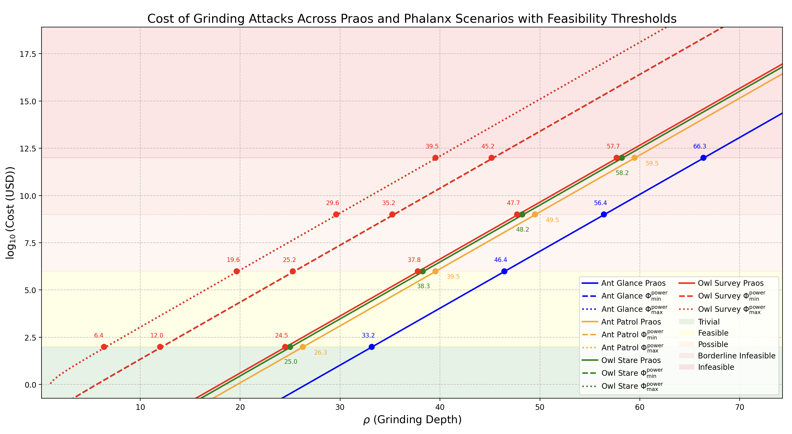

## Table of Contents

- [Abstract](#abstract)
- [Motivation: Why is this CIP necessary?](#motivation-why-is-this-cip-necessary)
- [Specification / The Φalanx Sub-Protocol](#specification--the-phalanx-sub-protocol)
  - [1. High-Level Changes Relative to Praos](#1-high-level-changes-relative-to-praos)
  - [2. The Streams](#2-the-streams)
    - [2.1 The η stream](#21-the-eta-stream)
    - [2.2 The pre-η Synchronizations](#22-the-pre-eta-synchronizations)
    - [2.3 The φ stream](#23-the-phi-stream)
    - [2.4 The η Generations](#24-the-eta-generations)
  - [3. Distribution of Φ Iterations](#3-distribution-of-phi-iterations)
    - [3.1 Challenge to solve](#31-challenge-to-solve)
    - [3.2 Solution Properties S.C.A.L.E](#32-solution-properties-scale)
    - [3.3 Computation Participation](#33-computation-participation)
    - [3.4 Slot Leader Schedule Visibility & pre-η Instability](#34-slot-leader-schedule-visibility--pre-eta-instability)
    - [3.5 The Algorithm](#35-the-algorithm)
    - [3.8 Agda Mechanization](#38-agda-mechanization)
  - [4. The Φ Cryptographic Primitive](#4-the-phi-cryptographic-primitive)
  - [5. Recommended Parameterization](#5-recommended-parameterization)
- [Rationale: How This CIP Achieves Its Goals](#rationale-how-this-cip-achieves-its-goals)
  - [1. Φ_power & Adversarial Cost Overhead](#1-phi-power--adversarial-cost-overhead)
    - [1.1 Cost Overhead of a Grinding Attempt](#11-cost-overhead-of-a-grinding-attempt)
    - [1.2 Cost Overhead of a Grinding Attack](#12-cost-overhead-of-a-grinding-attack)
      - [1.2.1 Formula](#121-formula)
      - [1.2.2 Estimated Formula Using Mainnet Cardano Parameters](#122-estimated-formula-using-mainnet-cardano-parameters)
      - [1.2.3 Φ_power & Scenarios](#123-phi_textpower--scenarios)
  - [2. Adaptive Strategies for Efficient Φ Computation](#2-adaptive-strategies-for-efficient-phi-computation)
    - [2.4.3 Block-based approach](#243-block-based-approach)
  - [3. Performance Impacts on Consensus & Ledger Repository](#3-performance-impacts-on-consensus--ledger-repository)
  - [4. Maintainability](#4-maintainability)
- [Path to Active](#path-to-active)
  - [Acceptance Criteria](#acceptance-criteria)
  - [Implementation Plan](#implementation-plan)
- [References](#references)
- [Copyright](#copyright)

## Abstract

<!-- A short (\\\~200 word) description of the proposed solution and the technical issue being addressed. \-->

Addressing the "[Ouroboros Randomness Manipulation](../CPS/README.md)" **Problem**,  **Ouroboros Φalanx (Pronounced Phalanx)** enhances **Ouroboros Praos** to mitigate grinding attacks by **increasing the cost of leader election manipulation**. It extends **nonce generation from 1 epoch to 2**, introducing a **computationally intensive function** that remains efficient for honest participants but makes it **significantly more costly for adversaries to bias the process**.

A [**Phalanx**](https://en.wikipedia.org/wiki/Phalanx) is an **Ancient Greek military formation** where soldiers **stand in a tightly packed unit**, shielding and reinforcing one another to create a nearly impenetrable defense. This strategy made it far more difficult for enemies to break through compared to fighting individual soldiers.


In **Φalanx Protocol**, we apply this idea cryptographically by **enhancing the VRF-based randomness generation sub-protocol** with a cryptographic primitive that is **efficient for honest participants** but **computationally expensive for adversaries** attempting to bias leader election. While it won’t eliminate grinding attacks entirely, it **significantly increases their cost**, and our work focuses on **precisely quantifying this added expense**.

Please refer to the CPD "[Ouroboros Randomness Generation Sub-Protocol – The Coin-Flipping Problem](../CPS/CPD/README.md)" for a detailed understanding of **randomness generation, leader election in Praos, and the coin-flipping dilemma in consensus protocols**. Moving forward, we will **dive into the core details**, assuming you have the **relevant background** to understand the proposal.

## Motivation: why is this CIP necessary?

<!-- A clear explanation that introduces the reason for a proposal, its use cases and stakeholders. If the CIP changes an established design then it must outline design issues that motivate a rework. For complex proposals, authors must write a Cardano Problem Statement (CPS) as defined in CIP-9999 and link to it as the \`Motivation\`. -->

The "[Ouroboros Randomness Generation Sub-Protocol – The Coin-Flipping Problem](../CPS/CPD/README.md)" CPD reveals a significant vulnerability in **Ouroboros Praos**: adversaries controlling a substantial portion of stake can execute **grinding attacks** to manipulate leader election, compromising the protocol’s fairness and security. As detailed in [CPD Section 3.2 - Entry Ticket: Acquiring Stake to Play the Lottery](../CPS/CPD/README.md#32-entry-ticket-acquiring-stake-to-play-the-lottery), an adversary with **20% or more of the total stake** gains an exponential advantage in influencing randomness, with attack feasibility increasing rapidly as stake grows. This critical threshold is further explored in [CPD Section 3.6 - Grinding Power Computational Feasibility](../CPS/CPD/README.md#36-grinding-power-computational-feasibility), which shows that grinding attacks become computationally viable for well-resourced adversaries, particularly in the "Owl Survey" scenario, where costs remain within the "Possible" range (up to $\$1$ billion USD) for grinding depths ($\rho$) between 34 and 48.

The CPD analysis in [Section 3.5 - Scenarios](../CPS/CPD/README.md#35-scenarios) quantifies this vulnerability across four scenarios—Ant Glance, Ant Patrol, Owl Stare, and Owl Survey—highlighting the ranges of $\rho$ where attacks are feasible. The table below summarizes these ranges, showing the intervals where grinding attacks transition from trivial to infeasible:

| **Feasibility Category**                  | **🔵 Ant Glance** | **🟠 Ant Patrol** | **🟢 Owl Stare** | **🔴 Owl Survey** |
|--------------------------------------------|-------------------|-------------------|------------------|-------------------|
| **🟢 🌱 Trivial for Any Adversary**        | $[0, 33.2)$       | $[0, 26.3)$       | $[0, 25)$        | $[0, 24.5)$       |
| **🟡 💰 Feasible with Standard Resources** | $[33.2, 46.4)$    | $[26.3, 39.5)$    | $[25, 38.3)$     | $[24.5, 37.8)$    |
| **🟠 🏭 Possible with Large-Scale Infrastructure** | $[46.4, 56.4)$ | $[39.5, 49.5)$ | $[38.3, 48.2)$ | $[37.8, 47.7)$ |
| **🔴 🚫 Borderline Infeasible**            | $[56.4, 66.3)$    | $[49.5, 59.5)$    | $[48.2, 58.2)$   | $[47.7, 57.7)$    |
| **🔴 🚫 Infeasible**                      | $[66.3, 256)$     | $[59.5, 256)$     | $[58.2, 256)$    | $[57.7, 256)$     |

This vulnerability is visually depicted in the graph below, which plots the logarithmic cost (in USD) of grinding attacks against grinding depth ($\rho$) for each scenario. The shaded feasibility layers indicate the economic thresholds where attacks become trivial, feasible, possible, borderline infeasible, or infeasible. The consistent gap of $\Delta \log_{10}(\text{Cost (USD)}) \approx 6.3$ between the least (Ant Glance) and most (Owl Survey) resource-intensive scenarios highlights how evaluation complexity ($T_{\text{eval}}$) and observation scope ($w_T$) significantly amplify attack costs :

<div align="center">

</div>

These findings indicate that, under current protocol parameters, grinding attacks are computationally viable at lower $\rho$ values for adversaries with significant resources. However, as highlighted in [CPD Section 3.2](../CPS/CPD/README.md#32-entry-ticket-acquiring-stake-to-play-the-lottery), executing such attacks requires a substantial upfront investment—acquiring 20% of the total stake, equivalent to over 4.36 billion ADA as of March 1, 2025—and the ability to operate covertly to avoid detection. Publicly observable grinding attempts expose adversarial stake pool operators (SPOs) to severe economic and social consequences, such as loss of trust, delegator withdrawals, or protocol-level countermeasures, which could devalue their stake and undermine their efforts. Despite these barriers, the potential for well-funded adversaries to bias randomness remains a threat to Cardano’s decentralized ethos, as it could skew block production and transaction settlement in their favor.

This CIP addresses the critical question: **Can we increase the computational cost of grinding attempts to shrink these vulnerable intervals, thereby deterring adversaries effectively?** Φalanx proposes a solution by introducing a computationally intensive mechanism that disproportionately burdens attackers while remaining manageable for honest participants. By elevating the resource threshold required for successful attacks, as analyzed in [CPD Section 3.4 - Cost of a Grinding Attack](../CPS/CPD/README.md#34-cost-of-a-grinding-attack), this CIP aims to shift the feasibility curve, making randomness manipulation prohibitively expensive and strengthening the protocol’s resilience against such threats.

## Specification / The Φalanx Sub-Protocol

<!-- The technical specification should describe the proposed improvement in sufficient technical detail. In particular, it should provide enough information that an implementation can be performed solely on the basis of the design in the CIP. This is necessary to facilitate multiple, interoperable implementations. This must include how the CIP should be versioned, if not covered under an optional Versioning main heading. If a proposal defines structure of on-chain data it must include a CDDL schema in its specification.-->

The core principle of the proposed protocol change is to **substantially escalate the computational cost of each grinding attempt for an adversary**. 

To achieve this, every honest participant is required to perform a designated computation for each block they produce over an epoch (**21,600 blocks**). Consequently, an adversary attempting a grinding attack must **recompute these operations for every single attempt**, while being **constrained by the grinding window**, which dramatically increases the resource expenditure. 

By enforcing this computational burden, we **drastically reduce the feasible number of grinding attempts** an adversary with a fixed resource budget can execute, making randomness manipulation **more expensive and significantly less practical**.
 

### 1. High-Level Changes Relative to Praos

In **Φalanx** , the randomness generation and leader election flows are modified as follows:


1. The **stake distribution stabilization phase** is shifted **back by one epoch :** The **active** **stake distribution** *SDe* used for leader election is now derived from the **end of $epoch_\text{e-3}$** instead of **$epoch_\text{e-2}$**  as in the original Praos protocol.  
2. The **honest contribution inclusion phase**, which originally resulted in a **ηₑ candidate**, is also **shifted back by one epoch**, aligning with the adjusted **stake distribution stabilization**. This value is now referred to as the **pre-ηₑ candidate**, signifying its role as an **intermediate randomness nonce** in the sub-protocol.  
3. The **ηₑ (randomness eta nonce)** undergoes an **additional sequence of incremental hashing** using a **new deterministic** **cryptographic primitive Φ (Phi)**, applied over a duration equivalent to a full epoch.


### 2. The Streams 

The Randomness Generation sub-protocol operates with two parallel streams: $`\eta^\text{stream}`$ and $`\phi^\text{stream}`$, which synchronize at the conclusion of the **Include Honest Contribution** Phase (akka Phase 2) :  


#### 2.1 **The $`\eta^\text{stream}`$** 
   - Already present in Praos and retained in Phalanx 
   - Updated with every block produced in the blockchain tree, a $`\eta^\text{stream}`$ captures intermediate values $`\eta^\text{evolving}_t`$ in the block headers, defined as follows:

```math
   \eta^{\text{evolving}}_{t+1} =
   \begin{cases}
   \text{ProtocolParameter}_\text{extraEntropy} & \text{when } t = 0, \\
   \eta^{\text{evolving}}_{t} ⭒ VRF^\text{Output}_\text{t+1} & \text{when BlockProduced}(t) \\
   \eta^{\text{evolving}}_{t}  & \text{otherwise.}
   \end{cases}
   
```
```math 
\text{BlockProduced}(t) = 
\begin{cases} 
true & \text{if a block is produced at time } t, \\
false & \text{otherwise.}
\end{cases}
```

| **where** ||
|---------------|-----------------|
| $`\text{ProtocolParameter}_\text{extraEntropy} `$ | The evolving nonce is initialized using the extraEntropy field defined in the protocol parameters.|
| $` VRF^\text{Output}_\text{i} `$ | The **VRF output** generated by the $` \text{slot}_\text{i} `$ Leader and included in the block header |
| $a⭒b$    | The concatenation of $a$ and $b$ , followed by a BLAKE2b-256 hash computation.


#### 2.2 The $`\text{pre-}\eta`$ Synchronizations  

- To generate $`\eta_\text{e}`$ for epoch $`e`$, the stream $`\phi^\text{stream}`$ is reset with the value of $`\eta^\text{stream}`$ at the end of Phase 2 in $`\text{epoch}_{e-2}`$. 
- This specific value of $`\eta^\text{stream}`$ is referred to as **$`\text{pre-}\eta_e`$**.


#### 2.3 The $`\phi^\text{stream}`$

- The stream depends on the selected cryptographic primitive and it is parametrizable with $i$, the total number of $`\Phi`$ iterations,
- The stream $`\phi^\text{stream}`$ is reset during each $`\text{pre-}\eta`$ synchronization.  
- At the synchronization point $`\text{pre-}\eta_{e+1}`$, the stream must guarantee delivery of $`\phi^\text{evolving}_e`$, defined as:
  
```math
  \phi^\text{evolving}_e = \Phi^i(\text{pre-}\eta_e)
```
- Between 2 consecutive resets, a subset of the blocks produced must append to their block header a unique intermediate value $\phi^\text{evolving}_x$, where $x \in {0, 1, \dotsc, i-1}$ denotes the progression index of the $\Phi$ computation(See the [**Distribution of Φ Iterations Approach**](#3-distribution-of-phi-iterations) below).


#### 2.4 The $`\eta`$** Generations
   - This is the final nonce $`\eta_\text{e}`$ used to determine participant eligibility during epoch $`e`$.  
   - It originates from the operation ⭒ with  $`\phi^{\text{stream}}_{t}`$ at $`\text{pre-}\eta_\text{e+1}`$ Synchronization and $`\eta^\text{stream}_t`$ $`\text{when } t = \text{end of epoch}_\text{e-3}`$   

```math
\eta_\text{e} = \eta^\text{stream}_{epoch_\text{e-3}} ⭒ \phi^\text{evolving}_e , \quad \text{when } t = \text{pre-}\eta_\text{e+1}\text{ synchronization } 
```
**Note** : $`\text{pre-}\eta_\text{e+1}`$ synchronization occurs $`\text{when } t = \text{end of phase 2 at epoch}_\text{e-1}`$


### 3. Distribution of $\Phi$ Iterations

#### 3.1 Challenge to solve 

**How can we ensure that, for a given epoch $e$, Stake Pool Operators (SPOs) can efficiently perform the $i$ iterations of $`\Phi`$ required to deterministically produce $`\phi^\text{evolving}_e`$, thereby enabling a more secure computation of $`\eta_e`$ than in the current Praos protocol?**

<div align="center">

</div>

#### 3.2  Solution Properties S.C.A.L.E

To ensure robust and efficient production of $`\phi^\text{evolving}_e`$,  $k(\text{pre-η},t)$ should aim to satisfy the following **SCALE** properties — prioritized in the order shown:

- **S**uccess Probability — Maximize the likelihood of deterministically producing $`\phi^\text{evolving}_e`$ without falling back to the Praos protocol.  
- **C**ompactness — Minimize block header size increase.  
- **A**vailability — Minimize additional latency in block diffusion.  
- **L**ightweight Execution — minimize redundant or wasteful iterations of $`\Phi`$ among the SPOs.  
- **E**agerness — Better to compute sooner than later.

These properties define the design space for secure, performant execution of $`\Phi`$ in each epoch.

**How can we ensure that each SPO uphold the **SCALE** properties and in particular neither compromises the Availability property nor fails to produce their block on time due to the added Phalanx computation?**


#### 3.3 Computation Participation

Regarding SPO participation in the protocol, we identify three possible models:

- **Centralized**: A single entity is responsible for the entire process. This model is strongly discouraged, as it introduces a textbook case of a single point of failure, undermining both resilience and decentralization.
- **Federated**: A selected subset of SPOs participates in the process. While this model improves over the centralized approach, it raises concerns of collusion, particularly the possibility of intentionally omitting the final iteration and reverting to the default Praos protocol. Additionally, participants could become targeted by adversaries, and governance mechanisms must be introduced to manage entry and exit from this privileged role.
- **Decentralized**: All SPOs participate in the additional computation phase. Unsurprisingly in our context, this is the most robust model, leveraging the existing infrastructure of SPOs who are already running the network and receiving rewards. 

Taking the decentralized approach, SPOs are expected to collectively compute the $i^{\text{th}}$ iteration of $\Phi$. 
The key question, then, is **how can we design effective incentives to ensure that this task is performed reliably and in a timely manner?**

#### 3.4 Slot Leader Schedule Visibility & $\text{pre-}\eta_e$ instability

**Regardless of the chosen approach**, each SPO knows their complete private schedule for $`\Phi`$ computation as soon as the slot leader distribution is revealed. Within this epoch-sized period:
- **During the interval $[0, \frac{3k}{f})$:**
  - SPOs are still operating in $`epoch_{\text{e-2}}`$, which means they know their schedule **$\frac{6k}{f}$ slots in advance**.
  - However, at this point, $\text{pre-}\eta_e$ remains a *candidate value* — not yet finalized. Multiple forks may still exist, each potentially initiating a distinct instance of $\Phi$.
  - As such, early iterations of $\Phi$ are **speculative**. If the canonical chain later stabilizes on a different fork than the one used during early computations, the associated $\text{pre-}\eta_e$ will change, and the corresponding $\Phi$ computation must be **discarded and restarted**.
  - **In short**, the closer we approach the fork stabilization point, the **higher the probability** that the selected $\text{pre-}\eta_e$ will remain, but rollback is still possible within this window.

- **During the interval $[\frac{3k}{f},\frac{4k}{f})$:**
  - SPOs are still operating in $`epoch_{\text{e-2}}`$, which means they know their schedule **$\frac{6k}{f}$ slots in advance**.
  - From this slot onward, $\text{pre-}\eta_e$ is fully stable, and all SPOs will execute $\Phi$ using the same seed, ensuring deterministic and aligned computations.
  - The slot leader distribution is finalized at $\frac{3k}{f}$-th slot, which means they know their schedule **$\frac{k}{f}$ slots in advance** for the next interval.

- **During the interval $[\frac{4k}{f}, \frac{10k}{f})$:**
  - SPOs are now in $`epoch_{\text{e-1}}`$.
  - Full visibility and full stability
  
The following visual highlights this situation:

<div align="center"></div>


#### 3.5 The Algorithm 

We will reuse the existing game-theoretic framework for block production in Praos (No Timely Iteration, No Block Reward) and require each stake pool operator (SPO), upon producing a block, to provide **a proof of computation performed—specifically, a proof that they have computed the *x*‑th iteration of $\Phi$**. 
In this approach, we divide the epoch-size equivalent period into $y$ intervals defined by the **redundancy parameter $R$**, which specifies the expected number of blocks per interval as follows:

<div align="center"></div> 

Each interval is characterized by:

- a **size** (in slots), derived from the redundancy parameter `R` and the active slot coefficient `f`:
    ```math
    \text{Interval size} = \frac{R}{f}
    ```

- a **start slot** and **end slot** for a given slot `t`, defined as:
    ```math
    \text{startInterval}(t) = \left\lfloor \frac{t}{\text{Interval size}} \right\rfloor \cdot \text{Interval size}
    ```
    ```math
    \text{endInterval}(t) = \left( \left\lfloor \frac{t}{\text{Interval size}} \right\rfloor + 1 \right) \cdot \text{Interval size} - 1
    ```

The core of the algorithm lies in how we distribute the iterations of $\Phi$ across these intervals. Ideally, we want to remain resilient—even in extreme cases such as a global outage causing **36 hours** (**30% of an epoch**) of consecutive downtime (see the [Cardano Disaster Recovery Plan](https://iohk.io/en/research/library/papers/cardano-disaster-recovery-plan)). To be optimal in the face of such rare but impactful events, we will adopt the strategy : **"Better Sooner Compute than Later."** 

In practice, this means **front-loading the computation** as much as possible during the early intervals of the computation phase. If a sequence of blockless intervals occurs, it is the responsibility of the **next non-blockless interval** to publish the proof corresponding to the $x^{\text{th}}$ iteration—where $x - 1$ was the index of the last successfully revealed proof before the interruption.

Let’s define a reasonable upper bound for each interval: **allocate at most half of its duration** to the computation of a single iteration of $`\Phi`$ : 
- $T_\phi^\text{max} = T_\phi =\frac{\text{Interval Size}}{2}$
- For instance, if $R = 10$, then the interval size is $\text{IntervalSize} = \frac{R}{f} = \frac{10}{1/20} = 200 \text{ slots} \approx 200\text{s}$ and we set a single iteration of $\Phi$ at $T_\phi = 100\text{s}$ from the very first interval.
- To **prevent an adversary from withholding a block** in the last interval (thus delaying the delivery of $`\phi^\text{evolving}_e`$), we define the final interval to be longer than the others—**long enough to ensure with 128-bit confidence** that **at least one block will be produced**. This requires approximately **1735 slots** of redundancy. We will call this period the **Cool-Down Phase**


Let's define then a parameter $\Phi_{\text{power}} \in [0, 1]$, which quantifies the proportion of the maximum allowable computational budget that is actually exercised by the network.

* $\Phi_{\text{power}} = 0$: no additional computation (no overhead),
* $\Phi_{\text{power}} = 1$: corresponds to the maximum cost we will impose on an adversary.

The total time allocated to all $\Phi$ computations across the computation phase is given by:

$$
T_\Phi = \Phi_{\text{power}} \cdot \frac{1}{2} \cdot ((1-30\%) \cdot \text{Computation Phase} - \text{Cooldown Phase} - ) = \Phi_{\text{power}} \cdot \frac{1}{2} \cdot (\frac{7k}{f} - 1735)
$$

To help visualize the computational implications of different $\Phi_{\text{power}}$ values, the table below provides:

- the total accumulated computation time $T_\Phi$ expressed as a human-readable duration (1 slot ~ 1 sec),
- the corresponding number of non-blockless intervals required to cover that budget, for various interval sizes $R$.
- Each cell in the table indicates how many intervals are needed to cover $T_\Phi$, relative to the total available intervals of that size within the computation phase.

| $\Phi_{\text{power}}$ | $T_\Phi$              | R=5 (100 slots)     | R=10 (200 slots)    | R=30 (600 slots)   | R=50 (1000 slots)   |
|------------------------|------------------------|-------------------|-------------------|-------------------|-------------------|
| 0.0                    | 0 minute               | 0 / 3006          | 0 / 1503          | 0 / 501           | 0 / 300           |
| 0.1                    | 4 hours 10 minutes     | 150 / 3006        | 75 / 1503         | 25 / 501          | 15 / 300          |
| 0.2                    | 8 hours 21 minutes     | 301 / 3006        | 150 / 1503        | 50 / 501          | 30 / 300          |
| 0.3                    | 12 hours 31 minutes    | 451 / 3006        | 226 / 1503        | 75 / 501          | 45 / 300          |
| 0.4                    | 16 hours 42 minutes    | 601 / 3006        | 301 / 1503        | 100 / 501         | 60 / 300          |
| 0.5                    | 20 hours 52 minutes    | 752 / 3006        | 376 / 1503        | 125 / 501         | 75 / 300          |
| 0.6                    | 1 day 1 hour 3 minutes | 902 / 3006        | 451 / 1503        | 150 / 501         | 90 / 300          |
| 0.7                    | 1 day 5 hours 13 min   | 1052 / 3006       | 526 / 1503        | 175 / 501         | 105 / 300         |
| 0.8                    | 1 day 9 hours 24 min   | 1203 / 3006       | 601 / 1503        | 200 / 501         | 120 / 300         |
| 0.9                    | 1 day 13 hours 34 min  | 1353 / 3006       | 676 / 1503        | 225 / 501         | 135 / 300         |
| 1.0                    | 1 day 17 hours 45 min  | 1503 / 3006       | 751 / 1503        | 250 / 501         | 150 / 300         |

Here are the durations of each interval size $R$, assuming 1 slot ≈ 1 second :

* **R = 5** → 100 slots → **1 minute 40 seconds**
* **R = 10** → 200 slots → **3 minutes 20 seconds**
* **R = 30** → 600 slots → **10 minutes**
* **R = 50** → 1000 slots → **16 minutes 40 seconds**

##### Proof Requirements

By default, in each interval, the first block produced must include a proof of work performed in order to be considered valid. Subsequent blocks produced within the same interval are exempt from this requirement. 

However, during the first $\frac{3 \cdot k}{f}$ slots, sudden rollbacks affecting the $\text{pre-}\eta_e$ seed may, under certain conditions, disrupt the immediate slot leaders' ability to produce timely blocks.

The **worst-case scenario** occurs when a rollback happens **at the very end of a computation interval**, and the **next scheduled slot leader** is positioned just after the **beginning of the following interval**. In such a case, the **Availability** property may be compromised: block production could be **delayed**, leading to **increased latency in block diffusion**, or worse, the block may arrive **too late** and be **rejected** by the network. 

The higher the value of $R$, the less likely this worst-case scenario will occur, as the computation load is spread over longer intervals. However, when such a situation does happen, the **amount of work required to catch up increases**, potentially impacting **multiple consecutive blocks**.  

A solution is to **relax the block validity requirements** when the gap between the last slot of the previous interval and the first slot leader of the current interval is **less than** the allocated computation time $T_\phi$. In this case, the **remaining slot leaders** within the interval—those whose gap exceeds $T_\phi$—are expected to provide the proof of the $x^{\text{th}}$ iteration of $\Phi$ :

📐 Let

* $s_{\text{prev}} \in \mathbb{N}$: relative slot of the **last produced block** in the previous interval
* $s_{\text{next}} \in \mathbb{N}$: relative slot of the **next slot leader** in the current interval
* $T_\phi \in \mathbb{N}$: allowed computation time for an iteration of $\Phi$, in slot units
* $\Delta s = s_{\text{next}} - s_{\text{prev}}$
* $k \in \mathbb{N}$: security parameter
* $f \in (0, 1]$: active slot coefficient


✅ Rule for Proof Requirement

A proof is required **if and only if** the following conditions hold simultaneously:

$$
\begin{aligned}
s_{\text{prev}} > \frac{3k}{f}  \quad
\text{Or} \quad &\Delta s \geq T_\phi 
\end{aligned}
$$

Otherwise, no proof is required.

##### Scheduling

We define a threshold parameter $\Phi\_{\text{margin}} \in (1, \infty)$ that represents the **minimum required interval lead** to safely defer computation. Specifically, we require:

$$
\Phi_{\text{margin}} > \text{intervalIndex}(\text{nextSlotLeader}) - \text{intervalIndex}(\text{currentSlot})
$$

If this margin condition is **not satisfied**—i.e., the next slot leader is too close—we proactively begin computing the **remaining iterations of $\Phi$ locally**, rather than waiting for proofs to arrive on-chain.


#### 3.8. Agda Mechanization

### 4. The Φ Cryptographic Primitive

 (incomplete section -- add the specific primitive selected and all its characteristics )

The Φ cryptographic primitive is a critical component of the Φalanx protocol, designed to increase the computational cost of grinding attacks while remaining efficient for honest participants. To achieve this, Φ must adhere to a set of well-defined properties that ensure its security, efficiency, and practical usability within the Cardano ecosystem. These properties are outlined in the table below :

| **Property**              | **Description**                                                                                                   |
|---------------------------|-------------------------------------------------------------------------------------------------------------------|
| **Functionality**         | Must be a well-defined mathematical function, ensuring a unique output for each given input (unlike proof-of-work, which allows multiple valid outputs). |
| **Determinism**           | Must be fully deterministic, with the output entirely determined by the input, eliminating non-deterministic variations. |
| **Efficient Verification**| Must allow for fast and lightweight verification, enabling rapid validation of outputs with minimal computational overhead. |
| **Compact Representation**| Input and output sizes should be small enough to fit within a block, optimizing on-chain storage efficiency. Further reductions are desirable where feasible. |
| **Lower Bound on Computation** | Computational cost of evaluation should be well-characterized and predictable, with a lower bound that is difficult to surpass, ensuring adversaries cannot gain an unfair efficiency advantage. |
| **Ease of Implementation & Maintenance** | Should be simple to implement and maintain, ensuring long-term usability and minimizing technical debt. |
| **Adaptive Security**     | Function and its parameters should be easily reconfigurable to accommodate evolving threats, such as advances in computational power or new cryptographic attacks. |


### 5. Recommended Parameterization

**(To be completed)**

We currently identify the following key parameters:

- $\Phi_{\text{power}}$
- $\Phi_{\text{margin}}$
- $R$
- (To be added: parameters related to the cryptographic primitive)


## Rationale: How does this CIP achieve its goals?
<!-- The rationale fleshes out the specification by describing what motivated the design and what led to particular design decisions. It should describe alternate designs considered and related work. The rationale should provide evidence of consensus within the community and discuss significant objections or concerns raised during the discussion.

It must also explain how the proposal affects the backward compatibility of existing solutions when applicable. If the proposal responds to a CPS, the 'Rationale' section should explain how it addresses the CPS, and answer any questions that the CPS poses for potential solutions.
-->

### 1. $Φ_\text{power}$ & Adversarial Cost Overhead
#### 1.1 Cost Overhead of a grinding attempt

In **Φalanx**, we introduce an additional **computational cost**, denoted $T_\Phi$, for each **grinding attempt**. This cost represents the total cumulative effort required to compute $i$ iterations of the $\Phi$ primitive. It is defined as follows:

```math
T_\Phi = \Phi_{\text{power}} \cdot \frac{1}{2} \cdot \frac{9k}{f}
```

where:  
- $T_\Phi$ is the total cost (in seconds, assuming 1 slot ≈ 1 second) for a single grinding attempt under Φalanx,  
- $\Phi_{\text{power}} \in [0,1]$ is a tunable parameter controlling the difficulty of computing the $\Phi$ function,  
- $\frac{1}{2}$ is a deliberate margin: honest participants are guaranteed **twice the time** adversaries have to perform the $\Phi$ iterations,  
- $k$ is the common prefix parameter,  
- $f$ is the active slot coefficient,  
- $\frac{9k}{f}$ defines the number of slots within the **Computation Phase** (e.g., $388,\!800$ slots when $k = 2,\!160$ and $f = 0.05$).


This additional cost directly impacts the total estimated **time per grinding attempt**, as originally defined in [CPD Section 3.3.4 - Total Estimated Time per Grinding Attempt](../CPS/CPD/README.md#334-total-estimated-time-per-grinding-attempt). The baseline grinding time in **Praos** is:

```math
T_{\text{grinding}}^{\text{Praos}} = \frac{\rho}{2} T_{\text{BLAKE2b}} + w_T \cdot ( T_{\mathsf{VRF}} + T_{\text{eligibility}} ) + T_{\text{eval}}
```

With **Φalanx**, the total grinding time per attempt is updated to include $T_\Phi$:

```math
T_{\text{grinding}}^{\text{Phalanx}} = \frac{\rho}{2} T_{\text{BLAKE2b}} + w_T \cdot ( T_{\mathsf{VRF}} + T_{\text{eligibility}} ) + T_{\text{eval}} + T_\Phi 
```

Substituting $T_\Phi$ with the expression above, the final grinding time per attempt under **Φalanx** becomes:

```math
T_{\text{grinding}}^{\text{Phalanx}} = \frac{\rho}{2} T_{\text{BLAKE2b}} + w_T \cdot ( T_{\mathsf{VRF}} + T_{\text{eligibility}} ) + T_{\text{eval}} + \Phi_{\text{power}} \cdot \frac{1}{2} \cdot \frac{9k }{f}
```

With **Cardano mainnet parameters** ($k = 2,\!160$, $f = 0.05$), this simplifies to:

```math
T_{\text{grinding}}^{\text{Phalanx}} = \frac{\rho}{2} T_{\text{BLAKE2b}} + w_T \cdot ( T_{\mathsf{VRF}} + T_{\text{eligibility}} ) + T_{\text{eval}} + \Phi_{\text{power}} \cdot 1.944 \cdot 10^5 
```

Where:  
- $T_{\mathsf{VRF}}$ is the **VRF evaluation time**,  
- $T_{\text{eligibility}}$ is the **eligibility check time**,  
- $T_{\text{BLAKE2b}}$ is the time for the **hashing operation**,  
- $w_T$ is the **target window size** (seconds),  
- $\rho$ is the **grinding depth**,  
- $T_{\text{eval}}$ is the **nonce selection and evaluation time** (**attack-specific**).


The introduction of $T_\Phi$ substantially increases the **computational burden** for adversaries, as they must **recompute** the $\Phi^i$ function for each of the $2^\rho$ possible **nonces** evaluated during a grinding attack. In contrast, for **honest participants**, this computation is **distributed** across the epoch, ensuring it remains **manageable and efficient**. 


### 1.2 Cost Overhead of a Grinding Attack

Building on the updated **grinding time formula** introduced in the previous section, which incorporates the additional **computational cost** $T_\Phi$, we can now revise the formula for a grinding attack from [CPD Section 3.4.1 - Formula](https://github.com/cardano-foundation/CIPs/tree/master/CPS-0021/CPS/CPD/README.md#341-formula), where we defined a total attack time that must fit within the **grinding opportunity window** $w_O$:

```math
\frac{2^{\rho} \cdot T_{\text{grinding}}^{\text{Phalanx}}}{N_{\text{CPU}}} \leq w_O
```
which leads to the lower bound on computational power ($N_\text{CPU}$) : 

```math
N_{\text{CPU}} \geq \left \lceil \frac{2^{\rho} \cdot T_{\text{grinding}}^{\text{Phalanx}}}{w_O} \right \rceil
```

#### 1.2.1 Formula

##### Expanding $T_{\text{grinding}}^{\text{Phalanx}}$
From **Section 1.1**, the per-attempt grinding time under **Φalanx** is:

```math
T_{\text{grinding}}^{\text{Phalanx}} = \frac{\rho}{2} T_{\text{BLAKE2b}} + w_T \cdot ( T_{\mathsf{VRF}} + T_{\text{eligibility}} ) + T_{\text{eval}} + \Phi_{\text{power}} \cdot \frac{1}{2} \cdot \frac{9k }{f}
```

Substituting this into the inequality:

```math
N_{\text{CPU}} \geq \left \lceil \frac{2^{\rho} \cdot \left( \frac{\rho}{2} T_{\text{BLAKE2b}} + w_T \cdot ( T_{\mathsf{VRF}} + T_{\text{eligibility}} ) + T_{\text{eval}} + \Phi_{\text{power}} \cdot \frac{1}{2} \cdot \frac{9k }{f} \right)}{w_O} \right \rceil
```

##### Expanding $w_O$ in Terms of $\rho$ and $f$
From previous sections, the **grinding opportunity window** is defined as:

```math
\frac{X_A(w)}{f} \leq w_O \leq \frac{w}{f}
```

Assuming the upper bound $w_O = \frac{w}{f}$ (worst-case scenario for the adversary), and noting that $w < 2 \cdot \rho - 1$ as per [CPD Section 3.4.1](https://github.com/cardano-foundation/CIPs/tree/master/CPS-0021/CPD#341-formula), we substitute $w_O$:

```math
N_{\text{CPU}} \geq \left \lceil f \cdot \frac{2^{\rho} \cdot \left( \frac{\rho}{2} T_{\text{BLAKE2b}} + w_T \cdot ( T_{\mathsf{VRF}} + T_{\text{eligibility}} ) + T_{\text{eval}} + \Phi_{\text{power}} \cdot \frac{1}{2} \cdot \frac{9k }{f} \right)}{w} \right \rceil
```

Since $w < 2 \cdot \rho - 1$, we can use this bound to simplify:

```math
N_{\text{CPU}} \geq \left \lceil f \cdot \frac{2^{\rho} \cdot \left( \frac{\rho}{2} T_{\text{BLAKE2b}} + w_T \cdot ( T_{\mathsf{VRF}} + T_{\text{eligibility}} ) + T_{\text{eval}} + \Phi_{\text{power}} \cdot \frac{1}{2} \cdot \frac{9k }{f} \right)}{2 \cdot \rho - 1} \right \rceil
```

To derive a more explicit expression, we distribute the terms:

```math
N_{\text{CPU}} \geq \left \lceil f \cdot 2^{\rho} \cdot \frac{\frac{\rho}{2} T_{\text{BLAKE2b}} + w_T \cdot ( T_{\mathsf{VRF}} + T_{\text{eligibility}} ) + T_{\text{eval}} + \Phi_{\text{power}} \cdot \frac{1}{2} \cdot \frac{9k \cdot T_\phi}{f}}{2 \cdot \rho - 1} \right \rceil
```

Simplify by breaking it down:

```math
N_{\text{CPU}} \geq \left \lceil f \cdot 2^{\rho} \cdot \left( \frac{\frac{\rho}{2} T_{\text{BLAKE2b}}}{2 \cdot \rho - 1} + \frac{w_T \cdot ( T_{\mathsf{VRF}} + T_{\text{eligibility}} )}{2 \cdot \rho - 1} + \frac{T_{\text{eval}}}{2 \cdot \rho - 1} + \frac{\Phi_{\text{power}} \cdot \frac{1}{2} \cdot \frac{9k }{f}}{2 \cdot \rho - 1} \right) \right \rceil
```

This can be rewritten as:

```math
N_{\text{CPU}} \geq \left \lceil f \cdot 2^{\rho} \cdot \left( \frac{\rho T_{\text{BLAKE2b}}}{2 (2 \cdot \rho - 1)} + \frac{w_T \cdot ( T_{\mathsf{VRF}} + T_{\text{eligibility}} )}{2 \cdot \rho - 1} + \frac{T_{\text{eval}}}{2 \cdot \rho - 1} + \frac{\Phi_{\text{power}} \cdot 9k }{2 f \cdot (2 \cdot \rho - 1)} \right) \right \rceil
```

To align with the form provided in the query, we aim for a lower bound expression. Recognizing that $2 \cdot \rho - 1 \approx 2 \rho$ for large $\rho$, we approximate:

```math
N_{\text{CPU}} > \left \lceil f \cdot 2^{\rho-1} \cdot T_{\text{BLAKE2b}} + f \cdot 2^{\rho} \cdot \frac{w_T \cdot ( T_{\mathsf{VRF}} + T_{\text{eligibility}} ) + T_{\text{eval}}}{2 \cdot \rho - 1} + f \cdot 2^{\rho} \cdot \frac{\Phi_{\text{power}} \cdot 9k }{2 f \cdot (2 \cdot \rho - 1)} \right \rceil
```

Further simplifying:

```math
N_{\text{CPU}} > \left \lceil f \cdot 2^{\rho-1} \cdot T_{\text{BLAKE2b}} + \frac{f \cdot 2^{\rho}}{2 \cdot \rho - 1} \cdot \left( w_T \cdot ( T_{\mathsf{VRF}} + T_{\text{eligibility}} ) + T_{\text{eval}} + \Phi_{\text{power}} \cdot \frac{9k }{f} \right) \right \rceil
```

For large $\rho$, $\frac{2^{\rho}}{2 \cdot \rho - 1} \approx \frac{2^{\rho}}{2 \rho} = \frac{2^{\rho-1}}{\rho}$, so:

```math
N_{\text{CPU}} > \left \lceil f \cdot 2^{\rho-1} \cdot T_{\text{BLAKE2b}} + \frac{f}{\rho} \cdot 2^{\rho-1} \cdot \left( w_T \cdot ( T_{\mathsf{VRF}} + T_{\text{eligibility}} ) + T_{\text{eval}} + \Phi_{\text{power}} \cdot \frac{9k }{f} \right) \right \rceil
```

Finally, we can express the $\Phi$ term more explicitly:

```math
N_{\text{CPU}} > \left \lceil f \cdot 2^{\rho-1} \cdot T_{\text{BLAKE2b}} + \frac{f}{\rho} \cdot 2^{\rho-1} \cdot \left( w_T \cdot ( T_{\mathsf{VRF}} + T_{\text{eligibility}} ) + T_{\text{eval}} \right) + \frac{\Phi_{\text{power}} \cdot 9k \cdot 2^{\rho-1}}{\rho} \right \rceil
```

#### 1.2.2 Estimated Formula Using Mainnet Cardano Parameters

Starting from the final expression at the end of the last section:

```math
N_{\text{CPU}} > \left \lceil f \cdot 2^{\rho-1} \cdot T_{\text{BLAKE2b}} + \frac{f}{\rho} \cdot 2^{\rho-1} \cdot \left( w_T \cdot ( T_{\mathsf{VRF}} + T_{\text{eligibility}} ) + T_{\text{eval}} \right) + \frac{\Phi_{\text{power}} \cdot 9k \cdot 2^{\rho-1}}{\rho} \right \rceil
```

#### Applying Cardano Mainnet Parameters
Using Cardano’s mainnet values:
- $T_{\mathsf{VRF}} = 10^{-6}$ seconds (1 microsecond) – Time to evaluate a Verifiable Random Function.
- $T_{\text{BLAKE2b}} = 10^{-8}$ seconds (0.01 microseconds) – Time for a BLAKE2b-256 hash operation.
- $f = \frac{1}{20} = 0.05$ – Active slot coefficient.
- $k = 2160$
- Slot duration = 1 second.

Since the eligibility check is negligible, set $T_{\text{eligibility}} \approx 0$:

Substitute into the expression:

- First term: $f \cdot 2^{\rho-1} \cdot T_{\text{BLAKE2b}} = 0.05 \cdot 2^{\rho-1} \cdot 10^{-8} = 5 \cdot 10^{-10} \cdot 2^{\rho-1}$,
- Second term: $\frac{f}{\rho} \cdot 2^{\rho-1} \cdot \left( w_T \cdot ( T_{\mathsf{VRF}} + T_{\text{eligibility}} ) + T_{\text{eval}} \right) = \frac{0.05}{\rho} \cdot 2^{\rho-1} \cdot \left( w_T \cdot (10^{-6} + 0) + T_{\text{eval}} \right) = \frac{0.05 \cdot 2^{\rho-1}}{\rho} \cdot (10^{-6} w_T + T_{\text{eval}})$.
- Third term (with $k = 2160$):

```math
  \frac{9 \cdot 2160 \cdot \Phi_{\text{power}} \cdot 2^{\rho - 1}}{\rho} = \frac{1.9440 \cdot 10^4 \cdot\Phi_{\text{power}} \cdot 2^{\rho - 1}}{\rho} \approx  \frac{10^4 \cdot\Phi_{\text{power}} \cdot 2^{\rho}}{\rho}
```

The estimated number of CPUs required is:

```math
N_{\text{CPU}} > \left \lceil
5 \cdot 10^{-10} \cdot 2^{\rho - 1} +
\frac{5 \cdot 10^{-8} \cdot 2^{\rho - 1}}{\rho} \cdot w_T +
\frac{5 \cdot 10^{-2} \cdot 2^{\rho - 1}}{\rho} \cdot T_{\text{eval}} +
\frac{10^4\cdot \Phi_{\text{power}} \cdot 2^{\rho}}{\rho}
\right \rceil
```


#### 1.2.3 $\Phi_\text{power}$ & Scenarios


This increased **grinding time** directly affects the number of **CPUs** ($N_{\text{CPU}}$) required for an **adversary** to execute a grinding attack within the **grinding opportunity window** $w_O$. 

By varying $\Phi_{\text{power}}$, we can explore how the **computational overhead scales** and assess its effectiveness in **deterring adversaries**. To  evaluate the **impact of Φalanx** on grinding attack feasibility, we introduce an additional dimension to our analysis by incorporating extreme values of $\Phi_{\text{power}}$. 

These extremes—ranging from a minimal computational burden to the maximum feasible overhead—allow us to test the protocol's robustness across a wide spectrum of adversarial conditions. By extending the four scenarios defined in [CPD Section 3.5 - Scenarios](https://github.com/input-output-hk/ouroboros-anti-grinding-design/blob/main/CPS/Readme.md#35-scenarios)—**Ant Glance**, **Ant Patrol**, **Owl Stare**, and **Owl Survey**—with Φalanx-enhanced versions, we can quantify how these computational costs reshape the feasibility of attacks compared to the baseline **Praos** protocol.

These scenarios use an **animal-inspired metaphor** to reflect **evaluation complexity** ($T_{\text{eval}}$) and **observation scope** ($w_T$), providing a basis for comparing the **computational cost** under **Praos**. We incorporate the additional **computational cost** $T_\Phi$, with:
  - **$\Phi^\text{power}_\text{min}$**: 2% capacity ($\Phi_{\text{power}} = 0.02$), which yields an accumulated time of $T_\Phi = 3.888 \times 10^3 \, \text{seconds}$ (approximately 1 hour and 5 minutes).
  - **$\Phi^\text{power}_\text{max}$**: 100% capacity ($\Phi_{\text{power}} = 1$), which yields an accumulated time of $T_\Phi = 1.944 \times 10^5 \, \text{seconds}$ (approximately 54 hours or 2 days and 6 hours).

The table below summarizes the **Accumulated Computation Time** ($T_\Phi$) for various $\Phi_{\text{power}}$ values, illustrating the range of computational overheads introduced by Φalanx:

| $\Phi_{\text{power}}$ | Accumulated Computation Time |
|-----------------------|------------------------------|
| 0.0                   | 0 minutes                    |
| 0.02                  | 1 hour 5 minutes             |
| 0.05                  | 2 hours 42 minutes           |
| 0.1                   | 5 hours 24 minutes           |
| 0.2                   | 10 hours 48 minutes          |
| 0.3                   | 16 hours 12 minutes          |
| 0.4                   | 21 hours 36 minutes          |
| 0.5                   | 1 day 3 hours                |
| 0.6                   | 1 day 8 hours 24 minutes     |
| 0.7                   | 1 day 13 hours 48 minutes    |
| 0.8                   | 1 day 19 hours 12 minutes    |
| 0.9                   | 2 days 35 minutes            |
| 1.0                   | 2 days 6 hours               |

The table highlights the computational burden for $`\Phi^\text{power}_\text{min} = 0.02`$ and $`\Phi^\text{power}_\text{max} = 1.0`$, which we use to extend the scenarios. 

The following table summarizes the scenarios, including their $T_{\text{eval}}$ (evaluation complexity) and $w_T$ (observation scope), and extends them to Φalanx-enhanced versions with the additional computational cost $T_\Phi$:

| **Scenario**            | **$T_{\text{eval}}$ (Complexity)** | **$w_T$ (Scope)** | **Description**                                                                 |
|--------------------------|------------------------------------|-------------------|---------------------------------------------------------------------------------|
| **Ant Glance Praos**     | $0 \, \text{s}$                   | $1 \, \text{h}$  | An **ant** quickly **glancing** at a small spot, representing **simple evaluation** (low $T_{\text{eval}}$) with **basic effort** and a **narrow observation scope** (small $w_T$). |
| **Ant Glance $\Phi^\text{power}_\text{min}$** | $0 \, \text{s}$                   | $1 \, \text{h}$  | An **ant glancing** with **Phalanx’s minimal** $\Phi$ cost, adding **moderate effort** due to $T_\Phi = 3.888 \times 10^3 \, \text{s}$. |
| **Ant Glance $\Phi^\text{power}_\text{max}$** | $0 \, \text{s}$                   | $1 \, \text{h}$  | An **ant glancing** with **Phalanx’s maximal** $\Phi$ cost, **significantly increasing effort** due to $T_\Phi = 1.944 \times 10^5 \, \text{s}$. |
| **Ant Patrol Praos**     | $0 \, \text{s}$                   | $5 \, \text{d}$  | An **ant patrolling** a **wide area** over time with **simple instincts**, representing **simple evaluation** (low $T_{\text{eval}}$) with **basic effort** and a **broad observation scope** (large $w_T$). |
| **Ant Patrol $\Phi^\text{power}_\text{min}$** | $0 \, \text{s}$                   | $5 \, \text{d}$  | An **ant patrolling** with **Phalanx’s minimal** $\Phi$ cost, adding **moderate effort** due to $T_\Phi = 3.888 \times 10^3 \, \text{s}$. |
| **Ant Patrol $\Phi^\text{power}_\text{max}$** | $0 \, \text{s}$                   | $5 \, \text{d}$  | An **ant patrolling** with **Phalanx’s maximal** $\Phi$ cost, **significantly increasing effort** due to $T_\Phi = 1.944 \times 10^5 \, \text{s}$. |
| **Owl Stare Praos**      | $1 \, \text{s}$                  | $1 \, \text{h}$  | An **owl staring intently** at a **small area** with **keen focus**, representing **complex evaluation** (high $T_{\text{eval}}$) with **advanced effort** and a **narrow observation scope** (small $w_T$). |
| **Owl Stare $\Phi^\text{power}_\text{min}$** | $1 \, \text{s}$                  | $1 \, \text{h}$  | An **owl staring** with **Phalanx’s minimal** $\Phi$ cost, adding **moderate effort** due to $T_\Phi = 3.888 \times 10^3 \, \text{s}$. |
| **Owl Stare $\Phi^\text{power}_\text{max}$** | $1 \, \text{s}$                  | $1 \, \text{h}$  | An **owl staring** with **Phalanx’s maximal** $\Phi$ cost, **significantly increasing effort** due to $T_\Phi = 1.944 \times 10^5 \, \text{s}$. |
| **Owl Survey Praos**     | $1 \, \text{s}$                  | $5 \, \text{d}$  | An **owl surveying** a **wide range** with **strategic awareness**, representing **complex evaluation** (high $T_{\text{eval}}$) with **advanced effort** and a **broad observation scope** (large $w_T$). |
| **Owl Survey $\Phi^\text{power}_\text{min}$** | $1 \, \text{s}$                  | $5 \, \text{d}$  | An **owl surveying** with **Phalanx’s minimal** $\Phi$ cost, adding **moderate effort** due to $T_\Phi = 3.888 \times 10^3 \, \text{s}$. |
| **Owl Survey $\Phi^\text{power}_\text{max}$** | $1 \, \text{s}$                  | $5 \, \text{d}$  | An **owl surveying** with **Phalanx’s maximal** $\Phi$ cost, **significantly increasing effort** due to $T_\Phi = 1.944 \times 10^5 \, \text{s}$. |


The **$N_{\text{CPU}}$ formulas** are derived by **substituting** the respective **$w_T$** and **$T_{\text{eval}}$ values** from each **scenario** into the **base expression** from **Section 1.2.2**:

```math
N_{\text{CPU}} > \left \lceil
5 \cdot 10^{-10} \cdot 2^{\rho - 1} +
\frac{5 \cdot 10^{-8} \cdot 2^{\rho - 1}}{\rho} \cdot w_T +
\frac{5 \cdot 10^{-2} \cdot 2^{\rho - 1}}{\rho} \cdot T_{\text{eval}} +
\frac{200 \cdot 2^\rho}{\rho}
\right \rceil \quad \text{for } \Phi^\text{power}_\text{min}
```

```math
N_{\text{CPU}} > \left \lceil
5 \cdot 10^{-10} \cdot 2^{\rho - 1} +
\frac{5 \cdot 10^{-8} \cdot 2^{\rho - 1}}{\rho} \cdot w_T +
\frac{5 \cdot 10^{-2} \cdot 2^{\rho - 1}}{\rho} \cdot T_{\text{eval}} +
\frac{10^4 \cdot 2^\rho}{\rho}
\right \rceil \quad \text{for } \Phi^\text{power}_\text{max}
```

| **Scenario**            | **$N_{\text{CPU}}$ Formula**                                                                                     |
|--------------------------|-----------------------------------------------------------------------------------------------------------------|
| **Ant Glance Praos**     | $5 \cdot 10^{-10} \cdot 2^{\rho - 1} + 1.8 \cdot 10^{-4} \cdot \frac{2^{\rho - 1}}{\rho}$                      |
| **Ant Glance $\Phi^\text{power}_\text{min}$** | $5 \cdot 10^{-10} \cdot 2^{\rho - 1} + 1.8 \cdot 10^{-4} \cdot \frac{2^{\rho - 1}}{\rho} + \frac{200 \cdot 2^\rho}{\rho}$ |
| **Ant Glance $\Phi^\text{power}_\text{max}$** | $5 \cdot 10^{-10} \cdot 2^{\rho - 1} + 1.8 \cdot 10^{-4} \cdot \frac{2^{\rho - 1}}{\rho} + \frac{10^4 \cdot 2^\rho}{\rho}$ |
| **Ant Patrol Praos**     | $5 \cdot 10^{-10} \cdot 2^{\rho - 1} + 2.16 \cdot 10^{-2} \cdot \frac{2^{\rho - 1}}{\rho}$                     |
| **Ant Patrol $\Phi^\text{power}_\text{min}$** | $5 \cdot 10^{-10} \cdot 2^{\rho - 1} + 2.16 \cdot 10^{-2} \cdot \frac{2^{\rho - 1}}{\rho} + \frac{200 \cdot 2^\rho}{\rho}$ |
| **Ant Patrol $\Phi^\text{power}_\text{max}$** | $5 \cdot 10^{-10} \cdot 2^{\rho - 1} + 2.16 \cdot 10^{-2} \cdot \frac{2^{\rho - 1}}{\rho} + \frac{10^4 \cdot 2^\rho}{\rho}$ |
| **Owl Stare Praos**      | $5 \cdot 10^{-10} \cdot 2^{\rho - 1} + 1.8 \cdot 10^{-4} \cdot \frac{2^{\rho - 1}}{\rho} + 5 \cdot 10^{-2} \cdot \frac{2^{\rho - 1}}{\rho}$ |
| **Owl Stare $\Phi^\text{power}_\text{min}$** | $5 \cdot 10^{-10} \cdot 2^{\rho - 1} + 1.8 \cdot 10^{-4} \cdot \frac{2^{\rho - 1}}{\rho} + 5 \cdot 10^{-2} \cdot \frac{2^{\rho - 1}}{\rho} + \frac{200 \cdot 2^\rho}{\rho}$ |
| **Owl Stare $\Phi^\text{power}_\text{max}$** | $5 \cdot 10^{-10} \cdot 2^{\rho - 1} + 1.8 \cdot 10^{-4} \cdot \frac{2^{\rho - 1}}{\rho} + 5 \cdot 10^{-2} \cdot \frac{2^{\rho - 1}}{\rho} + \frac{10^4 \cdot 2^\rho}{\rho}$ |
| **Owl Survey Praos**     | $5 \cdot 10^{-10} \cdot 2^{\rho - 1} + 2.16 \cdot 10^{-2} \cdot \frac{2^{\rho - 1}}{\rho} + 5 \cdot 10^{-2} \cdot \frac{2^{\rho - 1}}{\rho}$ |
| **Owl Survey $\Phi^\text{power}_\text{min}$** | $5 \cdot 10^{-10} \cdot 2^{\rho - 1} + 2.16 \cdot 10^{-2} \cdot \frac{2^{\rho - 1}}{\rho} + 5 \cdot 10^{-2} \cdot \frac{2^{\rho - 1}}{\rho} + \frac{200 \cdot 2^\rho}{\rho}$ |
| **Owl Survey $\Phi^\text{power}_\text{max}$** | $5 \cdot 10^{-10} \cdot 2^{\rho - 1} + 2.16 \cdot 10^{-2} \cdot \frac{2^{\rho - 1}}{\rho} + 5 \cdot 10^{-2} \cdot \frac{2^{\rho - 1}}{\rho} + \frac{10^4 \cdot 2^\rho}{\rho}$ |


The **graph below** illustrates the **logarithmic cost** (in **USD**) of **grinding attacks** across **Praos** and **Phalanx scenarios** as a function of **grinding depth** ($\rho$). **Solid lines** represent the **original Praos scenarios** (Ant Glance, Ant Patrol, Owl Stare, and Owl Survey), **dashed lines** represent **Phalanx with** $`\Phi^\text{power}_\text{min}`$ ($`\Phi_{\text{power}} = 0.02`$), and **dotted lines** represent **Phalanx with** $`\Phi^\text{power}_\text{max}$ ($\Phi_{\text{power}} = 1.0`$). The **shaded feasibility layers** indicate **economic thresholds** where attacks become **trivial**, **feasible**, **possible**, **borderline infeasible**, or **infeasible**, as defined in [**CPD Section 3.6 – Grinding Power Computational Feasibility**](https://github.com/input-output-hk/ouroboros-anti-grinding-design/blob/main/CPS/Readme.md#36-grinding-power-computational-feasibility). 


<div align="center">

</div>

✏️ **Note**: The **code** to generate this **graph** is available at ➡️ [**this link**](./graph/scenario_cost_praos_vs_phalanx.py).

### **Interpretation of the Graph**

The graph provides several key insights into the cost dynamics of grinding attacks under the Phalanx protocol compared to Praos, with deltas that remain consistent across all $\rho$ values due to the logarithmic scale:

- **Moderate Cost Variation Within Phalanx Scenarios**:
  Within the **Phalanx** protocol, the cost difference between different $`\Phi_{\text{power}}`$ levels for the same scenario is relatively moderate. For instance:
  - The delta between $`\Phi^\text{power}_\text{max}`$ and $`\Phi^\text{power}_\text{min}`$ for the Owl Survey scenario is approximately 1.7 in $`\log_{10}(\text{Cost USD})`$, as annotated at $\rho=50$. This difference is consistent for all $\rho$ values.

- **Substantial Cost Increase Compared to Praos**:
  The cost difference between **Phalanx** and **Praos** is significantly larger, highlighting the increased computational burden imposed by Phalanx:
  - The delta between Owl Survey under Phalanx with $`\Phi^\text{power}_\text{min}`$ and the original Owl Survey Praos is approximately 3.75 in $`\log_{10}(\text{Cost USD})`$, as annotated at $\rho=100$. This difference is consistent across all $\rho$ values.

- **Impact Across Adversarial Strategies**:
  When comparing Phalanx for a complex scenario like Owl Survey with Praos for a simpler scenario like Ant Glance, the cost difference further underscores Phalanx's effectiveness:
  - The delta between Owl Survey under Phalanx with $`\Phi^\text{power}_\text{min}`$ and Ant Glance Praos is approximately 6.35 in $`\log_{10}(\text{Cost USD})`$, as annotated at $\rho=150$. This difference is consistent for all $\rho$ values.

- **Uniformity Across Scenarios**:
  The close overlap of cost curves for different scenarios under the same $\Phi_{\text{power}}$ indicates that the **computational cost** of a **grinding attack** under **Phalanx** is largely **independent of the adversary’s strategy** (i.e., the choice of **scenario**, which varies by $T_{\text{eval}}$ and $w_T$). This **uniformity** simplifies our reasoning about **adversarial behavior**: we no longer need to analyze **distinct scenarios** to assess the **feasibility of grinding attacks**. Moving forward, we can focus on a **single cost model** for **Phalanx**, treating the **attack cost** as a function of $\rho$ and the $\Phi_\text{power}$ parameter, without differentiating between **strategic variations**.

### **Impact on Feasibility Categories**

This **simplification** allows us to **revisit and improve** the **feasibility category table** presented in the **Motivation section**, which originally detailed the $\rho$ ranges for each **Praos scenario**. With **Phalanx**, the **overlap of scenarios** enables us to **consolidate** the analysis into a **single set** of **feasibility ranges** based on the $`\Phi^\text{power}_{\text{min}}`$ and $`\Phi^\text{power}_{\text{max}}`$ configurations. The **tables below** first present the **original Praos feasibility ranges**, followed by the **updated categories for Phalanx**, reflecting the **increased computational cost** and the **unified cost model**. The **Phalanx tables** include the **delta improvements** ($\Delta \rho$) for each **Praos scenario**, showing the **reduction** in the **upper bound** of each **feasibility category** compared to the **original Praos ranges**. A **positive** $\Delta \rho$ indicates that **Phalanx increases the cost** by making **attacks infeasible at lower** $\rho$ values.


<div align="center">

</div>


✏️ **Note**: The **code** to generate this **graph** is available at ➡️ [**this link**](./graph/scenario-cost-cross-thresholds.py).


#### Feasibility Ranges 

| **Feasibility Category**                  | **🔵 Ant Glance** | **🟠 Ant Patrol** | **🟢 Owl Stare** | **🔴 Owl Survey** | **Phalanx $\Phi^\text{power}_{\text{min}}$** | **Phalanx $\Phi^\text{power}_{\text{max}}$** |
|-------------------------------------------|-------------------|-------------------|------------------|-------------------|-------------------------------|-------------------------------|
| **🟢 🌱 Trivial for Any Adversary**        | $[0, 33.2)$       | $[0, 26.3)$       | $[0, 25)$        | $[0, 24.5)$       | $[0, 12)$                     | $[0, 6.4)$                    |
| **🟡 💰 Feasible with Standard Resources** | $[33.2, 46.4)$    | $[26.3, 39.5)$    | $[25, 38.3)$     | $[24.5, 37.8)$    | $[12, 25.2)$                  | $[6.4, 19.6)$                 |
| **🟠 🏭 Possible with Large-Scale Infrastructure** | $[46.4, 56.4)$ | $[39.5, 49.5)$ | $[38.3, 48.2)$ | $[37.8, 47.7)$ | $[25.2, 35.2)$                | $[19.6, 29.6)$                |
| **🔴 🚫 Borderline Infeasible**            | $[56.4, 66.3)$    | $[49.5, 59.5)$    | $[48.2, 58.2)$   | $[47.7, 57.7)$    | $[35.2, 45.2)$                | $[29.6, 39.5)$                |
| **🔴 🚫 Infeasible**                      | $[66.3, 256)$     | $[59.5, 256)$     | $[58.2, 256)$    | $[57.7, 256)$     | $[45.2, 256)$                 | $[39.5, 256)$                 |

#### Improvements by Phalanx

| **Scenario**       | **$\Phi^\text{power}_{\text{min}}$ $\Delta \rho$**  | **$\Phi^\text{power}_{\text{max}}$ $\Delta \rho$**       
|--------------------|------------------------------------|----------------------------|
| **🔵 Ant Glance**  | +21.2        | +26.8 |
| **🟠 Ant Patrol**  | +14.3         | +19.9 |
| **🟢 Owl Stare**   | +13.0        |+18.7 |
| **🔴 Owl Survey**  | +12.5        |+18.2 |


<br/>


These **tables** demonstrate a **significant improvement** over the **Praos scenarios**. For **$\Phi^\text{power}_{\text{min}}$**, the "**Trivial**" range shrinks to **$\rho < 12$** (a **reduction of up to 21.2** for **Ant Glance Praos**), and the "**Possible**" range is limited to **$\rho < 35.2$** (a **reduction of up to 21.2** for **Ant Glance Praos**). For **$\Phi^\text{power}_{\text{max}}$**, the effect is even more pronounced, with the "**Trivial**" range reduced to **$\rho < 6.4$** (a **reduction of up to 26.8** for **Ant Glance Praos**) and the "**Possible**" range to **$\rho < 29.6$** (a **reduction of up to 26.8** for **Ant Glance Praos**). These substantial **$\Delta \rho$ values** indicate that **Phalanx significantly raises the bar** for **grinding attacks**, pushing the **feasibility thresholds** to much **lower $\rho$ values** across all **scenarios**. This makes such **attacks economically and computationally prohibitive** for **adversaries**, even those with **significant resources**, thereby **enhancing the security** of the **Ouroboros Praos protocol**.

# DRAFT Land BELOW

### 1. Cryptographic Primitive 

#### 1.1 Evaluation

Work in Progress in [google doc](https://docs.google.com/document/d/13TZF2jYLoKPjs6Aa9tLA4t9TtxqhBB7qMIZCy9SWKR4/edit?tab=t.0)

[Consolidation of this google doc - Anti-Grinding: the Cryptography](https://docs.google.com/document/d/1zXMdoIlwnVSYjz46jxXuNPIWi-xPXxUjltF-8g7TJTc/edit?tab=t.0#heading=h.wefcmsmvzoy5)

#### 1.2. Selection Rationale


### 2. Adaptive Strategies for Efficient $\Phi$ Computation


##### 2.4.3 Block-based approach

In this approach, each newly produced block must include one additional iteration of $\Phi$ compared to the previous block in the chain. Over a period equivalent to one epoch, we expect a minimum of $i$ blocks to be appended to the chain. This value $i$ corresponds to the number of iterations we aim to compute for $\Phi$ during that period.

To maximize the likelihood of deterministically producing $\phi^\text{evolving}_e$ without falling back to the Praos protocol, we require that the full iteration chain completes with probability at least $1 - 2^{-\epsilon}$, where $\epsilon$ is typically set to 128.

To achieve this, we consider the number of honest blocks $N_h$ expected given an adversarial stake $s_a$ (assuming a coalition of adversaries can be modeled as a single adversary holding the combined stake). In practice, we may wish to concentrate computation in fewer blocks to account for network noise or timing uncertainties. To model this flexibility, we introduce the parameter $\alpha$, where $0 < \alpha \leq 1$, representing the fraction of $N_h$ that will actively contribute to the computation.

The duration of anti-grinding computation assigned per block is then defined as:

$$
T_\Phi = \frac{\text{Accumulated Computation} \cdot f}{N_h \cdot \alpha}
$$

where:
- $\text{Accumulated Computation}$ is the total duration of the computation window (in slots),
- $f$ is the active slot coefficient,
- and $1 - \alpha$ represents the tolerated margin of failure.

The value $N_h$, the minimum number of honest blocks required in an epoch, is defined as the solution to the following equation:

$$
\Pr(X_h > N_h) = F(N_h, N_s, f \cdot (1 - s_a)) = 1 - 2^{-\epsilon}
$$

which is equivalent to:

$$
\Pr(X_h \leq N_h) = F(N_s - N_h, N_s, 1 - f \cdot (1 - s_a)) = 2^{-\epsilon}
$$

and thus:

$$
-\log_2(\Pr(X_h \leq N_h)) = \epsilon
$$


###### Nₐ s.t. Pr(Xₐ < Nₐ) = F(Nₐ, 432,000, f * sₐ) = 1 - 2^-128

| sₐ     | 0.005 | 0.01 | 0.02 | 0.05 | 0.1  | 0.2  | 0.25 | 0.3  | 0.33 | 0.4  | 0.45 | 0.49 | 0.5  |
|--------|-------|------|------|------|------|------|------|------|------|------|------|------|------|
| ε = 128|   269 |  434 |  730 | 1537 | 2794 | 5204 | 6384 | 7554 | 8252 | 9872 |11024 |11942 |12171 |


###### Nₕ s.t. Pr(Xₕ > Nₕ) = F(432,000 - Nₕ, 432,000, 1 - f * (1 - sₐ)) = 1 - 2^-128

| sₐ     | 0.005 | 0.01 | 0.02 | 0.05 | 0.1  | 0.2  | 0.25 | 0.3  | 0.33 | 0.4  | 0.45 | 0.49 | 0.5  |
|--------|-------|------|------|------|------|------|------|------|------|------|------|------|------|
| ε = 128| 19645 |19541 |18713 |17680 |15618 |14590 |13563 |12949 |11517 |10498 | 9685 | 9482 |


Empirically, assuming an adversarial stake of approximately 45%, requiring at least **10,000 honestly produced blocks** to derive the final value of $`\phi^\text{evolving}_e`$ appears to be a reasonable and secure choice.
In practice, to ensure liveness in edge cases, the protocol reverts to standard Praos behavior, using $\text{pre-}\eta_e$ as $\eta_e$.  


### 3. Performance Impacts on Consensus & Ledger Repository

Todo : Simulation of Phalanx for Honest Participant for refining $\Phi_{\text{min}}$ and $\Phi_{\text{max}}$ defined in Specification.

### 3. Maintainability

Todo 

## Path to Active

### Acceptance Criteria
<!-- Describes what are the acceptance criteria whereby a proposal becomes 'Active' -->

Todo

### Implementation Plan
<!-- A plan to meet those criteria or `N/A` if an implementation plan is not applicable. -->
Todo
<!-- OPTIONAL SECTIONS: see CIP-0001 > Document > Structure table -->


## References

- [Cardano Disaster Recovery Plan](https://iohk.io/en/research/library/papers/cardano-disaster-recovery-plan) 

## Copyright
<!-- The CIP must be explicitly licensed under acceptable copyright terms.  Uncomment the one you wish to use (delete the other one) and ensure it matches the License field in the header: -->
Todo
<!-- This CIP is licensed under [CC-BY-4.0](https://creativecommons.org/licenses/by/4.0/legalcode). -->
<!-- This CIP is licensed under [Apache-2.0](http://www.apache.org/licenses/LICENSE-2.0). -->
