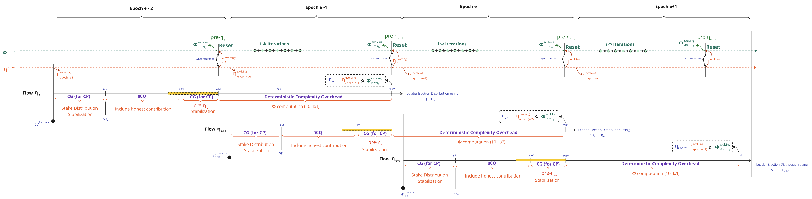
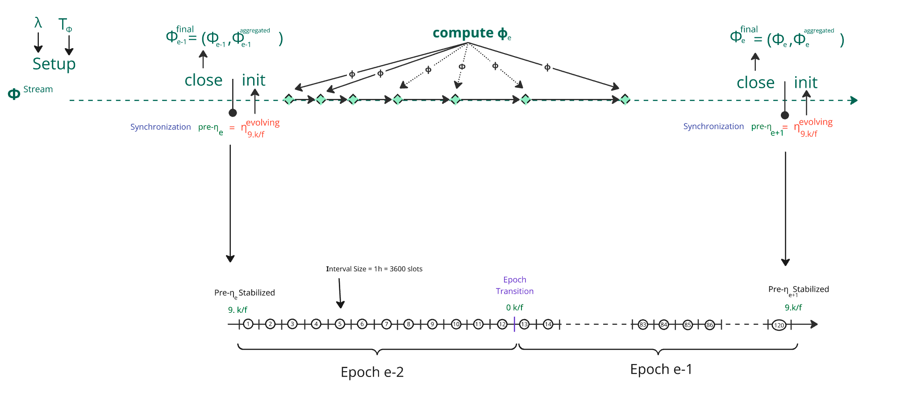
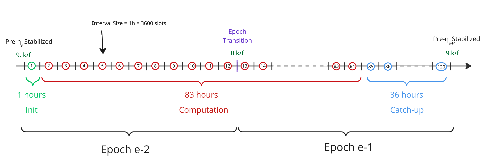
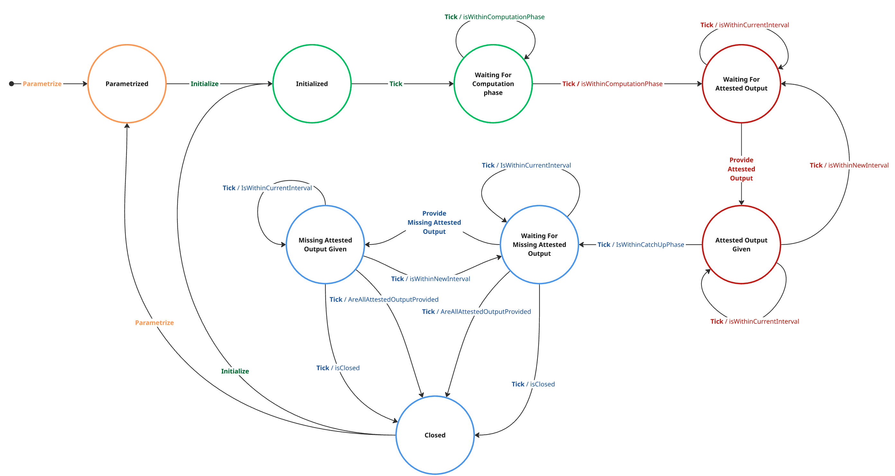

## Table of Contents

- [Abstract](#abstract)
- [Motivation: why is this CIP necessary?](#motivation-why-is-this-cip-necessary)
- [Specification / The Φalanx Sub-Protocol](#specification--the-φalanx-sub-protocol)
  - [1. High-Level Overview ](#1-high-level-overview)
    - [1.1 Changes Relative to Praos](#11-changes-relative-to-praos)
    - [1.2 Inputs & Outputs ](#12-inputs--outputs)
      - [1.2.1 The η Stream](#121-the-etatextstream)
      - [1.2.2 The pre-ηₑ Synchronizations](#122-the-textpre-eta-synchronizations)
      - [1.2.3 The Φ Stream ](#123-the-phitextstream)
        - [1.2.3.1 The Setup](#1231-the-setup)
        - [1.2.3.2 The Lifecycle](#1232-the-lifecycle)
      - [1.2.4 The η Generations](#124-the-eta-generations)
  - [2. The Φ Cryptographic Primitive](#2-the-φ-cryptographic-primitive)
    - [2.1. Expected Properties](#21-expected-properties)
    - [2.2. Verifiable Delayed Functions (VDF)](#22-verifiable-delayed-functions-vdf)
    - [2.3 Wesolowski's VDF](#23-wesolowskis-vdf)
      - [2.3.1 VDF Primitives](#231-vdf-primitives)
      - [2.3.1 VDF Aggregation Primitives](#231-vdf-aggregation-primitives)
  - [3. $`\phi^{\text{stream}}`$ Specification](#3-phitextstream-specification)
    - [3.1 Distribution of Φ Iterations](#31-distribution-of-φ-iterations)
    - [3.2 The State Machine](#32-the-state-machine)
      - [3.2.1 Diagram Overview](#321-diagram-overview)
      - [3.2.2 Parametrization Phase](#322-parametrization-phase)
      - [3.2.3 Initialization Grace Phase](#323-initialization-grace-phase)
        - [3.2.3.1 Initialize Command](#3231-initialize-command)
        - [3.2.3.2 Tick Commands & Grace Period](#3232-tick-commands--grace-period)
      - [3.2.4 Computation Phase](#324-computation-phase)
        - [3.2.4.1 VDF integration](#3241-vdf-integration)
        - [3.2.4.2 The States](#3242-the-states)
        - [3.2.4.3 ProvideAttestedOutput & Tick Commands](#3243-provideattestedoutput--tick-commands)
      - [3.2.5 Catch-up Phase](#325-catch-up-phase)
        - [3.2.5.1 The States](#3251-the-states)
        - [3.2.5.2 ProvideMissingAttestedOutput & Tick Commands](#3252-providemissingattestedoutput--tick-commands)
      - [3.2.6 Closure Phase](#326-closure-phase)
        - [3.2.6.1 The States](#3261-the-states)
        - [3.2.6.2 The Successful Scenario: The `Close` Command](#3262-the-successful-scenario-the-close-command)
        - [3.2.6.3 `tick` Command](#3263-tick-command)
        - [3.2.6.4 The Failure Scenario : The Force Close Process](#3264-the-failure-scenario--the-force-close-process)
  - [4. Agda Mechanization](#38-agda-mechanization)
- [Rationale: How does this CIP achieve its goals?](#rationale-how-does-this-cip-achieve-its-goals)
  - [1. How Phalanx Addresses CPS-21 - Ouroboros Randomness Manipulation ?](#1-how-phalanx-addresses-cps-21---ouroboros-randomness-manipulation)
    - [1.1 Problem Overview](#11-problem-overview)
    - [1.2 Phalanx Cost Amplification per Grinding Attempt](#12-phalanx-cost-amplification-per-grinding-attempt)
    - [1.3 Phalanx Cost Amplification per Grinding Attack](#13-phalanx-cost-amplification-per-grinding-attack)
      - [1.3.1 Formula](#131-formula)
      - [1.3.2 Estimated Formula Using Mainnet Cardano Parameters](#132-estimated-formula-using-mainnet-cardano-parameters)
      - [1.3.3 Impact of T<sub>Φ</sub> on Canonical Scenarios](#133-impact-of-t_phi-on-canonical-scenarios)
      - [1.3.4 Impact of T<sub>Φ</sub> on Feasibility Categories](#134-impact-of-t_phi-on-feasibility-categories)
    - [1.4. Conclusion: How Much Risk is Mitigated?](#14-conclusion-how-much-risk-is-mitigated)
  - [2. How Phalanx Improves CPS-17 - Settlement Speed ?](#2-how-phalanx-improves-cps-17---settlement-speed)
    - [2.1 Settlement times without grinding attacks](#21-settlement-times-without-grinding-attacks)
    - [2.2 How Grinding Power affects Settlement times](#22-how-grinding-power-affects-settlement-times)
    - [2.3 How Phalanx improves compared to Praos?](#23-how-phalanx-improves-compared-to-praos-) 
    - [2.4 Advocating for Peras: Phalanx as a Complementary Layer](#24-advocating-for-peras-phalanx-as-a-complementary-layer) 
  - [3. Why VDFs Were Chosen over other Cryptographic Primitives ?](#3-why-vdfs-were-chosen-over-other-cryptographic-primitives-)
    - [3.1 Requirements](#31-requirements)
    - [3.2 Primitive selection](#32-primitive-selection)
      - [3.2.1 RSA solutions](#321-rsa-solutions)
        - [3.2.1.1 Designs](#3211-designs)
        - [3.2.1.2 Properties](#3212-properties)
      - [3.2.2 ECC solutions](#322-ecc-solutions)
        - [3.2.2.1 Designs](#3221-designs)
        - [3.2.2.2 Properties](#3222-properties)
      - [3.2.3 Class group solutions](#323-class-group-solutions)
        - [3.2.3.1 Design](#3231-design)
        - [3.2.3.2 Properties](#3232-properties)
      - [3.2.4 OWF solutions](#324-owf-solutions)
        - [3.2.4.1 Proofs of knowledge](#3241-proofs-of-knowledge)
        - [3.2.4.2 OWFs](#3242-owfs)
        - [3.2.4.3 Design](#3243-design)
        - [3.2.4.4 Properties](#3244-properties)
    - [3.3 Primitive recommendation](#33-primitive-recommendation)
  - [4. Simulation and Prototyping](#4-simulation-and-prototyping)
    - [4.1 Implementing Wesolowski’s VDF: The CHiA Approach](#41-implementing-wesolowskis-vdf-the-chia-approach)
    - [4.2 Lightweight Simulation of Phalanx](#42-lightweight-simulation-of-phalanx)
  - [5. Phalanx Performance Evaluation](#5-phalanx-performance-evaluation)
  - [6. Recommended Parameters](#6-recommended-parameters)
- [Path to Active](#path-to-active)
  - [Acceptance Criteria](#acceptance-criteria)
  - [Implementation Plan](#implementation-plan)
- [References](#references)
- [Copyright](#copyright)


## Abstract

<!-- A short (\\\~200 word) description of the proposed solution and the technical issue being addressed. \-->

Addressing the "[Ouroboros Randomness Manipulation](../CPS/README.md)" **Problem**,  **Ouroboros Φalanx (Pronounced Phalanx)** enhances **Ouroboros Praos** to mitigate grinding attacks by **increasing the cost of leader election manipulation**. It extends **nonce generation from 1 epoch to 2**, introducing a **computationally intensive function** that remains efficient for honest participants but makes it **significantly more costly for adversaries to bias the process**.

A [**Phalanx**](https://en.wikipedia.org/wiki/Phalanx) is an **Ancient Greek military formation** where soldiers **stand in a tightly packed unit**, shielding and reinforcing one another to create a nearly impenetrable defense. This strategy made it far more difficult for enemies to break through compared to fighting individual soldiers.


In **Φalanx Protocol**, we apply this idea cryptographically by **enhancing the VRF-based randomness generation sub-protocol** with a cryptographic primitive that is **efficient for honest participants** but **computationally expensive for adversaries** attempting to bias leader election. While it won’t eliminate grinding attacks entirely, it **significantly increases their cost**, and our work focuses on **precisely quantifying this added expense**.

Please refer to the CPD "[Ouroboros Randomness Generation Sub-Protocol – The Coin-Flipping Problem](../CPS/CPD/README.md)" for a detailed understanding of **randomness generation, leader election in Praos, and the coin-flipping dilemma in consensus protocols**. Moving forward, we will **dive into the core details**, assuming you have the **relevant background** to understand the proposal.

## Motivation: why is this CIP necessary?

The "[Ouroboros Randomness Generation Sub-Protocol – The Coin-Flipping Problem](../CPS/CPD/README.md)" CPD reveals a significant vulnerability in **Ouroboros Praos**: adversaries controlling a substantial portion of stake can execute **grinding attacks** to manipulate leader election, compromising the protocol’s fairness and security. As detailed in [CPD Section 3.2 - Entry Ticket: Acquiring Stake to Play the Lottery](../CPS/CPD/README.md#32-entry-ticket-acquiring-stake-to-play-the-lottery), an adversary with **20% or more of the total stake** gains an exponential advantage in influencing randomness, with attack feasibility increasing rapidly as stake grows. This critical threshold is further explored in [CPD Section 3.6 - Grinding Power Computational Feasibility](../CPS/CPD/README.md#36-grinding-power-computational-feasibility), which shows that grinding attacks become computationally viable for well-resourced adversaries, particularly in the "Owl Survey" scenario, where costs remain within the "Possible" range (up to $\$1$ billion USD) for grinding depths ($\rho$) up to $57.7$.

A grinding depth of **57.7** bits means:
  - The adversary can simulate approximately $2^{57.7}$ possible randomness outcomes, derive the corresponding leader distribution for the next epoch, and select the most favorable one.
  - This amplifies the probability of bad events (such as rollbacks or forks) compared to the honest model. The key idea is that if a bad event, like a settlement failure, occurs with probability $\varepsilon$ under perfectly unbiased randomness, then an adversary who can try $R$ independent randomness candidates can increase the chance of that event up to $R \cdot \varepsilon$ (by the union bound).

**For example**, suppose that on mainnet we reach a rollback probability of $2^{-60}$ for a block at index $x$ after $y$ additional blocks are appended. If an adversary has grinding power of $2^{57.7}$, the effective risk becomes $2^{-60} \cdot 2^{57.7} = 2^{-2.3}$. To maintain the original $2^{-60}$ confidence level under grinding, the protocol must instead target a baseline security of $2^{-(60 + 57.7)} = 2^{117.7}$, requiring many more blocks to be appended, thus significantly increasing settlement times.

Because the protocol must account for the possibility of grinding attacks, settlement times are currently calibrated with conservative assumptions. Mitigating this attack presents a compelling opportunity to improve settlement speed which the core objective of [CPS-0017 / Settlement Speed](https://github.com/cardano-foundation/CIPs/tree/master/CPS-0017).

**Φalanx** proposes a solution by introducing a computationally intensive mechanism that disproportionately burdens attackers while remaining manageable for honest participants. By elevating the resource threshold required for successful attacks, as analyzed in [CPD Section 3.4 - Cost of a Grinding Attack](../CPS/CPD/README.md#34-cost-of-a-grinding-attack), this CIP aims to shift the feasibility curve, making randomness manipulation more economically and practically infeasible. 

This CIP responds to two Cardano Problem Statements:

- [CPS-0021 / Ouroboros Randomness Manipulation](https://github.com/cardano-foundation/CIPs/tree/master/CPS-0021), by reducing the probability of bad events facilitated by grinding attacks.
- [CPS-0017 / Settlement Speed](https://github.com/cardano-foundation/CIPs/tree/master/CPS-0017), by making better settlement guarantees.


## Specification / The Φalanx Sub-Protocol

<!-- The technical specification should describe the proposed improvement in sufficient technical detail. In particular, it should provide enough information that an implementation can be performed solely on the basis of the design in the CIP. This is necessary to facilitate multiple, interoperable implementations. This must include how the CIP should be versioned, if not covered under an optional Versioning main heading. If a proposal defines structure of on-chain data it must include a CDDL schema in its specification.-->

The core principle of the proposed protocol change is to **substantially escalate the computational cost of each grinding attempt for an adversary**. To achieve this, every honest participant is required to perform a designated computation for each block they produce over an epoch (**432,000 slots - 5 days**). Consequently, an adversary attempting a grinding attack must **recompute these operations for every single attempt**, while being **constrained by the grinding window**, which dramatically increases the resource expenditure. By enforcing this computational burden, we **drastically reduce the feasible number of grinding attempts** an adversary with a fixed resource budget can execute, making randomness manipulation **more expensive and significantly less practical**.
 

### 1. High-Level Overview 

#### 1.1 Changes Relative to Praos

In **Φalanx** , the randomness generation and leader election flows are modified as follows:


1. The **stake distribution stabilization phase** is shifted **back by one epoch :** The **active** **stake distribution** *SDe* used for leader election is now derived from the **end of $epoch_\text{e-3}$** instead of **$epoch_\text{e-2}$**  as in the original Praos protocol.  
2. The **honest contribution inclusion phase**, which originally resulted in a **ηₑ candidate**, is also **shifted back by one epoch**, aligning with the adjusted **stake distribution stabilization**. This value is now referred to as the **pre-ηₑ candidate**, signifying its role as an **intermediate randomness nonce** in the sub-protocol.  
3. The **pre-ηₑ candidate**, once finalized (after $`3 \cdot \frac{k}{f}`$), undergoes a **sequence of incremental hashings** using a **new deterministic cryptographic primitive Φ (Phi)**. This sequence spans a full epoch size, specifically during the interval:$`\left[\frac{9k}{f} \cdot \text{epoch}_{e-2},  \frac{9k}{f} \cdot \text{epoch}_{e-1}\right)`$.
4. The final **ηₑ (eta nonce)**, resulting from the Φ computation, is stabilized and becomes available $`\frac{k}{f}`$ slots before the start of $`\text{epoch}_e`$ like in Praos.

#### 1.2 Inputs & Outputs 

The Randomness Generation sub-protocol operates with two parallel streams $`\eta^\text{stream}`$ and $`\phi^\text{stream}`$, which synchronize at $`9.\frac{k}{f}`$ at each epoch :  



##### 1.2.1 **The $`\eta^\text{stream}`$** 

   - Already present in Praos and retained in Phalanx 
   - Updated with every block produced in the blockchain tree, a $`\eta^\text{stream}`$ captures intermediate values $`\eta^\text{evolving}_t`$ in the block headers, defined as follows:

```math
   \eta^{\text{evolving}}_{t+1} =
   \begin{cases}
   \text{ProtocolParameter}_\text{extraEntropy} & \text{when } t = 0, \\
   \eta^{\text{evolving}}_{t} ⭒ VRF^\text{Output}_\text{t+1} & \text{when BlockProduced}(t) \\
   \eta^{\text{evolving}}_{t}  & \text{otherwise.}
   \end{cases}
   
```
```math 
\text{BlockProduced}(t) = 
\begin{cases} 
true & \text{if a block is produced at time } t, \\
false & \text{otherwise.}
\end{cases}
```

| **where** ||
|---------------|-----------------|
| $`\text{ProtocolParameter}_\text{extraEntropy} `$ | The evolving nonce is initialized using the extraEntropy field defined in the protocol parameters.|
| $` VRF^\text{Output}_\text{i} `$ | The **VRF output** generated by the $` \text{slot}_\text{i} `$ Leader and included in the block header |
| $a⭒b$    | The concatenation of $a$ and $b$ , followed by a BLAKE2b-256 hash computation.


##### 1.2.2 The $`\text{pre-}\eta`$ Synchronizations  

- To generate $`\eta_\text{e}`$ for epoch $`e`$, the stream $`\phi^\text{stream}`$ is reset with the value of $`\eta^\text{stream}`$ at $`t=9.\frac{k}{f}`$ at $epoch_{e-2}$
- This specific value of $`\eta^\text{stream}`$ is referred to as **$`\text{pre-}\eta_e`$** and defined as :
```math
\text{pre-}\eta_e= \eta^{evolving}_{9.\frac{k}{f}(epoch_{e-2})}
```

##### 1.2.3 The $`\phi^\text{stream}`$

###### 1.2.3.1 The Setup

The stream is bootstrapped by calling the parametrize function of the cryptographic primitive $`\Phi`$ with:
```math
Φ.\text{Stream.State} \leftarrow \Phi.\text{parametrize}(\lambda, T_\Phi)
```
where : 
  -  $`\lambda`$ is a security parameter for the cryptographic primitive $`\Phi`$.
  - $`T_\Phi`$, a time-bound parameter representing the required computation  $`\Phi`$ duration, independent of available computing power.
  - Any change to these 2 parameters would require a decision through Cardano governance.
  - $\Phi.\text{Stream.State}$ will contain derived configuration specific to the algorithm and the cryptographic primitive used.

###### 1.2.3.2 The Lifecycle

It is reset at every $`\text{pre-}\eta`$ synchronization point every $`10.\frac{k}{f}`$ slots :
```math
Φ.\text{Stream.State} \leftarrow \Phi.\text{initialize}(Φ.\text{Configuration}, \text{pre-}\eta)
```
At each slot $t$, update the stream state by :   
```math
Φ.\text{Stream.State} \leftarrow \Phi.\text{tick}(Φ.\text{Stream.State, t})
```
A node must be able to determine, based on the current state, whether it should begin computing $\Phi$ iterations in order to provide a proof at its next scheduled leader slot:
```math
\{0,1\} \leftarrow \Phi.\text{shouldCompute}(Φ.\text{Stream.State,nextSlotLeader})
```
A node must be able to compute a specific chunk of the $`\Phi`$ iteration independently of any global state. 
The result is an *attested output*—a pair $`\phi_x =(\pi_x,\ o_x)`$ where : 

 - $`o_x`$ is the computed output for iteration $`x`$, 
 - $`\pi_x`$ is a cryptographic proof attesting that $`o_x`$ was correctly derived from the input according to the rules of $`\Phi`$. 
 - Since this operation may be long-lived, intermediate attested outputs should be persistable to disk, allowing the node to stop, resume, or cancel computation from the latest completed sub-computation.

A subset of block-producing slots must include in their block headers a unique attested output $`\phi_x`$ whith $`x \in \{1, \dotsc, e \}`$ denoting the iteration index within the $`\Phi`$ computation :
  - Each attested output updates the stream state as follows:
```math
 \Phi.\text{StreamState} \leftarrow \Phi.\text{provideAttestedOutput}(\Phi.\text{StreamState},\ t,\ \phi_x)
```
  - Each attested output must be verifiable both:
      - **logically**, to ensure it corresponds to the correct slot and index, and
      - **cryptographically**, to confirm that the computation was effectively executed

```math
\{0,1\} \leftarrow \Phi.\text{verify}(\Phi.\text{StreamState},\ t,\ \phi_x)
```

At the synchronization point $`\text{pre-}\eta_{e+1}`$, the stream is closed providing $`\phi^{final}_e = (\phi_e,\phi^{aggregated}_e)`$ with the last attested output $`\phi_e`$, along with an **aggregated proof** $`\phi^{final}_e`$. This aggregated proof allows nodes to efficiently verify the final result without checking each individual $`\phi_x`$ produced during the computation phase :

```math
\phi^{final}_e \leftarrow \Phi.\text{close}( \Phi.\text{StreamState})
```

##### 1.2.4 The $`\eta`$ Generations
   - This is the final nonce $`\eta_\text{e}`$ used to determine participant eligibility during epoch $`e`$.  
   - It originates from the operation ⭒ with  $`\phi^{\text{stream}}_{t}`$ at $`\text{pre-}\eta_\text{e+1}`$ Synchronization and $`\eta^\text{stream}_t`$ $`\text{when } t = \text{end of epoch}_\text{e-3}`$   

```math
\eta_\text{e} = \eta^\text{evolving}_{epoch_\text{e-3}} ⭒ {o_e} , \quad \text{when } t = \text{pre-}\eta_\text{e+1}\text{ synchronization } 
```


### 2. The Φ Cryptographic Primitive

#### 2.1. Expected Properties

The Φ cryptographic primitive is a critical component of the Φalanx protocol, designed to increase the computational cost of grinding attacks while remaining efficient for honest participants. To achieve this, Φ must adhere to a set of well-defined properties that ensure its security, efficiency, and practical usability within the Cardano ecosystem. These properties are outlined in the table below :

| **Property**              | **Description**                                                                                                   |
|---------------------------|-------------------------------------------------------------------------------------------------------------------|
| **Functionality**         | Must be a well-defined mathematical function, ensuring a unique output for each given input (unlike proof-of-work, which allows multiple valid outputs). |
| **Determinism**           | Must be fully deterministic, with the output entirely determined by the input, eliminating non-deterministic variations. |
| **Efficient Verification**| Must allow for fast and lightweight verification, enabling rapid validation of outputs with minimal computational overhead. |
| **Compact Representation**| Input and output sizes should be small enough to fit within a block, optimizing on-chain storage efficiency. Further reductions are desirable where feasible. |
| **Lower Bound on Computation** | Computational cost of evaluation should be well-characterized and predictable, with a lower bound that is difficult to surpass, ensuring adversaries cannot gain an unfair efficiency advantage. |
| **Ease of Implementation & Maintenance** | Should be simple to implement and maintain, ensuring long-term usability and minimizing technical debt. |
| **Adaptive Security**     | Function and its parameters should be easily reconfigurable to accommodate evolving threats, such as advances in computational power or new cryptographic attacks. |

#### 2.2. Verifiable Delayed Functions (VDF)

Verifiable Delayed Functions (VDFs) are cryptographic primitives designed to take a certain amount of time to compute, regardless of how much computing resources are avaialable. This delay is enforced by requiring a specific number of sequential steps that cannot be sped up through parallel processing. Once the computation is done, the result comes with a proof that can be checked quickly and efficiently by anyone. Importantly, for a given input, the output is always the same (deterministic function), ensuring consistency. They usually rely on repeatedly squaring numbers in a mathematical setting that prevents shortcuts and enables quick verification.

As one can see, VDFs present _functionality_, _determinism_, _efficient verification_ and _lower bound on computation_. The _compact representation_ depends on the chosen group as well as the instantiation, which we will tackle later on. The _implementation and maintenance_ is straightforward as the output of a VDF is a simple exponentiation of a group element, only the square operation is needed to be implemented to compute it. As for the proof, this depends on the precise VDF instantiation. Finally, the system is "adaptively secure" as we can set up a group with high security to be reused for a whole epoch, and set the number of squaring, also called difficulty, depending on how much computation we want the nodes to perform.

Verifiable Delayed Functions were introduced by Boneh et al. [6](https://eprint.iacr.org/2018/601.pdf) where the authors suggest several sequential functions combined with the use of proof systems in the incrementally verifiable computation framework (IVC) for viable proof generation and fast verification.
VDF variants revolve around two primary SNARK-free designs: one from Pietrzak [36](https://drops.dagstuhl.de/storage/00lipics/lipics-vol124-itcs2019/LIPIcs.ITCS.2019.60/LIPIcs.ITCS.2019.60.pdf) and the second from Wesolowski [35](https://eprint.iacr.org/2018/623.pdf). They differ in the proof design. 

In Wesolowski’s paper, the proof is defined as $x^{2^T} / l$ where $g$ is the challenge, $T$ the difficulty and $l$ is a prime number found by hashing the VDF input and output together.  

The proof is thus a single group element that can be computed in at most $2 T$ group operations and constant space, or $(1+1/s) \cdot T$ time where the number $s$ is both the number of processors and space while the verification takes $log_2 T$ scalar multiplications in $\mathcal{Z}/l$ and two small exponentiations in the group $\mathbb{G}$. 

The proving time can further be optimized to $O(T /  log(T))$ group multiplications by reusing the evaluation intermediary results.

Wesolowski also presents aggregation and watermarking methods. The aggregation method does not consist in aggregating multiple proofs but computing a proof of several VDF challenges. This is done by batching all inputs and outputs together and creating a proof for this batched input. The watermarking is done by computing the VDF twice, once normally and another time on a combination of the challenger’s id and VDF input.

In Pietrzak’s paper, the proof is a tuple of group elements $\pi = \{x^{2^{T / 2^i}}\}$, of size logarithmic in $T$, that can be computed in $(1+2 \sqrt{T}^-1) T$ time and can be optimized to $O(\sqrt{T} \cdot log_2 T)$ multiplications, the verification takes $2 \cdot log_2T$ small exponentiations. Subsequent work on Pietrzak’s paper shows how VDFs challenges can be structured in a Merkle tree to get a proof of the whole tree.

We will choose Wesolowski design over Pietrzark because of its space efficiency and possibility to aggregate proofs.


#### 2.3 Wesolowski's VDF 

##### 2.3.1 VDF Primitives

Let $`\text{VDF} = (\text{Setup},\ \text{Prove},\ \text{Verify})`$ be a Verifiable Delay Function based on class groups, defined as follows:

- $`(\mathbb{G},\ \Delta,\ \cdot) \leftarrow \text{VDF}.\text{Setup}(\lambda,\ \Delta_{\text{challenge}})`$
  Takes as input a **security parameter** $`\lambda \in \mathbb{N}`$ and a **challenge discriminant** $`\Delta_{\text{challenge}}`$. This challenge discriminant acts as a source of public entropy used to deterministically derive the group discriminant $\Delta$, which defines a group of unknown order $\mathbb{G}$ along with its group operation $`\cdot`$. The use of a challenge ensures that the resulting group is unbiasable and unpredictable, preventing adversarial precomputation. Internally, we expect the setup procedure to invoke the following sub-operations:
```math
    \Delta \leftarrow \texttt{VDF.CreateDiscriminant}(\lambda,\ \Delta_{\text{challenge}})
```
```math
  (\mathbb{G},\ \cdot) \leftarrow \texttt{VDF.DeriveGroupClass}(\lambda,\ \Delta)
```

- $`(y,\ \pi) \leftarrow \text{VDF}.\text{Prove}((\mathbb{G},\ \Delta,\ \cdot), \ x,\ I)`$
  Given a challenge $`x \in \mathbb{G}`$ and a number of iterations $`I \in \mathbb{N}`$, computes the VDF output $`y = x^{2^I}`$ and a corresponding **proof** $`\pi`$.

- $`\{0,1\} \leftarrow \text{VDF}.\text{Verify}((\mathbb{G},\ \Delta,\ \cdot), \ x,\ y,\ I,\ \pi)`$
  Returns 1 if $`\pi`$ successfully attests that $`y = x^{2^I}`$, with overwhelming probability. Returns 0 otherwise.


##### 2.3.1 VDF Aggregation Primitives

Let $`\text{VDF.Aggregation} = (\text{Prove},\ \text{Verify},\ \text{ComputeChallenge},\ \text{VerifyChallenge})`$ denote an **Aggregated Verifiable Delay Function** constructed over class groups.

In the sections that follow, we present a mechanism for producing a **proof of aggregation**. This construction enables efficient synchronization for network participants and plays a central role in deriving the final epoch nonce $`\eta_e`$. Each function in the aggregation interface is detailed below, forming the core of this synchronization primitive.


| `compute an aggregated output` | $`(x,\ y,\ \pi) \leftarrow \texttt{VDF.Aggregation.Prove}(\lambda,\ \text{Hash}_\mathbb{G},\ \text{Hash}^{(n)}_\mathbb{N},\ \text{pre-}\eta_e, \ [(x_i, y_i)]^n,\ I)`$     |
| ------------------------- | ------------------------- |
| **Input Parameters**      | <ul><li>$`\lambda \in \mathbb{N}`$ — Security parameter.</li><li>$`\text{Hash}_\mathbb{G}`$ — Hash function mapping to the group $`\mathbb{G}`$.</li><li>$`\text{Hash}^{(n)}_\mathbb{N}`$ — Hash function mapping to $`\mathbb{N}`$ with domain size $`n`$.</li><li>$\text{pre-}\eta_e \in \{0,1\}^{256}$ — 256-bit pre-nonce entropy for epoch $e$.</li><li>$`[(x_i, y_i)]^n`$ — List of $`n`$ attested output pairs for intervals.</li><li>$`I \in \mathbb{N}`$ — Per-interval iteration count for the VDF.</li></ul> |
| **Steps**                 | <ol><li>Compute the aggregated challenge:<br>$`x \leftarrow \texttt{VDF.Aggregation.computeChallenge}(\lambda,\ \text{Hash}_\mathbb{G},\ \text{Hash}^{(n)}_\mathbb{N},\ [(x_i, y_i)]^n)`$</li><li>Compute the VDF output and proof:<br>$`(y,\ \pi) \leftarrow \text{VDF}.\text{Prove}((\mathbb{G},\ \Delta,\ \cdot), \ x,\ I)`$</li></ol>                                                                                                          |
| **Returned Output**       | $`(x,\ y,\ \pi)`$ — Aggregated input, output, and VDF proof.   |


| `compute an aggregated challenge` | $`x \leftarrow \texttt{VDF.Aggregation.computeChallenge}(\lambda,\ \text{Hash}_\mathbb{G},\ \text{Hash}^{(n)}_\mathbb{N},\ \text{pre-}\eta_e, \ [(x_i, y_i)]^n)`$  |
| ------------------- | ------------------- |
| **Input Parameters**         | <ul><li>$`\lambda \in \mathbb{N}`$ — Security parameter (bit length).</li><li>$`\text{Hash}_\mathbb{G}`$ — Hash function mapping into the class group $`\mathbb{G}`$.</li><li>$`\text{Hash}^{(n)}_\mathbb{N}`$ — Hash function producing $`n`$-bit integers.</li><li>$\text{pre-}\eta_e \in \{0,1\}^{256}$ — 256-bit pre-nonce entropy for epoch $e$.</li><li>$`[(x_1, y_1), \dots, (x_n, y_n)]`$ — Sequence of $`n`$ tuples where $`x_i`$ is a VDF challenge and $`y_i`$ the corresponding output.</li></ul> |
| **Per-element Computation**  | For each $`i \in \{1, \dots, n\}`$:<br><ul><li>$`x_i = \text{Hash}_\mathbb{G}(\text{pre-}\eta_e \,\|\, i)`$ — Compute individual VDF challenge from the pre-nonce and index.</li><li>$`\alpha_i = \text{Hash}^{(\lambda)}_\mathbb{N}(\cdots\text{Hash}^{(\lambda)}_\mathbb{N}(\text{Hash}^{(\lambda)}_\mathbb{N}(x_1 \,\|\, \cdots \,\|\, x_n) \,\|\, y_1)\cdots \,\|\, y_i)`$ — Derive exponent for aggregation.</li></ul>      |
| **Final Aggregation**        | Compute the aggregated challenge:<br>$`x = \prod_{i=1}^{n} x_i^{\alpha_i}`$    |
| **Returned Value**           | $`x \in \mathbb{G}`$ — Aggregated VDF challenge in the class group. |


| `Verify Challenge x` | $`\texttt{VDF.Aggregation.VerifyChallenge}(\lambda,\ \text{Hash}_\mathbb{G},\ \text{Hash}^{(n)}_\mathbb{N},\ x_{\text{expected}},\ [(x_i, y_i)]^n)`$     |
| ------------- | ------ |
| **Input Parameters**              | <ul><li>$`\lambda \in \mathbb{N}`$ — Security parameter.</li><li>$`\text{Hash}_\mathbb{G}`$ — Hash function mapping into the class group $`\mathbb{G}`$.</li><li>$`\text{Hash}^{(n)}_\mathbb{N}`$ — Hash function returning $`n`$-bit integers.</li><li>$`x_{\text{expected}} \in \mathbb{G}`$ — Expected aggregated challenge.</li><li>$`[(x_1, y_1)]^n`$ — Sequence of $`n`$ VDF challenge-output pairs.</li></ul> |
| **Computation**                   | Recompute the challenge:<br>$`x \leftarrow \texttt{VDF.Aggregation.computeChallenge}(\lambda,\ (\mathbb{G},\ \Delta,\ \cdot),\ \text{Hash}_\mathbb{G},\ \text{Hash}^{(n)}_\mathbb{N},\ [(x_i, y_i)]^n)`$    |
| **Check**                         | Verify equality:<br>$`x \stackrel{?}{=} x_{\text{expected}}`$   |
| **Returned Value**                | $`\texttt{true}`$ if the computed $`x`$ matches $`x_{\text{expected}}`$; otherwise $`\texttt{false}`$.  |


| `Verify Aggregated Output` | $`\texttt{VDF.Aggregation.Verify}(\lambda,\  (\mathbb{G},\ \Delta,\ \cdot) ,\  \text{Hash}_\mathbb{G},\ \text{Hash}^{(n)}_\mathbb{N} ,\ x,\ y, [(x_i, y_i)]^n,\ I ,\ \ \pi,\ )`$   |
| ------------------- | ------ |
| **Input Parameters**       | <ul><li>$`\lambda \in \mathbb{N}`$ — Security parameter.</li><li>$`(\mathbb{G},\ \Delta,\ \cdot)`$ — Group and associated data.</li><li>$`\text{Hash}_\mathbb{G}`$ — Hash function into the group.</li><li>$`\text{Hash}^{(n)}_\mathbb{N}`$ — Hash to $`\mathbb{N}`$.</li><li>$`x \in \mathbb{G}`$ — Aggregated challenge to verify.</li><li>$`y \in \mathbb{G}`$ — Claimed output of the VDF.</li><li>$`[(x_i, y_i)]^n`$ — Sequence of challenge-output pairs.</li><li>$`I \in \mathbb{N}`$ — Number of VDF iterations.</li><li>$`\pi`$ — Claimed proof of the computation.</li></ul> |
| **Steps** | <ol><li>Recompute and verify the challenge:<br>$`\texttt{VerifyChallenge}(\lambda,\ \text{Hash}_\mathbb{G},\ \text{Hash}^{(n)}_\mathbb{N},\ x,\  [(x_i, y_i)]^n))`$</li><li>Run the VDF verifier:<br>$`\text{VDF.Verify}((\mathbb{G},\ \Delta,\ \cdot),\ x,\ y,\ I,\ \pi)`$</li></ol>  |
| **Returned Value**         | $`\texttt{true}`$ if both challenge and VDF proof are valid; otherwise $`\texttt{false}`$. |

### 3. $`\phi^{\text{stream}}`$ Specification

We previously outlined the purpose of the Phalanx sub-protocol and introduced the cryptographic primitive underpinning its security guarantees. In this section, we provide a precise technical specification of the protocol, focusing on how the $`\Phi`$ iterations are distributed and how Wesolowski’s Verifiable Delay Function (VDF) is integrated into the process.

#### 3.1 Distribution of $\Phi$ Iterations

As previously mentioned, $`\phi^{\text{stream}}`$ is divided into epoch-sized *lifecycle segments*. They begin with an **init** function, end with a **close** function, and then followed by a new segment begins.

We further partition this segment into **intervals**, each large enough to guarantee (with 128-bit confidence) that at least one block will be produced within it. This corresponds to **3434 slots** per interval. For simplicity, we round this to **3600 slots** (~1 hour), resulting in exactly 120 intervals per segment, which conveniently aligns with the 120 hours in five days.

<details>
<summary>🔍 How 128-bit Confidence gives 3434 Slots ?</summary>
<p> 

## 📦 Guaranteeing Honest Block Inclusion with 128-bit Confidence in our context

We want to make sure that, in any given interval of $N$ slots, there's **at least one honest block** produced — with a failure probability of at most $2^{-128}$ (which is a standard for cryptographic security).

It is also important to note that we are operating in a context where fork-related concerns can be safely abstracted away. In particular, if an adversary were to attempt a private chain attack and succeed, it would imply that their chain is denser and that the proof of $\Phi$ computation is valid. In this setting, forks do not undermine security—they actually improve the probability of having at least one valid computation published within the interval.

This means:

```math
\Pr(\text{at least one honest block in } N \text{ slots}) \geq 1 - 2^{-128}
```

##### 🎲 Step 1 — What’s the chance of *not* getting an honest block?

Each slot gives honest participants a chance to be selected as leader.

Let:

- $f = 0.05$ → probability a slot is active  
- $\sigma = 0.51$ → 51% of stake is honest

Then the chance that **no honest party** is selected in a slot is:

```math
(1 - f)^\sigma = 0.95^{0.51} \approx 0.97416
```

So, the chance that **at least one honest party** is selected in a slot is:

```math
p_h = 1 - 0.97416 = 0.02584
```

This means that **each slot has a 2.584% chance** of having an honest leader.

##### 📐 Step 2 — What about across $N$ slots?

The chance that **no honest block** is produced in $N$ consecutive slots is:

```math
(1 - p_h)^N
```

We want this to be **less than or equal to** $2^{-128}$, so:

```math
(1 - p_h)^N \leq 2^{-128}
```

##### ✏️ Step 3 — Solve for $N$

Take log base 2 of both sides:

```math
\log_2((1 - p_h)^N) \leq \log_2(2^{-128})
```

```math
N \cdot \log_2(1 - p_h) \leq -128
```

```math
N \geq \frac{-128}{\log_2(1 - p_h)}
```

Now plug in:

```math
\log_2(1 - 0.02584) = \log_2(0.97416) \approx -0.03729
```

```math
N = \frac{128}{0.03729} \approx 3434
```

To guarantee with 128-bit confidence that an interval contains **at least one honest block**, the interval must be at least **3434 slots** long.

This ensures security even if up to **49% of stake is adversarial**.

----
</p> 
</details>
<br>

This structure can be illustrated as follows:




As previously described, we configure the stream using two key parameters, most notably the total computational budget $`T_\Phi`$. This value defines the total amount of work we require SPOs to collectively perform.

We split $`T_\Phi`$ into discrete **iterations**, each with the following properties:

- Iterations are fully independent and can be computed in parallel.
- Slot leaders are responsible for submitting a proof of computation for the specific iteration assigned to them.
- These computations are fully decoupled, there is no requirement to wait for previous iterations, enabling precomputation.
- All iterations must eventually be completed, and the final iteration involves aggregating all outputs along with a corresponding proof.
- This final aggregate is then used to derive the output $o_e$, which in turn is used to compute the epoch randomness $\eta_e$.

Each iteration is mapped to a specific interval, with the following constraints:

  - The first interval is intentionally left without an assigned iteration, giving slot leaders time to compute the first output during interval 2.
  - Each interval must be longer than the time required to compute a single iteration (i.e., the iteration duration must be less than one hour).
  - The first slot leader to produce a block within an interval is responsible for submitting the corresponding attested output.

At first glance, we could divide $`T_\Phi`$ evenly across the 120 intervals. However, to ensure resilience, the protocol must remain robust even in extreme scenarios—such as a global outage causing **36 hours** of consecutive downtime (**30% of an epoch**). This scenario is detailed in the [Cardano Disaster Recovery Plan](https://iohk.io/en/research/library/papers/cardano-disaster-recovery-plan).

A global outage implies a sequence of blockless intervals. To tolerate such conditions, the protocol must be able to handle up to **36 intervals without block production**.  To address this, we introduce a catch-up mechanism: 
  - We reserve the final 36 intervals of the segment specifically for recovering any missing attested outputs. 
  - These missing outputs must be submitted in order, according to their original indices, ensuring deterministic reconstruction of the full computation stream.


We define **4 sequential phases** in the stream lifecycle:

- 🟧 **Parametrization Phase** : 
  The stream is configured but not yet active. Parameters such as $`\lambda`$ (computation hardness) and $`\#\text{iterations}_\phi`$ (number of iterations) are established during this phase.

- 🟩 **Initialization Grace Phase**:
  The stream is activated, and Stake Pool Operators (SPOs) are given a grace period to begin the first iteration of the computation.

- 🟥 **Computation Phase**:
  During this phase, the protocol expects attested outputs to be published on-chain. It consists of **82 computation iterations**, each producing an intermediate output that contributes to the final result.

- 🟦 **Catch-up & Closure Phase**:
  - A bounded recovery window that allows SPOs to submit any **missing attested outputs**, ensuring the completeness of the computation prior to finalization.
  - A final dedicated interval to compute the **aggregation** of all previous outputs and derive the epoch’s final randomness $`\eta_e`$. This phase **seals the stream** and concludes a lifecycle.

The diagram below illustrates how the lifecycle segment is structured:



### 3.2 The State Machine

#### 3.2.1 Diagram Overview

The figure below presents the **state transition diagram** for the Phalanx computation stream. Each node represents a distinct state in the lifecycle of the stream, and the arrows indicate transitions triggered by `Tick` events. These transitions are guarded by boolean predicates evaluated at each slot (e.g., `isWithinComputationPhase`, `isWithinCurrentInterval`).



In the following sections, we provide a detailed breakdown of each phase of the state machine, specifying its purpose, entry conditions, timing constraints, and transitions.


#### 3.2.2 🟧 *Parametrization Phase*


At the setup of $`\phi^{stream}`$, the total number of VDF iterations is derived from the time-bound parameter $`T_\Phi`$, using a reference hardware profile that reflects the minimal computational capacity expected of SPOs. While this derivation may not be fully automatable in practice, we include it here to clarify how time constraints are mapped to iteration counts during configuration.

Importantly, this **parametrization phase** occurs only once, either during the initial bootstrap of the stream or following a transition from the `Closed` to `Initialized` state.

| `Parametrized`  |  $`\Phi.\text{Stream.State} \in \texttt{Parametrized} : \left\{ {securityParameter} \in \mathbb{N},\quad I \in \mathbb{N} \right\}`$ |
| ---------------------------- | ---------------------------------------------------------------------------------------------------------------------------- |
| **Fields**       | <ul><li>$`\text{securityParameter} \in \mathbb{N}`$ — The **security parameter**, defining the size (in bits) of the VDF discriminant.</li><li>$`I \in \mathbb{N}`$ — The **per-interval VDF iteration count**, computed from $`T_\Phi`$ and evenly distributed across 82 computation intervals.</li></ul> |


|  `parametrize` | $`\Phi.\text{Stream.State} \leftarrow \Phi.\text{parametrize}(\lambda,\ T_\Phi)`$|
| ------------------- | --------------------------------------------------------------------------------------------------------------------------------------- |
| **Input Parameters**          | <ul><li>$`\lambda \in \mathbb{N}`$ — **Security parameter**, defines the size (in bits) of the VDF discriminant.</li><li>$`T_\Phi \in \mathbb{N}`$ — **Time budget** in seconds, representing the total computation time under reference hardware.</li></ul> |
| **Derivation Logic**  | <ul><li>$`\#\text{Iterations}_\Phi \leftarrow \text{VDF}.\texttt{IterationsFromDuration}(T_\Phi)`$</li><li>$`\#\text{Iterations}_\phi \leftarrow \left\lfloor \frac{\#\text{Iterations}_\Phi}{82} \right\rfloor`$</li></ul>                                  |
| **Returned State** | $`\texttt{Parametrized} \left\{ \text{securityParameter} \mapsto \lambda,\quad I \mapsto \#\text{Iterations}_\phi \right\}`$|

#### 3.2.3  🟩 *Initialization Grace Phase*

Initialization occurs at every $`\text{pre-}\eta`$ synchronization point, followed by an *Initialization Grace* period during which the protocol waits long enough for the first iteration to be computed and its proof to be included within the first computation interval. This process recurs every $`10 \cdot \frac{k}{f}`$ slots.

##### 3.2.3.1 *Initialize Command*

| `Initialized` | $`\Phi.\text{Stream.State} \in \texttt{Initialized} : \left\{ \text{parametrized} \in \texttt{Parametrized},\ \text{group} \in \mathbb{G},\  \text{discriminant} \in \mathbb{Z},\ \text{operation} : \mathbb{G} \times \mathbb{G} \to \mathbb{G} \right\}`$|
| ----------- | -------------- |
| **Fields**  | <ul><li>$\text{parametrized} \in \texttt{Parametrized}$ — Reference to the prior configuration (security parameter and iteration count).</li><li>$\text{group} \in \mathbb{G}$ — VDF group used for exponentiation.</li><li>$\text{discriminant} \in \mathbb{Z}$ — Epoch-specific VDF discriminant.</li><li>$\text{operation} : \mathbb{G} \times \mathbb{G} \to \mathbb{G}$ — Group operation used for VDF evaluation (e.g., modular exponentiation).</li><li>$\text{epochId}_e \in \mathbb{N}$ — Numerical identifier for epoch $e$.</li><li>$\text{pre-}\eta_e \in \{0,1\}^{256}$ — 256-bit pre-nonce entropy for epoch $e$.</li></ul> |


| `initialize`           | $\Phi.\text{Stream.State} \leftarrow \Phi.\text{Initialize}(\text{parametrizedState},\ \text{epochId}_e,\ \text{pre-}\eta_e)$ |
| -------------------- | ----------------------------------------- |
| **Input Parameters** | <ul><li>$\text{parametrizedState} = (\lambda,\ I) \in \texttt{Parametrized}$ — Configuration from the prior Parametrized state.</li><li>$\text{epochId}_e \in \mathbb{N}$ — Numerical identifier for epoch $e$.</li><li>$\text{pre-}\eta_e \in \{0,1\}^{256}$ — 256-bit pre-nonce entropy for epoch $e$.</li></ul>              |
| **Derivation Logic** | <ul><li>$`\Delta_{\text{challenge}} \leftarrow \text{Hash}(\text{bin}(\text{epochId}_e) \ \|\ \text{pre-}\eta_e)`$</li><li>$`(\mathbb{G},\ \Delta,\ \cdot) \leftarrow \text{VDF}.\text{Setup}(\lambda,\ \Delta_{\text{challenge}})`$</li></ul> |
| **Returned State**   | $`\texttt{Initialized} \left\{ \text{parametrized} \mapsto (\lambda,\ I),\ \text{group} \mapsto \mathbb{G},\ \text{discriminant} \mapsto \Delta,\ \text{operation} \mapsto \cdot , \ \text{epochId}_e \mapsto \text{epochId}_e ,\ \text{pre-}\eta_e  \mapsto \text{pre-}\eta_e  \right\}`$                                        |

##### 3.2.3.2 *Tick Commands* & Grace Period

| `AwaitingComputationPhase` | $`\Phi.\text{Stream.State} \in \texttt{AwaitingComputationPhase} : \left\{ \text{initialized} \in \texttt{Initialized},\ \text{currentSlot} \in\ \mathbb{N} \bmod \left(10 \cdot \frac{k}{f}\right) \right\}`$ |
|--------------------|-------------|
| **Fields** | <ul><li>$`\text{initialized} \in \texttt{Initialized}`$ — Reference to the prior initialization.</li><li>$`\text{currentSlot} \in\ \mathbb{N} \bmod \left(10 \cdot \frac{k}{f}\right)`$ — The current slot in the chain timeline.</li></ul> |


**Initial tick transition to `AwaitingComputationPhase`:**

| `tick`           | $\Phi.\text{Stream.State} \leftarrow \Phi.\text{tick}(\text{initializedState})$ |
| -------------------- | ----------------------------------------- |
| **Input Parameters** | <ul><li>$\text{initializedState} \in \texttt{Initialized}$ — Configuration from the prior Initialized state.</li></ul>              |
| **Returned State**   | $`\texttt{AwaitingComputationPhase} \left\{ \text{initialized} \mapsto initialiinitializedzedState,\ \text{currentSlot} \mapsto 0 \right\}`$  


**Subsequent ticks on `AwaitingComputationPhase`:**

| `tick`               | $`\Phi.\text{Stream.State} \leftarrow \Phi.\text{tick}(\text{awaitingComputationPhaseState})`$ |
|--------------------|---------------------------------------------------------------------------------------------------|
| **Input Parameters** | <ul><li>$`\text{awaitingComputationPhaseState} \in \texttt{AwaitingComputationPhase}`$ — Configuration from the prior Initialized state.</li></ul> |
| **Returned State**   | $` \begin{cases} \text{When } \texttt{isWithinInitializationGracePhase} :\ \texttt{AwaitingComputationPhase}\ \{ \text{initialized} ,\ \text{currentSlot++} \} \\\\ \text{When } \texttt{isWithinComputationPhase} :\ \texttt{AwaitingAttestedOutput}\ \{ \text{initialized} ,\ \text{currentSlot++} \} \end{cases}`$ |

#### 3.2.4  🟥  *Computation Phase*

##### 3.2.4.1 VDF integration

We are now entering the **Computation Phase**. We have waited long enough for the first slot leader within the initial interval to have the opportunity to produce a block and submit the corresponding attested output. However, because the slot distribution is privately visible, leaders within the interval cannot determine whether they are the first to produce a block.

Each leader is free to adopt their own strategy for deciding whether to initiate the proof of computation. A simple and conservative approach is to wait until $`\text{currentSlot} \geq \text{nextSlotLeader} - \left(\frac{T_\Phi}{82} + C\right)`$, where $`C`$ is a small constant. At that point, the leader may begin computing. If a block has already been produced by then, the leader can either skip the computation or abort it if already in progress. This delay increases the chances that any earlier eligible leaders have already submitted their outputs, thereby minimizing the risk of redundant proofs.

To publish the first block of interval $`i \in [1..82]`$, the node invokes:

```math
(y_i, \pi_i) \leftarrow \Phi.\text{compute}(\text{initialized} \in \texttt{Initialized},\ i \in \texttt{Interval})
```

This function internally calls the VDF primitive: $`(y, \pi) \leftarrow \text{VDF}.\text{Prove}((\mathbb{G},\ \Delta, \cdot),\ x,\ I)`$ with inputs constructed as:

- $`x_i = \text{Hash}(\text{bin}(e) \,\|\, \text{pre-}\eta_e \,\|\, \text{bin}(i))`$
- The parameters $`(\mathbb{G}, \Delta, \cdot)`$ and $`I`$ are retrieved from the `Initialized` state.

Finally, the node includes the attested outputs in the block header:

- $`y_i`$: the VDF output for interval $`i`$
- $`\pi_i`$: the corresponding VDF proof for interval $`i`$

In rare cases, an interval may produce no block, and consequently, no expected proof for the corresponding iteration. The computation phase simply acknowledges these gaps; they are handled during the subsequent **Catch-up Phase**, which is specifically designed to resolve such missing outputs.

##### 3.2.4.2 The States

During the computation phase, the stream alternates between two closely related states: `AwaitingAttestedOutput` and `AttestedOutputProvided`. These two states are **structurally identical**, meaning they share the same underlying fields. What distinguishes them is their **semantic role** in the protocol’s lifecycle:

* `AwaitingAttestedOutput` represents the period **before** an attestation has been submitted for the current interval.
* `AttestedOutputProvided` signals that the attestation for the current interval has been **successfully received and verified**.

The field structure for both is as follows:

```math
\Phi.\text{Stream.State} \in \texttt{AwaitingAttestedOutput} : \left\{
  \begin{aligned}
    &\text{initialized}     &&\in\ \texttt{Initialized}, \\
    &\text{currentSlot}     &&\in\ \mathbb{N} \bmod \left(10 \cdot \frac{k}{f}\right), \\
    &\text{attestedOutputs} &&\in\ \left[\texttt{Maybe}\ (y, \pi)\right]^{82}
  \end{aligned}
\right\}
```

| **Field**   | **Description** |
| ---- | -------- |
| $`\text{initialized} \in \texttt{Initialized}`$ | Reference to the prior initialization state.|
| $`\text{currentSlot} \in\ \mathbb{N} \bmod \left(10 \cdot \frac{k}{f}\right)`$| The current slot in the timeline.  |
| $`\text{attestedOutputs} \in \left[\texttt{Maybe}\ (y, \pi)\right]^{82}`$ | <ul><li>An array of optional attested outputs, one per computation interval.</li><li>Each index corresponds to a specific interval and may contain a proof pair $`(y, \pi)`$.</li><li>If the output is not yet submitted, the entry is `None`.</li></ul> |

The `AttestedOutputProvided` state reuses the exact same structure:

```math
\Phi.\text{Stream.State} \in \texttt{AttestedOutputProvided} : \left\{
  \begin{aligned}
    &\text{initialized}     &&\in\ \texttt{Initialized}, \\
    &\text{currentSlot}     &&\in\ \mathbb{N} \bmod \left(10 \cdot \frac{k}{f}\right), \\
    &\text{attestedOutputs} &&\in\ \left[\texttt{Maybe}\ (y, \pi)\right]^{82}
  \end{aligned}
\right\}
```

This version aligns both the field names and their types in two neat columns. Let me know if you'd prefer the braces to be placed differently (e.g. outside the alignment block) for aesthetic reasons.


| **Field**   | **Description**    |
| ------------- | --------------- |
| $`\text{initialized} \in \texttt{Initialized}`$ | Reference to the prior initialization state.     |
| $`\text{currentSlot} \in\ \mathbb{N} \bmod \left(10 \cdot \frac{k}{f}\right)`$ | The current slot in the timeline.   |
| $`\text{attestedOutputs} \in \left[\texttt{Maybe}\ (y, \pi)\right]^{82}`$ | <ul><li>An array of optional attested outputs, one per computation interval.</li><li>Each index corresponds to a specific interval and may contain a proof pair $`(y, \pi)`$.</li><li>If the output hasn't been submitted yet, the entry is `None`.</li><li>For the current interval, the output **has already been provided** in this state.</li></ul> |

##### 3.2.4.3 ProvideAttestedOutput & Tick Commands

The `provideAttestedOutput` command is used to submit a new attested output $`\phi_i = (y_i, \pi_i)`$ for a specific interval $`i`$, when the protocol is in the `AwaitingAttestedOutput` state. This function verifies the validity of the provided proof and updates the stream state accordingly :

| `provideAttestedOutput` | $`\Phi.\text{Stream.State} \leftarrow \Phi.\text{provideAttestedOutput}(\text{awaitingAttestedOutputState},\ \phi_i)`$ |
|-------------------------|--------------------------------------------------------------------------------------------------------------------------|
| **Input Parameters**    | <ul><li>$`\text{awaitingAttestedOutputState} \in \texttt{AwaitingAttestedOutput}`$ — Current state awaiting an attested output $`\phi_i`$ for interval $`i`$.</li><li>$`\phi_i = (y_i, \pi_i)`$ — Attested output and corresponding proof.</li></ul> |
| **Property Check**      | <ul><li>Ensure $`\phi_i`$ is valid by verifying:<br> $`\text{VDF.Verify}((\mathbb{G},\ \Delta,\ \cdot),\ x_i,\ y_i,\ I,\ \pi_i)`$</li> <li>Where:<br> $`x_i = \text{Hash}(\text{bin}(e)\ \|\ \text{pre-}\eta_e\ \|\ \text{bin}(i))`$<br> $`I \in \mathbb{N}`$ is the per-interval iteration count.</li></ul> |
| **Returned State**      | $`\texttt{AttestedOutputProvided}\ \{ \text{initialized},\ \text{currentSlot} + 1,\ \text{attestedOutputs}[i] \mapsto \phi_i \}`$ — Updated state reflecting the verified attestation. |

Once an attested output has been provided, the next slot may trigger a `tick` event. If no further action is taken, the system must determine whether it remains within the current interval, moves to the next, or enters the catch-up phase. The following command captures this logic when starting from the `AttestedOutputProvided` state :

| `tick`               | $`\Phi.\text{Stream.State} \leftarrow \Phi.\text{tick}(\text{attestedOutputProvidedState})`$ |
|----------------------|---------------------------------------------------------------------------------------------------|
| **Input Parameters** | <ul><li>$`\text{attestedOutputProvidedState} \in \texttt{AttestedOutputProvided}`$ — The current state after an attestation has been successfully provided.</li></ul> |
| **Returned State**   | $`\begin{cases} \text{When } \texttt{isWithinCurrentInterval} &: \texttt{AttestedOutputProvided} \{ \dots,\ \text{currentSlot++} \} \\\\ \text{When } \texttt{isWithinNextInterval} &: \texttt{AwaitingAttestedOutput} \{ \dots,\ \text{currentSlot++} \} \\\\ \text{When } \texttt{isWithinCatchUpPhase} &: \texttt{AwaitingMissingAttestedOutput} \{ \dots,\ \text{currentSlot++} \} \end{cases}`$ |

Alternatively, when still waiting for an attestation and no block was produced, a `tick` may trigger a transition based on the current time. This command applies to the `AwaitingAttestedOutput` state before any attestation has been submitted :

| `tick`               | $`\Phi.\text{Stream.State} \leftarrow \Phi.\text{tick}(\text{awaitingAttestedOutputState})`$ |
|--------------------|---------------------------------------------------------------------------------------------------|
| **Input Parameters** | <ul><li>$`\text{awaitingAttestedOutputState} \in \texttt{AwaitingAttestedOutput}`$ — Current state awaiting an attested output $`\phi_i`$ for interval $`i`$.</li><li>$`\phi_i = (y_i, \pi_i)`$ — Attested output and corresponding proof.</li></ul> |
| **Returned State**   | $` \begin{cases} \text{When } \texttt{isWithinCurrentInterval} :\ \texttt{AwaitingComputationPhase}\ \{ \text{..} ,\ \text{currentSlot++} \} \\\\ \text{When } \texttt{isWithinCatchUpPhase} :\ \texttt{AwaitingMissingAttestedOutput}\ \{ \text{..} ,\ \text{currentSlot++} \}  \\\\ \text{When } \texttt{isClosable} :\ \texttt{AwaitingGracefulClosure}\ \{ \text{..} ,\ \text{currentSlot++} \}\end{cases}`$ |

`isClosable` indicates that all attested outputs have been successfully provided, and only the final interval remains, during which the outputs are aggregated and the seed $`\eta_e`$ is derived and recorded on-chain.

#### 3.2.5  🟦 *Catch-up Phase*

This Catch-up Phase closely resembles the preceding Computation Phase, but its purpose is to recover from any blockless intervals that may have occurred — albeit such cases are extremely rare.

The phase spans a total of 37 intervals: 36 are reserved to account for up to 36 consecutive intervals without block production (e.g., a global outage affecting 30% of an epoch), and 1 final interval is allocated for the Closure Phase. As in the Computation Phase, missing attested outputs must be submitted in order, one per interval.

The faster these missing outputs are provided, the sooner the state machine can transition to the final phase. Although the protocol allocates 37 intervals to handle the worst-case scenario, recovery may complete much earlier in practice.

This section focuses solely on the Catch-up Phase; the next section will describe the process of stream closure.

##### 3.2.5.1 The States

Structurally, we define two states that are similar in form and semantics to `AwaitingMissingAttestedOutput` and `AttestedMissingOutputProvided`:

```math
\Phi.\text{Stream.State} \in \texttt{AwaitingMissingAttestedOutput} : \left\{
  \begin{aligned}
    &\text{initialized}     &&\in\ \texttt{Initialized}, \\
    &\text{currentSlot}     &&\in\ \mathbb{N} \bmod \left(10 \cdot \frac{k}{f}\right), \\
    &\text{attestedOutputs} &&\in\ \left[\texttt{Maybe}\ (y, \pi)\right]^{82}
  \end{aligned}
\right\}
```

```math
\Phi.\text{Stream.State} \in \texttt{AttestedMissingOutputProvided} : \left\{
  \begin{aligned}
    &\text{initialized}     &&\in\ \texttt{Initialized}, \\
    &\text{currentSlot}     &&\in\ \mathbb{N} \bmod \left(10 \cdot \frac{k}{f}\right), \\
    &\text{attestedOutputs} &&\in\ \left[\texttt{Maybe}\ (y, \pi)\right]^{82}
  \end{aligned}
\right\}
```

This phase focuses on recovering the missing attested outputs—specifically, the `None` entries in the `attestedOutputs` array. The goal during this phase is to have those missing values provided.This phase operates under strict sequential expectations where the missing attested outputs must be provided in order, one per interval, as in the Computation Phase. To make this explicit, we define the sequence of expected indices as follows:

```math
\text{ExpectedMissingIndices} := \left\{ i \in \{1, \dots, 82\} \mid \text{attestedOutputs}[i] = \texttt{Nothing} \right\}
```
This ordered set defines the exact sequence in which the missing attestations must be submitted during the Catch-up Phase.


##### 3.2.5.2 ProvideMissingAttestedOutput & Tick Commands

The `provideMissingAttestedOutput` command is used to submit a missing attested output $`\phi_i = (y_i, \pi_i)`$ for a specific interval $`i`$, when the protocol is in the `AwaitingMissingAttestedOutput` state. This function checks the validity of the proof and updates the stream state accordingly:

| `provideMissingAttestedOutput` | $`\Phi.\text{Stream.State} \leftarrow \Phi.\text{provideMissingAttestedOutput}(\text{awaitingMissingAttestedOutputState},\ \phi_i)`$  |
| ----- | --- |
| **Input Parameters**           | <ul><li>$`\text{awaitingMissingAttestedOutputState} \in \texttt{AwaitingMissingAttestedOutput}`$ — State awaiting a missing attestation $`\phi_i`$ for interval $`i`$.</li><li>$`\phi_i = (y_i, \pi_i)`$ — Attested output and its proof.</li></ul>                                            |
| **Property Check**             | <ul><li>Verify $`\phi_i`$ with:<br> $`\text{VDF.Verify}((\mathbb{G},\ \Delta,\ \cdot),\ x_i,\ y_i,\ I,\ \pi_i)`$</li><li>Where:<br> $`x_i = \text{Hash}(\text{bin}(e)\ \|\ \text{pre-}\eta_e\ \|\ \text{bin}(i))`$</li><li>$`I \in \mathbb{N}`$ is the per-interval iteration count.</li></ul> |
| **Returned State**             | $`\texttt{MissingAttestedOutputProvided} \{ \text{initialized},\ \text{currentSlot} + 1,\ \text{attestedOutputs}[i] \mapsto \phi_i \}`$ — Updated state reflecting the accepted missing output.                                                                                                      |

Once a missing attested output has been provided, the next slot may trigger a `tick` event. The system must determine whether it remains within the current interval, moves to the next, or enters the closure phase. The following command captures this logic when starting from the `MissingAttestedOutputProvided` state :

| `tick`               | $`\Phi.\text{Stream.State} \leftarrow \Phi.\text{tick}(\text{missingAttestedOutputProvidedState})`$ |
|----------------------|---------------------------------------------------------------------------------------------------|
| **Input Parameters** | <ul><li>$`\text{missingAttestedOutputProvidedState} \in \texttt{MissingAttestedOutputProvided}`$ — The current state after an attestation has been successfully provided.</li></ul> |
| **Returned State**   | $`\begin{cases} \text{When } \texttt{isWithinCurrentInterval} &: \texttt{MissingAttestedOutputProvided} \{ \dots,\ \text{currentSlot++} \} \\\\ \text{When } \texttt{isWithinNextInterval} &: \texttt{AwaitingMissingAttestedOutput} \{ \dots,\ \text{currentSlot++} \} \\\\ \text{When } \texttt{isClosable} &: \texttt{AwaitingGracefulClosure} \{ \dots,\ \text{currentSlot++} \} \\\\ \text{When } \texttt{isFallbackClosable} &: {forceClose}(missingAttestedOutputProvidedState) \} \end{cases}`$ |

Alternatively, when still waiting for an attestation and no block was produced, a `tick` may trigger a transition based on the current time. This command applies to the `AwaitingMissingAttestedOutput` state before any attestation has been submitted :

| `tick`               | $`\Phi.\text{Stream.State} \leftarrow \Phi.\text{tick}(\text{awaitingMissingAttestedOutputState})`$ |
|--------------------|---------------------------------------------------------------------------------------------------|
| **Input Parameters** | <ul><li>$`\text{awaitingMissingAttestedOutputState} \in \texttt{AwaitingMissingAttestedOutput}`$ — Current state awaiting an attested output $`\phi_i`$ for interval $`i`$.</li><li>$`\phi_i = (y_i, \pi_i)`$ — Attested output and corresponding proof.</li></ul> |
| **Returned State**   | $` \begin{cases} \text{When } \texttt{isWithinCurrentInterval} :\ \texttt{AwaitingMissingAttestedOutput}\ \{ \text{..} ,\ \text{currentSlot++} \} \\\\ \text{When } \texttt{isClosable} :\ \texttt{AwaitingGracefulClosure}\ \{ \text{..} ,\ \text{currentSlot++} \} \\\\ \text{When } \texttt{isFallbackClosable} :\ {forceClose}(awaitingMissingAttestedOutputState) \}\end{cases}`$ |

`isFallbackClosable` indicates that the end of the lifecycle segment has been reached (i.e., `currentSlot++ == 0`) while some attested outputs are still missing. This condition triggers the `forceClose` process.


#### 3.2.6 ⬛ *Closure Phase*

We now enter the final phase of the lifecycle, during which all collected outputs are expected to be aggregated and recorded on-chain, and the seed $\eta_e$ derived and committed.

**Successful Scenarios:**
In these cases, all attested outputs have been provided by the end of the catch-up phase.

- **Best-case scenario:** The closure phase begins at interval 84, giving the system 37 intervals to perform output aggregation and seed commitment under normal operating conditions.
- **Worst-case scenario:** The catch-up mechanism is fully utilized, and the system enters the closure phase at interval 120, the very last interval of the lifecycle segment. Even so, all necessary outputs have been successfully provided.

**Failure Scenario:**

This occurs when the lifecycle segment reaches its end (i.e., the full $10 \cdot \frac{k}{f}$ slots), and despite the entire duration of the catch-up mechanism (up to interval 120), either some required attested outputs remain missing, or all outputs have been delivered but the final aggregation has not occurred.
This scenario represents an extremely rare event—statistically far beyond 128-bit confidence—and reflects a severe disruption in which no blocks have been produced for over 36 hours. These edge cases are represented in the diagram by the transition `Tick / isFallbackClosable`.

#### 3.2.6.1 The States 

In this phase, we define two states:

- `AwaitingGracefulClosure`: This state signifies that all 82 attested outputs have been successfully collected. At this point, the outputs are no longer optional—each index is populated with a verified pair $`(y, \pi)`$.

```math
\Phi.\text{Stream.State} \in \texttt{AwaitingGracefulClosure} : \left\{
  \begin{aligned}
    &\text{initialized}     &&\in\ \texttt{Initialized}, \\
    &\text{currentSlot}     &&\in\ \mathbb{N} \bmod \left(10 \cdot \frac{k}{f}\right), \\
    &\text{attestedOutputs} &&\in\ \left[(y, \pi)\right]^{82}
  \end{aligned}
\right\}
```

- `Closed`: This is the final state in the stream lifecycle. It signifies that the aggregated output has been computed and verified, and the final epoch randomness \$`\eta_e`\$ has been successfully derived—achieving the core objective of the protocol. This state is reached in response to either a `Close` command or a `Tick` / `isFallbackClosable` trigger :

```math
\Phi.\text{Stream.State} \in \texttt{Closed} : \left\{
  \begin{aligned}
    &\text{initialized}      &&\in\ \texttt{Initialized}, \\
    &\text{attestedOutputs}  &&\in\ \left[(y, \pi)\right]^{82}, \\
    &\text{aggregatedOutput} &&\in\ (x, y, \pi), \\
    &\eta_e                  &&\in\ \{0,1\}^{256} 
  \end{aligned}
\right\}
```


#### 3.2.6.2 The Successful Scenario: The `Close` Command

At this stage, the system is in the `AwaitingGracefulClosure` state. All necessary data has been collected, and a block can now be produced within the remaining time before the end of the stream lifecycle (as previously discussed, this could occur at the 84th or 120th interval, depending on how smoothly the lifecycle progressed).

In this scenario, the first block producer within the remaining intervals must include the following values in the block header:

- $`(x, y, \pi)`$: The aggregated output of the $`\Phi`$ computation, representing the final result and its corresponding proof.
- $`\eta_e`$: The final objective of the protocol—a 256-bit epoch randomness beacon, which will be used to seed leader election in the next epoch.

These values complete the stream and trigger the transition to the `Closed` state.

| `Close`    | $`\Phi.\text{Stream.State} \leftarrow \Phi.\text{Close}((x, y, \pi),\ \text{awaitingGracefulClosureState})`$  |
| -------------------- | ---- |
| **Input Parameters** | <ul><li>$`\text{awaitingGracefulClosureState} \in \texttt{AwaitingGracefulClosure}`$ — State indicating readiness for closure.</li><li>$`(x, y, \pi)`$ — Aggregated output and its proof for the entire stream.</li></ul>                                                                                                    |
| **Property Check**   | <ul><li>Verify the aggregated output with:<br> $`\text{VDF.Aggregation.Verify}((\mathbb{G},\ \Delta,\ \cdot),\ x,\ y,\ \text{attestedOutputs},\ \pi)`$</li><li>Where:<br> $`x = \text{Hash}(\text{bin}(e)\ \|\ \text{pre-}\eta_e)`$<br>$`attestedOutputs = \text{awaitingGracefulClosureState.attestedOutputs}`$</li></ul> |
| **Epoch Randomness** | $`\eta_e = \text{Hash}^{(256)}(y)`$ — Apply the SHA-256 hash function 256 times to \$`y`\$.  |
| **Returned State**   | $`\texttt{Closed} \{ \text{initialized},\ \text{attestedOutputs},\ (x, y, \pi),\ \eta_e \}`$ — Final state embedding the verified computation and the derived epoch randomness.  |


#### 3.2.6.3 `tick` Command

The `tick` command handles time progression within the `AwaitingGracefulClosure` state:

-  **`isFallbackClosable`** is true when the stream reaches the end of its lifecycle segment (i.e., $`\texttt{currentSlot} + 1 \equiv 0 \pmod{T}`$), and some attested outputs are still missing. In this case, the system triggers a `forceClose`.
-  **Otherwise**, the command simply increments the `currentSlot` field to reflect time advancement.


| `tick`               | $`\Phi.\text{Stream.State} \leftarrow \Phi.\text{tick}(\text{awaitingGracefulClosureState})`$ |
|--------------------|---------------------------------------------------------------------------------------------------|
| **Input Parameters** | <ul><li>$`\text{awaitingGracefulClosureState} \in \texttt{AwaitingMissingAttestedOutput}`$ — State indicating readiness for closure.</li></ul> |
| **Returned State**   | $`\begin{cases} \text{When } \texttt{isFallbackClosable} :\ \texttt{forceClose}(\text{awaitingGracefulClosureState}) \\\\ \text{Otherwise} :\ \texttt{AwaitingGracefulClosure} \{\, \ldots,\, \texttt{currentSlot} + 1 \,\} \end{cases}`$ |

`isFallbackClosable` indicates that the end of the lifecycle segment has been reached (i.e., `currentSlot++ == 0`) while some attested outputs are still missing. This condition triggers the `forceClose` process. Otherwise we are just update the current slot field


#### 3.2.6.4 The Failure Scenario : The Force Close Process 


**TODO: Handling $`\eta_e`$ in Statistically Impossible Scenarios**

How should we ensure the production of $`\eta_e`$ even in edge cases where the expected number of attested outputs cannot be reached due to failure?

A simple fallback is to set $`\eta_e = \text{pre-}\eta_e`$.
Alternatively, the system could locally compute all missing attested outputs. This approach introduces latency in the state machine but guarantees progress and correctness.

This topic requires further discussion in an upcoming meeting.


## Rationale: How does this CIP achieve its goals?
<!-- The rationale fleshes out the specification by describing what motivated the design and what led to particular design decisions. It should describe alternate designs considered and related work. The rationale should provide evidence of consensus within the community and discuss significant objections or concerns raised during the discussion.

It must also explain how the proposal affects the backward compatibility of existing solutions when applicable. If the proposal responds to a CPS, the 'Rationale' section should explain how it addresses the CPS, and answer any questions that the CPS poses for potential solutions.
-->

### 1. How Phalanx Addresses CPS-21 - Ouroboros Randomness Manipulation?

#### 1.1 Problem Overview

[CPS-0021 / Ouroboros Randomness Manipulation](https://github.com/cardano-foundation/CIPs/tree/master/CPS-0021) examines the *Randomness Generation Sub-Protocol* within *Ouroboros Praos* ⚙️, highlighting its vulnerabilities and their implications for *Cardano’s* **security** 🔒. Key insights include:

- **Randomness Vulnerability**: *Ouroboros Praos* employs **VRFs** for randomness generation, but this approach is susceptible to *grinding attacks*, where adversaries manipulate outcomes to influence **leader election**, threatening Cardano’s **fairness** ⚖️ and **integrity**.
- **Attack Likelihood**: Attacks become significantly more feasible when an adversary controls **over 20% of the total stake** (approximately **4.36 billion ADA**, as of March 2025), while smaller stakes (e.g., **5%**) make such attempts highly unlikely over extended periods.
- **Economic Barrier**: Gaining enough stake to execute an attack requires a **substantial investment** 💰—billions of USD for a **20% share**—posing a financial risk, as a successful attack could devalue the asset and undermine network trust.
- **Computational Feasibility**: The feasibility of attacks varies widely based on the computational resources an adversary can deploy, becoming progressively more accessible as stake accumulates:
  - Small-scale attacks, costing as little as ~**$56**, are easily achievable with minimal resources, such as a standard computer, making them a low-barrier threat that even individual actors could attempt.
  - Large-scale attacks, costing up to ~**$3.1 billion**, require extensive computational infrastructure, such as large data centers with millions of CPUs, placing them in a range from feasible for well-funded entities (e.g., corporations or nation-states) to nearly impractical for most adversaries due to the immense resource demands.
  - The intensity of these attacks scales with stake: the more stake an adversary holds, the greater their influence over **leader election**, amplifying their ability to manipulate randomness. In a simplistic view, this can be likened to manipulating a $256$-bits nonce—a value $\rho$ ranging from $0$ to $256$— where higher stake progressively grants more control, potentially allowing full manipulation of the nonce at the upper limit.
  - The wide cost disparity reflects how the complexity of the attack—such as the scope of the targeted time window and the depth of evaluation—drastically increases resource needs, acting as a natural deterrent for more ambitious manipulations.

To illustrate the **Computational Feasibility**, the graph below (sourced from the **CPD**, Section [**3. The Cost of Grinding: Adversarial Effort and Feasibility**](./CPD/README.md#3-the-cost-of-grinding-adversarial-effort-and-feasibility)) maps attack feasibility across four scenarios—**Ant Glance**, **Ant Patrol**, **Owl Stare**, and **Owl Survey**—based on the nonce value $\rho$ (0 to 256 bits). Each scenario reflects different attack complexities, with feasibility shifting as computational and economic demands grow:

<div align="center">

</div>

The table below delineates the **$\rho$ values** at which each scenario transitions across feasibility categories, illustrating the computational and economic thresholds:

| **Feasibility Category**                  | **🔵 Ant Glance**   | **🟠 Ant Patrol**   | **🟢 Owl Stare**   | **🔴 Owl Survey**   |
|--------------------------------------------|---------------------|---------------------|--------------------|--------------------|
| **🟢 🌱 Trivial for Any Adversary**        | $0 \to 53.6$        | $0 \to 32.9$        | $0 \to 31.6$       | $0 \to 31.1$       |
| **🟡 💰 Feasible with Standard Resources** | $53.6 \to 60$     | $32.9 \to 39.5$     | $31.6 \to 38.3$    | $31.1 \to 37.8$    |
| **🟠 🏭 Large-Scale Infrastructure Required** | $60 \to 69.7$  | $39.5 \to 49.5$     | $38.2 \to 48.2$    | $37.8 \to 47.7$    |
| **🔴 🚫 Borderline Infeasible**            | $69.7 \to 79.4$     | $49.5 \to 59.5$     | $48.2 \to 58.2$    | $47.7 \to 57.7$    |
| **🔴 🚫 Infeasible**                      | $79.4 \to 256$      | $59.5 \to 256$      | $58.2 \to 256$     | $57.7 \to 256$     |


**Context**: The scenarios represent increasing attack sophistication (e.g., *Ant Glance* is a quick, low-effort attack; *Owl Survey* is a comprehensive, resource-intensive one). As $\rho$ increases, so does the difficulty, shifting feasibility from trivial (e.g., a lone actor with a laptop) to infeasible (e.g., requiring nation-state-level resources).

These thresholds reveal critical vulnerabilities in Cardano’s current consensus design. **Φalanx** aims to mitigate these risks.  In the following section, we revisit the core computational model, introduce the proposed enhancements, and quantify how they shift the feasibility landscape in favor of security.

#### 1.2 Phalanx Cost Amplification per Grinding Attempt

In **Φalanx**, we introduce an additional parameter and **computational cost**, denoted $T_\Phi$, for each **grinding attempt**. This cost represents the total cumulative effort required to compute $i$ iterations of the $\Phi$ primitive. This additional cost directly impacts the total estimated **time per grinding attempt**, as originally defined in [CPD Section 3.3.4 - Total Estimated Time per Grinding Attempt](../CPS/CPD/README.md#334-total-estimated-time-per-grinding-attempt). The baseline grinding time in **Praos** is:

```math
T_{\text{grinding}}^{\text{Praos}} = \frac{\rho}{2} T_{\text{BLAKE2b}} + w_T \cdot ( T_{\mathsf{VRF}} + T_{\text{eligibility}} ) + T_{\text{eval}}
```

With **Φalanx**, the total grinding time per attempt is updated to include $T_\Phi$:

```math
T_{\text{grinding}}^{\text{Phalanx}} = \frac{\rho}{2} T_{\text{BLAKE2b}} + w_T \cdot ( T_{\mathsf{VRF}} + T_{\text{eligibility}} ) + T_{\text{eval}} + T_\Phi 
```
Where:  
- $T_{\mathsf{VRF}}$ is the **VRF evaluation time**,  
- $T_{\text{eligibility}}$ is the **eligibility check time**,  
- $T_{\text{BLAKE2b}}$ is the time for the **hashing operation**,  
- $w_T$ is the **target window size** (seconds),  
- $\rho$ is the **grinding depth**,  
- $T_{\text{eval}}$ is the **nonce selection and evaluation time** (**attack-specific**).
- $T_\Phi$ is the additional computational cost of **Φalanx**


The introduction of $T_\Phi$ substantially increases the **computational burden** for adversaries, as they must **recompute** the $\Phi^i$ function for each of the $2^\rho$ possible **nonces** evaluated during a grinding attack. In contrast, for **honest participants**, this computation is **distributed** across the epoch, ensuring it remains **manageable and efficient**. 


#### 1.3 Phalanx Cost Amplification per Grinding Attack

Building on the updated **grinding time formula** introduced in the previous section, which incorporates the additional **computational cost** $T_\Phi$, we can now revise the formula for a grinding attack from [CPD Section 3.4.1 - Formula](https://github.com/cardano-foundation/CIPs/tree/master/CPS-0021/CPS/CPD/README.md#341-formula), where we defined a total attack time that must fit within the **grinding opportunity window** $w_O$:

```math
\frac{2^{\rho} \cdot T_{\text{grinding}}^{\text{Phalanx}}}{N_{\text{CPU}}} \leq w_O
```
which leads to the lower bound on computational power ($N_\text{CPU}$) : 

```math
N_{\text{CPU}} \geq \left \lceil \frac{2^{\rho} \cdot T_{\text{grinding}}^{\text{Phalanx}}}{w_O} \right \rceil
```

##### 1.3.1 Formula

###### Expanding $T_{\text{grinding}}^{\text{Phalanx}}$

From **Section 1.1**, the per-attempt grinding time under **Φalanx** is:

```math
T_{\text{grinding}}^{\text{Phalanx}} = \frac{\rho}{2} T_{\text{BLAKE2b}} + w_T \cdot ( T_{\mathsf{VRF}} + T_{\text{eligibility}} ) + T_{\text{eval}} + T_{\Phi}
```

Substituting this into the inequality:

```math
N_{\text{CPU}} \geq \left \lceil \frac{2^{\rho} \cdot \left( \frac{\rho}{2} T_{\text{BLAKE2b}} + w_T \cdot ( T_{\mathsf{VRF}} + T_{\text{eligibility}} ) + T_{\text{eval}} + T_{\Phi} \right)}{w_O} \right \rceil
```

###### Expanding $w_O$ in Terms of $\rho$ and $f$

The grinding opportunity window is:

```math
\frac{X_A(w)}{f} \leq w_O \leq \frac{w}{f}
```

Assuming worst-case upper bound $w_O = \frac{w}{f}$ and noting $w < 2 \cdot \rho - 1$, we substitute:

```math
N_{\text{CPU}} \geq \left \lceil f \cdot \frac{2^{\rho} \cdot \left( \frac{\rho}{2} T_{\text{BLAKE2b}} + w_T \cdot ( T_{\mathsf{VRF}} + T_{\text{eligibility}} ) + T_{\text{eval}} + T_{\Phi} \right)}{w} \right \rceil
```

Bounding $w < 2 \cdot \rho - 1$:

```math
N_{\text{CPU}} \geq \left \lceil f \cdot \frac{2^{\rho} \cdot \left( \frac{\rho}{2} T_{\text{BLAKE2b}} + w_T \cdot ( T_{\mathsf{VRF}} + T_{\text{eligibility}} ) + T_{\text{eval}} + T_{\Phi} \right)}{2 \cdot \rho - 1} \right \rceil
```

Rewriting:

```math
N_{\text{CPU}} \geq \left \lceil f \cdot 2^{\rho} \cdot \left( \frac{\frac{\rho}{2} T_{\text{BLAKE2b}}}{2 \cdot \rho - 1} + \frac{w_T \cdot ( T_{\mathsf{VRF}} + T_{\text{eligibility}} )}{2 \cdot \rho - 1} + \frac{T_{\text{eval}}}{2 \cdot \rho - 1} + \frac{T_{\Phi}}{2 \cdot \rho - 1} \right) \right \rceil
```

Approximating $2 \cdot \rho - 1 \approx 2 \rho$:

```math
N_{\text{CPU}} > \left \lceil \frac{f}{2 \rho} \cdot 2^{\rho} \cdot \left( \rho T_{\text{BLAKE2b}} + 2 w_T \cdot ( T_{\mathsf{VRF}} + T_{\text{eligibility}} ) + 2 T_{\text{eval}} + 2 T_{\Phi} \right) \right \rceil
```

Simplified:

```math
N_{\text{CPU}} > \left \lceil f \cdot 2^{\rho - 2} \cdot T_{\text{BLAKE2b}} + \frac{f \cdot 2^{\rho}}{2 \rho} \cdot \left( w_T \cdot ( T_{\mathsf{VRF}} + T_{\text{eligibility}} ) + T_{\text{eval}} + T_{\Phi} \right) \right \rceil
```

Or grouped as:

```math
N_{\text{CPU}} > \left \lceil f \cdot 2^{\rho - 2} \cdot T_{\text{BLAKE2b}} + \frac{f}{\rho} \cdot 2^{\rho - 1} \cdot \left( w_T \cdot ( T_{\mathsf{VRF}} + T_{\text{eligibility}} ) + T_{\text{eval}} + T_{\Phi} \right) \right \rceil
```

##### 1.3.2 Estimated Formula Using Mainnet Cardano Parameters

Starting from the final expression at the end of the last section:

```math
N_{\text{CPU}} > \left \lceil f \cdot 2^{\rho-2} \cdot T_{\text{BLAKE2b}} + \frac{f}{\rho} \cdot 2^{\rho-1} \cdot \left( w_T \cdot ( T_{\mathsf{VRF}} + T_{\text{eligibility}} ) + T_{\text{eval}} + T_{\Phi} \right) \right \rceil
```

###### Applying Cardano Mainnet Parameters

Using Cardano’s mainnet values:

* $T_{\mathsf{VRF}} = 10^{-6}$ seconds (1 microsecond) – Time to evaluate a Verifiable Random Function.
* $T_{\text{BLAKE2b}} = 10^{-8}$ seconds (0.01 microseconds) – Time for a BLAKE2b-256 hash operation.
* $f = \frac{1}{20} = 0.05$ – Active slot coefficient.
* $k = 2160$
* Slot duration = 1 second.

Since the eligibility check is negligible, set \$T\_{\text{eligibility}} \approx 0\$:

Substitute into the expression:

* First term:

  ```math
  f \cdot 2^{\rho-2} \cdot T_{\text{BLAKE2b}} = 0.05 \cdot 2^{\rho-2} \cdot 10^{-8} = 5 \cdot 10^{-10} \cdot 2^{\rho-2}
  ```

* Second term:

  ```math
  \frac{f}{\rho} \cdot 2^{\rho-1} \cdot \left( w_T \cdot 10^{-6} + T_{\text{eval}} + T_{\Phi} \right)
  = \frac{0.05 \cdot 2^{\rho-1}}{\rho} \cdot \left( 10^{-6} w_T + T_{\text{eval}} + T_{\Phi} \right)
  ```

The estimated number of CPUs required is:

```math
N_{\text{CPU}} > \left \lceil
5 \cdot 10^{-10} \cdot 2^{\rho - 2} +
\frac{5 \cdot 10^{-8} \cdot 2^{\rho - 1}}{\rho} \cdot w_T +
\frac{5 \cdot 10^{-2} \cdot 2^{\rho - 1}}{\rho} \cdot T_{\text{eval}} +
\frac{5 \cdot 10^{-2} \cdot 2^{\rho - 1}}{\rho} \cdot T_{\Phi}
\right \rceil
```

##### 1.3.3 Impact of T<sub>Φ</sub> on Canonical Scenarios

Now that we have an updated formula, we can evaluate how **Phalanx** directly affects the cost of grinding attempts when compared to the original CPD scenarios. As previously discussed, the goal is to strike a balance between the effort expected from honest **SPOs** during an epoch and the computational burden imposed on an adversary attempting to evaluate multiple $`\eta_e`$ candidates in preparation for an attack.

To anchor this analysis, we introduce a baseline configuration denoted as $`\text{Phalanx}_\text{1/100}`$: an overhead equal to **1/100 of an epoch**, corresponding to $432{,}000 \div 100 = 4{,}320$ slots. This represents a **modest but meaningful choice** — substantial enough to raise the adversary’s cost significantly, yet conservative enough to avoid overloading honest participants. In contrast, imposing a full-epoch overhead would likely be excessive in practice, potentially destabilizing the protocol or placing undue demands on block producers. We may refer to that upper bound as $`\text{Phalanx}_{\text{max}}`$, and the present section aims to explore and recommend a viable configuration somewhere between this maximum and our conservative baseline.

Since each slot lasts 1 second, the $`\text{Phalanx}_\text{1/100}`$ overhead equates to **4,320 seconds**, or exactly **1 hour and 12 minutes**.

We now revisit the canonical scenarios from [CPD Section 3.5 – Scenarios](https://github.com/input-output-hk/ouroboros-anti-grinding-design/blob/main/CPS/Readme.md#35-scenarios), and extend each one with a **Phalanx-enhanced variant** that incorporates this fixed computational cost: $`T_{\Phi} = 4320 \, \text{seconds}`$. The resulting **$N_{\text{CPU}}$ formulas** are derived by substituting each scenario’s respective values for $`w_T`$ and $`T_{\text{eval}}`$ into the base expression from **Section 1.2.2**, now augmented with the constant Phalanx term $`T_{\Phi}`$.

```math
N_{\text{CPU}} > \left \lceil
5 \cdot 10^{-10} \cdot 2^{\rho - 2} +
\frac{5 \cdot 10^{-8} \cdot 2^{\rho - 1}}{\rho} \cdot w_T +
\frac{5 \cdot 10^{-2} \cdot 2^{\rho - 1}}{\rho} \cdot T_{\text{eval}} +
\frac{216 \cdot 2^{\rho - 1}}{\rho}
\right \rceil \quad \text{(Phalanx}_\text{1/100})
```

```math
N_{\text{CPU}} > \left \lceil
5 \cdot 10^{-10} \cdot 2^{\rho - 2} +
\frac{5 \cdot 10^{-8} \cdot 2^{\rho - 1}}{\rho} \cdot w_T +
\frac{5 \cdot 10^{-2} \cdot 2^{\rho - 1}}{\rho} \cdot T_{\text{eval}}
\right \rceil \quad \text{(Praos)}
```

The table below summarizes the expressions for each scenario:

| **Scenario**            | $\text{Praos}$  | $\text{Phalanx}_\text{1/100}$       |
|------------------------|---------------|--------------------|
| **Ant Glance**         | $5 \cdot 10^{-10} \cdot 2^{\rho-2}$           |  $5 \cdot 10^{-10} \cdot 2^{\rho-2} + 216 \cdot \frac{2^{\rho-1}}{\rho}$|
| **Ant Patrol**         | $5 \cdot 10^{-10} \cdot 2^{\rho-2} + 2.16 \cdot 10^{-2} \cdot \frac{2^{\rho-1}}{\rho}$  |$5 \cdot 10^{-10} \cdot 2^{\rho-2} + 2.16 \cdot 10^{-2} \cdot \frac{2^{\rho-1}}{\rho} + 216 \cdot \frac{2^{\rho-1}}{\rho}$|
| **Owl Stare**          | $5 \cdot 10^{-10} \cdot 2^{\rho-2} + 5 \cdot 10^{-2} \cdot \frac{2^{\rho-1}}{\rho}$  | $5 \cdot 10^{-10} \cdot 2^{\rho-2} + 5 \cdot 10^{-2} \cdot \frac{2^{\rho-1}}{\rho} + 216 \cdot \frac{2^{\rho-1}}{\rho}$ |
| **Owl Survey**         | $5 \cdot 10^{-10} \cdot 2^{\rho-2} + 7.16 \cdot 10^{-2} \cdot \frac{2^{\rho-1}}{\rho}$ | $5 \cdot 10^{-10} \cdot 2^{\rho-2} + 7.16 \cdot 10^{-2} \cdot \frac{2^{\rho-1}}{\rho} + 216 \cdot \frac{2^{\rho-1}}{\rho}$ |


The **graph below** presents the **logarithmic cost** (in **USD**) of executing **grinding attacks** as a function of the **grinding depth** ($`\rho`$), across both **Praos** and **$\text{Phalanx}_{1/100}$** scenarios.

* **Solid lines** correspond to the original **Praos configurations** (*Ant Glance*, *Ant Patrol*, *Owl Stare*, and *Owl Survey*).
* **Dashed lines** represent the respective **$\text{Phalanx}_\text{1/100}$ variants**, each incorporating a fixed additional computational overhead of $`T_{\Phi} = 4320 \, \text{seconds}`$.
* The **shaded feasibility regions** reflect increasing **economic difficulty levels**, based on thresholds defined in [**CPD Section 3.6 – Grinding Power Computational Feasibility**](https://github.com/input-output-hk/ouroboros-anti-grinding-design/blob/main/CPS/Readme.md#36-grinding-power-computational-feasibility).


<div align="center">

</div>

✏️ **Note**: The Python script used to generate this graph is available here ➡️ [**scenario\_cost\_praos\_vs\_phalanx.py**](./graph/scenario_cost_praos_vs_phalanx.py)


###### **Interpretation of the Graph**

The graph highlights how the **$\text{Phalanx}_\text{1/100}$ protocol** dramatically increases the **cost of grinding attacks** compared to **Praos**, using a logarithmic scale to represent costs in **USD** as a function of the grinding depth $`\rho`$: 

1. **Consistent Cost Increase Across All $\rho$ Values**
  The differences (deltas) between **$\text{Phalanx}_\text{1/100}$** and **Praos** scenarios remain stable across all grinding depths due to the logarithmic scale. This allows us to make generalizable observations regardless of $\rho$.

2. **Moderate Gap Between Scenarios Within $\text{Phalanx}_\text{1/100}$**
  Variations between different **$\text{Phalanx}_\text{1/100}$** scenarios (e.g., Ant Glance vs Owl Survey) are relatively modest. For example:
    - At $`\rho = 100`$, the cost difference between **Owl Survey ($\text{Phalanx}_\text{1/100}$)** and **Owl Survey (Praos)** is about **3.5** orders of magnitude in $`\log_{10}(\text{Cost})`$.

3. **Significant Overhead Introduced by $\text{Phalanx}_\text{1/100}$**
  The **computational burden** imposed by Phalanx is substantial.
    - At $`\rho = 150`$, the cost delta between **Owl Survey ($\text{Phalanx}_\text{1/100}$)** and **Ant Glance (Praos)** reaches nearly **9.8**, representing a **10⁹.⁸×** increase in expected cost for the attacker.
    - This effectively pushes grinding attacks into the **"infeasible" zone** for a wide range of strategies.

4. **Strategic Uniformity Under $\text{Phalanx}_\text{1/100}$**
  All **$\text{Phalanx}_\text{1/100}$** scenario curves tightly cluster together, showing minimal divergence across evaluation complexity ($T_{\text{eval}}$) and observation scope ($w_T$).
    - This implies that **Phalanx equalizes grinding costs** across adversarial strategies.
    - Practically, this means defenders (e.g., protocol designers) can reason about attack feasibility without considering specific adversarial tactics. One cost curve is sufficient.

We can now **simplify and generalize** the grinding cost formulas for different **Phalanx configurations**, along with their **estimated order-of-magnitude improvements** over Praos:

| **Configuration**                | **Time Budget** | **Grinding Cost Formula**                               | **Cost Amplification** |
| ------------------------------- | --------------- | ------------------------------------------------------- | -------------------------- |
| $`\text{Phalanx}_{1/100}`$      | 2 hours         | $`\frac{2.16 \cdot 10^{2} \cdot 2^{\rho - 1}}{\rho}`$ | $\boldsymbol{10^{10.2}}$×     |
| $`\text{Phalanx}_{1/10}`$       | 12 hours        | $`\frac{2.16 \cdot 10^{3} \cdot 2^{\rho - 1}}{\rho}`$ | $\boldsymbol{10^{11.2}}$×     |
| $`\text{Phalanx}_{\text{max}}`$ | 5 days          | $`\frac{2.16 \cdot 10^{4} \cdot 2^{\rho - 1}}{\rho}`$ | $\boldsymbol{10^{12.2}}$×     |


<div align="center">

</div>

✏️ **Note**: The Python script used to generate this graph is available here ➡️ [**scenario\_cost\_praos\_vs\_phalanx-full-scenarios.py**](./graph/scenario_cost_praos_vs_phalanx-full-scenarios.py).

These results confirm that even the **minimal configuration** ($`\text{Phalanx}_{1/100}`$) yields a **$10^{10.6}$-fold increase** in the computational cost of a grinding attack — a formidable barrier for adversaries. More aggressive deployments such as $`\text{Phalanx}_{1/10}`$ and $`\text{Phalanx}_{\text{max}}`$ push this cost further, to $10^{11.6}$ and $10^{12.6}$ times that of Praos, respectively — while still remaining practical for honest participants.


##### 1.3.4 Impact of T<sub>Φ</sub> on Feasibility Categories

This **simplification** allows us to **revisit and improve** the **feasibility category table** presented in the **Problem Overview section** :

<div align="center">

</div>

✏️ **Note**: The **code** to generate this **graph** is available at ➡️ [**this link**](./graph/scenario-cost-cross-thresholds.py).

The **tables below** present first the **original Praos feasibility intervals**, followed by the **adjusted categories under Phalanx** :

| **Feasibility Category**                      | **🔵 Ant Glance**   | **🟠 Ant Patrol**   | **🟢 Owl Stare**    | **🔴 Owl Survey**   | **$`\text{Phalanx}_{1/100}`$** | **$`\text{Phalanx}_{1/10}`$** | **$`\text{Phalanx}_{max}`$** |
| --------------------------------------------- | ------------------- | ------------------- | ------------------- | ------------------- | ----------------------- | ---------------------- | --------------------- |
| **🟢 🌱 Trivial for Any Adversary**           | $`0 \to 53.6`$    | $`0 \to 32.9`$    | $`0 \to 31.6`$    | $`0 \to 31.1`$    | $`0 \to 19.6`$        | $`0 \to 16.3`$       | $`0 \to 13.0`$      |
| **🟡 💰 Feasible with Standard Resources**    | $`53.6 \to 60.0`$  | $`32.9 \to 39.5`$ | $`31.6 \to 38.3`$ | $`31.1 \to 37.8`$ | $`19.6 \to 26.3`$     | $`16.3 \to 23.0`$    | $`13.0 \to 19.6`$   |
| **🟠 🏭 Large-Scale Infrastructure Required** | $`60.0 \to 69.7`$   | $`39.5 \to 49.5`$ | $`38.3 \to 48.2`$ | $`37.8 \to 47.7`$ | $`26.3 \to 36.2`$     | $`23.0 \to 32.9`$    | $`19.6 \to 29.6`$   |
| **🔴 🚫 Borderline Infeasible**               | $`69.7 \to 79.4`$ | $`49.5 \to 59.5`$ | $`48.2 \to 58.2`$ | $`47.7 \to 57.7`$ | $`36.2 \to 46.2`$     | $`32.9 \to 42.9`$    | $`29.6 \to 39.5`$   |
| **🔴 🚫 Infeasible**                          | $`79.4 \to 256`$  | $`59.5 \to 256`$  | $`58.2 \to 256`$  | $`57.7 \to 256`$  | $`46.2 \to 256`$      | $`42.9 \to 256`$     | $`39.5 \to 256`$    |


The **Phalanx tables** include **delta improvements** for each **Praos scenario**. A **positive** $\Delta$ implies that **Phalanx forces infeasibility earlier**, i.e., at a lower $`\rho`$ value, thereby **increasing adversarial cost** :

| **Scenario**      | $`\Delta \text{Phalanx}_{1/100}`$ | $`\Delta \text{Phalanx}_{1/10}`$ | $`\Delta \text{Phalanx}_{max}`$ |
| ----------------- | ------------------------- | ------------------------ | ------------------------------ |
| **🔵 Ant Glance** | $`+34.0`$               | $`+36.5`$              | $`+39.9`$                    |
| **🟠 Ant Patrol** | $`+13.3`$               | $`+16.6`$              | $`+20.0`$                    |
| **🟢 Owl Stare**  | $`+12.0`$               | $`+15.3`$              | $`+18.7`$                    |
| **🔴 Owl Survey** | $`+11.5`$               | $`+14.8`$              | $`+18.2`$                    |


### 1.4 Conclusion: How Much Risk is Mitigated?

To quantify the **security improvement**, we compute the **percentage reduction in the “Trivial for Any Adversary” interval** compared to Praos. This represents the portion of grinding attacks that are now **pushed into more difficult feasibility regions**.

| **Scenario**      | **Praos Trivial** | $`\Delta \text{Phalanx}_{1/100}`$ | **% Reduction** |$`\Delta \text{Phalanx}_{1/10}`$ | **% Reduction** | $`\Delta \text{Phalanx}_{max}`$ | **% Reduction** |
| ----------------- | ----------------- | --------------------------- | --------------- | -------------------------- | --------------- | ------------------------- | --------------- |
| 🔵 **Ant Glance** | 53.6              | 19.6                        | **−63.4%**      | 16.3                       | **−69.6%**      | 13.0                      | **−75.7%**      |
| 🟠 **Ant Patrol** | 32.9              | 19.6                        | **−40.4%**      | 16.3                       | **−50.5%**      | 13.0                      | **−60.5%**      |
| 🟢 **Owl Stare**  | 31.6              | 19.6                        | **−38.0%**      | 16.3                       | **−48.4%**      | 13.0                      | **−58.9%**      |
| 🔴 **Owl Survey** | 31.1              | 19.6                        | **−37.0%**      | 16.3                       | **−47.6%**      | 13.0                      | **−58.2%**      |

These results show that **Phalanx makes low-effort grinding substantially harder**, reducing adversarial opportunity for trivial manipulation by up to **76%** in the most favorable configuration, and by **at least 37%** across all attack types and parameterizations.

This concludes our **high-level assessment of feasibility mitigation** in security terms. In the next section, **“2. How Phalanx Improves CPS-17 – Settlement Speed?”**, we will examine how this risk reduction translates into a much more **tangible and practical benefit**: **faster and more reliable settlement times in Ouroboros**.

### 2. How Phalanx Improves CPS-17 - Settlement Speed?  

Let us recall that, like **Bitcoin**, **Cardano** relies on **probabilistic** and **unbiased randomness** for **leader election**. As a result, both systems inherently provide **statistical consensus guarantees**. For **Stake Pool Operators (SPOs)**, being elected as a **slot leader** grants some **control** over the protocol. This control increases with **stake**—more skin in the game means more chances to be selected. However, due to the **randomized** nature of the leader election, SPOs cannot predict or influence exactly *when* they will be selected.

This makes **undesirable events**—such as **regional concentrations** of slot leadership deviating from the expected distribution, or **control over multiple consecutive blocks**—**statistically quantifiable** and, in the absence of **grinding attacks**, **extremely unlikely**. These include risks like **rollbacks**, **$k$-common prefix violations**, or **private chain attacks**. This is precisely the **security model** Ouroboros **Praos** was designed around—and so far, it has held up well.

However, if **adversaries** manage to control more than **20% of the stake**, they gain **significant** and *exponentially growing* **grinding power**. This power allows them to **bend** the **statistical distribution** of events in their favor. For example, achieving a **grinding depth** of **79.4** means they can select from among **$2^{79.4}$ (~ $10^{24}$)** possible distributions to **optimize** the **timing** and **nature** of their attacks. At that scale, they can deliberately **amplify** the probability of "**bad events**" and execute a variety of **targeted attacks** against the protocol.

In this section, we narrow our focus to a specific class of such bad events: those that **bias or delay the confirmation time of transactions on Cardano**. We’ll show how this issue is **directly tied to adversarial grinding power**, and how reducing that power leads to **faster and more reliable settlement guarantees**, thereby directly addressing  [CPS-0017 / Settlement Speed](https://github.com/cardano-foundation/CIPs/tree/master/CPS-0017).

#### 2.1 Settlement times without grinding attacks

In longest-chain consensus protocols like Ouroboros Praos, settlement time refers to the duration required for a transaction to be considered irreversibly included in the blockchain with high probability. Without grinding attacks, this is primarily determined by the risk of chain reorganizations (e.g., forks or common prefix violations), where an adversary might create a competing chain that overtakes the honest one. The goal is to compute the minimum number of confirmations (blocks appended after the transaction's block) needed to achieve a target security level, such as a failure probability below $2^{-30}$ or $2^{-60}$.

The methodology for computing settlement bounds, as detailed in the paper ["Practical Settlement Bounds for Longest-Chain Consensus" (Gaži et al., 2022)](https://eprint.iacr.org/2022/1571.pdf), uses a phase-based analytical model that divides time into intervals separated by the maximum network delay $\Delta$ (e.g., 2-5 seconds for Cardano). It tracks metrics like "margin" (for PoW) or "reach" and "margin" (for PoS) to bound the probability of an adversary overtaking the honest chain. 

To obtain metrics, you can run the software from [https://github.com/renling/LCanalysis/](https://github.com/renling/LCanalysis/), which implements these evaluations in MATLAB. Clone the repo, open `PoSRandomWalk.m` (for PoS like Cardano), set parameters (e.g., honest ratio $\beta = 0.7$ (30% of stake adversary), network delay $\Delta = 5s$), and run to output failure probabilities vs. confirmations. Below is a representative graph: 


✏️ **Note**: The Python script used to generate this graph is available here ➡️ [**settlement-time-without-grinding.py**](./graph/settlement-time-without-grinding.py).

A **60-bit confidence level** (failure probability ≤ **$2^{-60}$**) is a common threshold where events are considered negligible in practice. In the graph above, for example, this corresponds to a confirmation interval of **[438, 527]** blocks. Beyond this, the choice of confidence level and thus the number of confirmations required for transaction settlement, becomes **application-specific**, balancing security against efficiency.

#### 2.2 How Grinding Power Affects Settlement Times

What does it mean for settlement times when, in a scenario like the **Owl Survey Glance**, the adversary can observe a large portion of the candidate randomness distribution and perform an attack with a grinding power of $2^{57.7}$?

A grinding power of $2^{57.7}$ / a grinding depth of **57.7 bits**, implies that:

- The adversary can simulate approximately $2^{57.7}$ distinct randomness outcomes, derive the associated leader schedules for the next epoch, and select the most favorable one.
- This drastically increases the likelihood of **bad events** (e.g., settlement failures) compared to a protocol with unbiased randomness.
- More precisely, if a bad event occurs with probability $\varepsilon$ under honest randomness, then an adversary capable of evaluating $R$ different randomness candidates can amplify this probability up to $R \cdot \varepsilon$ (by the union bound).

In practical terms, such grinding power **extends the number of confirmations required** to reach a desired security level. The stronger the adversary’s grinding capability, the longer it takes for a transaction to be considered truly settled.

**For example**, assume that on mainnet, a rollback probability of $2^{-60}$ is achieved for a block at index $x$ after $y$ subsequent blocks are appended. If an adversary possesses grinding power of $2^{57.7}$, the effective risk increases to:

```math
2^{-60} \cdot 2^{57.7} = 2^{-2.3}
```

To preserve the original $2^{-60}$ confidence level *under adversarial grinding*, the protocol must instead target a baseline security of:

```math
2^{-(60 + 57.7)} = 2^{-117.7}
```

This implies that **many more blocks must be appended** before a block is considered settled, thereby **significantly increasing settlement times**.

In the example above, we used the **Owl Survey Glance** scenario, which is the most computationally expensive in terms of grinding *cost*. However, when establishing a protocol-wide security threshold, it is more prudent to anchor on the **worst-case grinding *power*** — that is, the scenario with the **highest grinding depth**. In our analysis, this is the **Ant Glance** scenario, with a grinding depth of **79.4 bits**. To maintain the original $2^{-60}$ confidence level under such an adversary, the protocol must instead target:

```math
2^{-(60 + 79.4)} = 2^{-139.4}
```

This defines a **stricter baseline** and ensures security even against the most favorable conditions for the adversary. In our previous scenario (30% adversary and 5-second network delay), the effect can be visualized as follows:


✏️ **Note**: The Python script used to generate this graph is available here ➡️ [**settlement-time-praos.py**](./graph/settlement-time-praos.py).

Where the confirmation interval was **\[438, 527]** blocks in the absence of a grinding attack, it increases to **\[864, 1037]** blocks under grinding power $2^{57.7}$ in the **Owl Survey** scenario, and further to **\[1024, 1229]** blocks under the same grinding power in the **Ant Glance** scenario.

Assuming a block is produced every 20 seconds, this extends the required confirmation window from approximately **\[2.43, 2.93] hours** to **\[4.80, 5.76] hours** in the Owl Survey case, and up to **\[5.69, 6.83] hours** in the Ant Glance case — more than doubling the settlement time.

As discussed in [**Section 1: How Phalanx Addresses CPS-21 – Ouroboros Randomness Manipulation**](#1-how-phalanx-addresses-cps-21--ouroboros-randomness-manipulation), this is a key challenge in Praos: the presence of multiple attack scenarios with varying grinding power makes it difficult to define a single, consistent security threshold for settlement — a complexity that **Phalanx simplifies** by unifying the treatment of adversarial power across scenarios.
 
#### 2.3 How Phalanx improves compared to Praos ? 

In the conclusion of [**Section 1.4: How Much Risk Is Mitigated?**](#14-conclusion-how-much-risk-is-mitigated), we quantified Phalanx's improvement over Praos in terms of **grinding depth reduction** as follows:

| **Scenario**      | $`\Delta \text{Phalanx}_{1/100}`$ | $`\Delta \text{Phalanx}_{1/10}`$ | $`\Delta \text{Phalanx}_{\text{max}}`$ |
| ----------------- | ----------------------------------- | ---------------------------------- | ---------------------------------------- |
| **🔵 Ant Glance** | $`+34.0`$                         | $`+36.5`$                        | $`+39.9`$                              |

In our previous examples, we are given that under **Praos**, the Ant Glance scenario results in a required security level of $`2^{-139.4}`$, which translate into the following threshold for the Phalanx configurations : 

| **Configuration**        | **Computation**       | **Resulting Security Level** |
| ------------------------ | --------------------- | ---------------------------- |
| $`\text{Phalanx}_{1/100}`$      | $2^{-139.4 + 34.0}$ | $2^{-105.4}$    |
| $`\text{Phalanx}_{1/10}`$       | $2^{-139.4 + 36.5}$ | $2^{-102.9}$    |
| $`\text{Phalanx}_{\text{max}}`$ | $2^{-139.4 + 39.9}$ | $2^{-99.5}$     |

This can be visualized as follows:


✏️ **Note**: The Python script used to generate this graph is available here ➡️ [**settlement-time-phalanx.py**](./graph/settlement-time-phalanx.py).

In the absence of a grinding attack, the confirmation interval was **\[438, 527]** blocks. Under the actual version of **Praos**, accounting for a grinding depth of 79.4 bits in the **Ant Glance** scenario, this interval increases to **\[1024, 1229]** blocks.

However, with Phalanx applied, the required confirmation windows are **significantly reduced**:

| **Configuration**                 | **Confirmation Interval** | **Duration @ 20s/block** |
| --------------------------------- | ------------------------- | ------------------------ |
| $`\text{Phalanx}_{1/100}`$      | \[773, 928]               | \~4.29 h → \~5.16 h      |
| $`\text{Phalanx}_{1/10}`$       | \[754, 906]               | \~4.19 h → \~5.03 h      |
| $`\text{Phalanx}_{\text{max}}`$ | \[729, 876]               | \~4.05 h → \~4.87 h      |

Compared to Praos' ~5.69 h → ~6.83 h (from blocks 1024 to 1229), these configurations reduce settlement time by approximately 20–30% while maintaining equivalent security.

#### 2.4 Advocating for Peras: Phalanx as a Complementary Layer

**[Ouroboros Peras](https://peras.cardano-scaling.org/)** is a recent protocol extension designed to accelerate settlement in Cardano by introducing **stake-weighted voting and certified blocks**. Built as a lightweight augmentation of Praos, it enables rapid finality—often within **1 to 2 minutes**—by allowing randomly selected committees to vote on blocks and issue certificates that elevate their importance in the chain selection rule ([Peras Intro](https://peras.cardano-scaling.org/docs/intro/)). Critically, Peras maintains full compatibility with Praos' security guarantees, reverting gracefully when quorum is not reached ([Peras FAQ](https://peras.cardano-scaling.org/docs/faq/)). Rather than replacing Praos, it overlays an additional mechanism for **fast, probabilistically final settlement**, offering a much-needed middle ground between immediate confirmation and the traditional **2160-block** security window.

While Peras dramatically reduces settlement times compared to both Praos and Phalanx, it does so through a **certification mechanism** that depends on the timely participation of randomly selected committees. In practice, this mechanism offers fast settlement when quorum is achieved—but when participation conditions are not met (e.g., insufficient online stake or network asynchrony), **Peras gracefully falls back to standard Praos behavior** ([Peras Technical Report](https://peras.cardano-scaling.org/docs/reports/tech-report-2/)). This fallback mode retains the full settlement guarantees we've detailed in this CIP and in the accompanying [CPS-18: Ouroboros Randomness Manipulation](https://github.com/cardano-foundation/CIPs/pull/0000) and [CIP-Phalanx](https://github.com/input-output-hk/ouroboros-anti-grinding-design). In such scenarios, settlement times revert to those defined under grinding-aware Praos parameters—precisely where Phalanx becomes relevant as a **complementary defense layer**, ensuring that even in fallback conditions, the chain benefits from **stronger security guarantees** and **significantly improved settlement times** compared to unmodified Praos.

Finally, a point of critical importance that we emphasized in the [CPS-21: Ouroboros Randomness Generation Sub-Protocol – The Coin-Flipping Problem](https://github.com/cardano-foundation/CIPs/tree/master/CPS-0021): **today, the protocol remains effectively blind to grinding attacks**. Within the *window of opportunity* defined in the CPD, detecting randomness manipulation is inherently difficult—both in terms of real-time monitoring and retrospective analysis. However, [Ouroboros Peras](https://peras.cardano-scaling.org/docs/intro/) introduces a meaningful defense: by reducing settlement times to **1–2 minutes** ([Peras FAQ](https://peras.cardano-scaling.org/docs/faq/)), it can **close the grinding window entirely**, provided it does **not fall back to Praos mode** during this period. If such a fallback *does* occur within the grinding window, it becomes a strong signal that a grinding attempt may be underway. In this case, examining which SPOs abstained from voting during the certification phase could provide actionable insights to **identify adversarial behavior**. In this light, Peras is not only a mechanism for faster settlement—it also contributes to **resilience against randomness manipulation**. 

We therefore **strongly recommend deploying both mechanisms in tandem**:

* [**Peras**](https://peras.cardano-scaling.org/) for rapid probabilistic finality and real-time detection,
* [**Phalanx**](./Readme.md) as a fallback that offers **quantifiable grinding resistance** even in worst-case epochs.

**Note:** If Peras committee selection ultimately relies on randomness from the standard beacon in its production version, it too inherits vulnerability to grinding — especially when a **Praos epoch precedes a Peras epoch**. In such cases, **Phalanx mitigates the grinding risk at the source**, reducing the manipulation surface of the beacon and thereby **indirectly strengthening Peras**. This highlights the **complementarity** of the two systems: **each reinforces the other**.

### 3. Why VDFs Were Chosen over other Cryptographic Primitives ? 

As shown previously in the CPS and CPD, Cardano’s randomness generation currently is biasable and this CIP aims at presenting solutions on top of the current Praos’ randomness generation algorithm to disincentivize adversaries from performing grinding attacks by increasing their computational cost. We do not intend to change the protocol in depth, as this would need a much greater initiative that may not bear fruits, but add an additional layer of security on top of the current protocol only.

To argue about our decision, i.e. increasing the attack cost, we first list different ways to fix the last revealer attack as suggested in [1](https://eprint.iacr.org/2015/1249.pdf) that present a similar issue when combining different sources of randomness.
- _Simultaneous lottery draws, so that all random nonces are revealed at once._ Unfortunately this solution is not possible in our context as nonces are revealed iteratively in block headers so that they can be easily extractable and verifiable from the blockchain directly.
- _Using a slow function to generate the randomness on top of the revealed nonces, so that the adversary cannot decide in time whether to reveal their nonces or not._ In practice, time assumptions are delicate in cryptography for theoretical reasons (potential attacks, better algorithms) and practical ones (Moore’s law).
- _Using a commitment, so that the revealed nonces are combined to some previously committed value._ This solution is not feasible as we would either need to rely on trusted parties, which is contrary to blockchain’s operandi, or to reveal the committed values, which is equivalent to RANDAO.
- _Limiting the entropy of the last lottery draws, by combining it with sufficiently many low entropy - a single bit- randomness._ This solution is impractical as we would still have a revealer attack, but on the lone bits.

As such, we should focus from now on using a weakened slow function, that is instead of solely relying on time based guarantees, we will principally count on computational costs: we will append to our existing protocol a computationally costly chain of computation that the adversary will have to process for each grinding attempt.

#### 3.1 Requirements

When choosing a cryptographic primitive, we need to balance several criteria. In particular, checking its _security strength and maturity_, _performance_, _deployability_ and _compliance_:
- _Security strength & Maturity_:  the primitive is resistant to known attacks and comprise a sufficient security margin. Furthermore, it has been extensively reviewed by the cryptographic community, has been developed transparently and has been accepted and standardized.
- _Performance_: the primitive is efficient in terms of size (input, output and if applicable proof size), and computation (CPU cycles, memory footprint, and power consumption) with respect to the application and intended platform.
- _Deployability_: the primitive should be easy to set up, upgrade and, in case of attacks and if possible, switch
- _Compliance_: the primitive should be free of licensing restrictions and meet regulatory standards.

We furthermore require the following properties for the Phalanx project. The cryptographic primitive must be an **_NP deterministic function_**. More precisely, a primitive whose verification time is fast, that for each input corresponds to a unique output and whose latter is fixed.

We can either support a primitive which computation can be split in different iterations, each of which is verifiable, or which is finely tunable so that we can solve a challenge in less than a block time and can be used in cascade. Being able to generate and verify a single proof for the whole chain of computation would be another advantage in the context of syncing.

#### 3.2 Primitive selection

To ensure fast verification, we face a first choice: relying on a cryptographic primitive based on trapdoor assumptions, which present NP problems and by definition have fast verification, or combine a primitive without fast verification with an efficient proof system such as a Succinct Non-interactive ARgument of Knowledge (SNARK).

##### 3.2.1 RSA solutions

An RSA group is the multiplicative group of integers modulo N, where N is the product of two large prime numbers p and q, N = p⋅q. This group is called RSA after the RSA cryptosystem by Rivest, Shamir and Adleman where the public encryption key is the group modulus N and a small exponent e, while the corresponding  decryption key is the number d such that d ⋅ e ≡ 1 (ϕ(N)) where ϕ(N) = (p−1)(q−1), where p and q remain private. To break the RSA cryptosystem, the adversary has to factorize N into its prime p and q which can be done most efficiently with the General Number Field Sieve algorithm, based on the NFS [2](https://dl.acm.org/doi/pdf/10.1145/100216.100295), in sub-exponential time. To reach 128 bit of security, the modulus must be at least 2048 bit long, and preferably at least 3072 bit long, according to NIST [3](https://csrc.nist.gov/pubs/sp/800/78/5/final).

###### 3.2.1.1 Designs

Three problems defined on RSA groups satisfy the requirements: solving the RSA problem or the integer factorization, or using verifiable delayed functions (VDFs, [6](https://eprint.iacr.org/2018/601.pdf)).
RSA problem. The setup consists in generating an RSA public key (N, e) where N’s factorization is unknown and a ciphertext c. The challengers then have to find the plaintext corresponding to that ciphertext, that is finding the eth root the ciphertext modulo N, i.e. finding m such that c ≡ me (mod N). The verification is straightforward, re-encrypting the plaintext and checking it equals the ciphertext.
The most efficient method to solve this problem is by first factoring the modulus N, which cannot be done in polynomial time without a quantum computer (in which case we would use Shor’s algorithm). The best published algorithm to solve this problem with classical computers is the general number field sieve (GNFS), that is sub-exponential in time.
Integer factorization. This is a simpler case to the RSA problem: only the group modulus is given and needs to be factorized, by the same algorithm.
VDF. Similarly to the other problems, we first start by generating an unknown order group of modulus N but also sample a random group element g. The challenge then consists in raising this element to a big exponent of the form 2T where T is set depending on the difficulty, the computation or time we want the challenger to need to solve the problem. The challengers eventually compute and output y = x^{2T} mod N by squaring the integer x exactly T times as well as generate an additional proof of this result. The verification consists in verifying the proof passes successfully together with the input, output and modulus.

###### 3.2.1.2 Properties

**Security Strength & Maturity.** RSA cryptography, since its introduction in 1977, has reached a high level of maturity and is widely considered one of the most reliable and well-understood public-key cryptographic systems. Its security is based on the computational difficulty of factoring large composite numbers, a problem that has remained challenging even with significant advances in both hardware and algorithmic techniques. Over the years, RSA has undergone extensive cryptanalysis, making it one of the most scrutinized cryptographic algorithms. Its applications have become deeply embedded in a wide range of security protocols, such as SSL/TLS for secure communications, digital signatures, and encryption. RSA is however vulnerable to quantum attacks; when large-scale quantum computers become practical, RSA’s security could be broken by quantum algorithms like Shor's algorithm, making it less future-proof compared to post-quantum cryptographic algorithms.

**Performance.** One of the main drawbacks of the RSA cryptosystem relies on its inefficiency due to large modulus, making the group element large space-wise and operations computationally expensive. 

**Deployability.**  As solving the RSA problem or integer factorization consists in breaking the group security, groups latter cannot be continuously reused in this scenario. More particularly, after finding the factorization of the group modulus, decrypting further ciphertexts in the same group becomes trivial. As for solving a VDF puzzle, the group can be reused safely as long as the modulus is of sufficient size, at least 2048 bit-long. We can in that scenario choose a known secure modulus, whose factorization is unknown, such as an RSA challenge to create a group. Such trusted unknown moduli are however limited in numbers and we would have to generate new ones, in a trustless manner, when updating security parameters or in case of an, potentially post-quantum, attack.
In our context, setting up RSA groups would be challenging to say the least, as we would need to generate groups of unknown order, that is the RSA modulus must be public while the underlying prime numbers must remain unknown. There is no known method to generate such groups, even inefficiently, which becomes especially critical if we have to do it repeatedly. Generating such a group might be achievable via multi-party computation (MPC) where the network would compute random numbers passing distributive primality tests. This would however be highly impractical.

**Compliance.** RSA is compliant with a wide range of security standards and regulations. It is one of the most widely accepted public-key cryptosystems and has been incorporated into many cryptographic protocols, including SSL/TLS for secure web communication, digital signatures, and email encryption. RSA complies with industry standards such as FIPS 186-4, X.509, PKCS#1 and NIST guidelines.
None of the methods, GNFS or VDFs, are proprietary and there exists open source code implementing these.

##### 3.2.2 ECC solutions

Elliptic Curve Cryptography (ECC) is a form of public-key cryptography based on the mathematical structure of elliptic curves over finite fields. More particularly, ECC relies on a safe subgroup of elliptic curves, usually defined on a prime field for security and efficiency. It provides strong security with smaller key sizes compared to traditional methods like RSA, needing 256 to 384 bit long prime only [3],  making it ideal for constrained environments. To break ECC, one has to compute the discrete logarithm of the group (ECDLP), which can be done most efficiently with Pollard's Rho algorithm that solves the discrete logarithm in O(n​1/2) time and O(1) space. 

###### 3.2.2.1 Designs

The main problem satisfying our requirements is solving the discrete logarithmic on a secure subgroup of an elliptic curve. In that case, the setup consists in generating a curve and generator G, and sampling a random point P from its secure subgroup. The challengers then have to find the scalar a such that P = a ⋅ G. Verification is also straightforward, as it consists in raising G to the power a and verifying it equals P.
The most efficient methods to find this scalar include the Index Calculus and Pollard’s ⍴.

###### 3.2.2.2 Properties

**Security Strength & Maturity.** Elliptic Curve Cryptography has reached a high level of maturity over the past few decades and is widely regarded as a modern, efficient alternative to traditional public-key cryptosystems like RSA. Its security is based on the hardness of the Elliptic Curve Discrete Logarithm Problem (ECDLP), which has been extensively analyzed, making ECC a trusted and well-understood cryptographic method. ECC is now widely adopted in industry standards, including TLS, SSH, Cardano, Bitcoin, and other blockchain technologies, where its efficiency and robustness are critical. 
ECC is also vulnerable to post-quantum attacks and can be broken in polynomial time with  Pollard's Rho or the Index Calculus algorithm.

**Performance.** ECC is known for its great performance, particularly in terms of computational efficiency and resource utilization. Compared to traditional public-key systems like RSA, ECC achieves the same level of security with much smaller key sizes, which translates into faster computation, reduced storage requirements, and lower power consumption.

**Deployability.**  To make sure that our elliptic curves are not known too long in advance, or are precomputed in sufficient numbers [^1], to mitigate preprocessing [12](https://eprint.iacr.org/2017/1113.pdf)  as much as possible, we would need to generate the curves on the fly. While RSA groups only rely on the generation of sufficiently large prime numbers, ECC has an array of attacks to look out for as described in safecurves website and paper [7](https://eprint.iacr.org/2024/1265.pdf). As such, generating a secure elliptic curve is a complex and challenging task. Nevertheless, there have been methods to generate efficiently safe elliptic curves ([8](https://core.ac.uk/download/pdf/11679572.pdf), [9](https://link.springer.com/content/pdf/10.1007/s00145-009-9037-2.pdf), [10](https://infoscience.epfl.ch/server/api/core/bitstreams/e2890c5e-2c1e-42e0-92d6-29c6d8d33acf/content)) on the fly but these methods still necessitate minutes worth of probabilistic computation that is not easily verifiable. As finding the discrete logarithm of a number on a curve that has already been broken is significantly easier, thanks to the costly precomputation in  Pollard’s Rho algorithm that can be reused (also succinctly mentioned in [10, attacking multiple keys]), we would have to regularly change the elliptic curve which would make ensuring their number is sufficiently large an important yet difficult challenge to solve.

[^1]: An open ended question is the number of safe elliptic curves for a specific security parameter.
As finding the discrete logarithm 

**Compliance.** ECC is widely compliant with numerous industry standards and regulations, making it a trusted choice for modern cryptographic applications, including NIST guidelines,  FIPS 186-4 and IETF standards for secure communication protocols.
None of the methods, Index Calculus or Pollard’s ⍴, are proprietary and there exists open source code implementing these.

##### 3.2.3 Class group solutions

The class group of a number field is the group of fractional ideals modulo principal ideals, whose security is partially determined by a parameter called a discriminant. Class group of binary quadratic forms [14](https://github.com/Chia-Network/vdf-competition/blob/master/classgroups.pdf) omits trusted setup as the group order, also called class number, is believed to be difficult to compute when the discriminant is sufficiently large - more particularly the class number grows linearly to the square root of the discriminant. For a class group to be secure, the group size and discriminant must be sufficiently long - respectively at least 1900 and 3800 bit-long for 128 bit of security [4](https://arxiv.org/pdf/2211.16128)- negative, square free and congruent to 0 or 1 modulo 4. Similarly to ECC, to break a class group security one has to find a class group discrete logarithm (CDLP) which can be done most efficiently with index calculus algorithms that reduce CDLP to integer factorization in sub-exponential time [5](https://citeseerx.ist.psu.edu/document?repid=rep1&type=pdf&doi=b1e2870db7c2f1cdeb916afe072d84e581ce68b5).

###### 3.2.3.1 Design

Similarly to previous solutions, class groups present two types of problems satisfying the requirements: breaking the discrete logarithm by finding the class order, or using verifiable delayed functions.
CDLP. In that case, the setup consists in generating a discriminant and generator G, and sampling a random point P from its secure subgroup. The challengers then have to find the scalar a such that P = a ⋅ G. Verification is also straightforward, as it consists in raising G to the power a and verifying it equals P.
The most efficient methods to find this scalar include the Index Calculus algorithm.
VDF. Similarly to the CLPD, we first start by generating a discriminant and sample a random group element g. The challenge then consists in raising this element to a big exponent of the form 2T where T is set depending on the difficulty, the computation or time we want the challenger to need to solve the problem. The challengers eventually compute and output y = x^{2T} mod N by squaring the integer x exactly T times as well as generate an additional proof of this result. The verification consists in verifying the proof passes successfully together with the input, output and modulus.

###### 3.2.3.2 Properties

**Security Strength & Maturity.** Class group-based cryptography has reached a moderate level of maturity in cryptographic research. While not as widely deployed as more traditional cryptographic methods like RSA or ECC, class group cryptography has gained attention due to its potential resistance to quantum computing attacks. The mathematical foundations, particularly the hardness of the class group discrete logarithm problem, are well-understood, and class group cryptosystems have been rigorously analyzed. However, practical deployment is still in the early stages, with ongoing efforts focused on optimizing efficiency, key management, and standardization. 

**Performance.** Class group-based cryptography is generally less efficient than RSA or ECC due to the size of their elements and the computational complexity of the composition of elements.
More particularly, to achieve strong security, class groups’ discriminants must be several thousands bit long, and group elements half of this. Operations are thus costly, especially as composition in class groups rely on finding the greatest common denominator between such numbers that is particularly expensive.

**Deployability.**  Setting up class groups, even though their order is hidden, is much easier than previously discussed solutions as it consists in practice to generate a sufficiently long negative square-free random integer d, and such that d ≡ 1 mod 4. as discriminant. Generating a random element in a class group by hashing also is however more of a delicate but still feasible task as mentioned in [11](https://eprint.iacr.org/2024/034.pdf). Interestingly, there exist algorithms that have been designed to reuse the underlying group such as cascaded and continuous VDFs [13](https://par.nsf.gov/servlets/purl/10159432).

**Compliance.** Since class group-based cryptography is still being researched, it is not as broadly standardized or regulated as more established cryptographic techniques like ECC. That said, once formal standards and guidelines are developed and adopted, class group-based cryptography could achieve compliance with relevant legal and regulatory frameworks. None of the VDF proof generation algorithms are proprietary and there exists open source code implementing these. 
Other groups
We mostly focused on commonly used groups, such as RSA and ECC, and class groups whose usage have been increasing lately, notably because of the popularity of VDF primitives. There exist however other groups such as lattices which are one of the main candidates for post quantum cryptography, supersingular isogenies, whose security is dubious at the moment since the attack on SIDH in 2022, and hyperelliptic Jacobians groups, which are still novel and need further time to get confidence in their security and for more protocols to be built upon, to cite a few.

##### 3.2.4 OWF solutions

To widen our spectrum of solutions, we are now exploring solutions based on well-established non-trapdoored cryptographic functions and pair them with efficient proof systems to enable fast verification.
Hash-based approaches are generally more cost-effective than asymmetric cryptography, do not depend on potentially vulnerable trapdoors, and can be implemented using widely deployed primitives. They are well understood both cryptographically and economically, especially given the prevalence of hash farms.
The main drawback of hash functions lies in their verification: traditionally, verification requires recomputing the hashes, which can be too time-consuming for our use case, especially when considering synching. To address this, we propose leveraging proof systems, such as Succinct Non-interactive Arguments of Knowledge (SNARKs) and Scalable Transparent ARguments of Knowledge (STARKs) to reduce verification time. This introduces a modest overhead in the form of small proof sizes—on the order of hundreds of bytes—which remains acceptable.
Although SNARKs are relatively new and involve complex protocols, their adoption is growing, with some blockchains like Mina and Midnight fully built around them. While their use may raise concerns, it remains a practical choice. It is worth noting, however, that SNARKs are not quantum-resistant—unlike their hash-based counterpart, STARKs, which do offer quantum resistance.

###### 3.2.4.1 Proofs of knowledge

Proofs of knowledge have become an especially active and dynamic area of research in recent years. The foundations were laid in the 1990s with key contributions such as Bellare et al.'s work on Probabilistically Checkable Proofs (PCPs, [18](https://dl.acm.org/doi/pdf/10.1145/167088.167174)), Kilian’s results on interactive arguments of knowledge derived from PCPs [17], and Micali’s introduction of Computationally Sound Proofs (CS Proofs [16](https://people.csail.mit.edu/silvio/Selected%20Scientific%20Papers/Proof%20Systems/Computationally_Sound_Proofs.pdf)), which transformed interactive proofs into non-interactive ones using the Fiat-Shamir heuristic.
In 2016, Groth introduced one of the most efficient PCP-based proof systems to date [15](https://eprint.iacr.org/2016/260.pdf), offering significant improvements in both verification time and proof size. Its main drawback, however, is its reliance on a lengthy trusted setup that cannot be reused across different applications.
Subsequent advancements built on this foundation, with SNARKs compiling from interactive oracle proofs (IOPs) and polynomial commitment schemes (PCs) such as Plonk [19](https://eprint.iacr.org/2019/953.pdf) and Marlin [20](https://eprint.iacr.org/2019/1047.pdf). Researchers introduced novel techniques to optimize proving time—either by reducing asymptotic complexity, such as replacing FFTs with multivariate polynomials, or by enhancing circuit efficiency through the use of lookup tables [23](https://eprint.iacr.org/2020/315.pdf), custom gates [24](https://docs.zkproof.org/pages/standards/accepted-workshop3/proposal-turbo_plonk.pdf), and cryptographic primitives tailored for specific applications.
More recently, proof aggregation has emerged as a promising paradigm. Techniques like folding and recursive proofs—exemplified by concepts such as Proof-Carrying Data (PCD, [21](https://eprint.iacr.org/2012/095.pdf)) and Incrementally Verifiable Computation (IVC, [22](https://g-city.sass.org.cn/_upload/article/files/b4/b1/dcb2f5064216b5751c14bc8366f8/e092766a-ddaa-4fa1-b052-8662bad2d2b6.pdf#page=12))—enable efficient step-by-step computation and verification.
Despite ongoing debates about their security—particularly around the soundness of modeling a random oracle (RO) inside a SNARK—these systems are increasingly being integrated into blockchain technologies. Projects like ZCash, Mina, and Midnight blockchains leverage SNARKs for their powerful compression capabilities, and in some cases, for their privacy-preserving features as well.

###### 3.2.4.2 OWFs

**Non-Algebraic standard hashes.** SHA-2, SHA-3, and BLAKE2 are prominent cryptographic hash functions widely used today. SHA-2, standardized by NIST in 2001, remains the industry standard due to its strong security and broad adoption in applications like TLS and cryptocurrencies.
Keccak [25](https://eprint.iacr.org/2015/389.pdf), selected through a NIST competition in 2015 as the new standard SHA-3, offers a fundamentally different sponge-based design, providing an alternative with enhanced flexibility and resilience at the cost of lower throughput.
BLAKE2 [26], developed as a high-performance finalist in the same SHA-3 competition, is favored for its speed and security, often outperforming both SHA-2 and SHA-3 in practical settings. While not standardized by NIST, BLAKE2 is widely trusted and increasingly adopted in modern cryptographic implementations.
Together, these functions represent a balance of security, performance, and diversity in cryptographic hashing today.

While these hash functions are very efficient on CPU, they are very expensive to verify with classic SNARKs, as the latter are working on prime fields and not bits. Proving hash evaluation is several orders of magnitude higher than evaluating on CPU making this solution very impractical. Simple benchmarks demonstrate such results, with the generation of a proof asserting the evaluation of a few hundreds of hashes taking tens of seconds, while the evaluation itself is of the order of the microsecond. For instance, according to Figure 1, the a hundred evaluations of SHA-256 would take 32μs on CPU and require 300,000 gates. To generate a proof of these evaluations, we would require a circuit of size 219 , i.e. the smallest power of 2 above 300,000, which takes 6s to 18s depending on the commitment scheme, making this solution, combining standard hash functions and SNARKs, highly impractical.

<center>


Figure 1, taken from Reinforced concrete paper [27]. Performance of various hash functions in the zero knowledge (preimage proof) and native (hashing 512 bits of data) settings on Intel i7-4790 CPU (3.6 GHz base frequency, 4 core, 8 threads).
</center>


<center>
| $\text{log}_2(\text{gates})$ |   $\#\text{gates}$    | $\text{proving time - KZG} (ms)$ | $\text{proving time - IPA} (ms)$ |
| :--------------------------: | :-------------------: | :------------------------------: |:-------------------------------: |
| $8$                          |  256     	           |  43	                            |  77	                             |
| $9$                          |  512	                 |  58	                            |  105	                           |
| $10$                         |  1,024	               |  75	                            |  153	                           |
| $11$                         |  2,048	               |  100                             |  210	                           |
| $12$                         |  4,096   	           |  157                             |  330	                           |
| $13$                         |  8,192   	           |  218                             |  500	                           |
| $14$                         |  16,384  	           |  342                             |  856	                           |
| $15$                         |  32,768  	           |  540                             |  1,432	                         |
| $16$                         |  65,536  	           |  917	                            |  2,590	                         |
| $17$                         |  131,072 	           |  1,646	                          |  4,779	                         |
| $18$                         |  262,144 	           |  3,028	                          |  9,199                           |
| $19$                         |  524,288 	           |  6,231	                          |  18,496	                         |
| $20$                         |  1,048,576 	         |  12,743	                        |  37,287	                         |

Table 2. Halo2 benchmarks, using KZG [28](https://www.cypherpunks.ca/~iang/pubs/PolyCommit-AsiaCrypt.pdf) and IPA [29](https://eprint.iacr.org/2017/1066.pdf) commitment schemes on Intel(R) Core(TM) i9-14900HX (2.2 GHz base frequency, 24 cores, 32 threads).
</center>

**Memory-hard functions (MHFs).** are primitives relying on hash functions designed to resist attacks by requiring significant memory and computational effort, making them particularly interesting in our use case, where memory would become another bottleneck to an adversary attempting a grinding attack.
Argon2, the winner of the Password Hashing Competition in 2015, is the current industry standard due to its strong security, configurability, and resistance to known attacks.
Balloon Hashing offers a simpler design focused on provable security guarantees and ease of analysis but is less widely adopted. 
The MHF scrypt, introduced earlier and used notably in cryptocurrencies like Litecoin, was among the first practical memory-hard functions but has seen some theoretical attacks exploiting trade-offs between memory and computation. 
Of the three, only Argon2 is formally standardized in RFC 9106 and recommended for new applications, while scrypt remains popular in legacy systems and Balloon Hashing is still primarily academic.
Unfortunately, these primitives are much more expensive than hashes on CPU as well as on SNARKs, where the memory requirements become even more prohibitive.

**SNARK-friendly hashes.** A novel branch of research started with the adoption of SNARKs to design SNARK friendly hash functions. We can classify them in two categories: algebraic or not. Algebraic hashes include, but are not limited to, Poseidon [30](https://www.usenix.org/system/files/sec21-grassi.pdf), Anemoi [31](https://hal.science/hal-04276646v1/file/2022-840%281%29.pdf), Rescue [32]((https://eprint.iacr.org/2020/1143.pdf)) which are based on prime fields. Choosing carefully the fields can result in optimizations of 2 to 3 orders of magnitude in SNARKs, but with higher CPU time unfortunately. For instance, a hundred evaluations of Poseidon hash would take 1.9ms, compared to 32μs for SHA-256, on CPU, but the proof generation would take 1s to 3s, compared to 6s to 18s for SHA-256.
Other, non algebraic, hash functions have also been created such as Reinforced Concrete [27]((https://dl.acm.org/doi/pdf/10.1145/3548606.3560686)) and Monolith [33](https://ojs.ub.ruhr-uni-bochum.de/index.php/ToSC/article/download/11810/11315) to minimize the cost of binary operations by making the most of lookup tables, which store binary operations on vectors of bits.
The fact that these hash functions are less efficient on CPUs is not problematic as we are only interested in computational cost. Unfortunately, the ratio between CPU and prove generation time still remains too high for our usage. More novel techniques in SNARKs, such as IVC or folding, would be needed to make the “snarkification” of hash practical but these progresses have yet to reach maturity, be it in both theory and practice.
Another caveat to using SNARK-friendly hashes would be that adversaries could afford specialised hardware such as CPUs with special instructions such as AVX2, or GPUs, FPGAs or ASICs to accelerate prime field operations and widen the gap between honest users and adversaries.

###### 3.2.4.3 Design
Using OWFs and SNARKs in the context of Phalanx is straightforward. To each iteration is associated a input that we have to recursively hash a number of times set by the total duration and number of iterations with the desired primitive. Once the result is computed, a SNARK proof can be generated proving the correctness of the computation. We can remark that IVC based solutions are particularly adapted as a choice for SNARK primitves as we can prove a batch of iterations per step of IVC. Both the hash output and the SNARK are then published.

###### 3.2.4.4 Properties

**Security Strength & Maturity.** While traditional hashes have strong security, more novel ones, especially the more usable with SNARKs, can be deemed too novel for adoption. SNARKs, and SNARKs friendly primitives, are very complex pieces of technology that have been broken before and are still evolving at a rapid pace. SNARKs are not postquantum resistant but STARKs are.

**Performance.** While hash functions are extremely efficient on commodity hardware, the proof generation with current SNARKs is far too slow for this solution to be practical

**Deployability.**  SNARKs are difficult to deploy, they rely on different libraries that are not easy to update. Changing of SNARKs is also tedious as circuits would very likely need to be rewritten, adding further risk and complexity.

**Compliance.** Hash functions are standardized and libraries are easily available. SNARK solutions are not copyrighted, there is however a limited number of available libraries, which can either be open source or proprietary (SP1, RISC0, STARKNET…).

#### 3.3 Primitive recommendation

The combination of OWFs and SNARKs, however elegant it may be for its modularity, is not practical for the proof generation overhead being prohibitive. 
Trapdoor based solutions seem to be the best candidates for anti-grinding solutions. Out of the ones considered, VDFs seem the most practical primitive thanks to the possibility of reusing the group, and class groups offer the simplest deployment. The main caveat of such a solution is in its relative novelty, regular assessment would need to be done to ensure correct and up to date parametrization.

### 4. Simulation and Prototyping
TODO
#### 4.1 Implementing Wesolowski’s VDF: The CHiA Approach  
TODO
#### 4.2 Lightweight Simulation of Phalanx
TODO
### 5. Phalanx Performance Evaluation
TODO
### 6. Recommended Parameters
TODO
## Path to Active

### Acceptance Criteria
<!-- Describes what are the acceptance criteria whereby a proposal becomes 'Active' -->
TODO


### Implementation Plan
<!-- A plan to meet those criteria or `N/A` if an implementation plan is not applicable. -->
TODO
<!-- OPTIONAL SECTIONS: see CIP-0001 > Document > Structure table -->


## References

- [Cardano Disaster Recovery Plan](https://iohk.io/en/research/library/papers/cardano-disaster-recovery-plan)
- [Baigneres, Thomas, et al. "Trap Me If You Can--Million Dollar Curve." Cryptology ePrint Archive (2015).](https://eprint.iacr.org/2015/1249.pdf)
- [Lenstra, Arjen K., et al. "The number field sieve." Proceedings of the twenty-second annual ACM symposium on Theory of computing. 1990.](https://dl.acm.org/doi/pdf/10.1145/100216.100295)
-[National Institute of Standards and Technology (NIST). (April 2010). Special Publication  800-78-5: Cryptographic Algorithms and Key Sizes for Personal Identity Verification.](https://csrc.nist.gov/pubs/sp/800/78/5/final)
- [Dobson, Samuel, Steven Galbraith, and Benjamin Smith. "Trustless unknown-order groups." arXiv preprint arXiv:2211.16128 (2022).](https://arxiv.org/pdf/2211.16128)
- [Hamdy, Safuat, and Bodo Möller. "Security of cryptosystems based on class groups of imaginary quadratic orders." Advances in Cryptology—ASIACRYPT 2000: 6th International Conference on the Theory and Application of Cryptology and Information Security Kyoto, Japan, December 3–7, 2000 Proceedings 6. Springer Berlin Heidelberg, 2000.](https://citeseerx.ist.psu.edu/document?repid=rep1&type=pdf&doi=b1e2870db7c2f1cdeb916afe072d84e581ce68b5)
- [Boneh, Dan, et al. "Verifiable delay functions." Annual international cryptology conference. Cham: Springer International Publishing, 2018.](https://eprint.iacr.org/2018/601.pdf)
- [Bernstein, Daniel J., and Tanja Lange. "Safe curves for elliptic-curve cryptography." Cryptology ePrint Archive (2024).](https://eprint.iacr.org/2024/1265.pdf)
- [Baier, Harald. Efficient algorithms for generating elliptic curves over finite fields suitable for use in cryptography. Diss. Technische Universität, 2002.](https://core.ac.uk/download/pdf/11679572.pdf)
- [Konstantinou, Elisavet, et al. "On the efficient generation of prime-order elliptic curves." Journal of cryptology 23.3 (2010): 477-503.](https://link.springer.com/content/pdf/10.1007/s00145-009-9037-2.pdf)
- [Miele, Andrea, and Arjen K. Lenstra. "Efficient ephemeral elliptic curve cryptographic keys." Information Security: 18th International Conference, ISC 2015, Trondheim, Norway, September 9-11, 2015, Proceedings 18. Springer International Publishing, 2015.](https://infoscience.epfl.ch/server/api/core/bitstreams/e2890c5e-2c1e-42e0-92d6-29c6d8d33acf/content)
- [Seres, István András, Péter Burcsi, and Péter Kutas. "How (not) to hash into class groups of imaginary quadratic fields?." Cryptographers’ Track at the RSA Conference. Cham: Springer Nature Switzerland, 2025.](https://eprint.iacr.org/2024/034.pdf)
- [Corrigan-Gibbs, Henry, and Dmitry Kogan. "The discrete-logarithm problem with preprocessing." Advances in Cryptology–EUROCRYPT 2018: 37th Annual International Conference on the Theory and Applications of Cryptographic Techniques, Tel Aviv, Israel, April 29-May 3, 2018 Proceedings, Part II 37. Springer International Publishing, 2018.](https://eprint.iacr.org/2017/1113.pdf)
- [Ephraim, Naomi, et al. "Continuous verifiable delay functions." Annual International Conference on the Theory and Applications of Cryptographic Techniques. Cham: Springer International Publishing, 2020.](https://par.nsf.gov/servlets/purl/10159432)
- [Long, Lipa. "Binary quadratic forms.", (2018)](https://github.com/Chia-Network/vdf-competition/blob/master/classgroups.pdf)
- [Groth, Jens. "On the size of pairing-based non-interactive arguments." Advances in Cryptology–EUROCRYPT 2016: 35th Annual International Conference on the Theory and Applications of Cryptographic Techniques, Vienna, Austria, May 8-12, 2016, Proceedings, Part II 35. Springer Berlin Heidelberg, 2016.](https://eprint.iacr.org/2016/260.pdf)
- [Micali, Silvio. "CS proofs." Proceedings 35th Annual Symposium on Foundations of Computer Science. IEEE, 1994](https://people.csail.mit.edu/silvio/Selected%20Scientific%20Papers/Proof%20Systems/Computationally_Sound_Proofs.pdf)
- [Kilian, Joe. "A note on efficient zero-knowledge proofs and arguments." Proceedings of the twenty-fourth annual ACM symposium on Theory of computing. 1992.](https://dl.acm.org/doi/pdf/10.1145/129712.129782)
- [Bellare, Mihir, et al. "Efficient probabilistically checkable proofs and applications to approximations." Proceedings of the twenty-fifth annual ACM symposium on Theory of computing. 1993.](https://dl.acm.org/doi/pdf/10.1145/167088.167174)
- [Gabizon, Ariel, Zachary J. Williamson, and Oana Ciobotaru. "Plonk: Permutations over lagrange-bases for oecumenical noninteractive arguments of knowledge." Cryptology ePrint Archive (2019).](https://eprint.iacr.org/2019/953.pdf)
- [Chiesa, Alessandro, et al. "Marlin: Preprocessing zkSNARKs with universal and updatable SRS." Advances in Cryptology–EUROCRYPT 2020: 39th Annual International Conference on the Theory and Applications of Cryptographic Techniques, Zagreb, Croatia, May 10–14, 2020, Proceedings, Part I 39. Springer International Publishing, 2020.](https://eprint.iacr.org/2019/1047.pdf)
- [Bitansky, Nir, et al. "Recursive composition and bootstrapping for SNARKS and proof-carrying data." Proceedings of the forty-fifth annual ACM symposium on Theory of computing. 2013.](https://eprint.iacr.org/2012/095.pdf)
- [Valiant, Paul. "Incrementally verifiable computation or proofs of knowledge imply time/space efficiency." Theory of Cryptography: Fifth Theory of Cryptography Conference, TCC 2008, New York, USA, March 19-21, 2008. Proceedings 5. Springer Berlin Heidelberg, 2008.](https://g-city.sass.org.cn/_upload/article/files/b4/b1/dcb2f5064216b5751c14bc8366f8/e092766a-ddaa-4fa1-b052-8662bad2d2b6.pdf#page=12)
- [Gabizon, Ariel, and Zachary J. Williamson. "plookup: A simplified polynomial protocol for lookup tables." Cryptology ePrint Archive (2020).](https://eprint.iacr.org/2020/315.pdf)
- [Gabizon, Ariel, and Zachary J. Williamson. "Proposal: The turbo-plonk program syntax for specifying snark programs.", 2020](https://docs.zkproof.org/pages/standards/accepted-workshop3/proposal-turbo_plonk.pdf)
- [Bertoni, Guido, et al. "Keccak." Annual international conference on the theory and applications of cryptographic techniques. Berlin, Heidelberg: Springer Berlin Heidelberg, 2013.](https://eprint.iacr.org/2015/389.pdf)
- [Aumasson, Jean-Philippe, et al. "BLAKE2: simpler, smaller, fast as MD5." International Conference on Applied Cryptography and Network Security. Berlin, Heidelberg: Springer Berlin Heidelberg, 2013.](https://eprint.iacr.org/2013/322.pdf)
- [Grassi, Lorenzo, et al. "Reinforced concrete: A fast hash function for verifiable computation." Proceedings of the 2022 ACM SIGSAC Conference on Computer and Communications Security. 2022.](https://dl.acm.org/doi/pdf/10.1145/3548606.3560686)
- [Kate, Aniket, Gregory M. Zaverucha, and Ian Goldberg. "Constant-size commitments to polynomials and their applications." International conference on the theory and application of cryptology and information security. Berlin, Heidelberg: Springer Berlin Heidelberg, 2010.](https://www.cypherpunks.ca/~iang/pubs/PolyCommit-AsiaCrypt.pdf)
- [Bünz, Benedikt, et al. "Bulletproofs: Short proofs for confidential transactions and more." 2018 IEEE symposium on security and privacy (SP). IEEE, 2018.](https://eprint.iacr.org/2017/1066.pdf)
- [Grassi, Lorenzo, et al. "Poseidon: A new hash function for {Zero-Knowledge} proof systems." 30th USENIX Security Symposium (USENIX Security 21). 2021.](https://www.usenix.org/system/files/sec21-grassi.pdf)
- [Bouvier, Clémence, et al. "New design techniques for efficient arithmetization-oriented hash functions: Anemoi permutations and Jive compression mode." Annual International Cryptology Conference. Cham: Springer Nature Switzerland, 2023.](https://hal.science/hal-04276646v1/file/2022-840%281%29.pdf)
- [Szepieniec, Alan, Tomer Ashur, and Siemen Dhooghe. "Rescue-prime: a standard specification (SoK)." Cryptology ePrint Archive (2020).](https://eprint.iacr.org/2020/1143.pdf)
- [Grassi, Lorenzo, et al. "Monolith: Circuit-friendly hash functions with new nonlinear layers for fast and constant-time implementations." IACR Transactions on Symmetric Cryptology 2024.3 (2024): 44-83.](https://ojs.ub.ruhr-uni-bochum.de/index.php/ToSC/article/download/11810/11315)
- [Wesolowski, Benjamin. "Efficient verifiable delay functions." Advances in Cryptology–EUROCRYPT 2019: 38th Annual International Conference on the Theory and Applications of Cryptographic Techniques, Darmstadt, Germany, May 19–23, 2019, Proceedings, Part III 38. Springer International Publishing, 2019.](https://eprint.iacr.org/2018/623.pdf)
- [Pietrzak, Krzysztof. "Simple verifiable delay functions." 10th innovations in theoretical computer science conference (itcs 2019). Schloss Dagstuhl–Leibniz-Zentrum für Informatik, 2019.](https://drops.dagstuhl.de/storage/00lipics/lipics-vol124-itcs2019/LIPIcs.ITCS.2019.60/LIPIcs.ITCS.2019.60.pdf)


## Copyright
<!-- The CIP must be explicitly licensed under acceptable copyright terms.  Uncomment the one you wish to use (delete the other one) and ensure it matches the License field in the header: -->
Todo
<!-- This CIP is licensed under [CC-BY-4.0](https://creativecommons.org/licenses/by/4.0/legalcode). -->
<!-- This CIP is licensed under [Apache-2.0](http://www.apache.org/licenses/LICENSE-2.0). -->


-------
Below is under progress 
-------


3. Feasible values for Phalanx protocol parameters 
    3.1. Protocol Parameters
    3.2. Recommended Crypto Lib 
    3.3. Security Gains Compared to Praos
4. Faster Settlement under Phalanx
5. Use Cases
7. Resource Requirements


#### 3.8. Agda Mechanization

### 4. The Φ Cryptographic Primitive

The Φ cryptographic primitive is a critical component of the Φalanx protocol, designed to increase the computational cost of grinding attacks while remaining efficient for honest participants. To achieve this, Φ must adhere to a set of well-defined properties that ensure its security, efficiency, and practical usability within the Cardano ecosystem. These properties are outlined in the table below :

| **Property**              | **Description**                                                                                                   |
|---------------------------|-------------------------------------------------------------------------------------------------------------------|
| **Functionality**         | Must be a well-defined mathematical function, ensuring a unique output for each given input (unlike proof-of-work, which allows multiple valid outputs). |
| **Determinism**           | Must be fully deterministic, with the output entirely determined by the input, eliminating non-deterministic variations. |
| **Efficient Verification**| Must allow for fast and lightweight verification, enabling rapid validation of outputs with minimal computational overhead. |
| **Compact Representation**| Input and output sizes should be small enough to fit within a block, optimizing on-chain storage efficiency. Further reductions are desirable where feasible. |
| **Lower Bound on Computation** | Computational cost of evaluation should be well-characterized and predictable, with a lower bound that is difficult to surpass, ensuring adversaries cannot gain an unfair efficiency advantage. |
| **Ease of Implementation & Maintenance** | Should be simple to implement and maintain, ensuring long-term usability and minimizing technical debt. |
| **Adaptive Security**     | Function and its parameters should be easily reconfigurable to accommodate evolving threats, such as advances in computational power or new cryptographic attacks. |

#### 4.1. Verifiable Delayed Functions

Verifiable Delayed Functions (VDFs) are cryptographic primitives designed to take a certain amount of time to compute, regardless of how much computing resources are avaialable. This delay is enforced by requiring a specific number of sequential steps that cannot be sped up through parallel processing. Once the computation is done, the result comes with a proof that can be checked quickly and efficiently by anyone. Importantly, for a given input, the output is always the same, ensuring consistency. They usually rely on repeatedly squaring numbers in a mathematical setting that prevents shortcuts and enables quick verification.

As one can see, VDFs present _functionality_, _determinism_, _efficient verification_ and _lower bound on computation_. The _compact representation_ depends on the chosen group as well as the instantiation, which we will tackle later on. The _implementation and maintenance_ is straightforward as the output of a VDF is a simple exponentiation of a group element, only the square operation is needed to be implemented to compute it. As for the proof, this depends on the precise VDF instantiation. Finally, the system is "adaptively secure" as we can set up a group with high security to be reused for a whole epoch, and set the number of squaring, also called difficulty, depending on how much computation we want the nodes to perform.

#### 4.1.1 Wesolowski's VDF

Verifiable Delayed Functions were introduced by Boneh et al. [6](https://eprint.iacr.org/2018/601.pdf) where the authors suggest several sequential functions combined with the use of proof systems in the incrementally verifiable computation framework (IVC) for viable proof generation and fast verification.
VDF variants revolve around two primary SNARK-free designs: one from Pietrzak [36](https://drops.dagstuhl.de/storage/00lipics/lipics-vol124-itcs2019/LIPIcs.ITCS.2019.60/LIPIcs.ITCS.2019.60.pdf) and the second from Wesolowski [35](https://eprint.iacr.org/2018/623.pdf). They differ in the proof design. 

In Wesolowski’s paper, the proof is defined as $x^{2^T} / l$ where $g$ is the challenge, $T$ the difficulty and $l$ is a prime number found by hashing the VDF input and output together.  The proof is thus a single group element that can be computed in at most $2 T$ group operations and constant space, or $(1+1/s) \cdot T$ time where the number $s$ is both the number of processors and space while the verification takes $log_2 T$ scalar multiplications in $\mathcal{Z}/l$ and two small exponentiations in the group $\mathbb{G}$. The proving time can further be optimized to $O(T /  log(T))$ group multiplications by reusing the evaluation intermediary results.
Wesolowski also presents aggregation and watermarking methods. The aggregation method does not consist in aggregating multiple proofs but computing a proof of several VDF challenges. This is done by batching all inputs and outputs together and creating a proof for this batched input. The watermarking is done by computing the VDF twice, once normally and another time on a combination of the challenger’s id and VDF input.

In Pietrzak’s paper, the proof is a tuple of group elements $\pi = \{x^{2^{T / 2^i}}\}$, of size logarithmic in $T$, that can be computed in $(1+2 \sqrt{T}^-1) T$ time and can be optimized to $O(\sqrt{T} \cdot log_2 T)$ multiplications, the verification takes $2 \cdot log_2T$ small exponentiations. Subsequent work on Pietrzak’s paper shows how VDFs challenges can be structured in a Merkle tree to get a proof of the whole tree.

We will choose Wesolowski design over Pietrzark because of its space efficiency and possibility to aggregate proofs.

#### 4.1.2 VDF's integration

Phalanx design is to run for each interval of slots a certain amount of computation, and prove this on-chain. As such, we can generate a VDF group of sufficient security or weaker ones at every epoch and associate to each of its intervals a VDF challenge. The nodes will then publish in block’s the VDF output and proof. The seed will then be computed by combining all the VDF output together, either by directly hashing them or by first accumulating them.

To facilitate synching, we may add two accumulators that will be updated every time an iteration is published _in the correct order_. If an interval has no block, we will refrain from updating the accumulators until the nodes have caught up and the missing iteration is published, in which case we will update the accumulators for all consecutive available iterations.
After the last iteration has been revealed, we can choose to publish a proof of aggregation of all iterations to facilitate synching. The seed will be then computed as the hash of the VDF output accumulators.

We will use Wesolowski's VDF on _class groups_ to generate efficiently on the fly the group at each epoch. Class groups are entirely determined by their discriminant $\Delta$ that is a negative prime number with specific properties. If we intend to reuse the same group for several epochs, we will generate a group with 128 bit of security, which means generate discriminants of length of at 3800 bits according to [4](https://arxiv.org/pdf/2211.16128). Were we to change groups at each epoch, we can reduce the security parameter and group size further. To evaluate the correct level of security to ensure that a class group remain secure for at least an epoch, we can look at the amount of work needed to break RSA challenges and deduce, for a given number of CPU and margin, corresponding class group discriminant size. For instance, the RSA-155 challenge, written over 155 decimal digits and 512 bits, was factored in 1999 with the general number feield sieve algorithm, taking an estimated 8000 MIPS-year. RSA-768, 768 bit long modulus, was factored in two years back in 2009 taking almost 2000 years of computing on a single-core 2.2 GHz CPU. More recently in 2020, the RSA-250 challenge, 250 decimal digits and 829 bits, was factored using a 2.1 GHz CPU in 2,700 CPU core-years. According to well-known [security organisations](https://www.keylength.com/en/compare/), 1024 bit long RSA correspond to less than 80 bits of security nowadays, the latter corresponding to 1920 to 2400 bit-long discriminants.


As such, we add to a block the following two elements:
- $y_i$, the $\text{i}^\text{th}$ interval VDF's output,
- $\pi_i$, the $\text{i}^\text{th}$ interval VDF's proof.

We locally compute the following accumulators (or optionally publish them alongside $y_i$ and $\pi_i$ onchain):
- $\textrm{Acc}_x$, the input accumulator,
- $\textrm{Acc}_y$, the output accumulator,

We now show what happens at diverse points in time of the computation phase:
- Before the computation phase, and when the preseed $\text{pre-}\eta_e$ is stabilized, we compute the epoch's discriminant $\Delta$ using $\text{Hash}(\text{bin}(e) || \text{pre-}\eta_e)$ as seed which determines the group $\mathbb{G}$. Finally, we will initialize both accumulators to $1_\mathbb{G}$.
- To publish the first block of interval $i$, the node will compute the VDF input $x_i$ from the seed $\text{Hash}(\text{bin}(e) || \text{pre-}\eta_e || \text{bin}(i))$, its corrsponding output as well as a VDF proof of correctness. If there has been no missing iteration, the node will then compute $\alpha_i = \text{Hash} ( \dots  \text{Hash} (\text{Hash}( \text{Hash}(x_1\ ||\ \dots || x_n)\ ||\ y_1 )\ || y_2) \dots ||\ y_i)$ (note that $\alpha_i = \text{Hash}(\alpha_{i-1}\ ||\ y_i)$) and update the accumulator as follows: $\textrm{Acc}_x \leftarrow \textrm{Acc}_x \cdot x_i^{\alpha_i}$ and $\textrm{Acc}_y \leftarrow \textrm{Acc}_y \cdot y_i^{\alpha_i}$. If some iterations were not published, we will refrain from updating the accumulators until we havec caught back to ensure the ordering of the $x_i$ and $y_i$ in the computation of the $\alpha_i$.
- When publishing the last iteration, may it be in the last interval if there was no empty interval or in the catch-up period, we will update the accumulator and may compute a proof of aggregation. This simply corresponds to a VDF proof on input $\textrm{Acc}_x$ and output $\textrm{Acc}_y$. The seed of the new epoch will be $\text{Hash}^{(256)}(\textrm{Acc}_y)$.
- When verifying a block, if the node is not synching, they will verify the VDF proof as well as the correct aggregation of the accumulators. If the node is synching, they will verify only the correct aggregation of the accumulators and verify the proof of aggregation at the end.

Let $\text{VDF}.\left(\text{Setup}, \text{Prove}, \text{Verify} \right)$ a class group based VDF algorithm definition, with:
- $(\mathbb{G}, \Delta, \cdot) \leftarrow \text{VDF}.\text{Setup}(\lambda)$: Takes as input a security parameter $\lambda$ and returns a group description $\mathbb{G}$ with discriminant $\Delta$ and operation $\cdot$. We will omit $\lambda$ and $\mathbb{G}$ for simplicity;
- $\left(y, \pi\right) \leftarrow \text{VDF}.\text{Prove}(x, T)$: Takes as input the challenge $x \in \mathbb{G}$ and difficulty $T \in \mathbb{N}$ and returns the VDF output $y = x^{2^T}$ and the VDF proof $\pi$;
- $\{0,1\} \leftarrow \text{VDF}.\text{Verify}(x,y,T,\pi)$: Returns 1 if the verification of $\pi$ is successful, that is $y == x^{2^T}$ with overwhelming probability, otherwise 0.

We furthermore introduce the two additional functions $\text{Hash}_\mathbb{G}(\cdot)$ a hash to the class group, and $\text{Hash}_\mathbb{N}^{(n)}(\cdot)$ a hash to the integers of size $n$ bits.

To publish a block, nodes needs to include the VDF output and proof of the interval. We define by $x_i \leftarrow \text{Hash}_\mathbb{G}(\text{pre-}\eta_e || i)$ the challenge for interval $i$ using the pre-seed $\text{pre-}\eta_e$ of the current computation phase. Nodes will thus have to compute $\left(y_i, \pi_i\right) \leftarrow \text{VDF}.\text{Prove}(x_i, T)$ and publish them on-chain. Nodes also may publish accumulators, if there is no missing iterations. They do so by generate a random coin as $\alpha_i = \text{Hash}_\mathbb{N}^{(\lambda)} ( \dots  \text{Hash}_\mathbb{N}^{(\lambda)} (\text{Hash}_\mathbb{N}^{(\lambda)}( \text{Hash}_\mathbb{N}^{(\lambda)}(x_1\ ||\ \dots || x_n)\ ||\ y_1 )\ || y_2) \dots ||\ y_i)$ (note that $\alpha_i = \text{Hash}_\mathbb{N}^{(\lambda)}(\alpha_{i-1}\ ||\ y_i)$) and update $\textrm{Acc}_x$ (resp. $\textrm{Acc}_y$) to $\textrm{Acc}_x \cdot x_i^{\alpha_i}$ (resp. to $\textrm{Acc}_y \cdot y_i^{\alpha_i}$).
When an iteration is missing, we shall wait until the network has caught up to respect the sequentiality of the $\alpha_i$.

When all iterations have been computed, we generate a proof of aggregation $\pi$ using the same proving algorithm on $\textrm{Acc}_x$, but without recomputing the VDF output which is $\textrm{Acc}_y$. Hence we have, $\left(\textrm{Acc}_y, \pi\right) \leftarrow \text{VDF}.\text{Prove}(\textrm{Acc}_x, T)$.

The computation guarantees of VDFs relies on the fact that squaring elements in an unknown order group is believed to be difficult to parallelize without specialised hardware. The goal of the adversary is to compute the seed as efficiently and quickly as possible. Regardless of whether the seed is defined as the hash of all VDF outputs - the $y_i$s or the hash of the output aggregator $\textrm{Acc}_y$, the adversary cannot batch the computation with significant probability. Indeed. we can see that the adverasry needs to compute the individual $y_i$ to compute the seed as he would need to hash all of them in the first solution, and similarly in the second as the batching coefficient $\alpha_i$ depends on the outputs $y_i$. If the adversary were to batch the $x_i$ with random coefficients, this would be equal to $\textrm{Acc}_x$ with negligeable property, and so the VDF evaluation of it would likewise equal $\textrm{Acc}_y$ with negligeable probability.
The security proof of this accumulation can be found in [Building Cryptographic Proofs from Hash Functions, Chapter 14](https://github.com/hash-based-snargs-book/hash-based-snargs-book/blob/main/snargs-book.pdf) by Alessandro Chiesa and Eylon Yogev.


#### 4.1.3 Efficiency analysis

We will need to add to the block four group elements, each element can be compressed to $3/4 \cdot \text{log}(| \Delta|)$ bits, that is 11,400 bits in total for 3,800-bit-long discriminant, or half of it were we to not publish the accumulators and keep them in cache.

To publish a block, the node would need to perform $T$ squaring for the output computation and $O(T / \text{log}(T))$ operations for the proof generation, and update both accumulators with two hashes, exponentiations and multiplications in total if the interval's iteration was not already published and no iteration needs to be caught up. If an iteration needs to be caught up, the node would need to compute an additional proof and computation, and update the accumulators with $2\cdot m$ hashes, multiplications and exponentiations where $m$ is the number of consecutive iterations published after the missing iteration and now.

To verify a block, when not synching, the node would perform 2 hashes, 4 small exponentiations and 3 group multiplications. Over a whole epoch, with say $N$ intervals, we would thus need $2 \cdot N$ hashes, $4 \cdot N$ small exponentiations as well as $3 \cdot N$ group multiplications.
When synching, the node would only need to check the aggregation at each step and the aggregation proof for a total of $2\cdot N$ hashes, $2\cdot N + 1$ group multiplications and $2 \cdot (N+1) $ small exponentiations. Note that the exponentiations with the $\alpha_i$ are half as cheap as the ones in the proof verification. As such, were we not to do the aggregation, we would save 5,700 bits on the block, 2 small exponentiations and group multiplications per block but the synching node would however have to perform $2 \cdot N$ larger exponentiations instead of $2 \cdot N$ smaller ones and 2 larger ones.

Because the group generation algorithm is very efficient, we can re-generating a group every epoch easily. We can take advantage of this to reduce the security parameter such that it is still highly improbable to break the group within an epoch to reduce the size of the elements on-chain.

N.B. For future work, it could be interesting to snarkify the accumulators, their update and the proof verification to save space and potentially reduce the verification time. An incrementally verifiable computation technique would be particularly interesting in that scenario as we would be able to prove each iteration and accumulator update in small circuits and generate a single proof for the whole epoch. Regardless of the techniques chosen, using SNARKs would significantly increase the proving time.


<center>

| $\|\Delta\|$ (bits) | $\#\text{iterations}$ | $\text{proving time}$ (s)$           | $\text{verification time}$ (ms)       |
| :-----------------: | :-------------------: | :----------------------------------: | :-----------------------------------: |
| $256$               |  100,000 	            | $0.181\ (\sigma =7.31 \cdot 10^-4)$  | $1.643\ (\sigma =1.15 \cdot 10^-2)$   |
|                     |  200,000 	            | $0.361\ (\sigma =7.32 \cdot 10^-4)$  | $3.188\ (\sigma =4.34 \cdot 10^-2)$   |
|                     |  500,000 	            | $0.887\ (\sigma =3.19 \cdot 10^-3)$  | $1.896\ (\sigma =1.04 \cdot 10^-1)$   |
|                     |  1,000,000 	          | $1.777\ (\sigma =1.01 \cdot 10^-2)$  | $1.740\ (\sigma =2.26 \cdot 10^-2)$   |
|                     |  2,000,000 	          | $3.531\ (\sigma =4.32 \cdot 10^-2)$  | $1.540\ (\sigma =1.82 \cdot 10^-2)$   |
|                     |  5,000,000 	          | $8.722\ (\sigma =5.89 \cdot 10^-2)$  | $1.650\ (\sigma =1.81 \cdot 10^-2)$   |
|                     |  10,000,000           | $17.365\ (\sigma =7.30 \cdot 10^-2)$ | $1.660\ (\sigma =3.08 \cdot 10^-2)$   |
| $512$               |  100,000 	            | $0.302\ (\sigma =6.86 \cdot 10^-3)$  | $2.000\ (\sigma =3.11 \cdot 10^-2)$   |
|                     |  200,000 	            | $0.592\ (\sigma =1.58 \cdot 10^-3)$  | $1.929\ (\sigma =2.39 \cdot 10^-2)$   |
|                     |  500,000 	            | $1.465\ (\sigma =1.66 \cdot 10^-2)$  | $2.205\ (\sigma =1.88 \cdot 10^-2)$   |
|                     |  1,000,000 	          | $2.944\ (\sigma =2.90 \cdot 10^-2)$  | $1.835\ (\sigma =3.93 \cdot 10^-2)$   |
|                     |  2,000,000 	          | $5.782\ (\sigma =1.56 \cdot 10^-2)$  | $1.961\ (\sigma =1.56 \cdot 10^-2)$   |
|                     |  5,000,000 	          | $14.333\ (\sigma =2.92 \cdot 10^-2)$ | $2.499\ (\sigma =2.93 \cdot 10^-2)$   |
|                     |  10,000,000           | $28.359\ (\sigma =5.73 \cdot 10^-2)$ | $5.041\ (\sigma =1.01 \cdot 10^1 )$   |
| $1,024$             |  100,000 	            | $0.529\  (\sigma =7.23 \cdot 10^-4)$ | $3.401\ (\sigma =3.34 \cdot 10^-2)$   |
|                     |  200,000 	            | $1.038\  (\sigma =8.52 \cdot 10^-4)$ | $3.214\ (\sigma =3.05 \cdot 10^-2)$   |
|                     |  500,000 	            | $2.559\  (\sigma =1.71 \cdot 10^-2)$ | $3.409\ (\sigma =8.85 \cdot 10^-2)$   |
|                     |  1,000,000 	          | $5.096\  (\sigma =1.75 \cdot 10^-2)$ | $3.584\ (\sigma =1.71 \cdot 10^-2)$   |
|                     |  2,000,000 	          | $10.064\ (\sigma =2.88 \cdot 10^-2)$ | $3.228\ (\sigma =1.39 \cdot 10^-2)$   |
|                     |  5,000,000 	          | $24.919\ (\sigma =4.70 \cdot 10^-2)$ | $3.787\ (\sigma =1.20 \cdot 10^-2)$   |
|                     |  10,000,000           | $49.478\ (\sigma =7.79 \cdot 10^-2)$ | $3.895\ (\sigma =2.80 \cdot 10^-2)$   |


Table 1. VDF benchmarks, means and standard deviation, perfomed on a discriminant $\Delta$ of different sizes and with a range of iterations on one core of Intel(R) Core(TM) i9-14900HX (2.2 GHz base frequency, 24 cores, 32 threads).
</center>

### 5. Recommended Parameterization

**(To be completed)**

We currently identify the following key parameters:

- $\Phi_{\text{power}}$
- $\Phi_{\text{margin}}$
- $R$
- (To be added: parameters related to the cryptographic primitive)


The CPD analysis in [Section 3.5 - Scenarios](../CPS/CPD/README.md#35-scenarios) quantifies this vulnerability across four scenarios (**Ant Glance**, **Ant Patrol**, **Owl Stare**, and **Owl Survey**) highlighting the ranges of $\rho$ where attacks are feasible. The table below summarizes these ranges, showing the intervals where grinding attacks transition from trivial to infeasible:

| **Feasibility Category**                  | **🔵 Ant Glance**   | **🟠 Ant Patrol**   | **🟢 Owl Stare**   | **🔴 Owl Survey**   |
|--------------------------------------------|---------------------|---------------------|--------------------|--------------------|
| **🟢 🌱 Trivial for Any Adversary**        | $0 \to 39.8$        | $0 \to 32.9$        | $0 \to 31.6$       | $0 \to 31.1$       |
| **🟡 💰 Feasible with Standard Resources** | $39.8 \to 46.4$     | $32.9 \to 39.5$     | $31.6 \to 38.3$    | $31.1 \to 37.8$    |
| **🟠 🏭 Large-Scale Infrastructure Required** | $46.4 \to 56.4$  | $39.5 \to 49.5$     | $38.2 \to 48.2$    | $37.8 \to 47.7$    |
| **🔴 🚫 Borderline Infeasible**            | $56.4 \to 66.3$     | $49.5 \to 59.5$     | $48.2 \to 58.2$    | $47.7 \to 57.7$    |
| **🔴 🚫 Infeasible**                      | $66.3 \to 256$      | $59.5 \to 256$      | $58.2 \to 256$     | $57.7 \to 256$     |

This vulnerability is visually depicted in the graph below, which plots the logarithmic cost (in USD) of grinding attacks against grinding depth ($\rho$) for each scenario. The shaded feasibility layers indicate the economic thresholds where attacks become **trivial**, **feasible**, **possible**, **borderline infeasible**, or **infeasible**. The consistent gap of $\Delta \log_{10}(\text{Cost (USD)}) \approx 2.6$ between the least (Ant Glance) and most (Owl Survey) resource-intensive scenarios highlights how 88evaluation complexity** ($T_{\text{eval}}$) and **observation scope** ($w_T$) significantly amplify attack costs :

<div align="center">

</div>

These findings indicate that, under current protocol parameters, grinding attacks are computationally viable at lower $\rho$ values for adversaries with significant resources. However, as highlighted in [CPD Section 3.2](../CPS/CPD/README.md#32-entry-ticket-acquiring-stake-to-play-the-lottery), executing such attacks requires a substantial upfront investment—acquiring 20% of the total stake, equivalent to over 4.36 billion ADA as of March 1, 2025—and the ability to operate covertly to avoid detection. Publicly observable grinding attempts expose adversarial stake pool operators (SPOs) to severe economic and social consequences, such as loss of trust, delegator withdrawals, or protocol-level countermeasures, which could devalue their stake and undermine their efforts. Despite these barriers, the potential for well-funded adversaries to bias randomness remains a threat to Cardano’s decentralized ethos, as it could skew block production and transaction settlement in their favor.

TODO : Rework this section, it will be a summary of what we recommend and the gain we have if we put this in place, I would be ok to add results of settlement times of the previous overly optimistic algorithm for settlement times...
- Explain Recommendation of 12h and gain of 2^ 
