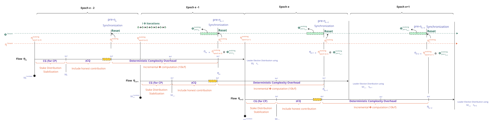
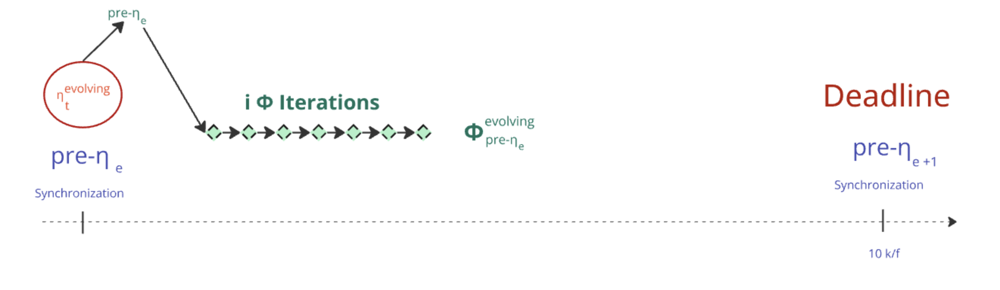
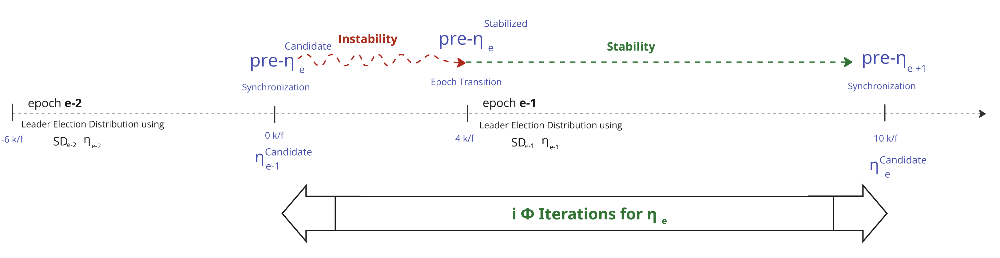
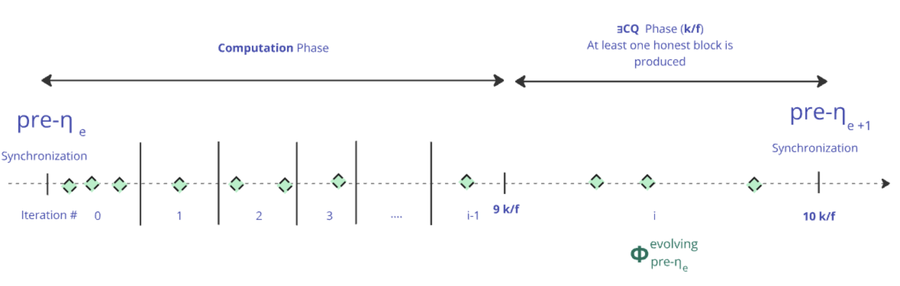
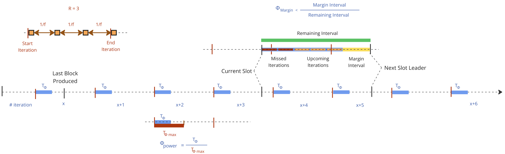
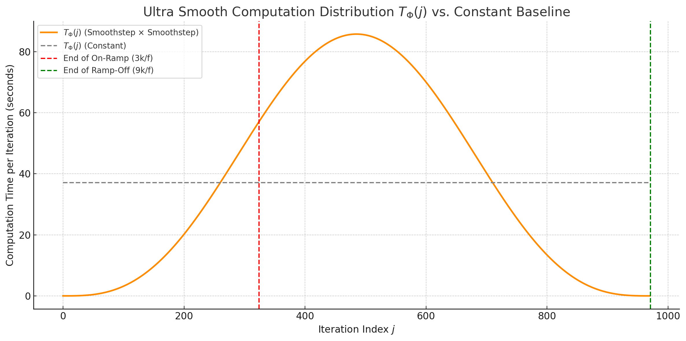
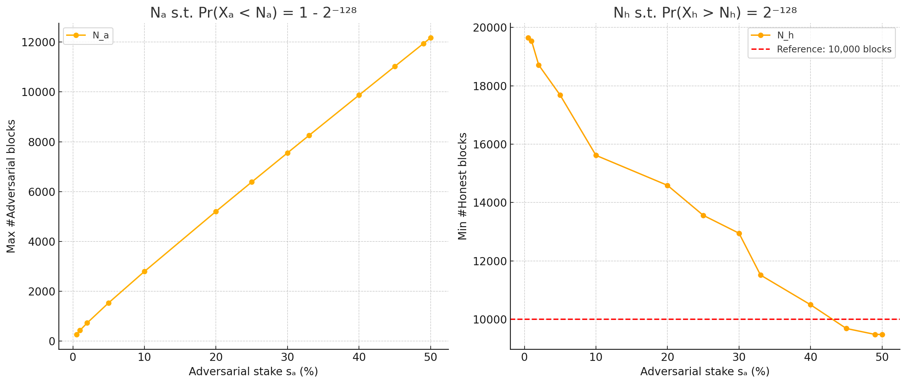

## Table of Contents

- [**Abstract**](#abstract)
- [**Motivation: Why is this CIP necessary?**](#motivation-why-is-this-cip-necessary)
- [**Specification / The Φalanx Sub-Protocol**](#specification--the-phalanx-sub-protocol)
  - [**1. High-Level Changes Relative to Praos**](#1-high-level-changes-relative-to-praos)
  - [**2. The Streams**](#2-the-streams)
    - [**2.1 The η stream**](#21-the-eta-stream)
    - [**2.2 The pre-η Synchronizations**](#22-the-pre-eta-synchronizations)
    - [**2.3 The φ stream**](#23-the-phi-stream)
    - [**2.4 The η Generations**](#24-the-eta-generations)
  - [**3.Distribution of Φ Iterations**](#3-distribution-of-phi-iterations)
    - [**3.1 Challenge to solve**](#31-challenge-to-solve)
    - [**3.2 Solution Properties S.C.A.L.E**](#32-solution-properties-scale)
    - [**3.3 Computation Participation**](#33-computation-participation)
    - [**3.4 Slot Leader Schedule Visibility & pre-ηₑ instability**](#34-slot-leader-schedule-visibility--pre-eta-e-instability)
    - [**3.5 Game-Theoretic Enforcement: No Timely Iteration, No Block Reward**](#35-game-theoretic-enforcement-no-timely-iteration-no-block-reward)
    - [**3.6 Availability Maximization**](#36-availability-maximization)
    - [**3.7 Shape Function**](#37-shape-function)
    - [**3.8 Agda Mechanization**](#38-agda-mechanization)
  - [**4. The Φ Cryptographic Primitive**](#4-the-phi-cryptographic-primitive)
  - [**5. Recommended Parameterization**](#5-recommended-parameterization)
- [**Rationale: How This CIP Achieves Its Goals**](#rationale-how-this-cip-achieves-its-goals)
  - [**1. $Φ_\text{power}$ & Adversarial Cost Overhead**](#1-φ_textpower--adversarial-cost-overhead)
  - [**2. Distribution of Φ Iterations Alternatives**](#2-φ-iterations--distribution-alternatives)
  - [**3. Choice of The Cryptographic Primitive**](#3-choice-of-the-cryptographic-primitive)
- [**Path to Active**](#path-to-active)
  - [**Acceptance Criteria**](#acceptance-criteria)
  - [**Implementation Plan**](#implementation-plan)
- [**Copyright**](#copyright)

## Abstract

<!-- A short (\\\~200 word) description of the proposed solution and the technical issue being addressed. \-->

Addressing the "[Ouroboros Randomness Manipulation](../CPS/README.md)" **Problem**,  **Ouroboros Φalanx (Pronounced Phalanx)** enhances **Ouroboros Praos** to mitigate grinding attacks by **increasing the cost of leader election manipulation**. It extends **nonce generation from 1 epoch to 2**, introducing a **computationally intensive function** that remains efficient for honest participants but makes it **significantly more costly for adversaries to bias the process**.

A [**Phalanx**](https://en.wikipedia.org/wiki/Phalanx) is an **Ancient Greek military formation** where soldiers **stand in a tightly packed unit**, shielding and reinforcing one another to create a nearly impenetrable defense. This strategy made it far more difficult for enemies to break through compared to fighting individual soldiers.


In **Φalanx Protocol**, we apply this idea cryptographically by **enhancing the VRF-based randomness generation sub-protocol** with a cryptographic primitive that is **efficient for honest participants** but **computationally expensive for adversaries** attempting to bias leader election. While it won’t eliminate grinding attacks entirely, it **significantly increases their cost**, and our work focuses on **precisely quantifying this added expense**.

Please refer to the CPD "[Ouroboros Randomness Generation Sub-Protocol – The Coin-Flipping Problem](../CPS/CPD/README.md)" for a detailed understanding of **randomness generation, leader election in Praos, and the coin-flipping dilemma in consensus protocols**. Moving forward, we will **dive into the core details**, assuming you have the **relevant background** to understand the proposal.

## Motivation: why is this CIP necessary?

<!-- A clear explanation that introduces the reason for a proposal, its use cases and stakeholders. If the CIP changes an established design then it must outline design issues that motivate a rework. For complex proposals, authors must write a Cardano Problem Statement (CPS) as defined in CIP-9999 and link to it as the \`Motivation\`. -->

The "[Ouroboros Randomness Generation Sub-Protocol – The Coin-Flipping Problem](../CPS/CPD/README.md)" CPD reveals a significant vulnerability in **Ouroboros Praos**: adversaries controlling a substantial portion of stake can execute **grinding attacks** to manipulate leader election, compromising the protocol’s fairness and security. As detailed in [CPD Section 3.2 - Entry Ticket: Acquiring Stake to Play the Lottery](../CPS/CPD/README.md#32-entry-ticket-acquiring-stake-to-play-the-lottery), an adversary with **20% or more of the total stake** gains an exponential advantage in influencing randomness, with attack feasibility increasing rapidly as stake grows. This critical threshold is further explored in [CPD Section 3.6 - Grinding Power Computational Feasibility](../CPS/CPD/README.md#36-grinding-power-computational-feasibility), which shows that grinding attacks become computationally viable for well-resourced adversaries, particularly in the "Owl Survey" scenario, where costs remain within the "Possible" range (up to $\$1$ billion USD) for grinding depths ($\rho$) between 34 and 48.

The CPD analysis in [Section 3.5 - Scenarios](../CPS/CPD/README.md#35-scenarios) quantifies this vulnerability across four scenarios—Ant Glance, Ant Patrol, Owl Stare, and Owl Survey—highlighting the ranges of $\rho$ where attacks are feasible. The table below summarizes these ranges, showing the intervals where grinding attacks transition from trivial to infeasible:

| **Feasibility Category**                  | **🔵 Ant Glance** | **🟠 Ant Patrol** | **🟢 Owl Stare** | **🔴 Owl Survey** |
|--------------------------------------------|-------------------|-------------------|------------------|-------------------|
| **🟢 🌱 Trivial for Any Adversary**        | $[0, 49)$         | $[0, 47)$         | $[0, 27)$        | $[0, 27)$         |
| **🟡 💰 Feasible with Standard Resources** | $[49, 59)$        | $[47, 57)$        | $[27, 34)$       | $[27, 34)$        |
| **🟠 🏭 Possible with Large-Scale Infrastructure** | $[59, 73)$ | $[57, 71)$        | $[34, 48)$       | $[34, 48)$        |
| **🔴 🚫 Borderline Infeasible**            | $[73, 87)$        | $[71, 85)$       | $[48, 62)$       | $[48, 62)$        |
| **🔴 🚫 Infeasible**                      | $[87, 256)$       | $[85, 256)$       | $[62, 256)$      | $[62, 256)$       |

This vulnerability is visually depicted in the graph below, which plots the logarithmic cost (in USD) of grinding attacks against grinding depth ($\rho$) for each scenario. The shaded feasibility layers indicate the economic thresholds where attacks become trivial, feasible, possible, borderline infeasible, or infeasible. The consistent gap of $\Delta \log_{10}(\text{Cost (USD)}) \approx 6.3$ between the least (Ant Glance) and most (Owl Survey) resource-intensive scenarios highlights how evaluation complexity ($T_{\text{eval}}$) and observation scope ($w_T$) significantly amplify attack costs :

<div align="center">

</div>

These findings indicate that, under current protocol parameters, grinding attacks are computationally viable at lower $\rho$ values for adversaries with significant resources. However, as highlighted in [CPD Section 3.2](../CPS/CPD/README.md#32-entry-ticket-acquiring-stake-to-play-the-lottery), executing such attacks requires a substantial upfront investment—acquiring 20% of the total stake, equivalent to over 4.36 billion ADA as of March 1, 2025—and the ability to operate covertly to avoid detection. Publicly observable grinding attempts expose adversarial stake pool operators (SPOs) to severe economic and social consequences, such as loss of trust, delegator withdrawals, or protocol-level countermeasures, which could devalue their stake and undermine their efforts. Despite these barriers, the potential for well-funded adversaries to bias randomness remains a threat to Cardano’s decentralized ethos, as it could skew block production and transaction settlement in their favor.

This CIP addresses the critical question: **Can we increase the computational cost of grinding attempts to shrink these vulnerable intervals, thereby deterring adversaries effectively?** Φalanx proposes a solution by introducing a computationally intensive mechanism that disproportionately burdens attackers while remaining manageable for honest participants. By elevating the resource threshold required for successful attacks, as analyzed in [CPD Section 3.4 - Cost of a Grinding Attack](../CPS/CPD/README.md#34-cost-of-a-grinding-attack), this CIP aims to shift the feasibility curve, making randomness manipulation prohibitively expensive and strengthening the protocol’s resilience against such threats.

## Specification / The Φalanx Sub-Protocol

<!-- The technical specification should describe the proposed improvement in sufficient technical detail. In particular, it should provide enough information that an implementation can be performed solely on the basis of the design in the CIP. This is necessary to facilitate multiple, interoperable implementations. This must include how the CIP should be versioned, if not covered under an optional Versioning main heading. If a proposal defines structure of on-chain data it must include a CDDL schema in its specification.-->

The core principle of the proposed protocol change is to **substantially escalate the computational cost of each grinding attempt for an adversary**. 

To achieve this, every honest participant is required to perform a designated computation for each block they produce over an epoch (**21,600 blocks**). Consequently, an adversary attempting a grinding attack must **recompute these operations for every single attempt**, while being **constrained by the grinding window**, which dramatically increases the resource expenditure. 

By enforcing this computational burden, we **drastically reduce the feasible number of grinding attempts** an adversary with a fixed resource budget can execute, making randomness manipulation **more expensive and significantly less practical**.
 

### 1. High-Level Changes Relative to Praos

In **Φalanx** , the randomness generation and leader election flows are modified as follows:


1. The **stake distribution stabilization phase** is shifted **back by one epoch :** The **active** **stake distribution** *SDe* used for leader election is now derived from the **end of $epoch_\text{e-3}$** instead of **$epoch_\text{e-2}$**  as in the original Praos protocol.  
2. The **honest contribution inclusion phase**, which originally resulted in a **ηₑ candidate**, is also **shifted back by one epoch**, aligning with the adjusted **stake distribution stabilization**. This value is now referred to as the **pre-ηₑ candidate**, signifying its role as an **intermediate randomness nonce** in the sub-protocol.  
3. The **ηₑ (randomness eta nonce)** undergoes an **additional sequence of incremental hashing** using a **new deterministic** **cryptographic primitive Φ (Phi)**, applied over a duration equivalent to a full epoch.


### 2. The Streams 

The Randomness Generation sub-protocol operates with two parallel streams: $`\eta^\text{stream}`$ and $`\phi^\text{stream}`$, which synchronize at the conclusion of the **Include Honest Contribution** Phase (akka Phase 2) :  



#### 2.1 **The $`\eta^\text{stream}`$** 
   - Already present in Praos and retained in Phalanx 
   - Updated with every block produced in the blockchain tree, a $`\eta^\text{stream}`$ captures intermediate values $`\eta^\text{evolving}_t`$ in the block headers, defined as follows:

```math
   \eta^{\text{evolving}}_{t+1} =
   \begin{cases}
   \text{ProtocolParameter}_\text{extraEntropy} & \text{when } t = 0, \\
   \eta^{\text{evolving}}_{t} ⭒ VRF^\text{Output}_\text{t+1} & \text{when BlockProduced}(t) \\
   \eta^{\text{evolving}}_{t}  & \text{otherwise.}
   \end{cases}
   
```
```math 
\text{BlockProduced}(t) = 
\begin{cases} 
true & \text{if a block is produced at time } t, \\
false & \text{otherwise.}
\end{cases}
```

| **where** ||
|---------------|-----------------|
| $`\text{ProtocolParameter}_\text{extraEntropy} `$ | The evolving nonce is initialized using the extraEntropy field defined in the protocol parameters.|
| $` VRF^\text{Output}_\text{i} `$ | The **VRF output** generated by the $` \text{slot}_\text{i} `$ Leader and included in the block header |
| $a⭒b$    | The concatenation of $a$ and $b$ , followed by a BLAKE2b-256 hash computation.


#### 2.2 The $`\text{pre-}\eta`$ Synchronizations  

- To generate $`\eta_\text{e}`$ for epoch $`e`$, the stream $`\phi^\text{stream}`$ is reset with the value of $`\eta^\text{stream}`$ at the end of Phase 2 in $`\text{epoch}_{e-2}`$. 
- This specific value of $`\eta^\text{stream}`$ is referred to as **$`\text{pre-}\eta_e`$**.


#### 2.3 The $`\phi^\text{stream}`$

- The stream depends on the selected cryptographic primitive and it is parametrizable with $i$, the total number of $`\Phi`$ iterations,
- The stream $`\phi^\text{stream}`$ is reset during each $`\text{pre-}\eta`$ synchronization.  
- At the synchronization point $`\text{pre-}\eta_{e+1}`$, the stream must guarantee delivery of $`\phi^\text{evolving}_e`$, defined as:
  
```math
  \phi^\text{evolving}_e = \Phi^i(\text{pre-}\eta_e)
```
- Between 2 consecutive resets, a subset of the blocks produced must append to their block header a unique intermediate value $\phi^\text{evolving}_x$, where $x \in {0, 1, \dotsc, i-1}$ denotes the progression index of the $\Phi$ computation(See the [**Distribution of Φ Iterations Approach**](#3-distribution-of-phi-iterations) below).


#### 2.4 The $`\eta`$** Generations
   - This is the final nonce $`\eta_\text{e}`$ used to determine participant eligibility during epoch $`e`$.  
   - It originates from the operation ⭒ with  $`\phi^{\text{stream}}_{t}`$ at $`\text{pre-}\eta_\text{e+1}`$ Synchronization and $`\eta^\text{stream}_t`$ $`\text{when } t = \text{end of epoch}_\text{e-3}`$   

```math
\eta_\text{e} = \eta^\text{stream}_{epoch_\text{e-3}} ⭒ \phi^\text{evolving}_e , \quad \text{when } t = \text{pre-}\eta_\text{e+1}\text{ synchronization } 
```
**Note** : $`\text{pre-}\eta_\text{e+1}`$ synchronization occurs $`\text{when } t = \text{end of phase 2 at epoch}_\text{e-1}`$


### 3. Distribution of $\Phi$ Iterations

#### 3.1 Challenge to solve 

**How can we ensure that, for a given epoch $e$, Stake Pool Operators (SPOs) can efficiently perform the $i$ iterations of $`\Phi`$ required to deterministically produce $`\phi^\text{evolving}_e`$, thereby enabling a more secure computation of $`\eta_e`$ than in the current Praos protocol?**

<div align="center">

</div>

#### 3.2  Solution Properties S.C.A.L.E

To ensure robust and efficient production of $`\phi^\text{evolving}_e`$,  $k(\text{pre-η},t)$ should aim to satisfy the following **SCALE** properties — prioritized in the order shown:

- **S**uccess Probability — Maximize the likelihood of deterministically producing $`\phi^\text{evolving}_e`$ without falling back to the Praos protocol.  
- **C**ompactness — Minimize block header size increase.  
- **A**vailability — Minimize additional latency in block diffusion.  
- **L**ightweight Execution — minimize redundant or wasteful iterations of $`\Phi`$ among the SPOs.  
- **E**quity in Effort — ensure computational fairness: stake holders compute proportionally to their stake.

These properties define the design space for secure, performant, and fair execution of $`\Phi`$ in each epoch.

#### 3.3 Computation Participation

Regarding SPO participation in the protocol, we identify three possible models:

- **Centralized**: A single entity is responsible for the entire process. This model is strongly discouraged, as it introduces a textbook case of a single point of failure, undermining both resilience and decentralization.
- **Federated**: A selected subset of SPOs participates in the process. While this model improves over the centralized approach, it raises concerns of collusion, particularly the possibility of intentionally omitting the final iteration and reverting to the default Praos protocol. Additionally, participants could become targeted by adversaries, and governance mechanisms must be introduced to manage entry and exit from this privileged role.
- **Decentralized**: All SPOs participate in the additional computation phase. Unsurprisingly in our context, this is the most robust model, leveraging the existing infrastructure of SPOs who are already running the network and receiving rewards. 

Taking the decentralized approach, SPOs are expected to collectively compute the $i^{\text{th}}$ iteration of $\Phi$. 
The key question, then, is **how can we design effective incentives to ensure that this task is performed reliably and in a timely manner?**

#### 3.4 Slot Leader Schedule Visibility & $\text{pre-}\eta_e$ instability

**Regardless of the chosen approach**, each SPO knows their complete private schedule for $`\Phi`$ computation as soon as the slot leader distribution is revealed. Within this epoch-sized period:
- **During the interval $[0, \frac{4k}{f})$:**
  - SPOs are still operating in $`epoch_{\text{e-2}}`$, which means they know their schedule **$\frac{6k}{f}$ slots in advance**.
  - However, at this point, $\text{pre-}\eta_e$ remains a *candidate value* — not yet finalized. Multiple forks may still exist, each potentially initiating a distinct instance of $\Phi$.
  - As such, early iterations of $\Phi$ are **speculative**. If the canonical chain later stabilizes on a different fork than the one used during early computations, the associated $\text{pre-}\eta_e$ will change, and the corresponding $\Phi$ computation must be **discarded and restarted**.
  - **In short**, the closer we approach the fork stabilization point, the **higher the probability** that the selected $\text{pre-}\eta_e$ will remain, but rollback is still possible within this window.

- **During the interval $[\frac{4k}{f}, \frac{10k}{f})$:**
  - SPOs are now in $`epoch_{\text{e-1}}`$.
  - Although the slot leader distribution is guaranteed to be finalized at the $\frac{4k}{f}$-th slot, SPOs gain increasing probabilistic confidence as they approach this point that no further changes will occur. As a result, they can begin to take **relatively safe preemptive actions** based on the expected future slot leader distribution, especially when close to the stabilization boundary.
  - From this slot onward, $\text{pre-}\eta_e$ is fully stable, and all SPOs will execute $\Phi$ using the same seed, ensuring deterministic and aligned computations.


The following visual highlights this situation:

<div align="center"></div>


#### 3.5 Game-Theoretic Enforcement: No Timely Iteration, No Block Reward

We will reuse the existing game-theoretic framework for block production in Praos and require each stake pool operator (SPO), upon producing a block, to provide a proof of work performed—specifically, a proof that they have computed the *x*‑th iteration of $\Phi$. 

In this approach, the epoch-size equivalent period is divided into $i$ intervals. Within each interval, the first block produced must include a proof of work performed in order to be considered valid. Subsequent blocks produced within the same interval are exempt from this requirement. This Computation phase is followed by an ∃CQ (Existential Chain Quality) phase. This final phase ensures, within our theoretical model, that the computation of $\phi^\text{evolving}_e$ is guaranteed to complete. In practice, to ensure liveness in edge cases, the protocol reverts to standard Praos behavior, using $\text{pre-}\eta_e$ as $\eta_e$.  

On mainnet, the parameter $s$ (Minimum Honest Block Inclusion Interval) is defined as $\frac{k}{f}$ within a segment of $\frac{10.k}{f}$ slots. This leaves a remaining window of $\frac{9.k}{f}$ slots allocated to the Computation Phase:

<div align="center"></div>

#### 3.6 Availability Maximization 

**Given the framework defined above, how can we ensure that each SPO neither compromises the Availability property nor fails to produce their block on time?**

To ensure timely block production, we prioritize **Availability** over **Lightweight Execution**. Specifically, stake pool operators (SPOs) must pre-compute a sufficient portion of their computation pipeline in advance.
We can formalize this with an algorithm where : 
1. We define a parameter $\Phi_{\text{power}} \in [0, 1]$, representing the fraction of $\Phi$'s maximal computational cost that is actually applied to the network. A value of $\Phi_{\text{power}} = 0$ corresponds to no overhead, while $\Phi_{\text{power}} = 1$ corresponds to **half of the maximum theoretical cost** we could impose on the adversary, ensuring that honest SPOs are granted **at least twice the time required** to perform each iteration under worst-case assumptions.
2. We predefined a thresold $\Phi_{\text{margin}} \in [0.1]$ such as $\Phi_{\text{margin}} < \frac{\text{Margin Interval}}{\text{Remaining Interval}}$. If we don't have enough margin time, we should start computing the remaining iteration of $\Phi$ **locally**.
3. Finally, let's define a parameter $R$ (Redundancy), the expected number of blocks per $\Phi$ interval. 



```math
\text{Accumulated Computation Time} = \Phi_{\text{power}} \cdot \frac{9k}{2f}, \quad \text{Interval size} = \frac{R}{f}, \quad \text{Total Φ Iterations = i} = \frac{9k/f}{R/f} = \frac{9k}{R} , \quad T_\Phi = \frac{\text{Accumulated Computation Time}}{i}
```
```math
\text{startInterval}(slot) = \left\lfloor \frac{\text{slot}}{i} \right\rfloor \cdot i , \quad \text{endInterval}(slot) = \left( \left\lfloor \frac{\text{slot}}{i} \right\rfloor + 1 \right) \cdot i - 1
```
```math

\text{\#MissedIterations} = \text{endInterval(lastBlockProducedSlot)} - \text{endInterval(currentSlot)} 
```
```math

\text{\#UpcomingIterations} = \text{endInterval(currentSlot)} - \text{endInterval(nextSlotLeader)} 
```
```math

\text{Remaining Interval} = \text{currentSlot} - \text{nextSlotLeader} 
```
```math

\text{Margin Interval} =  \text{Remaining Interval} -  (\text{\#MissedIterations}  +  \text{\#UpcomingIterations}) \cdot T_\Phi
```
```math
\Phi_{\text{Margin}} < \frac{\text{Margin Interval}}{\text{Remaining Interval}}
```

<br/><br/>

**How does the current algorithm behave during the $\text{pre-}\eta_e$ instability period ?** <br/>
**Does it continue to uphold the **SCALE** properties under these conditions?**

The answer is **yes**, provided that the **$T_\Phi$** remains relatively low. However, as this cost increases, sudden rollbacks affecting the $\text{pre-}\eta_e$ seed may, under certain conditions, disrupt the immediate slot leaders' ability to produce timely blocks.

The **worst-case scenario** occurs when a rollback happens **at the very end of a computation interval**, and the **next scheduled slot leader** is positioned just after the **beginning of the following interval**. In such a case, when $T_\Phi$ is large enough, the **Availability** property may be compromised: block production could be **delayed**, leading to **increased latency in block diffusion**, or worse, the block may arrive **too late** and be **rejected** by the network.

To better understand this risk under concrete conditions, the table below illustrates how the **Accumulated Computation Time is distributed across intervals** (i.e., the ratio $T_\Phi / \text{Interval size}$, expressed in seconds) on **Mainnet** under this approach:

| $\Phi_{\text{power}}$ | Accumulated Computation Time | R = 5 (i = 3888)     | R = 10 (i = 1944)    | R = 20 (i = 972)     | R = 30 (i = 648)     | R = 50 (i = 388)      |
|------------------------|-------------------------------|------------------------|------------------------|------------------------|------------------------|-------------------------|
| 0.0                    | 0 minutes                    | 0.0s / 100s           | 0.0s / 200s           | 0.0s / 400s           | 0.0s / 600s           | 0.0s / 1000s           |
| 0.1                    | 5 hours 24 minutes           | 5.0s / 100s           | 10.0s / 200s          | 20.0s / 400s          | 30.0s / 600s          | 50.1s / 1000s          |
| 0.2                    | 10 hours 48 minutes          | 10.0s / 100s          | 20.0s / 200s          | 40.0s / 400s          | 60.0s / 600s          | 100.2s / 1000s         |
| 0.3                    | 16 hours 12 minutes          | 15.0s / 100s          | 30.0s / 200s          | 60.0s / 400s          | 90.0s / 600s          | 150.3s / 1000s         |
| 0.4                    | 21 hours 36 minutes          | 20.0s / 100s          | 40.0s / 200s          | 80.0s / 400s          | 120.0s / 600s         | 200.4s / 1000s         |
| 0.5                    | 1 day 3 hours                | 25.0s / 100s          | 50.0s / 200s          | 100.0s / 400s         | 150.0s / 600s         | 250.5s / 1000s         |
| 0.6                    | 1 day 8 hours 24 minutes     | 30.0s / 100s          | 60.0s / 200s          | 120.0s / 400s         | 180.0s / 600s         | 300.6s / 1000s         |
| 0.7                    | 1 day 13 hours 48 minutes    | 35.0s / 100s          | 70.0s / 200s          | 140.0s / 400s         | 210.0s / 600s         | 350.7s / 1000s         |
| 0.8                    | 1 day 19 hours 12 minutes    | 40.0s / 100s          | 80.0s / 200s          | 160.0s / 400s         | 240.0s / 600s         | 400.8s / 1000s         |
| 0.9                    | 2 days 35 minutes            | 45.0s / 100s          | 90.0s / 200s          | 180.0s / 400s         | 270.0s / 600s         | 450.9s / 1000s         |
| 1.0                    | 2 days 6 hours               | 50.0s / 100s          | 100.0s / 200s         | 200.0s / 400s         | 300.0s / 600s         | 501.0s / 1000s         |

The higher the value of $R$, the less likely this worst-case scenario will occur, as the computation load is spread over more intervals. However, when such a situation does happen, the **amount of work required to catch up increases**, potentially impacting **multiple consecutive blocks**.  

For example, at full $\Phi_{\text{power}}$ capacity, the delay can range from **50 to 500 seconds**, which corresponds to **2.5 to 25 blocks** on mainnet.

A solution is to apply an **exponential function** to modulate the amount of $T_\Phi$ executed in each interval (an **On-Ramp** function ) , progressively increasing it over the period $[0, \frac{4k}{f})$, and reaching a **stable, consistent pace** during the final segment $[\frac{4k}{f}, \frac{10k}{f})$. This function should closely approximate the **probability curve of $\text{pre-}\eta_e$ stabilization**, allowing computation efforts to align with the growing certainty that the seed will remain unchanged.

if a rollback happens in that case, **$T_\Phi$** remains relatively low and the **SCALE** properties are preserved.


**How does the current algorithm behave throughout the epoch transition described above?**  <br/>
**Does it continue to uphold the _SCALE_ properties under these conditions?**

The answer is **yes**, because the protocol only requires a window of $3k/f$ slots to guarantee **Chain Growth from Common Prefix** ("CG from CP"), while in our case, we have a visibility window of $4k/f$ slots.  This provides an additional $k/f$ slots of buffer — a significant margin in the context of the algorithm described above — which can be leveraged to **adapt preemptive computations** accordingly. 

As a result, even during the epoch transition, the algorithm preserves the essential properties of **Success Probability** and **Availability**, maintaining compliance with the **SCALE** design goals.

<details>
  <summary> 📌📌 <i> Rationale about "CG from CP" Property </i> – <b>  Expand to view the content.</b>
 </summary>

**This argument, known as "CG from CP," proceeds as follows:**

Within these $3k/f$ slots, there are expected to be approximately $3k/2$ adversarial slots, assuming an adversary of strength close to $1/2$. Consequently, with overwhelming probability, there will be at least $k$ adversarial slots in this period.

Now, if the honest chain were to grow by fewer than $k$ blocks during this interval, it would signal an imminent $k$-common-prefix (k-CP) violation. The adversary could, at that point, maintain a private chain of length $k$ starting from the beginning of this interval. By simply waiting for the honest chain to reach a length of $k$ blocks, the adversary could present two disjoint chains of $k$ blocks each within the same epoch, thereby violating the k-CP property.

This reasoning assumes an adversary strength near $1/2$, but it is worth noting that the weaker the adversary, the better the chain growth (CG) properties.

</details>
<br/>

**How does the current algorithm behave throughout the Computation/∃CQ Transition?**  
**Does it continue to uphold the _SCALE_ properties under these conditions?**

Although the **probability** that an **adversary** is the **slot leader** in enough **consecutive blocks** just before the **transition** is low, it could still result in an **honest participant** in the **∃CQ transition** having to compute a **substantial number of iterations** between the **last block produced** and the **final iteration** of $\Phi$. If, for any reason, the **honest participant** does not have enough time to complete this **critical final iteration** during the **∃CQ phase**, it would **undermine the primary goal** of this **Ouroboros enhancement** — and we would be forced to **fall back to the original Praos protocol**.

As in the **$\text{pre-}\eta_e$ instability period**, we propose to apply a **modulation function** (an **Ramp-Off** function ) to control the number of $T_\Phi$ iterations executed within each interval. Specifically, we aim to **progressively reduce** the **computational load** over the period $[\frac{4k}{f},\frac{9k}{f})$, ensuring that the **number of iterations remains negligible** for an **honest participant** during the **∃CQ phase**. In doing so, we **preserve the _SCALE_ properties** under these **transitional conditions**.


### 3.7. Shape Function


To uphold the **_SCALE_** properties under all operational conditions described above, the flat baseline:

```math
T_\Phi = \frac{\text{Accumulated Computation Time}}{i}
```

is replaced by a modulated function $T_\Phi(j)$ that varies with the **iteration index** $j \in \{0, 1, \dotsc, i - 1\}$, where $j = 0$ corresponds to the initial pre-$\eta$ value and $j = i - 1$ to the iteration before the final one delivering $`\phi^\text{evolving}_e`$.

This modulation allows the protocol to adapt the computational effort per Φ iteration according to the structural phases of the period — ramping up during early uncertainty, concentrating effort where the protocol is stable, and easing off near the transition into the ∃CQ phase. 

This modulation shapes the amount of computation assigned to each $\Phi$ iteration, ensuring alignment with the **temporal characteristics** of the segment:

- During the **initial phase** ($[0, \frac{3k}{f}]$ slots), where the value $\text{pre-}\eta_e$ may still be unstable, the function should **ramp up gradually**, minimizing disruption to early slot leaders.
- In the **central computation window**, the protocol is stable with reliable leader schedules. The function should assign **strong and consistent effort** to maximize the computation of $\Phi$.
- In the **final portion** ($[\frac{3k}{f}, \frac{9k}{f}]$), computational effort should **taper off smoothly**, ensuring availability near the ∃CQ security threshold and avoiding performance degradation as the computation concludes.

#### Smoothstep Construction

To avoid any discontinuities or derivative discontinuities between phases, the computation profile is defined as a smooth, symmetric bell curve using the **product of two quintic smoothstep functions**:

```math
x_j = \frac{j}{i - 1}
```

```math
T_\Phi(j) = \frac{\text{Accumulated Computation Time}}{S} \cdot \text{smoothstep}(x_j) \cdot \text{smoothstep}(1 - x_j)
```

with:

```math
\text{smoothstep}(x) = 6x^5 - 15x^4 + 10x^3
```

This function satisfies the following:
- $T_\Phi(0) = T_\Phi(i-2) = 0$
- $\frac{dT_\Phi}{dj} = 0$ at both boundaries
- The peak is centered, smooth, and strictly inside the interval.

#### Normalization

The total accumulated time is preserved via a scaling constant:

```math
S = \sum_{j=0}^{i-1} \text{smoothstep}(x_j) \cdot \text{smoothstep}(1 - x_j)
```

```math
\sum_{j=0}^{i-1} T_\Phi(j) = \text{Accumulated Computation Time}
```
The resulting function can be visualized as a **continuous bell curve** concentrated at the center of the epoch’s computation window : 



#### 3.8. Agda Mechanization

### 4. The Φ Cryptographic Primitive

 (incomplete section -- add the specific primitive selected and all its characteristics )

The Φ cryptographic primitive is a critical component of the Φalanx protocol, designed to increase the computational cost of grinding attacks while remaining efficient for honest participants. To achieve this, Φ must adhere to a set of well-defined properties that ensure its security, efficiency, and practical usability within the Cardano ecosystem. These properties are outlined in the table below :

| **Property**              | **Description**                                                                                                   |
|---------------------------|-------------------------------------------------------------------------------------------------------------------|
| **Functionality**         | Must be a well-defined mathematical function, ensuring a unique output for each given input (unlike proof-of-work, which allows multiple valid outputs). |
| **Determinism**           | Must be fully deterministic, with the output entirely determined by the input, eliminating non-deterministic variations. |
| **Efficient Verification**| Must allow for fast and lightweight verification, enabling rapid validation of outputs with minimal computational overhead. |
| **Compact Representation**| Input and output sizes should be small enough to fit within a block, optimizing on-chain storage efficiency. Further reductions are desirable where feasible. |
| **Lower Bound on Computation** | Computational cost of evaluation should be well-characterized and predictable, with a lower bound that is difficult to surpass, ensuring adversaries cannot gain an unfair efficiency advantage. |
| **Ease of Implementation & Maintenance** | Should be simple to implement and maintain, ensuring long-term usability and minimizing technical debt. |
| **Adaptive Security**     | Function and its parameters should be easily reconfigurable to accommodate evolving threats, such as advances in computational power or new cryptographic attacks. |


### 5. Recommended Parameterization


## Rationale: how does this CIP achieve its goals?
<!-- The rationale fleshes out the specification by describing what motivated the design and what led to particular design decisions. It should describe alternate designs considered and related work. The rationale should provide evidence of consensus within the community and discuss significant objections or concerns raised during the discussion.

It must also explain how the proposal affects the backward compatibility of existing solutions when applicable. If the proposal responds to a CPS, the 'Rationale' section should explain how it addresses the CPS, and answer any questions that the CPS poses for potential solutions.
-->

### 1. $Φ_\text{power}$ & Adversarial Cost Overhead
### 2. $\Phi$ Iterations & Distribution alternatives 
### 3. Choice of The Cryptographic Primitive 


# Dump Not organized yet
---- 

By incorporating additional **computation** after aggregating all **VRF contributions**, we require each **honest participant** to perform a portion of the **calculation** within a reasonable timeframe, while imposing an **exponential computational overhead** on **adversaries** within a constrained window. Our objective is to select the **duration** of this computation such that, in the **best-case scenarios**, it completely **prevents attacks**, and in the **worst-case scenarios**, it **deters adversaries** from initiating an attack. To achieve this, we have identified four key goals when parameterizing **Φalanx**:

- Ensure a **reasonable cost** for honest participants.  
- Maintain a **prohibitive cost** for adversaries.  
- Prevent **small-scale attacks**.  
- Deter, where feasible, **medium- to large-scale attacks**.

In **Φalanx**, we introduce an additional **computational cost**, $T_\Phi$, for each **grinding attempt**, which arises from the new $\Phi$ **cryptographic primitive** applied across all blocks in an epoch. This cost is defined as:

```math
T_\Phi = \frac{10k \cdot T_\phi}{f}
```

Where:  
- $10k/f = 432,000$ slots (number of **slots in an epoch**, with $k = 2,160$, $f = 0.05$),  
- $T_\phi$: **Time to compute** an iteration $\phi$ of the $\Phi$ function per block.

This additional cost directly impacts the total estimated **time per grinding attempt**, as originally defined in [CPS Section 3.3.4 - Total Estimated Time per Grinding Attempt](https://github.com/input-output-hk/ouroboros-anti-grinding-design/blob/main/CPS/Readme.md#334-total-estimated-time-per-grinding-attempt). The baseline grinding time in **Praos** is:

```math
T_{\text{grinding}}^{\text{Praos}} = \frac{\rho}{2} T_{\text{BLAKE2b}} + w_T \cdot ( T_{\mathsf{VRF}} + T_{\text{eligibility}} ) + T_{\text{eval}}
```

With **Φalanx**, the total grinding time per attempt is updated to include $T_\Phi$:

```math
T_{\text{grinding}}^{\text{Phalanx}} = \frac{\rho}{2} T_{\text{BLAKE2b}} + w_T \cdot ( T_{\mathsf{VRF}} + T_{\text{eligibility}} ) + T_{\text{eval}} + T_\Phi
```

Substituting $T_\Phi$ with the expression above, the final grinding time per attempt under **Φalanx** becomes:

```math
T_{\text{grinding}}^{\text{Phalanx}} = \frac{\rho}{2} T_{\text{BLAKE2b}} + w_T \cdot ( T_{\mathsf{VRF}} + T_{\text{eligibility}} ) + T_{\text{eval}} + \frac{10k \cdot T_\phi}{f}
```

With **Cardano mainnet parameters** ($k = 2,160$, $f = 0.05$), this simplifies to:

```math
T_{\text{grinding}}^{\text{Phalanx}} = \frac{\rho}{2} T_{\text{BLAKE2b}} + w_T \cdot ( T_{\mathsf{VRF}} + T_{\text{eligibility}} ) + T_{\text{eval}} + 432,000 \cdot T_\phi
```

Where:  
- $T_{\mathsf{VRF}}$ is the **VRF evaluation time**,  
- $T_{\text{eligibility}}$ is the **eligibility check time**,  
- $T_{\text{BLAKE2b}}$ is the time for the **hashing operation**,  
- $w_T$ is the **target window size** (seconds),  
- $\rho$ is the **grinding power**,  
- $T_{\text{eval}}$ is the **nonce selection and evaluation time** (**attack-specific**).

The introduction of $T_\Phi$ substantially increases the **computational burden** for adversaries, as they must **recompute** the $\Phi$ function across the entire epoch for each of the $2^\rho$ possible **nonces** evaluated during a grinding attack. In contrast, for **honest participants**, this computation is **distributed** across the epoch, ensuring it remains **manageable and efficient**. Consequently, the selection of $T_\phi$ is **pivotal** in achieving the four goals outlined above, effectively **balancing** the computational load to **deter adversaries** while preserving **efficiency** for honest participants. To determine an optimal range for $T_\phi$, **simulations** will be conducted with varying $T_\Phi$ values to evaluate the range within which the **properties of the consensus layer** remain preserved.


### 5. Adversarial Cost Overhead

Building on the updated **grinding time formula** introduced in [Section 4 - **Balancing Honest and Adversarial Computation**](#4-balancing-honest-and-adversarial-computation), which incorporates the additional **computational cost** $T_\Phi$, we now analyze how this cost impacts the overall **feasibility of grinding attacks** across a range of theoretical $T_\phi$ values. As established, the total **grinding time per attempt** under **Φalanx** is:

```math
T_{\text{grinding}}^{\text{Phalanx}} = \frac{\rho}{2} T_{\text{BLAKE2b}} + w_T \cdot ( T_{\mathsf{VRF}} + T_{\text{eligibility}} ) + T_{\text{eval}} + 432,000 \cdot T_\phi
```

This increased **grinding time** directly affects the number of **CPUs** ($N_{\text{CPU}}$) required for an **adversary** to execute a grinding attack within the **grinding opportunity window** $w_O$, as originally derived in [CPS Section 3.4.1 - Formula](https://github.com/input-output-hk/ouroboros-anti-grinding-design/blob/main/CPS/Readme.md#341-formula). By varying $T_\phi$, we can explore how the **computational overhead scales** and assess its effectiveness in **deterring adversaries**, aligning with the goals of **balancing honest and adversarial computation** outlined in Section 4.

For a grinding attack with **grinding depth** $\rho$, the adversary must evaluate $2^\rho$ possible **nonces**, each requiring the **recomputation** of the $\Phi$ function across the entire epoch. Thus, the total additional **cost for the attack** is $2^\rho \cdot T_\Phi$. Incorporating this into the formula, the updated **computational requirement** becomes:

```math
N_{\text{CPU}} > \left \lceil 2^\rho \cdot T_\Phi + 5 \times 10^{-10} \times 2^{\rho-1} + \frac{5 \times 10^{-14} \times 2^{\rho-1}}{\rho} \cdot w_T + \frac{5 \times 10^{-2} \times 2^{\rho-1}}{\rho} \cdot T_{\text{eval}} \right \rceil
```

To evaluate the **impact of Φalanx** on grinding attack **feasibility**, we revisit the four **scenarios** defined in [CPS Section 3.5 - Scenarios](https://github.com/input-output-hk/ouroboros-anti-grinding-design/blob/main/CPS/Readme.md#35-scenarios)—**Ant Glance**, **Ant Patrol**, **Owl Stare**, and **Owl Survey**—and extend them to include **Φalanx-enhanced versions**. These scenarios use an **animal-inspired metaphor** to reflect **evaluation complexity** ($T_{\text{eval}}$) and **observation scope** ($w_T$), providing a basis for comparing the **computational cost** under **Praos**. We incorporate the additional **computational cost** $T_\Phi$, with $T_\phi$ values of **$100 \, \text{ms}$** ($0.1 \, \text{s}$) for $\Phi_{\text{min}}$ (where $T_\Phi = 4.32 \times 10^4 \, \text{s}$) and **$1 \, \text{s}$** for $\Phi_{\text{max}}$ (where $T_\Phi = 4.32 \times 10^5 \, \text{s}$).


| **Scenario**            | **$T_{\text{eval}}$ (Complexity)** | **$w_T$ (Scope)**       | **Description**                                                                 |
|--------------------------|------------------------------------|-------------------------|---------------------------------------------------------------------------------|
| **Ant Glance Praos**     | $0 \text{s}$                           | $1  \text{h}$  | An **ant** quickly **glancing** at a small spot, representing **simple evaluation** (low $T_{\text{eval}}$) with **basic effort** and a **narrow observation scope** (small $w_T$). |
| **Ant Glance $\Phi_{\text{min}}$** | $0 \text{s}$                           | $1  \text{h}$  | An **ant glancing** with **Phalanx’s minimal** $\Phi$ cost, adding **moderate effort** due to $T_\Phi = 4.32 \times 10^4  \text{s}$. |
| **Ant Glance $\Phi_{\text{max}}$** | $0 \text{s}$                           | $1  \text{h}$  | An **ant glancing** with **Phalanx’s maximal** $\Phi$ cost, **significantly increasing effort** due to $T_\Phi = 4.32 \times 10^5  \text{s}$. |
| **Ant Patrol Praos**     | $0 \text{s}$                           | $5  \text{d}$  | An **ant patrolling** a **wide area** over time with **simple instincts**, representing **simple evaluation** (low $T_{\text{eval}}$) with **basic effort** and a **broad observation scope** (large $w_T$). |
| **Ant Patrol $\Phi_{\text{min}}$** | $0 \text{s}$                           | $5  \text{d}$  | An **ant patrolling** with **Phalanx’s minimal** $\Phi$ cost, adding **moderate effort** across the **wide scope**. |
| **Ant Patrol $\Phi_{\text{max}}$** | $0 \text{s}$                           | $5  \text{d}$  | An **ant patrolling** with **Phalanx’s maximal** $\Phi$ cost, **significantly increasing effort** across the **wide scope**. |
| **Owl Stare Praos**      | $1 \text{s}$                          | $1  \text{h}$  | An **owl staring intently** at a **small area** with **keen focus**, representing **complex evaluation** (high $T_{\text{eval}}$) with **advanced effort** and a **narrow observation scope** (small $w_T$). |
| **Owl Stare $\Phi_{\text{min}}$**  | $1 \text{s}$                          | $1 \text{h}$  | An **owl staring** with **Phalanx’s minimal** $\Phi$ cost, adding **moderate effort** to its **complex evaluation**. |
| **Owl Stare $\Phi_{\text{max}}$**  | $1 \text{s}$                          | $1 \text{h}$  | An **owl staring** with **Phalanx’s maximal** $\Phi$ cost, **significantly increasing effort** in its **complex evaluation**. |
| **Owl Survey Praos**     | $1 \text{s}$                          | $5  \text{d}$ | An **owl surveying** a **wide range** with **strategic awareness**, representing **complex evaluation** (high $T_{\text{eval}}$) with **advanced effort** and a **broad observation scope** (large $w_T$). |
| **Owl Survey $\Phi_{\text{min}}$** | $1 \text{s}$                          | $5 \text{d}$ | An **owl surveying** with **Phalanx’s minimal** $\Phi$ cost, adding **moderate effort** across the **broad scope**. |
| **Owl Survey $\Phi_{\text{max}}$** | $1 \text{s}$                          | $5 \text{d}$ | An **owl surveying** with **Phalanx’s maximal** $\Phi$ cost, **significantly increasing effort** across the **broad scope**. |


The **$N_{\text{CPU}}$ formulas** are derived by **substituting** the respective **$w_T$** and **$T_{\text{eval}}$ values** from each **scenario** into the **base expression** from **Section 4**:

```math
N_{\text{CPU}} > \left \lceil 5 \times 10^{-10} \times 2^{\rho-1} + \frac{5 \times 10^{-14} \times 2^{\rho-1}}{\rho} \cdot w_T + \frac{5 \times 10^{-2} \times 2^{\rho-1}}{\rho} \cdot T_{\text{eval}} + 4.32 \times 10^4 \times 2^\rho \right \rceil \quad \text{for } \Phi_{\text{min}}
```

```math
N_{\text{CPU}} > \left \lceil 5 \times 10^{-10} \times 2^{\rho-1} + \frac{5 \times 10^{-14} \times 2^{\rho-1}}{\rho} \cdot w_T + \frac{5 \times 10^{-2} \times 2^{\rho-1}}{\rho} \cdot T_{\text{eval}} + 4.32 \times 10^5 \times 2^\rho \right \rceil \quad \text{for } \Phi_{\text{max}}
```

| **Scenario**            | **$N_{\text{CPU}}$ Formula**                                                                                     |
|--------------------------|-----------------------------------------------------------------------------------------------------------------|
| **Ant Glance Praos**     | $5 \times 10^{-10} \times 2^{\rho-1} + 1.8 \times 10^{-11} \times 2^{\rho-1}$                                  |
| **Ant Glance $\Phi_{\text{min}}$** | $5 \times 10^{-10} \times 2^{\rho-1} + 1.8 \times 10^{-11} \times 2^{\rho-1} + 4.32 \times 10^4 \times 2^\rho$  |
| **Ant Glance $\Phi_{\text{max}}$** | $5 \times 10^{-10} \times 2^{\rho-1} + 1.8 \times 10^{-11} \times 2^{\rho-1} + 4.32 \times 10^5 \times 2^\rho$  |
| **Ant Patrol Praos**     | $5 \times 10^{-10} \times 2^{\rho-1} + 2.16 \times 10^{-9} \times 2^{\rho-1}$                                  |
| **Ant Patrol $\Phi_{\text{min}}$** | $5 \times 10^{-10} \times 2^{\rho-1} + 2.16 \times 10^{-9} \times 2^{\rho-1} + 4.32 \times 10^4 \times 2^\rho$  |
| **Ant Patrol $\Phi_{\text{max}}$** | $5 \times 10^{-10} \times 2^{\rho-1} + 2.16 \times 10^{-9} \times 2^{\rho-1} + 4.32 \times 10^5 \times 2^\rho$  |
| **Owl Stare Praos**      | $5 \times 10^{-10} \times 2^{\rho-1} + 1.8 \times 10^{-11} \times 2^{\rho-1} + 5 \times 10^{-2} \times \frac{2^{\rho-1}}{\rho}$ |
| **Owl Stare $\Phi_{\text{min}}$**  | $5 \times 10^{-10} \times 2^{\rho-1} + 1.8 \times 10^{-11} \times 2^{\rho-1} + 5 \times 10^{-2} \times \frac{2^{\rho-1}}{\rho} + 4.32 \times 10^4 \times 2^\rho$ |
| **Owl Stare $\Phi_{\text{max}}$**  | $5 \times 10^{-10} \times 2^{\rho-1} + 1.8 \times 10^{-11} \times 2^{\rho-1} + 5 \times 10^{-2} \times \frac{2^{\rho-1}}{\rho} + 4.32 \times 10^5 \times 2^\rho$ |
| **Owl Survey Praos**     | $5 \times 10^{-10} \times 2^{\rho-1} + 2.16 \times 10^{-9} \times 2^{\rho-1} + 5 \times 10^{-2} \times \frac{2^{\rho-1}}{\rho}$ |
| **Owl Survey $\Phi_{\text{min}}$** | $5 \times 10^{-10} \times 2^{\rho-1} + 2.16 \times 10^{-9} \times 2^{\rho-1} + 5 \times 10^{-2} \times \frac{2^{\rho-1}}{\rho} + 4.32 \times 10^4 \times 2^\rho$ |
| **Owl Survey $\Phi_{\text{max}}$** | $5 \times 10^{-10} \times 2^{\rho-1} + 2.16 \times 10^{-9} \times 2^{\rho-1} + 5 \times 10^{-2} \times \frac{2^{\rho-1}}{\rho} + 4.32 \times 10^5 \times 2^\rho$ |


The **graph below** illustrates the **logarithmic cost** (in **USD**) of **grinding attacks** across **Praos** and **Phalanx scenarios** as a function of **grinding depth** ($\rho$). **Solid lines** represent the **original Praos scenarios**, **dashed lines** represent **Phalanx with** $\Phi_{\text{min}}$, and **dotted lines** represent **Phalanx with** $\Phi_{\text{max}}$. The **shaded feasibility layers** indicate **economic thresholds** where attacks become **trivial**, **feasible**, **possible**, **borderline infeasible**, or **infeasible**, as defined in [**CPS Section 3.6 – Grinding Power Computational Feasibility**](https://github.com/input-output-hk/ouroboros-anti-grinding-design/blob/main/CPS/Readme.md#36-grinding-power-computational-feasibility). The $\Delta \log_{10}(\text{Cost (USD)}) \approx 15.2$ at $\rho = 50$ between the **most resource-intensive Phalanx scenario** (**Owl Survey** $\Phi_{\text{max}}$) and the **least resource-intensive Praos scenario** (**Ant Glance Praos**) highlights the **significant cost increase** introduced by **Phalanx**.

<div align="center">

</div>

✏️ **Note**: The **code** to generate this **graph** is available at ➡️ [**this link**](./graph/scenario_cost_praos_vs_phalanx.py).

### **Interpretation of the Graph**

A **key observation** from the **graph** is that all **Phalanx scenarios**—whether $\Phi_{\text{min}}$ or $\Phi_{\text{max}}$—**overlap closely** in a $\log_{10}$ approximation across the range of $\rho$ values. This **overlap** is a **significant advantage** because it indicates that the **computational cost** of a **grinding attack** under **Phalanx** is largely **independent of the adversary’s strategy** (i.e., the choice of **scenario**, which varies by $T_{\text{eval}}$ and $w_T$). In other words, regardless of whether an **adversary** opts for a **simple strategy** like **Ant Glance** or a **complex one** like **Owl Survey**, the $\log_{10}$ **cost of the attack** remains **effectively the same** under **Phalanx**. This **uniformity** simplifies our reasoning about **adversarial behavior**: we no longer need to analyze **distinct scenarios** to assess the **feasibility of grinding attacks**. Moving forward, we can focus on a **single cost model** for **Phalanx**, treating the **attack cost** as a function of $\rho$ and the $\Phi$ parameter ($T_\phi$), without differentiating between **strategic variations**.

### **Impact on Feasibility Categories**

This **simplification** allows us to **revisit and improve** the **feasibility category table** presented in the **Motivation section**, which originally detailed the $\rho$ ranges for each **Praos scenario**. With **Phalanx**, the **overlap of scenarios** enables us to **consolidate** the analysis into a **single set** of **feasibility ranges** based on the $\Phi_{\text{min}}$ and $\Phi_{\text{max}}$ configurations. The **tables below** first present the **original Praos feasibility ranges**, followed by the **updated categories for Phalanx**, reflecting the **increased computational cost** and the **unified cost model**. The **Phalanx tables** include the **delta improvements** ($\Delta \rho$) for each **Praos scenario**, showing the **reduction** in the **upper bound** of each **feasibility category** compared to the **original Praos ranges**. A **positive** $\Delta \rho$ indicates that **Phalanx increases the cost** by making **attacks infeasible at lower** $\rho$ values.


#### Original Praos Feasibility Ranges
| **Feasibility Category**                  | **🔵 Ant Glance** | **🟠 Ant Patrol** | **🟢 Owl Stare** | **🔴 Owl Survey** |
|--------------------------------------------|-------------------|-------------------|------------------|-------------------|
| **🟢 🌱 Trivial for Any Adversary**        | $[0, 49)$         | $[0, 47)$         | $[0, 27)$        | $[0, 27)$         |
| **🟡 💰 Feasible with Standard Resources** | $[49, 59)$        | $[47, 57)$        | $[27, 34)$       | $[27, 34)$        |
| **🟠 🏭 Possible with Large-Scale Infrastructure** | $[59, 73)$ | $[57, 71)$        | $[34, 48)$       | $[34, 48)$        |
| **🔴 🚫 Borderline Infeasible**            | $[73, 87)$        | $[71, 85)$       | $[48, 62)$       | $[48, 62)$        |
| **🔴 🚫 Infeasible**                      | $[87, 256)$       | $[85, 256)$       | $[62, 256)$      | $[62, 256)$       |

#### Phalanx with $\Phi_{\text{min}}$
| **Feasibility Category**                  | **Phalanx $\Phi_{\text{min}}$** | **🔵 Ant Glance** | **🟠 Ant Patrol** | **🟢 Owl Stare** | **🔴 Owl Survey** |
|--------------------------------------------|-------------------------------|-------------------|-------------------|------------------|-------------------|
| **🟢 🌱 Trivial for Any Adversary**        | $[0, 10)$                     | +39               | +37               | +17              | +17               |
| **🟡 💰 Feasible with Standard Resources** | $[10, 15)$                    | +44               | +42               | +19              | +19               |
| **🟠 🏭 Possible with Large-Scale Infrastructure** | $[15, 20)$            | +53               | +51               | +28              | +28               |
| **🔴 🚫 Borderline Infeasible**            | $[20, 25)$                    | +62               | +60               | +37              | +37               |
| **🔴 🚫 Infeasible**                      | $[25, 256)$                   | +62               | +60               | +37              | +37               |

#### Phalanx with $\Phi_{\text{max}}$
| **Feasibility Category**                  | **Phalanx $\Phi_{\text{max}}$** | **🔵 Ant Glance** | **🟠 Ant Patrol** | **🟢 Owl Stare** | **🔴 Owl Survey** |
|--------------------------------------------|-------------------------------|-------------------|-------------------|------------------|-------------------|
| **🟢 🌱 Trivial for Any Adversary**        | $[0, 5)$                      | +44               | +42               | +22              | +22               |
| **🟡 💰 Feasible with Standard Resources** | $[5, 10)$                     | +49               | +47               | +24              | +24               |
| **🟠 🏭 Possible with Large-Scale Infrastructure** | $[10, 15)$            | +58               | +56               | +33              | +33               |
| **🔴 🚫 Borderline Infeasible**            | $[15, 20)$                    | +67               | +65               | +42              | +42               |
| **🔴 🚫 Infeasible**                      | $[20, 256)$                   | +67               | +65               | +42              | +42               |

</br>

<details>
  <summary>📌📌 <i>Delta Improvement Calculations</i> – <b>Expand to view the content</b>.</summary>
  <p>

- **Trivial**:
  - $\Phi_{\text{min}}$: Ant Glance: $49 - 10 = 39$, Ant Patrol: $47 - 10 = 37$, Owl Stare: $27 - 10 = 17$, Owl Survey: $27 - 10 = 17$
  - $\Phi_{\text{max}}$: Ant Glance: $49 - 5 = 44$, Ant Patrol: $47 - 5 = 42$, Owl Stare: $27 - 5 = 22$, Owl Survey: $27 - 5 = 22$
- **Feasible**:
  - $\Phi_{\text{min}}$: Ant Glance: $59 - 15 = 44$, Ant Patrol: $57 - 15 = 42$, Owl Stare: $34 - 15 = 19$, Owl Survey: $34 - 15 = 19$
  - $\Phi_{\text{max}}$: Ant Glance: $59 - 10 = 49$, Ant Patrol: $57 - 10 = 47$, Owl Stare: $34 - 10 = 24$, Owl Survey: $34 - 10 = 24$
- **Possible**:
  - $\Phi_{\text{min}}$: Ant Glance: $73 - 20 = 53$, Ant Patrol: $71 - 20 = 51$, Owl Stare: $48 - 20 = 28$, Owl Survey: $48 - 20 = 28$
  - $\Phi_{\text{max}}$: Ant Glance: $73 - 15 = 58$, Ant Patrol: $71 - 15 = 56$, Owl Stare: $48 - 15 = 33$, Owl Survey: $48 - 15 = 33$
- **Borderline Infeasible**:
  - $\Phi_{\text{min}}$: Ant Glance: $87 - 25 = 62$, Ant Patrol: $85 - 25 = 60$, Owl Stare: $62 - 25 = 37$, Owl Survey: $62 - 25 = 37$
  - $\Phi_{\text{max}}$: Ant Glance: $87 - 20 = 67$, Ant Patrol: $85 - 20 = 65$, Owl Stare: $62 - 20 = 42$, Owl Survey: $62 - 20 = 42$
- **Infeasible**:
  - The $\Delta \rho$ for the "Infeasible" category is the same as "Borderline Infeasible" since it reflects the shift in the upper bound of the previous category.

  </p>
</details>
</br>


These **tables** demonstrates a **significant improvement** over the **Praos scenarios**. For **$\Phi_{\text{min}}$**, the "**Trivial**" range shrinks to **$\rho < 10$** (a **reduction of up to 39** for **Ant Glance Praos**), and the "**Possible**" range is limited to **$\rho < 20$** (a **reduction of up to 53**). For **$\Phi_{\text{max}}$**, the effect is even more pronounced, with the "**Trivial**" range reduced to **$\rho < 5$** (a **reduction of up to 44**) and the "**Possible**" range to **$\rho < 15$** (a **reduction of up to 58**). These substantial **$\Delta \rho$ values** indicate that **Phalanx significantly raises the bar** for **grinding attacks**, pushing the **feasibility thresholds** to much **lower $\rho$ values** across all **scenarios**. This makes such **attacks economically and computationally prohibitive** for **adversaries**, even those with **significant resources**, thereby **enhancing the security** of the **Ouroboros Praos protocol**.


### 1. Cryptographic Primitive 

#### 1.1 Evaluation

Work in Progress in [google doc](https://docs.google.com/document/d/13TZF2jYLoKPjs6Aa9tLA4t9TtxqhBB7qMIZCy9SWKR4/edit?tab=t.0)

[Consolidation of this google doc - Anti-Grinding: the Cryptography](https://docs.google.com/document/d/1zXMdoIlwnVSYjz46jxXuNPIWi-xPXxUjltF-8g7TJTc/edit?tab=t.0#heading=h.wefcmsmvzoy5)

#### 1.2. Selection Rationale


### 2. Adaptive Strategies for Efficient $\Phi$ Computation


##### 2.4.3 Block-based approach

In this approach, each newly produced block must include one additional iteration of $\Phi$ compared to the previous block in the chain. Over a period equivalent to one epoch, we expect a minimum of $i$ blocks to be appended to the chain. This value $i$ corresponds to the number of iterations we aim to compute for $\Phi$ during that period.

To maximize the likelihood of deterministically producing $\phi^\text{evolving}_e$ without falling back to the Praos protocol, we require that the full iteration chain completes with probability at least $1 - 2^{-\epsilon}$, where $\epsilon$ is typically set to 128.

To achieve this, we consider the number of honest blocks $N_h$ expected given an adversarial stake $s_a$ (assuming a coalition of adversaries can be modeled as a single adversary holding the combined stake). In practice, we may wish to concentrate computation in fewer blocks to account for network noise or timing uncertainties. To model this flexibility, we introduce the parameter $\alpha$, where $0 < \alpha \leq 1$, representing the fraction of $N_h$ that will actively contribute to the computation.

The duration of anti-grinding computation assigned per block is then defined as:

$$
T_\Phi = \frac{\text{Accumulated Computation} \cdot f}{N_h \cdot \alpha}
$$

where:
- $\text{Accumulated Computation}$ is the total duration of the computation window (in slots),
- $f$ is the active slot coefficient,
- and $1 - \alpha$ represents the tolerated margin of failure.

The value $N_h$, the minimum number of honest blocks required in an epoch, is defined as the solution to the following equation:

$$
\Pr(X_h > N_h) = F(N_h, N_s, f \cdot (1 - s_a)) = 1 - 2^{-\epsilon}
$$

which is equivalent to:

$$
\Pr(X_h \leq N_h) = F(N_s - N_h, N_s, 1 - f \cdot (1 - s_a)) = 2^{-\epsilon}
$$

and thus:

$$
-\log_2(\Pr(X_h \leq N_h)) = \epsilon
$$


###### Nₐ s.t. Pr(Xₐ < Nₐ) = F(Nₐ, 432,000, f * sₐ) = 1 - 2^-128

| sₐ     | 0.005 | 0.01 | 0.02 | 0.05 | 0.1  | 0.2  | 0.25 | 0.3  | 0.33 | 0.4  | 0.45 | 0.49 | 0.5  |
|--------|-------|------|------|------|------|------|------|------|------|------|------|------|------|
| ε = 128|   269 |  434 |  730 | 1537 | 2794 | 5204 | 6384 | 7554 | 8252 | 9872 |11024 |11942 |12171 |


###### Nₕ s.t. Pr(Xₕ > Nₕ) = F(432,000 - Nₕ, 432,000, 1 - f * (1 - sₐ)) = 1 - 2^-128

| sₐ     | 0.005 | 0.01 | 0.02 | 0.05 | 0.1  | 0.2  | 0.25 | 0.3  | 0.33 | 0.4  | 0.45 | 0.49 | 0.5  |
|--------|-------|------|------|------|------|------|------|------|------|------|------|------|------|
| ε = 128| 19645 |19541 |18713 |17680 |15618 |14590 |13563 |12949 |11517 |10498 | 9685 | 9482 |




Empirically, assuming an adversarial stake of approximately 45%, requiring at least **10,000 honestly produced blocks** to derive the final value of $`\phi^\text{evolving}_e`$ appears to be a reasonable and secure choice.
In practice, to ensure liveness in edge cases, the protocol reverts to standard Praos behavior, using $\text{pre-}\eta_e$ as $\eta_e$.  


### 3. Performance Impacts on Consensus & Ledger Repository

Todo : Simulation of Phalanx for Honest Participant for refining $\Phi_{\text{min}}$ and $\Phi_{\text{max}}$ defined in Specification.

### 3. Maintainability

Todo 

## Path to Active

### Acceptance Criteria
<!-- Describes what are the acceptance criteria whereby a proposal becomes 'Active' -->

Todo

### Implementation Plan
<!-- A plan to meet those criteria or `N/A` if an implementation plan is not applicable. -->
Todo
<!-- OPTIONAL SECTIONS: see CIP-0001 > Document > Structure table -->

## Copyright
<!-- The CIP must be explicitly licensed under acceptable copyright terms.  Uncomment the one you wish to use (delete the other one) and ensure it matches the License field in the header: -->
Todo
<!-- This CIP is licensed under [CC-BY-4.0](https://creativecommons.org/licenses/by/4.0/legalcode). -->
<!-- This CIP is licensed under [Apache-2.0](http://www.apache.org/licenses/LICENSE-2.0). -->
