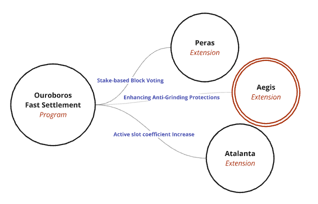
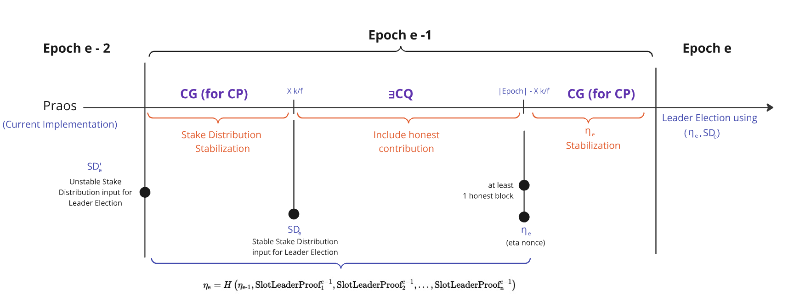

- CIP: `??`
- Title: `Ouroboros Enhancement Phalanx - (CPS Faster Settlement)`
- Category: Consensus
- Status: Proposed
- Authors:
    - `Nicolas Henin <nicolas.henin@iohk.io>`
- Implementors: []
- Discussions:
    - `https://github.com/cardano-foundation/CIPs/pull/?`
- Created: `2024-10-03`
- License: `CC-BY-4.0`


## Table of Contents
- [Abstract]()
- [Motivation: why is this CIP necessary?]()
- [Specifications]()
  - [1. Essential Ouroboros Fundamentals for Understanding How a Grinding Attack Could Be Performed](#1-essential-ouroboros-fundamentals-for-understanding-how-a-grinding-attack-could-be-executed)
    - [1.1 Properties](#11-properties)
      - [1.1.1 Transaction Ledger Properties](#111-transaction-ledger-properties)
        - [1.1.1.1 Persistence with the security parameter k &in; &#x2115;](#1111-persistence-with-the-security-parameter-k-in-n)
        - [1.1.1.2 Liveness with the transaction confirmation time parameter u &in; &#x2115;](#1112-liveness-with-the-transaction-confirmation-time-parameter-u-in-n)
      - [1.1.2 Chain Properties](#112-chains-properties)
        - [1.1.2.1 Common Prefix (CP) with parameter k &in; &#x2115;](#1121-common-prefix-cp-with-parameter-k-in-n)
        - [1.1.2.2 Honest-Bounded Chain Growth (HCG) with parameters &#x3C4; &in; &#x0028; 0, 1 &#x005D; and s &in; &#x2115;](#1122-honest-bounded-chain-growth-hcg-with-parameters-tau-in-028-01-and-s-in-n)
        - [1.1.2.3 Existential Chain Quality (&#x2203;CQ) with parameter s &in; &#x2115;](#1123-existential-chain-quality-existscq-with-parameter-s-in-n)
        - [1.1.2.4 Chain Growth (CG) with parameters &#x3C4; &in; &#x0028; 0, 1 &#x005D; and s &in; &#x2115;](#1124-chain-growth-cg-with-parameters-tau-in-028-01-and-s-in-n)
    - [1.2 Leader Election in Praos](#12-leader-election-in-praos)
      - [1.2.1 Key Notifiable Particularities of Praos](#121-key-notifiable-particularities-of-praos)
      - [1.2.2 Application of Verifiable Random Function (VRF)](#122-application-of-verifiable-random-function-vrf)
      - [1.2.3 Eligibility Check Input Variables](#123-eligibility-check-input-variables)
      - [1.2.4 Epoch Structure](#124-epoch-structure)
      - [1.2.5 Epoch & Phases Length](#125-epoch--phases-length)
        - [1.2.5.1 Stabilization of a Ledger Value in &#x0033;&#x006B;&#x002F;&#x0066;](#1251-stabilization-of-a-ledger-value-in-3kf)
        - [1.2.5.2 Lower Bound of the "Honest Randomness in &#x03B7;<sub>&#x1D07;</sub>" Phase in &#x006B;&#x002F;&#x0066; slots](#1252-lower-bound-of-the-honest-randomness-in-eta_e-phase-in-kf-slots)
        - [1.2.5.3 Additional &#x006B;&#x002F;&#x0066; slots for the &#x03B7;<sub>&#x1D07;</sub> Stabilization Phase (Genesis Specific Constraints)](#1253-additional-kf-slots-for-the-eta_e-stabilization-phase-genesis-specific-constraints)
  - [2. Grinding Attack](#2-grinding-attack)
    - [2.1 Algorithm: How to Perform an Attack?](#21-algorithm-how-to-perform-an-attack)
    - [2.2 Impacts on the Parameter k Value](#22-impacts-on-the-parameter-k-value)
  - [3. New Anti-grinding Measure](#3-new-anti-grinding-measure)
  - [4. The Security Parameter K]()
- [Rationale: how does this CIP achieve its goals?]()
  - [1. Path to Active]()
  - [2. Acceptance Criteria]()
  - [3. Implementation Plan]()
- [References]()
- [Copyright]()


## Abstract

<!-- A short (\~200 word) description of the proposed solution and the technical issue being addressed. --> 

We propose the **Ourboros Phalanx** Enhancement to the Ouroboros Praos Protocol as one of 3 approaches ([Peras](),[Phalanx]() and [the active slot coefficient f increase]()) to improve its settlement times (see [Settlement Speed CPS-0017](https://github.com/cardano-foundation/CIPs/pull/922)): 



The theoretical estimates for Cardano mainchain settlement times are significantly influenced by the potential impact of a **"grinding attack."**. 
Particurlarly, The **security parameter k** has been substantially increased to secure the Praos Protocol against these attacks. 

To reduce this effect and achieve faster settlement times, this CIP proposes some modifications to the Praos Protocol that would make such attacks considerably more expensive for adversaries, with a negligible additional cost to honest participants. 

By increasing the cost of a grinding attack, the protocol limits adversaries, who possess a certain amount of computational power, forcing them to carry out a much weaker form of the attack.

## Motivation: why is this CIP necessary?

<!-- A clear explanation that introduces the reason for a proposal, its use cases and stakeholders. If the CIP changes an established design then it must outline design issues that motivate a rework. For complex proposals, authors must write a Cardano Problem Statement (CPS) as defined in CIP-9999 and link to it as the `Motivation`. -->

The Praos consensus protocol, a key component of the Ouroboros family, secures blockchain networks through verifiable randomness in slot leader elections. 

However, the protocol is vulnerable to a grinding attack, where an adversary attempts to manipulate or predict the randomness used in leader selection by systematically "grinding" through potential inputs. 

This increases the likelihood of an attacker becoming a slot leader, compromising the fairness and security of the protocol. This vulnerability not only affects the security of the network but also has a direct impact on settlement times. By influencing the leader selection process, attackers can delay or manipulate block production, leading overall settlement delays. 

The Ouroboros Praos protocol, in contrast to its predecessor Ouroboros Classic, uses a more lightweight procedure for generating randomness. Concretely, the randomness nonce for a particular epoch is obtained by including a VRF value in each block, and hashing a concatenation of these values from a particular part of the chain belonging to the previous epoch. 

The downside of this efficiency improvement in Ouroboros Praos is that it allows for a limited amount of adversarial behavior, called grinding, where the adversary attempts to evaluate multiple potential paths leading to different nonces, and aims to steer the protocol to arrive at a nonce that is most advantageous for him. In this context, we refer to the action of determining one such potential randomness nonce as a single grinding attempt.

In the security analysis of Ouroboros Praos, this threat is contained by estimating the computational costs of such a single grinding attempt, and, assuming an upper bound on the computational power of the adversary in the short window of time when these grinding attempts must be performed, upper-bounding the number of such attempts an adversary is capable of performing. The protocol is then parametrized (in particular, the settlement times are chosen) so that settlement is guaranteed even when taking this limited grinding into account. 

This CIP is proposing to make a single grinding attempt significantly more costly for the adversary, hence decreasing the number of grinding attempts that an adversary with the same resource budget is capable of. In addition to reinforcing the protocol against CPU resource-based attacks, this enhancement will also enable to eventually reduce the **security parameter k**. 

This CIP partially addresses the [Settlement Speed CPS-0017](https://github.com/cardano-foundation/CIPs/pull/922) and will benefit a wide range of use cases and stakeholders across the Cardano community, including:
- Partner chains
- Exchanges
- Bridges
- DApps
- High-value transactions

## Specification

## 1. Essential Ouroboros Fundamentals for Understanding How a Grinding Attack Could Be Executed 

## 1.1 Properties

A protocol implements a robust transaction ledger if it maintains the ledger as a sequence of blocks, where each block is associated with a specific slot. Each slot can contain at most one ledger block, and this strict association ensures a well-defined and immutable ordering of transactions within the ledger. This structure is critical for preventing manipulation of the transaction order, which is a key vector for grinding attacks. 

For the ledger to be resistant to such attacks, the protocol must satisfy the following 2 critical properties (Persistence & Liveness), which ensure that blocks and transactions are securely committed and cannot be easily manipulated by adversaries. Persistence and liveness, can be derived to fundamental **chain properties** which are *used to explain how and why the leader election mechanism has been designed in this manner*. 

| **Chain Property**                      | **Description**                                                                                                                    |
|-----------------------------------------|------------------------------------------------------------------------------------------------------------------------------|
| **Common Prefix (CP)**                  | Ensures consistency across honest parties by requiring that chains adopted by different honest nodes share a common prefix.   |
| **Honest-Bounded Chain Growth (HCG)**   | Governs the rate at which the blockchain grows, ensuring that the chain grows at a rate proportional to time.     |
| **Existential Chain Quality (∃CQ)**     | Guarantees that at least one honestly-generated block appears in any given portion of the chain, ensuring honest contributions. |
| **Chain Growth (CG)**                   | Provides a more general notion of growth by combining **HCG** and **∃CQ**, ensuring both the quality and rate of chain expansion. |

### 1.1.1 Transaction Ledger Properties 
#### 1.1.1.1 Persistence with the **security parameter $` \text{k} \in \mathbb{N} `$**
 
Once a node of the system proclaims a certain transaction tx in the stable part of its ledger, the remaining nodes, if queried, will either report tx in the same position of that ledger or report a stable ledger which is a prefix of that ledger. Here the notion of stability is a predicate that is parameterized by a **security parameter $` \text{k} `$**. Specifically, a transaction is declared **stable** if and only if it is in a block that is more than $` \text{k} `$ blocks deep in the ledger.

#### 1.1.1.2 Liveness with the **transaction confirmation time parameter $` u \in \mathbb{N} `$** 

If all honest nodes in the system attempt to include a certain transaction then, after the passing of time corresponding to $` \text{u} `$ slots (called the **transaction confirmation time**), all nodes, if queried and responding honestly, will report the transaction as stable.

### 1.1.2 Chains properties 

**Persistence** and **liveness** can be derived from basic **chain properties**, provided that the protocol structures the ledger as a **blockchain**—a sequential data structure. The following key chain properties ensure that the blockchain behaves securely and efficiently:

#### 1.1.2.1 **Common Prefix (CP)**: With parameter the **security parameter $`k \in \mathbb{N}`$**. 

Consider 2 chains $`C_1`$ and $`C_2`$ adopted by 2 honest parties at the onset of slots $`sl_1`$ and $`sl_2`$, respectively, where $`sl_1 \leq sl_2`$. The chains must satisfy the condition:

  ```math
  C_1^{\lceil k} \preceq C_2
  ```
  Where:
  - $`C_1^{\lceil k}`$ represents the chain obtained by removing the last $`k`$ blocks from $`C_1`$.
  - $`\preceq`$ denotes the **prefix relation**.

  This ensures that the shorter chain is a prefix of the longer one, ensuring consistency across honest parties.

#### 1.1.2.2 **Honest-Bounded Chain Growth (HCG)**: With parameters $`\tau \in (0, 1]`$ (speed coefficient) and $`s \in \mathbb{N}`$ (Minimum Honest Block Inclusion Interval). 

The Honest-Bounded Chain Growth (HCG) property ensures that the blockchain grows steadily with honest participation. It uses two key parameters: $`\tau`$, the **speed coefficient**, which dictates how quickly blocks are produced relative to time, and $`s`$, the **Minimum Honest Block Inclusion Interval**, which defines the smallest span of consecutive slots in which at least one honest block must be produced.

Consider a chain $`C`$ adopted by an honest party. Let:
  - $`sl_2`$ be the slot associated with the **last block** of $`C`$,
  - $`sl_1`$ be a prior slot where $`C`$ has an honestly-generated block.

If $`sl_2 \geq sl_1 + s`$, this means that the honest chain has passed through an interval of $`s`$ slots. In such a case, the number of blocks produced in $`C`$ after $`sl_1`$ must be at least $`\tau s`$, where $`\tau`$ represents the fraction of slots that produce blocks.

- **$`s`$ (Minimum Honest Block Inclusion Interval)**: This parameter guarantees that within any sequence of $`s`$ consecutive slots, at least one block must be generated by an honest party. The choice of $`s`$ ensures that the chain grows consistently and prevents adversaries from delaying block production for too long. A higher value of $`s`$ allows for longer intervals between honest block production, while a smaller $`s`$ increases the frequency at which blocks must be produced, tightening the chain growth requirements.

- **$`\tau`$ (Speed Coefficient)**: The speed coefficient $`\tau`$ defines the proportion of slots in the interval $`s`$ that are expected to produce blocks. For instance, if $`\tau = 0.5`$ and $`s = 10`$, then at least $`\tau s = 5`$ blocks must be produced by honest participants within those 10 slots. 

Together, $`\tau`$ and $`s`$ ensure that the chain grows at a steady pace, with a balance between how frequently blocks must be produced and how much time is allowed between honest block generations. The $`s`$ parameter plays a critical role in ensuring that honest contributions remain frequent enough to maintain chain security, while $`\tau`$ governs the actual rate of block production within those intervals.

### 1.1.2.3 **Existential Chain Quality (∃CQ)**: With parameter $`s \in \mathbb{N}`$ (Minimum Honest Block Inclusion Interval). 

Consider a chain $`C`$ adopted by an honest party at the onset of a slot. For any portion of $`C`$ spanning $`s`$ prior slots, there must be at least one honestly-generated block within this portion. This ensures that the chain includes contributions from honest participants. In practical terms, $`s`$ defines the length of a "safety window" where honest contributions are guaranteed.

### 1.1.2.4 **Chain Growth (CG)**: With parameters $`\tau \in (0, 1]`$ (speed coefficient) and $`s \in \mathbb{N}`$ (Minimum Honest Block Inclusion Interval).

The Chain Growth (CG) property is a more general concept that combines both the **speed of block production** and the **frequency of honest contributions**. It uses two parameters: $`\tau`$, the **speed coefficient**, which governs how fast the chain grows, and $`s`$, the **Minimum Honest Block Inclusion Interval**, which ensures that honest blocks are consistently produced within a given interval of slots.

Consider a chain $`C`$ held by an honest party at the onset of a slot. For any portion of $`C`$ spanning $`s`$ contiguous prior slots . The number of blocks in this portion must be at least $`\tau s`$. 
The parameter $`\tau`$ determines the fraction of slots in which blocks are produced. For example, if $`\tau = 0.5`$ and $`s = 10`$, there should be at least 5 blocks produced within that span.
  
For example, if $`\tau = 0.5`$ and $`s = 10`$, then at least $`\tau s = 0.5 \times 10 = 5`$ blocks must be produced over the span of those 10 slots. 

**Note**: **∃CQ** and **HCG** are combined to provide this more general notion of chain growth (CG) 


## 1.2 Leader Election in Praos

To understand why anti-grinding mechanisms are necessary in Ouroboros Praos, it’s important to first explain how the Leader Election process works. In the Praos, the fairness and security of leader election are essential for maintaining the integrity of the blockchain. Grinding attacks target this very mechanism by trying to manipulate the randomness used in leader election, so the leader election process itself must be both fair and unpredictable. 

Let’s walk through how leader election works, followed by an explanation of the anti-grinding mechanism.

### 1.2.1 Key Notifiable Particularities of Praos

As Explained into [KRD017 - Ouroboros- A provably secure proof-of-stake blockchain protocol](https://eprint.iacr.org/2016/889.pdf), Praos protocol possesses the following basic characteristics : 

Based on her local view, a party is capable of deciding, in a publicly verifiable way, whether she is permitted to produce the next block, she is called a **slot leader**. Assuming the block is valid, other parties update their local views by adopting the block, and proceed in this way continuously. At any moment, the probability of being permitted to issue a block is proportional to the relative stake a player has in the system, as reported by the blockchain itself.

1. potentially, multiple slot leaders may be elected for a particular slot (forming a slot leader set); 
2. frequently, slots will have no leaders assigned to them; This defined by the **Active Slot Coefficient f**
3. a priori, only a slot leader is aware that it is indeed a leader for a given slot; this assignment is unknown to all the other stakeholders—including other slot leaders of the same slot—until the other stakeholders receive a valid block from this slot leader.

the **Verifiable Random Function (VRF)** plays a pivotal role in ensuring the security and fairness of the leader election process.

### 1.2.2 Application of Verifiable Random Function (VRF)

The VRF is used to introduce randomness into the protocol, making the leader election process unpredictable. It ensures that:
- A participant is privately and verifiably selected to create a block for a given slot.
- The VRF output is both secret (only known to the selected leader) and verifiable (publicly checkable).

If the VRF output (Slot Leader Proof) is less than her private $` \text{epoch}_e `$ threshold, the participant is eligible to produce a block, she becomes a Slot Leader for that particular $` \text{slot}_t `$. Her $` \text{SlotLeaderProof}_\text{t} `$ is added in the $` \text{BlockHeader}_\text{t} `$ and others participants have the ability to verify the proof.

| **Features** | **Mathematical Form** | **Description**  | 
|--------------|------------------|-----------------------|
| **Slot Leader Proof** | $` \text{SlotLeaderProof}_\text{t} = VRF_\text{gen} \left( key_\text{private}, \text{slot}_t \, \|\| \, \eta_\text{e} \right) `$ | This function computes the leader eligibility proof using the VRF, based on the slot number and randomness nonce.       | 
| **Slot Leader Threshold** | $` \text{Threshold}_\text{e} = \frac{\text{ActiveStake}^\text{e}_\text{participant}}{\text{ActiveStake}^\text{e}_\text{total}} \times ActiveSlotCoefficient `$ | This function calculates the threshold for a participant's eligibility to be selected as a slot leader during $` \text{epoch}_e `$.   | 
| **Eligibility Check** | $` \text{SlotLeaderProof}_\text{t} < \text{Threshold}_\text{e} `$ |The leader proof is compared against a threshold to determine if the participant is eligible to create a block.         |
| **Verification**       | $` VRF_\text{verify} \left( key_\text{public}, \text{SlotLeaderProof}_\text{t}\right) = \text{slot}_t \, \|\| \, \eta_\text{e}  `$ | Other nodes verify the correctness of the leader proof by recomputing it using the public VRF key and slot-specific input.     | 
 
| Where | |
|-----------------------------------|-----------------------------------------------------------------------------------------------------------------------------------|
| $` \text{slot}_t `$                   | The current slot number.                                                                                                          |
| $` \eta_\text{e} `$                   | Eta, The randomness nonce used in $` \text{epoch}_\text{e} `$, computed within the previous $` \text{epoch}_\text{e-1} `$.            |
| $` key_\text{private} `$              | The node's secret (private) key.                                                                                                  |
| $` key_\text{public} `$               | The node's public key.                                                                                                            |
| $` VRF_\text{gen} \left( key_\text{private}, \text{input} \right) \rightarrow Proof `$ | Generate a Proof with input |
| $` VRF_\text{verify} \left( key_\text{private}, proof \right) \rightarrow Input  `$ | Generate a Proof with input |
| $` a \|\| b `$                        | The concatenation of $`a`$ and $`b`$.                                                 |
| $` \text{ActiveStake}^\text{e}_\text{participant} `$ | The stake owned by the participant used in $` \text{epoch}_\text{e} `$, computed within the previous $` \text{epoch}_\text{e-1} `$                                                                                              |
| $` \text{ActiveStake}^\text{e}_\text{total} `$       | The total stake in the system used in $` \text{epoch}_\text{e} `$, computed within the previous $` \text{epoch}_\text{e-1} `$                                                                                                  |
| $` ActiveSlotCoefficient`$                            | The active slot coefficient (referred as $`f`$), representing the fraction of slots that will have a leader and eventually a block produced.                                           |

#### 1.2.3 Eligibility Check Input Variables   

For a participant to determine if they are eligible to be a slot leader, 2 key variable inputs are required:

```math 
\text{SlotLeaderProof}_\text{t} < \text{Threshold}_\text{e} \equiv isEligible\left (\text{ActivesStake}^\text{e},\eta_\text{e}\right) = VRF_\text{gen} \left( key_\text{private}, \text{slot}_t \, \|\| \, \eta_\text{e} \right) < \frac{\text{ActiveStake}^\text{e}_\text{participant}}{\text{ActiveStake}^\text{e}_\text{total}} \times ActiveSlotCoefficient 
```

1. **Active Stake Distribution**:  
   - $`\text{ActivesStake}^\text{e}_\text{participant}`$: The participant's stake during epoch $`e`$.
   - $`\text{ActiveStake}^\text{e}_\text{total}`$: The total stake in the system during epoch $`e`$.

2. **Randomness Beacon**:  
   - $`\eta_\text{e}`$: The randomness beacon for epoch $`e`$, which is derived from previous epoch contributions.
   - $` \eta_\text{e} `$ (for $` \text{epoch}_e `$) is computed based on the $` \text{SlotLeaderProof}_\text{t} `$ generated and included in the $` \text{BlockHeader}_\text{t} `$ during the previous $` \text{epoch}_\text{e-1} `$ : 

```math
 \eta_\text{e} = H\left( \eta_\text{e-1}, \text{SlotLeaderProof}_1^{e-1}, \text{SlotLeaderProof}_2^{e-1}, \dots, \text{SlotLeaderProof}_\text{n}^{e-1} \right) 
```

| **where** ||
|---------------|-----------------|
| $` H(\cdot) `$ | A cryptographic hash function (e.g., **SHA-256**), used to aggregate the VRF outputs from $` \text{epoch}_\text{e-1} `$ |
| $` \text{SlotLeaderProof}_i^{e-1} `$ | The **VRF proof** generated by the $` \text{slot}_\text{i} `$ leader  in  $` \text{epoch}_\text{e-1} `$ and included in the block header |
| $` n `$ | is the total number of blocks within the 2 first phases  ($` \text{\|epoch\| - } \|\eta_\text{e} \text{ Stabilization }\| `$  ) in  $` \text{epoch}_\text{e-1} `$. |

An epoch is structured to ensure that these two key input variables are distributively available to each participant, allowing for decentralized and secure leader election across the network.

#### 1.2.4 Epoch Structure 

In Praos and Genesis, An epoch consists of 3 logical phases to compute these 2 key variables—**active stake distribution** and **randomness beacon**—by going through the following phases:



The sequential flow of these 3 phases is deliberately structured by designed : 

| Id | **Phase**                                                  | **Key Property**                 | **Description**| 
|----|-------------------------------|---------------------------|-------------------------------|
| **1.**| $`\text{ActiveStakeDistribution}_e `$ Stabilization | **Chain Growth (CG)**  | This phase must be long enough to satisfy the **Chain Growth (CG)** property, ensuring that each honest party's chain grows by at least $`k`$ blocks. This guarantees that all honest parties agree on the stake distribution from the previous epoch. | 
| **2.**| Honest Randomness in $`\eta_\text{e}`$     | **Existential Chain Quality (∃CQ)** | After the Active Stake Distribution being stabilized to prevent adversaries from adjusting their stake in their favor, this phase must be sufficiently long to satisfy the Existential Chain Quality (∃CQ) property, which is parameterized by $`s \in \mathbb{N}`$, ensuring that at least one honestly-generated block is included within any span of $s$ slots. The presence of such a block guarantees that honest contributions to the randomness used in the leader election process are incorporated. This phase directly improves the quality of the randomness $` \eta_\text{e} `$ by ensuring that adversarial attempts to manipulate the randomness beacon are mitigated. The honest block serves as a critical input, strengthening the unpredictability and fairness of the leader election mechanism.   | 
| **3.**| $`\eta_\text{e}`$ Stabilization   | **Chain Growth (CG)**          | This phase must again be long enough to satisfy the **Chain Growth (CG)** property, ensuring that each honest party's chain grows by at least $`k`$ blocks, allowing all honest parties to agree on the randomness contributions from the second phase. | 

#### 1.2.5 Epoch & Phases Length 

While there is no theoretical upper bound on the epoch size—since it is defined by social and practical considerations (e.g., $`10 \, \text{k}/f`$ slots, approximately 5 days)—the epoch does have a defined lower bound. Phases 1 and 3 have fixed sizes of $`3 \, \text{k}/f`$ and $`4 \, \text{k}/f`$, respectively. The size of Phase 2, "Honest Randomness in $`\eta_\text{e}`$," is adjustable with a minimum size of $`1 \, \text{k}/f`$. 

The structure of an epoch is often described by the ratio `3:3:4`:
- **Phase 1** occupies **3** parts of the total epoch.
- **Phase 2** also occupies **3** parts of the epoch (adjusted slightly to ensure the total reaches **10** parts in total.). 
- **Phase 3** takes up the remaining **4** parts of the epoch.


##### 1.2.5.1 Stabilization of a ledger value in $`3k/f`$

<details>
<summary>in Progress</summary> 
This argument, known as "CG from CP," proceeds as follows:

Within these $3k/f$ slots, there are expected to be approximately $3k/2$ adversarial slots, assuming an adversary of strength close to $1/2$. Consequently, with overwhelming probability, there will be at least $k$ adversarial slots in this period.


Now, if the honest chain were to grow by fewer than $k$ blocks during this interval, it would signal an imminent $k$-common-prefix (k-CP) violation. The adversary could, at that point, maintain a private chain of length $k$ starting from the beginning of this interval. By simply waiting for the honest chain to reach a length of $k$ blocks, the adversary could present two disjoint chains of $k$ blocks each within the same epoch, thereby violating the k-CP property.

This reasoning assumes an adversary strength near $1/2$, but it is worth noting that the weaker the adversary, the better the chain growth (CG) properties.
</details>


##### 1.2.5.2 Lower Bound of the "Honest Randomness in $`\eta_\text{e}`$" phase in $`k/f`$ slots

<details>
<summary>in Progress</summary> 
TBD
</details>

##### 1.2.5.4 Additional $`k/f`$ flots for the $`\eta_\text{e}`$ Stabilization phase (Genesis Specific Constraints)

<details>
<summary>in Progress</summary> 
TBD
</details>

## 2. Grinding Attack 

### 2.1 Algorithm : how to perform an attack ?

### 2.2 Impacts on the parameter k value

## 3. Phalanx : the New Anti-grinding Measure

## 4. The security Parameter k

<details>
<summary>in Progress</summary> 

The strongest bounds that we know for settlement arise by considering executions of longest-chain-rule protocols divided into “phases.” 

Each phase is a window of time that terminates with a Delta period in which there are no honest leaders. 

Formally, a phase is a window of slots [s, s+1, ..., t] with the property that the last Delta slots have no honest leader, and no other subwindow of Delta slots in [s,t] has this property. (Note that for convenience here, and in the rest of the discussion, Delta—the maximum network delay—is measured in terms of slots.) If you take a long sequence of slots {0, 1, ..., L}, you can naturally decompose this into a sequence of phases by scanning the sequence from left to right and “ending a phase” every time you observe a sequence of Delta slot with no honest leaders. (This can leave a partial phase at the end.) Note that it is possible that a phase has no honest leaders in it, in which case it just consists of Delta slots.
The whole operation we are discussing is parametrized by

* Delta (as above), the maximum network delay measured in slots,
* p_a, the probability that a slot has at least one adversarial leader,
* p_h, the probability that a slot has at least one honest leader. A related probability that is important in the analysis is p_h*, the probability that the number of honest leaders in a slot is exactly one. We assume that the actual number of honest leaders in a slot is given by a Poisson distribution, which means that p_h* = - (1 - p_h) ln (1 - p_h). (To explain this, if the number of leaders is Poisson, then Pr[k honest leaders] = exp(-L) L^k/k! for some L. Now you can solve for L in terms of p_h and determine p_h*.
* (Note that it is also possible to determine p_a and p_h from adversarial stake, participating honest stake, and the “active slot coefficient.”)

The first challenge is to generate the phase distribution. Specifically, consider a sequence of slots {1, 2, ...} with associated random variables H_1, H_2, ... and A_1, A_2, ...; here A_t (taking values 0, 1) determines whether there is an adversarial leader in slot t and H_t whether there is an honest leader in slot t. In fact, for the honest case, we need slightly more information and we let H_t take values in {0, 1, 2+} , indicating whether there was 0, 1, or more than 1 leader in that slot. Here the A_t and H_t are independently set so that Pr[A_t = 1] = p_h, Pr[H_t = 1] = p_h*, and Pr[H_t = 0] = 1 - p_h. In terms of these random variables, there is a phase determined that starts at slot 1 and extends through some slot M; the value M is the smallest index so that the window {M-Delta, ..., M} has no honest successes (with the understanding that M >= Delta). We say that a phase has signature (h, a), where h takes values in the set {0, !, 1, 2, ...} and a takes values in the set {0, 1, ...} , if a and h  are numbers of slots in the phase in which there is are adversarial success and honest successes, with the extra understanding that if there is one honest slot and it has exactly one honest leader, then h = ! (instead of 1).
(This is not right: We need to update honest depth! So, that will mean two “suffix” parameters when we carry out the evolution of the probability distributions.)

</details>
<details>
  <summary>Brain Dump Area</summary>

This hash function is applied to the concatenation of VRF values that are inserted into each block during the first 16k/f slots of an epoch that lasts 24k/f slots in entirety. (The “quiet” period of the final 8k/f slots in each epoch will ensure that the nonce is stable before the next epoch begins.) The verifiability of those values is a key property that we exploit in the proof.


```haskell
-- | Input to the verifiable random function. Consists of the hash of the slot
-- and the epoch nonce.
newtype InputVRF = InputVRF {unInputVRF :: Hash Blake2b_256 InputVRF}
  deriving (Eq, Ord, Show, Generic)
  deriving newtype (NoThunks, ToCBOR)

instance SignableRepresentation InputVRF where
  getSignableRepresentation (InputVRF x) = hashToBytes x

-- | Construct a unified VRF value
mkInputVRF ::
  SlotNo ->
  -- | Epoch nonce (Eta)
  Nonce ->
  InputVRF
mkInputVRF (SlotNo slot) eNonce =
  InputVRF
    . Hash.castHash
    . Hash.hashWith id
    . runByteBuilder (8 + 32)
    $ BS.word64BE slot
      <> ( case eNonce of
             NeutralNonce -> mempty
             Nonce h      -> BS.byteStringCopy (Hash.hashToBytes h)
         )
```


- code places to look at 
 ```haskell
-- | Check whether this node meets the leader threshold to issue a block.
-- | pi =φf(αi)≜1−(1−f)^αi 
meetsLeaderThreshold ::
  forall c.
  PraosCrypto c =>
  ConsensusConfig (Praos c) ->
  LedgerView (Praos c) ->
  SL.KeyHash 'SL.StakePool c ->
  VRF.CertifiedVRF (VRF c) InputVRF ->
  Bool
meetsLeaderThreshold
  PraosConfig {praosParams}
  Views.LedgerView {Views.lvPoolDistr}
  keyHash
  rho =
    checkLeaderNatValue
      (vrfLeaderValue (Proxy @c) rho)
      getStakeProportion
      (praosLeaderF praosParams)
    where
      getStakeProportion =
        maybe 0 SL.individualPoolStake $
          Map.lookup keyHash poolDistr
      SL.PoolDistr poolDistr _totalActiveStake = lvPoolDistr


checkLeaderNatValue ::
  -- | Certified nat value
  BoundedNatural ->
  -- | Stake proportion
  Rational ->
  ActiveSlotCoeff ->
  Bool 

 -- | This module implements VRF range extension as described in
-- https://iohk.io/en/research/library/papers/on-uc-secure-range-extension-and-batch-verification-for-ecvrf/

checkLeaderNatValue
meetsLeaderThreshold
module Ouroboros.Consensus.Protocol.Praos.VRF (
    InputVRF
  , VRFUsage (..)
  , mkInputVRF
  , vrfLeaderValue
  , vrfNonceValue
  )
 ```

</details>

<!-- The technical specification should describe the proposed improvement in sufficient technical detail. In particular, it should provide enough information that an implementation can be performed solely on the basis of the design in the CIP. This is necessary to facilitate multiple, interoperable implementations. This must include how the CIP should be versioned, if not covered under an optional Versioning main heading. If a proposal defines structure of on-chain data it must include a CDDL schema in its specification.-->

### Agda Specification Changes

The changes to the Agda specification are found [here](https://github.com/IntersectMBO/ouroboros-consensus/tree/polina/anti-grinding/docs/agda-spec).
The main changes can be summarized as follows :

- `RandomnessStabilisationWindow` was renamed to `RandomnessStabilisationWindowPlusOne`, because this aligns better with the 
case splitting required for the changes. The implication is that `RandomnessStabilisationWindowPlusOne` is exactly 
one slot more than the `RandomnessStabilisationWindow`

- The following modules are parametrized by the function `grindingf : Nonce → Nonce` that gets applied repeatedly to 
the pre-nonce at the arrival of each block, called `f` in the Quick Wins document. This function is left abstract
in the specification. 
  - `Spec.ChainHead` , `Spec.ChainHead.Properties` , `Spec.Protocol` , `Spec.Protocol.Properties` , `Spec.UpdateNonce` , `Spec.UpdateNonce.Properties`

- The field `pre-η`, representing the current value of the pre-nonce, is added to the the following states :
  - `UpdateNonceState` , `PrtclState` , `ChainHeadState`

**`UPDN` Transition.** This transition is called by the `PTCL` transition every time a new block is being applied. 
It specifies 

- how the evolving nonce `ηv` is evolved by a VRF result from the incoming block header, i.e. in every 
case, it is combined  with the result of the VRF calculation `η` 
 
- how the candidate nonce `ηc` is updated : it is kept fixed whenever the current slot 
is less than `RandomnessStabilisationWindowPlusOne` slots away from the first slot of the next epoch, 
and is set equal to the evolving nonce otherwise

This transition is changed from having two rules, `Update-Both` and `Only-Evolve`, which 
correspond to whether `s + RandomnessStabilisationWindowPlusOne` is `<` or `≥` than `firstSlot (sucᵉ (epoch s))` (respectively) 
to having three separate cases. In all cases, the evolving nonce `ηv` is evolved by applying the VRF result `η`, denoted `ηv * η` :

1. `Update-All`, corresponding to `≡`
  - old pre-nonce `pre-η` is discarded, and the value in this field is set to a new pre-nonce, which is the same as 
  the updated evolving nonce, `ηv * η`,
  - the old candidate nonce `ηc` is discarded, and the value in this field is set to `grinding pre-η`. This is the 
  result of the application of the anti-grinding function `grindingf` 

2. `New-PreN`, corresponding to `<`
  - old pre-nonce `pre-η` is updated to the result of the application of the anti-grinding function `grindingf`, to 
  the existing pre-nonce to get `grindingf pre-η` 
  - the new candidate nonce `ηc` is discarded, and the field value is set to the same as the updated pre-nonce, i.e. `grindingf pre-η` 

3. `Keep-PreN`, corresponding to `>`
  - old pre-nonce `pre-η` is updated to the result of the application of the anti-grinding function `grindingf`, to 
  the existing pre-nonce to get `grindingf pre-η` 
  - the candidate nonce `ηc` is kept constant, because it needs to remain fixed for this last part of the epoch

These rule changes ensure that a fresh pre-nonce (which comes from the VRF-based evolving nonce) is set in the 
slot that is `RandomnessStabilisationWindowPlusOne`
before the first slot of the next epoch, updated by applying the anti-grinding function `grindingf` for each 
block in the span of the subsequent epoch. Once that is complete, the updated pre-nonce becomes the new 
candidate nonce.

**Changes to other Transitions.**
The rule that calls `UPDN`, which is `PRTL`, still does so by requiring the correct execution of `UPDN`.
This is achieved by including the the start state of  `UPDN` the pre-nonce `pre-η`, and in its end state, the updated 
`pre-η'`, which is the update computed by `UPDN`. The pre-nonce is also included in the state updated 
by `PRTL` itself. Changes to rule that calls `PRTL`, which is `CHAINHEAD`, follow the same pattern 
as the changes to `PRTL` : including the pre-nonce in its state, and updating it by calling the `PRTL` 
rule to compute the update.

**NOTE** The rule `TICKN` is used to swap out the old epoch nonce 
at the start of the new epoch. This rule does not swap the previous epoch's nonce for the candidate 
nonce directly, but instead, it combines the candidate nonce with the hash of previous 
epoch's last block header to obtain the new epoch nonce. This rule remains unchanged, however, 
this divergence from the original design impacts the analysis of the effectiveness of the 
new anti-grinding measures.


## Rationale: how does this CIP achieve its goals?

> [!NOTE] Quantifying : 
> 1. The increase of security
> 2. the decrease security parameter k

<!-- The rationale fleshes out the specification by describing what motivated the design and what led to particular design decisions. It should describe alternate designs considered and related work. The rationale should provide evidence of consensus within the community and discuss significant objections or concerns raised during the discussion.

It must also explain how the proposal affects the backward compatibility of existing solutions when applicable. If the proposal responds to a CPS, the 'Rationale' section should explain how it addresses the CPS, and answer any questions that the CPS poses for potential solutions.
-->

## Path to Active

### Acceptance Criteria
<!-- Describes what are the acceptance criteria whereby a proposal becomes 'Active' -->

### Implementation Plan
<!-- A plan to meet those criteria or `N/A` if an implementation plan is not applicable. -->

<!-- OPTIONAL SECTIONS: see CIP-0001 > Document > Structure table -->
## References

- [KRD017 - Ouroboros- A provably secure proof-of-stake blockchain protocol](https://eprint.iacr.org/2016/889.pdf)
- [DGKR18 - Ouroboros Praos/ An adaptively-secure, semi-synchronous proof-of-stake blockchain](https://eprint.iacr.org/2017/573.pdf)
- [Practical Settlement Bounds For Longest Chain Consensus](https://eprint.iacr.org/2022/1571.pdf) 
- [On UC-Secure Range Extension and Batch Verification for ECVRF](https://eprint.iacr.org/2022/1045.pdf)
## Definitions

## Copyright
<!-- The CIP must be explicitly licensed under acceptable copyright terms.  Uncomment the one you wish to use (delete the other one) and ensure it matches the License field in the header: -->

<!-- This CIP is licensed under [CC-BY-4.0](https://creativecommons.org/licenses/by/4.0/legalcode). -->
<!-- This CIP is licensed under [Apache-2.0](http://www.apache.org/licenses/LICENSE-2.0). -->