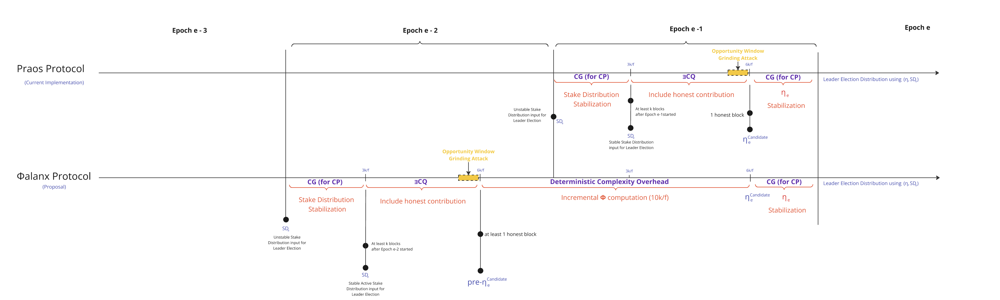

- CIP: `??`
- Title: `Φalanx (Phalanx) : Increasing the Computational Cost of Grinding Attacks`
- Category: Consensus
- Status: Proposed
- Authors:
    - `Nicolas Henin <nicolas.henin@iohk.io>`
- Implementors: []
- Discussions:
    - `https://github.com/cardano-foundation/CIPs/pull/?`
- Created: `2024-10-03`
- License: `CC-BY-4.0`

---
FYI > Work in Progress, in [google doc](https://docs.google.com/document/d/13TZF2jYLoKPjs6Aa9tLA4t9TtxqhBB7qMIZCy9SWKR4/edit?tab=t.0)

---

## Table of Contents

- [Abstract](#abstract)
- [Motivation: Why is this CIP necessary?](#motivation-why-is-this-cip-necessary)
- [Specification](#specification)
- [Rationale: How does this CIP achieve its goals?](#rationale-how-does-this-cip-achieve-its-goals)
- [Path to Active](#path-to-active)
  - [Acceptance Criteria](#acceptance-criteria)
  - [Implementation Plan](#implementation-plan)
- [Copyright](#copyright)

# Abstract

<!-- A short (\\\~200 word) description of the proposed solution and the technical issue being addressed. \-->

Addressing the "[Ouroboros Randomness Generation Sub-Protocol – The Coin-Flipping Problem](https://github.com/input-output-hk/ouroboros-anti-grinding-design/blob/main/CPS/Readme.md#4-the-quantification-challenge)" CPS**,  Φalanx (Pronounced Phalanx)** enhances **Ouroboros Praos** to mitigate grinding attacks by **increasing the cost of leader election manipulation**. It extends **nonce generation from 1 epoch to 2**, introducing a **computationally intensive function** that remains efficient for honest participants but makes it **significantly more costly for adversaries to bias the process**.

A [**Phalanx**](https://en.wikipedia.org/wiki/Phalanx) is an **Ancient Greek military formation** where soldiers **stand in a tightly packed unit**, shielding and reinforcing one another to create a nearly impenetrable defense. This strategy made it far more difficult for enemies to break through compared to fighting individual soldiers.


In **Φalanx Protocol**, we apply this idea cryptographically by **enhancing the VRF-based randomness generation sub-protocol** with a cryptographic primitive that is **efficient for honest participants** but **computationally expensive for adversaries** attempting to bias leader election. While it won’t eliminate grinding attacks entirely, it **significantly increases their cost**, and our work focuses on **precisely quantifying this added expense**.

# Motivation: why is this CIP necessary?

<!-- A clear explanation that introduces the reason for a proposal, its use cases and stakeholders. If the CIP changes an established design then it must outline design issues that motivate a rework. For complex proposals, authors must write a Cardano Problem Statement (CPS) as defined in CIP-9999 and link to it as the \`Motivation\`. -->

Please refer to the CPS "[Ouroboros Randomness Generation Sub-Protocol – The Coin-Flipping Problem](https://github.com/input-output-hk/ouroboros-anti-grinding-design/blob/main/CPS/Readme.md#4-the-quantification-challenge)" for a detailed understanding of **randomness generation, leader election in Praos, and the coin-flipping dilemma in consensus protocols**. Moving forward, we will **dive into the core details**, assuming you have the **relevant background** to understand the proposal.

We have detailed in the CPS the computational cost of a grinding attempt and observed that, for an adversarial stake **greater than 10%**, the **Ouroboros Praos** protocol becomes vulnerable to grinding attacks within the **harmful range** $`I = 10 < \rho < 64`$. Beyond $`\rho = 64`$, however, grinding computations become **practically infeasible**. 

The key question we explore in this CIP is:  
**Can we increase the computational cost of a grinding attempt sufficiently to shrink the vulnerable interval** $`I`$, **thereby effectively discouraging adversaries?**  

This CIP investigates that approach as a potential solution.


# Specification

<!-- The technical specification should describe the proposed improvement in sufficient technical detail. In particular, it should provide enough information that an implementation can be performed solely on the basis of the design in the CIP. This is necessary to facilitate multiple, interoperable implementations. This must include how the CIP should be versioned, if not covered under an optional Versioning main heading. If a proposal defines structure of on-chain data it must include a CDDL schema in its specification.-->

The core principle of the proposed protocol change is to **substantially escalate the computational cost of each grinding attempt for an adversary**. 

To achieve this, every honest participant is required to perform a designated computation for each block they produce over an epoch (**21,600 blocks**). Consequently, an adversary attempting a grinding attack must **recompute these operations for every single attempt**, while being **constrained by the grinding window**, which dramatically increases the resource expenditure. 

By enforcing this computational burden, we **drastically reduce the feasible number of grinding attempts** an adversary with a fixed resource budget can execute, making randomness manipulation **more expensive and significantly less practical**.
 

## 1. The Flow

In **Φalanx** , the randomness generation and leader election flows are modified as follows:



1. The **stake distribution stabilization phase** is shifted **back by one epoch :** The **active** **stake distribution** *SDe* used for leader election is now derived from the **end of epoch*e-3*** instead of ***epoche-2***  as in the original Praos protocol.  
2. The **honest contribution inclusion phase**, which originally resulted in a **ηₑ candidate**, is also **shifted back by one epoch**, aligning with the adjusted **stake distribution stabilization**. This value is now referred to as the **pre-ηₑ candidate**, signifying its role as an **intermediate randomness nonce** in the sub-protocol.  
3. The **ηₑ (randomness eta nonce)** undergoes an **additional sequence of incremental hashing** using a **new deterministic** **cryptographic primitive Φ (Phi)**, applied over a duration equivalent to a full epoch.

## 2. The Randomness Generation Sub-Protocol 

The Randomness Generation sub-protocol operates with two parallel streams: $`\eta^\text{stream}`$ and $`\phi^\text{stream}`$, which synchronize at the conclusion of the **Include Honest Contribution** Phase (akka Phase 2).  

##### **The $`\eta^\text{stream}`$ Definition** 
   - Exist in Praos already and will be kept in Phalanx  
   - **Sampling Rate**  : For every block produced within the blockchain tree, a unique $`\eta^\text{stream}`$ is appended in the block header :

```math
   \eta^{\text{stream}}_{t+1} =
   \begin{cases}
   \text{ProtocolParameter}_\text{extraEntropy} & \text{when } t = 0, \\
   \eta^{\text{stream}}_{t} \oplus VRF^\text{Output}_\text{t+1} & \text{when BlockProduced}(t) \\
   \eta^{\text{stream}}_{t}  & \text{otherwise.}
   \end{cases}
   
```
```math 
\text{BlockProduced}(t) = 
\begin{cases} 
true & \text{if a block is produced at time } t, \\
false & \text{otherwise.}
\end{cases}
```

| **where** ||
|---------------|-----------------|
| $`\text{ProtocolParameter}_\text{extraEntropy} `$ | The evolving nonce is initialized using the extraEntropy field defined in the protocol parameters.|
| $` VRF^\text{Output}_\text{i} `$ | The **VRF output** generated by the $` \text{slot}_\text{i} `$ Leader and included in the block header |

##### **The $`\text{pre-}\eta`$ Synchronizations**  

- To generate $`\eta_\text{e}`$ for epoch $`e`$, the stream $`\phi^\text{stream}`$ is reset with the value of $`\eta^\text{stream}`$ at the end of Phase 2 in $`\text{epoch}_{e-2}`$. The value of $`\eta^\text{stream}`$ at that moment is referred to as $`\text{pre-}\eta_e`$.
 
##### **The $`\phi^\text{stream}`$ Definition**  

   - It is reset at the $`\text{pre-}\eta`$ Synchronizations
   - For every block produced within the blockchain tree, a unique $`\phi^\text{evolving}`$ is appended in the block header :

```math
   \phi^{\text{stream}}_{t+1} =
   \begin{cases}
   \eta^\text{stream}_{t} & \text{when } t = \text{pre-}\eta\text{ synchronization}, \\
   \Phi(\phi^{\text{stream}}_{t})  & \text{when t = Active Slot} \\
   \phi^{\text{stream}}_{t}  & \text{otherwise.}
   \end{cases}
```

##### **The $`\eta`$** Generations
   - This is the final nonce $`\eta_\text{e}`$ used to determine participant eligibility during epoch $`e`$.  
   - It originates from $`\phi^{\text{stream}}_{t}`$ at $`\text{pre-}\eta_\text{e+1}`$ Synchronization  XOR with $`\eta^\text{stream}_t`$ $`\text{when } t = \text{end of epoch}_\text{e-3}`$   

```math
\eta_\text{e} = \eta^\text{stream}_{epoch_\text{e-3}} \oplus \phi^\text{stream}_t , \quad \text{when } t = \text{pre-}\eta_\text{e+1}\text{ synchronization } 
```
**N.B** : $`\text{pre-}\eta_\text{e+1}`$ synchronization occurs $`\text{when } t = \text{end of phase 2 at epoch}_\text{e-1}`$

## 3. The Φ Cryptographic Primitive

The Φ cryptographic primitive must satisfy the following key requirements to ensure security, efficiency, and practical usability within the protocol.

#### Core Properties :

1. **Functionality**

   * The relation must be a well-defined **mathematical function**, ensuring a **unique output for each given input** (unlike proof-of-work, which allows multiple valid outputs).  
2. **Determinism**

   * The function must be **fully deterministic**, meaning that its output is **entirely determined by its input**, eliminating non-deterministic variations.  
3. **Efficient Verification**

   * The function must allow for **fast and lightweight verification**, enabling rapid validation of outputs with minimal computational overhead.  
4. **Compact Representation**

   * The input and output sizes should be **small enough to fit within a block**, optimizing on-chain storage efficiency. Further reductions are desirable where feasible.  
5. **Lower Bound on Computation**

   * The computational cost of evaluating the function should be **well-characterized and predictable**, with a **lower bound that is difficult to surpass**, ensuring adversaries cannot gain an unfair efficiency advantage.  
6. **Ease of Implementation & Maintenance**

   * The function should be **simple to implement and maintain**, ensuring long-term usability and minimizing technical debt.  
7. **Adaptive Security**

   * The function and its parameters should be **easily reconfigurable** to accommodate evolving threats, such as advances in computational power or new cryptographic attacks.

## 4. Adversarial Resistance 


