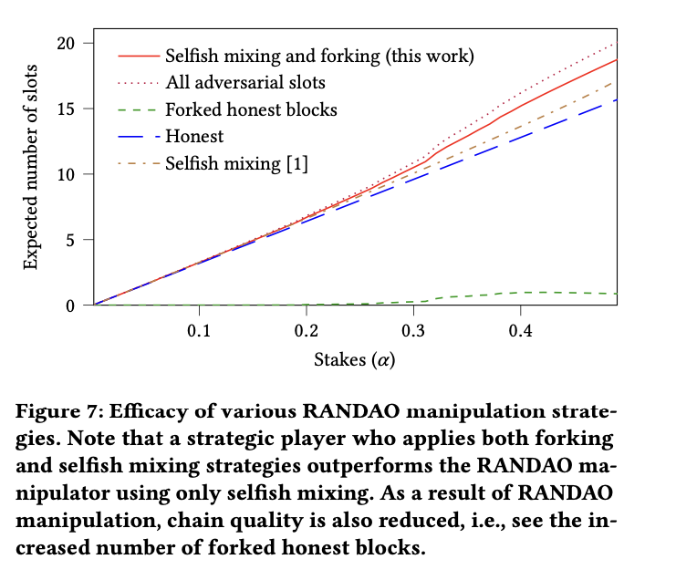
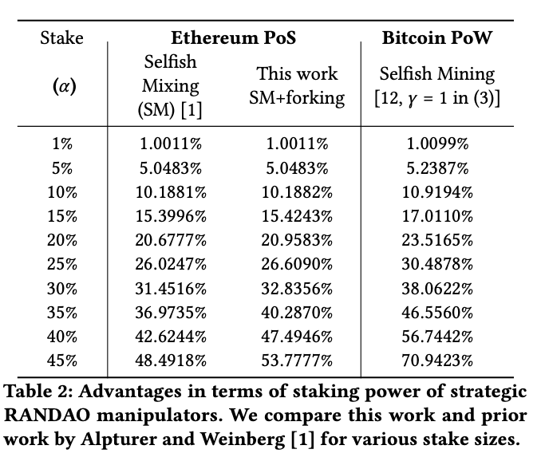
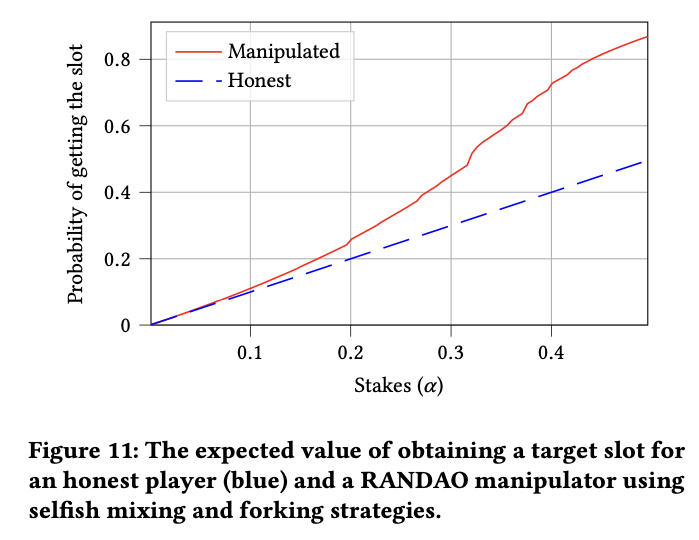
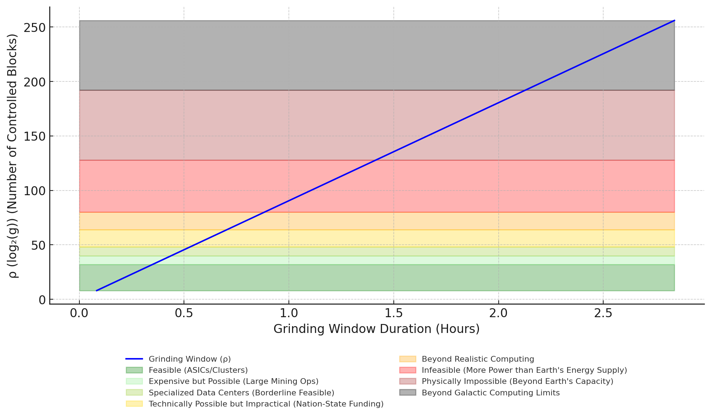
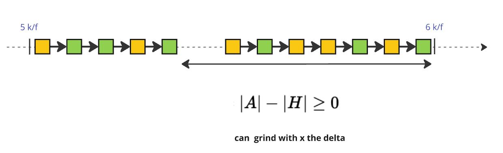
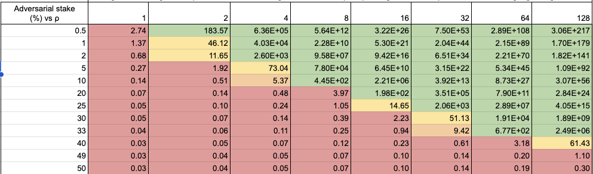
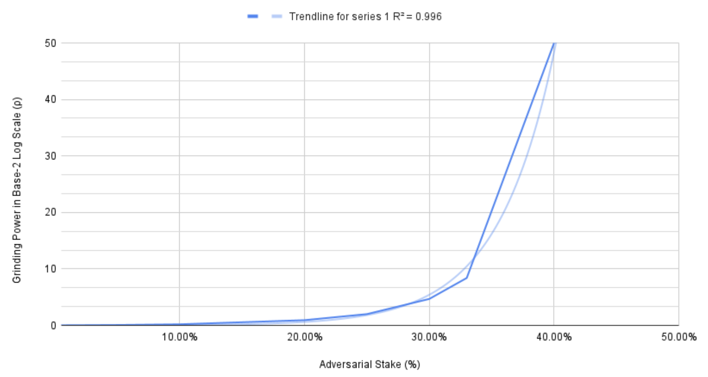

- CPS: 18
- Title: `Ouroboros Randomness Generation Sub-Protocol - The coin-flipping Problem`
- Category: Consensus/Security
- Status: Proposed
- Authors:
    - `Nicolas Henin <nicolas.henin@iohk.io>`
- Implementors: []
- Discussions:
    - `https://github.com/cardano-foundation/CIPs/pull/?`
- Created: `2024-10-03`
- License: `CC-BY-4.0`

## Table of Contents

- [Abstract](#abstract)
- [Problem](#problem)
- [Goals](#goals)
- [Open Questions](#open-questions)
- [References](#references)
- [Copyright](#copyright)


## Abstract


<!-- A short (\~200 word) description of the target goals and the technical obstacles to those goals. -->

A well-designed consensus protocol is inherently modular, consisting of multiple sub-protocols that collectively ensure security, efficiency, and decentralization. Among these, the Randomness Generation Sub-Protocol is crucial in addressing the Coin-Flipping Problem—the challenge of generating fair, unbiased, and unpredictable randomness in a distributed setting.

The objective of this CPS is to formally document the Coin-Flipping Problem and coordinate the development of CIPs aimed at mitigating or fully resolving this vulnerability within the Ouroboros protocol.

This problem is particularly critical in **Ouroboros**, where randomness serves as a foundation for key sub-protocols such as **leader election and committee selection**. Ensuring a **robust and tamper-resistant** randomness mechanism is essential to preserving the **security, fairness, and integrity** of the protocol.

To uphold Cardano’s **decentralized ethos**, the community must proactively mitigate these risks and **reduce the feasibility of biasing strategies**. Addressing this challenge requires answering key questions:

- **Is Cardano currently being manipulated?**  
  Strengthening **detection mechanisms**, such as **self-mixing analysis** and **forking manipulation detection**, can help **identify potential exploits** and assess ongoing threats.

- **Are we sufficiently disincentivizing randomness manipulation?**  
  Enhancing **stake operator diversity** and reinforcing incentives for **decentralization** will make manipulation **economically unviable**, fostering a **resilient and distributed** stake pool ecosystem.

- **How vulnerable is Cardano to these attacks, and what are the potential consequences?**  
  Improving **risk quantification** will provide deeper insight into **attack feasibility, vulnerabilities, and potential security gaps** within the protocol.

Beyond **detection, assessment, and quantification**, **protocol-level enhancements** must be explored to directly **reduce manipulation opportunities** and strengthen incentives for honest participation.

Finally, it is essential to recognize that **adversarial capabilities continually evolve**, making this an **ongoing challenge** that demands sustained **research, adaptation, and community-driven innovation**.
  
## Problem

- [1. Preliminaries](#1-preliminaries)
  - [1.1 Fundamental Properties](#11-fundamental-properties)
    - [1.1.1 Transaction Ledger Properties](#111-transaction-ledger-properties)
      - [1.1.1.1 Persistence with the security parameter k](#1111-persistence-with-the-security-parameter-k)
      - [1.1.1.2 Liveness with the transaction confirmation time parameter u](#1112-liveness-with-the-transaction-confirmation-time-parameter-u)
    - [1.1.2 Chains properties](#112-chains-properties)
      - [1.1.2.1 Common Prefix (CP)](#1121-common-prefix-cp)
      - [1.1.2.2 Honest-Bounded Chain Growth (HCG)](#1122-honest-bounded-chain-growth-hcg)
      - [1.1.2.3 Existential Chain Quality (∃CQ)](#1123-existential-chain-quality-cq)
      - [1.1.2.4 Chain Growth (CG)](#1124-chain-growth-cg)
- [1.2 The Coin-Flipping Problem](#12-the-coin-flipping-problem)
  - [1.2.1 Defining the Problem](#121-defining-the-problem)
  - [1.2.2 Strategies for Randomness Generation](#122-strategies-for-randomness-generation)
  - [1.2.3 The Historical Evolution of Ouroboros Randomness Generation](#123-the-historical-evolution-of-ouroboros-randomness-generation)
  - [1.2.4 Alternative Approaches to Randomness Generation](#124-alternative-approaches-to-randomness-generation)
    - [1.2.4.1 RANDAO (Ethereum’s Approach)](#1241-randao-ethereums-approach)
    - [1.2.4.2 VDFs (Verifiable Delay Functions)](#1242-vdfs-verifiable-delay-functions)
    - [1.2.4.3 Comparing the Approaches](#1243-comparing-the-approaches)
    - [1.2.4.4 Conclusion: Why VRFs Were Chosen for Ouroboros](#1244-conclusion-why-vrfs-were-chosen-for-ouroboros)
- [1.3 Leader Election in Praos](#13-leader-election-in-praos)
  - [1.3.1 Oblivious Leader Selection](#131-oblivious-leader-selection)
  - [1.3.2 Application of Verifiable Random Function (VRF)](#132-application-of-verifiable-random-function-vrf)
  - [1.3.3 Epoch Structure](#133-epoch-structure)
  - [1.3.4 Epoch & Phases Length](#134-epoch-phases-length)
  - [1.3.5 The Randomness Generation Sub-Protocol](#135-the-randomness-generation-sub-protocol)
- [1.4 Forks, Rollbacks, Finality and Settlement Times](#14-forks-rollbacks-finality-and-settlement-times)
- [2. Randomness Manipulation Objectives](#2-randomness-manipulation-objectives)
  - [2.1 Exposure](#21-exposure)
  - [2.2 Slot Leader Distribution Selection](#22-slot-leader-distribution-selection)
- [3. Non-Exhaustive Manipulation Strategy List](#3-non-exhaustive-manipulation-strategy-list)
  - [3.1 System Model](#31-system-model)
  - [3.2 Self Mixing Strategy](#32-self-mixing-strategy)
  - [3.3 Forking Strategies](#33-forking-strategies)
- [4. Adversarial Resistance](#4-adversarial-resistance) 
  - [4.1 Quantification Gaps Compared to Ethereum](#41-quantification-gaps-compared-to-ethereum)  
  - [4.2 Definitions](#42-definitions)  
    - [4.2.1 A-Heavy and Heaviness](#421-a-heavy-and-heaviness)  
    - [4.2.2 Grinding Power](#422-grinding-power)  
    - [4.2.3 Grinding Window](#423-grinding-window)  
  - [4.3 Grinding Power Computational Feasibility](#43-grinding-power-computational-feasibility)  
  - [4.4 Adversarial Exposure to ρ in Praos](#44-adversarial-exposure-to-ρ-in-praos)  


---

To fully grasp the context and accurately assess the level of vulnerability, it is crucial to **clearly define how the Praos protocol handles randomness** and eliminate any ambiguity in its implementation. This precise understanding will then serve as a foundation for **identifying and defining these potential attack vectors**. We will refer to these types of attacks as Grinding Attacks throughout this document.

## 1. Preliminaries

This section introduces the pertinent parts of the Cardano proof- of-stake consensus protocol. We focus on randomness generation and leader selection and omit irrelevant protocol details.

## 1.1 Fundamental Properties

A protocol implements a robust transaction ledger if it maintains the ledger as a sequence of blocks, where each block is associated with a specific slot. Each slot can contain at most one ledger block, and this strict association ensures a well-defined and immutable ordering of transactions within the ledger. This structure is critical for preventing manipulation of the transaction order, which is a key vector for grinding attacks. 

For the ledger to be resistant to such attacks, the protocol must satisfy the following two critical properties (Persistence & Liveness), which ensure that blocks and transactions are securely committed and cannot be easily manipulated by adversaries. Persistence and liveness, can be derived to fundamental **chain properties** which are *used to explain how and why the leader election mechanism has been designed in this manner*. 

| **Chain Property**                      | **Description**                                                                                                                    |
|-----------------------------------------|------------------------------------------------------------------------------------------------------------------------------|
| **Common Prefix (CP)**                  | Ensures consistency across honest parties by requiring that chains adopted by different honest nodes share a common prefix.   |
| **Honest-Bounded Chain Growth (HCG)**   | Governs the rate at which the blockchain grows, ensuring that the chain grows at a rate proportional to time.     |
| **Existential Chain Quality (∃CQ)**     | Guarantees that at least one honestly-generated block appears in any given portion of the chain, ensuring honest contributions. |
| **Chain Growth (CG)**                   | Provides a more general notion of growth by combining **HCG** and **∃CQ**, ensuring both the quality and rate of chain expansion. |

### 1.1.1 Transaction Ledger Properties 
#### 1.1.1.1 Persistence with the **security parameter $` \text{k} \in \mathbb{N} `$**
 
Once a node of the system proclaims a certain transaction *tx* in the stable part of its ledger, the remaining nodes, if queried, will either report *tx* in the same position of that ledger or report a stable ledger which is a prefix of that ledger. Here the notion of stability is a predicate that is parameterized by a **security parameter $` \text{k} `$**. Specifically, a transaction is declared **stable** if and only if it is in a block that is more than $` \text{k} `$ blocks deep in the ledger.

#### 1.1.1.2 Liveness with the **transaction confirmation time parameter $` u \in \mathbb{N} `$** 

If all honest nodes in the system attempt to include a certain transaction then, after the passing of time corresponding to $` \text{u} `$ slots (called the **transaction confirmation time**), all nodes, if queried and responding honestly, will report the transaction as stable.

### 1.1.2 Chains properties 

**Persistence** and **liveness** can be derived from basic **chain properties**, provided that the protocol structures the ledger as a **blockchain**—a sequential data structure. The following key chain properties ensure that the blockchain behaves securely and efficiently:

#### 1.1.2.1 **Common Prefix (CP)**: With parameter the **security parameter $`k \in \mathbb{N}`$**. 

Consider 2 chains $`C_1`$ and $`C_2`$ adopted by 2 honest parties at the onset of slots $`sl_1`$ and $`sl_2`$, respectively, where $`sl_1 \leq sl_2`$. The chains must satisfy the condition:

  ```math
  C_1^{\lceil k} \preceq C_2
  ```
  Where:
  - $`C_1^{\lceil k}`$ represents the chain obtained by removing the last $`k`$ blocks from $`C_1`$.
  - $`\preceq`$ denotes the **prefix relation**.

  This ensures that the shorter chain is a prefix of the longer one, ensuring consistency across honest parties.

#### 1.1.2.2 **Honest-Bounded Chain Growth (HCG)**: With parameters $`\tau \in (0, 1]`$ (speed coefficient) and $`s \in \mathbb{N}`$ (Minimum Honest Block Inclusion Interval). 

The Honest-Bounded Chain Growth (HCG) property ensures that the blockchain grows steadily with honest participation. It uses two key parameters: $`\tau`$, the **speed coefficient**, which dictates how quickly blocks are produced relative to time, and $`s`$, the **Minimum Honest Block Inclusion Interval**, which defines the smallest span of consecutive slots in which at least one honest block must be produced.

Consider a chain $`C`$ adopted by an honest party. Let:
  - $`sl_2`$ be the slot associated with the **last block** of $`C`$,
  - $`sl_1`$ be a prior slot where $`C`$ has an honestly-generated block.

If $`sl_2 \geq sl_1 + s`$, this means that the honest chain has passed through an interval of $`s`$ slots. In such a case, the number of blocks produced in $`C`$ after $`sl_1`$ must be at least $`\tau s`$, where $`\tau`$ represents the fraction of slots that produce blocks.

- **$`s`$ (Minimum Honest Block Inclusion Interval)**: This parameter guarantees that within any sequence of $`s`$ consecutive slots, at least one block must be generated by an honest party. The choice of $`s`$ ensures that the chain grows consistently and prevents adversaries from delaying block production for too long. A higher value of $`s`$ allows for longer intervals between honest block production, while a smaller $`s`$ increases the frequency at which blocks must be produced, tightening the chain growth requirements.

- **$`\tau`$ (Speed Coefficient)**: The speed coefficient $`\tau`$ defines the proportion of slots in the interval $`s`$ that are expected to produce blocks. For instance, if $`\tau = 0.5`$ and $`s = 10`$, then at least $`\tau s = 5`$ blocks must be produced by honest participants within those 10 slots. 

Together, $`\tau`$ and $`s`$ ensure that the chain grows at a steady pace, with a balance between how frequently blocks must be produced and how much time is allowed between honest block generations. The $`s`$ parameter plays a critical role in ensuring that honest contributions remain frequent enough to maintain chain security, while $`\tau`$ governs the actual rate of block production within those intervals.

#### 1.1.2.3 **Existential Chain Quality (∃CQ)**: With parameter $`s \in \mathbb{N}`$ (Minimum Honest Block Inclusion Interval). 

Consider a chain $`C`$ adopted by an honest party at the onset of a slot. For any portion of $`C`$ spanning $`s`$ prior slots, there must be at least one honestly-generated block within this portion. This ensures that the chain includes contributions from honest participants. In practical terms, $`s`$ defines the length of a "safety window" where honest contributions are guaranteed.

#### 1.1.2.4 **Chain Growth (CG)**: With parameters $`\tau \in (0, 1]`$ (speed coefficient) and $`s \in \mathbb{N}`$ (Minimum Honest Block Inclusion Interval).

The Chain Growth (CG) property is a more general concept that combines both the **speed of block production** and the **frequency of honest contributions**. It uses two parameters: $`\tau`$, the **speed coefficient**, which governs how fast the chain grows, and $`s`$, the **Minimum Honest Block Inclusion Interval**, which ensures that honest blocks are consistently produced within a given interval of slots.

Consider a chain $`C`$ held by an honest party at the onset of a slot. For any portion of $`C`$ spanning $`s`$ contiguous prior slots . The number of blocks in this portion must be at least $`\tau s`$. 
The parameter $`\tau`$ determines the fraction of slots in which blocks are produced. For example, if $`\tau = 0.5`$ and $`s = 10`$, there should be at least 5 blocks produced within that span.
  
For example, if $`\tau = 0.5`$ and $`s = 10`$, then at least $`\tau s = 0.5 \times 10 = 5`$ blocks must be produced over the span of those 10 slots. 

**Note**: **∃CQ** and **HCG** are combined to provide this more general notion of chain growth (CG) 

## 1.2 The Coin-Flipping Problem  

The **Coin-Flipping Problem** is a fundamental challenge in distributed systems that require a **fair, unbiased, and unpredictable** source of randomness—without allowing any single participant to manipulate the outcome.  

### **1.2.1 Defining the Problem**  
Consider a scenario where multiple untrusted parties must **flip a coin** to reach a decision. The challenge is ensuring that:  

1. 🎲 The outcome remains **random and unpredictable**.  
2. 🔒 No participant can **bias or influence** the result in their favor.  
3. ⚖️ The process is **fair and secure**, even in the presence of dishonest or colluding actors.  

In **blockchain consensus protocols**, randomness is crucial for **leader election, committee selection, and cryptographic lotteries**. If an adversary can bias the randomness, they can **increase their influence over block production**, **delay finality**, or **disrupt network security**.  

---

### **1.2.2 Strategies for Randomness Generation**  
Various cryptographic techniques exist to address the **coin-flipping problem** in decentralized settings. These methods differ in **security, efficiency, and resistance to adversarial manipulation**.  

| **Approach**              | **Pros** | **Cons** |
|---------------------------|---------|---------|
| **PVSS-Based Beacons** <br> _(Ouroboros Classic, RandHound, Scrape, HydRand)_ | ✔ Strong randomness guarantees—output is indistinguishable from uniform.<br> ✔ Resistant to last-mover bias—commitments prevent selective reveals. | ❌ High communication complexity—requires O(n²) messages.<br> ❌ Vulnerable to adaptive adversaries—who may corrupt committee members. |
| **VRF-Based Randomness** <br> _(Ouroboros Praos, Genesis, Snow White)_ | ✔ Efficient and scalable—no multi-round commit-reveal process.<br> ✔ Publicly verifiable—VRF proofs can be checked by anyone.<br> ✔ Resistant to last-mover bias—adversaries cannot selectively reveal values. | ❌ Min-entropy loss—adversaries controlling ≥10% of stake can slightly bias randomness.<br> ❌ Grinding attacks possible—attackers can compute multiple VRF outputs and selectively reveal the most favorable one. |
| **VDF-Based Beacons** <br> _(Ethereum’s RANDAO + VDF)_ | ✔ Reduces grinding attacks—prevents early randomness revelation.<br> ✔ Predictable computation time—ensures fairness. | ❌ Computational overhead—VDFs must be tuned for security vs. efficiency.<br> ❌ Liveness concerns—if VDFs take too long, block production can be delayed. |
| **Threshold Signature-Based Beacons** <br> _(DFINITY)_ | ✔ Fast and non-interactive—requires only one round of communication.<br> ✔ Resistant to last-mover bias—output is deterministic. | ❌ Group setup complexity—requires distributed key generation (DKG).<br> ❌ Security relies on assumptions—threshold parameters affect robustness. |
| **Byzantine Agreement-Based Beacons** <br> _(Algorand)_ | ✔ Finality guarantees—randomness is confirmed before the next epoch.<br> ✔ Less entropy loss than Praos. | ❌ Requires multi-round communication—higher latency.<br> ❌ Not designed for eventual consensus—better suited for BA-based protocols. |
| **RANDAO-Based Beacons** <br> _(Ethereum’s RANDAO)_ | ✔ Simple and efficient—low computational overhead.<br> ✔ Fully decentralized—any participant can contribute randomness. | ❌ Vulnerable to last-revealer bias—the last participant can manipulate the final output.<br> ❌ Requires additional mechanisms (e.g., VDFs) to prevent manipulation. |

### **1.2.3 The Historical Evolution of Ouroboros Randomness Generation**

The **Ouroboros family of protocols** has evolved over time to optimize **randomness generation** while balancing **security, efficiency, and decentralization**. Initially, **Ouroboros Classic** used a **secure multi-party computation (MPC) protocol** with **Publicly Verifiable Secret Sharing (PVSS)** to ensure **unbiased randomness**. While providing **strong security guarantees**, PVSS required **quadratic message exchanges** between committee members, introducing **significant communication overhead**. This **scalability bottleneck** limited participation and hindered the decentralization of Cardano's consensus process.

Recognizing these limitations, **Ouroboros Praos** moved to a **VRF-based randomness generation** mechanism. Here, each block includes a **VRF value**, and the randomness nonce for an epoch is derived from the **concatenation and hashing** of these values from a **specific section of the previous epoch’s chain**. This significantly **reduces communication complexity to linear in the number of block producers**, making randomness generation **scalable and practical** while maintaining **adequate security properties**.

However, this efficiency gain comes at a cost: it introduces a **limited avenue for randomness manipulation**. Adversaries can attempt **grinding attacks**, evaluating multiple **potential nonces** and selectively influencing randomness outcomes. While constrained, this trade-off necessitates further countermeasures to **limit adversarial influence** while maintaining protocol scalability.

---

### **1.2.4 Alternative Approaches to Randomness Generation**  

Beyond **PVSS and VRFs**, other blockchain networks have explored **alternative randomness beacons** such as **VDFs and RANDAO**.

#### **1.2.4.1 RANDAO (Ethereum’s Approach)**

Ethereum initially adopted **RANDAO**, a simple **commit-reveal randomness beacon** where validators submit **random values** during the commit phase, which are then **revealed and aggregated** to determine a final output. While **decentralized and lightweight**, RANDAO is vulnerable to **last-revealer bias**, where the final participant can withhold their value to influence the outcome.

To mitigate this, Ethereum considered **Verifiable Delay Functions (VDFs)** as an enhancement but ultimately decided against them due to **high computational requirements and validator overhead**.

#### **1.2.4.2 VDFs (Verifiable Delay Functions)**

VDFs are designed to provide **unpredictable, verifiable randomness** by requiring a **sequential computation delay** before revealing the output. This makes them **resistant to grinding attacks** since adversaries cannot efficiently evaluate multiple outcomes. However, they introduce **significant computational costs**, require specialized **hardware for efficient verification**, and demand **additional synchronization mechanisms**.

#### **1.2.4.3 Comparing the Approaches**

| **Feature**                     | **PVSS-Based (Classic)** | **VRF-Based (Praos)** | **RANDAO (Ethereum)** | **VDFs (Ethereum Considered)** |
|---------------------------------|------------------------|----------------------|----------------------|-------------------------|
| **Efficiency** ⚡                | ❌ High overhead (O(n²)) | ✅ Lightweight (O(n)) | ✅ Low complexity | ❌ High computational cost |
| **Non-Interactive Design** 🔄   | ❌ Requires multi-round commit-reveal | ✅ Fully non-interactive | ✅ Partially non-interactive | ❌ Requires sequential computation |
| **Decentralization** 🌍         | ⚠ Centralized risk via committee | ✅ Fully decentralized | ✅ Fully decentralized | ⚠ Requires specialized hardware |
| **Resistance to Grinding** 🔄   | ✅ Commitment prevents grinding | ⚠ Stake grinding possible | ❌ Last-revealer bias | ✅ Strong resistance |
| **Security Assumptions** 🔒     | ✅ Strong cryptographic guarantees | ⚠ Min-entropy loss possible | ⚠ Vulnerable to manipulation | ✅ Strong cryptographic guarantees |
| **Integration with PoS Consensus** 🔗 | ❌ Requires committee agreement | ✅ Stake-weighted randomness | ✅ Works with PoS | ❌ High integration complexity |

---

### **1.2.4.4 Conclusion: Why VRFs Were Chosen for Ouroboros**

Despite some **security trade-offs**, **VRFs** were selected for Ouroboros Praos due to their **balance between efficiency, scalability, and security**. Unlike **PVSS**, they do not require a **multi-party commit-reveal process** or **quadratic communication overhead**. Unlike **VDFs**, they are **computationally efficient** and do not require **specialized hardware**. Compared to **RANDAO**, they provide **stronger randomness guarantees**, reducing manipulation risks.

However, ongoing research continues to explore potential enhancements to **mitigate grinding risks**, including **hybrid randomness beacons** that combine **VRFs with cryptographic delay mechanisms**.


## 1.3 Leader Election in Praos

### 1.3.1 Oblivious Leader Selection

As Explained into [KRD017 - Ouroboros- A provably secure proof-of-stake blockchain protocol](https://eprint.iacr.org/2016/889.pdf), Praos protocol possesses the following basic characteristics : 
- **Privacy**: Only the selected leader knows they have been chosen until they reveal themselves, often by publishing a proof. This minimizes the risk of targeted attacks against the leader since other network participants are unaware of the leader's identity during the selection process.

- **Verifiable Randomness**: The selection process uses verifiable randomness functions (VRFs) to ensure that the leader is chosen fairly and unpredictably. The VRF output acts as a cryptographic proof that the selection was both random and valid, meaning others can verify it without needing to know the leader in advance.

- **Low Communication Overhead**: Since the identity of the leader is hidden until the proof is revealed, Oblivious Leader Selection can reduce communication overhead and minimize the chance of network-level attacks, such as Distributed Denial of Service (DDoS) attacks, aimed at preventing the leader from performing their role.

Based on her local view, a party is capable of deciding, in a publicly verifiable way, whether she is permitted to produce the next block, she is called a **slot leader**. Assuming the block is valid, other parties update their local views by adopting the block, and proceed in this way continuously. At any moment, the probability of being permitted to issue a block is proportional to the relative stake a player has in the system, as reported by the blockchain itself :
1. potentially, multiple slot leaders may be elected for a particular slot (forming a slot leader set); 
2. frequently, slots will have no leaders assigned to them; This defined by the **Active Slot Coefficient f**
3. a priori, only a slot leader is aware that it is indeed a leader for a given slot; this assignment is unknown to all the other stakeholders—including other slot leaders of the same slot—until the other stakeholders receive a valid block from this slot leader.


### 1.3.2 Application of Verifiable Random Function (VRF)

The VRF is used to introduce randomness into the protocol, making the leader election process unpredictable. It ensures that:
- A participant is privately and verifiably selected to create a block for a given slot.
- The VRF output is both secret (only known to the selected leader) and verifiable (publicly checkable).

If $`VRF^\text{Output}_\text{(participant,t)} `$ is less than her private $` \text{epoch}_e `$ threshold, the participant is eligible to produce a block, she becomes a Slot Leader for that particular $` \text{slot}_t `$. Her $` \text{SlotLeaderProof}_\text{t} `$ is added in the $` \text{BlockHeader}_\text{t} `$ and others participants have the ability to verify the proof.

| **Features** | **Mathematical Form** | **Description**  | 
|--------------|------------------|-----------------------|
| **Slot Leader Proof** | $`VRF^\text{Certification}_\text{(participant,t)} \equiv (VRF^\text{Proof}_\text{(participant,t)},VRF^\text{Output}_\text{(participant,t)}) \leftarrow VRF_\text{gen} \left( KeyVRF^\text{participant}_\text{private}, \text{slot}_t \, \|\| \, \eta_\text{e} \right) `$ | This function computes the leader eligibility proof using the VRF, based on the slot number and randomness nonce.       | 
| **Slot Leader Threshold** | $` \text{Threshold}^\text{participant}_\text{e} = (1 - ActiveSlotCoefficient )^\frac{\text{ActiveStake}^\text{e}_\text{participant}}{\text{ActiveStake}^\text{e}_\text{total}}  `$ | This function calculates the threshold for a participant's eligibility to be selected as a slot leader during $` \text{epoch}_e `$.   | 
| **Eligibility Check** | $` isEligible\left (t,participant ,\text{ActivesStake}^\text{e},\eta_\text{e}\right) = \frac{ toBoundedNatural  \circ  VRF^\text{Output}_\text{(participant,t)}}{\text{MaxBoundedNatural}} < \text{Threshold}^\text{participant}_\text{e} `$ |The leader proof is compared against a threshold to determine if the participant is eligible to create a block.         |
| **Verification**       | $` VRF_\text{verify} \left(  KeyVRF^\text{participant}_\text{public}, VRF^\text{Certification}_\text{(participant,t)}\right) = \text{slot}_t \, \|\| \, \eta_\text{e}  `$ | Other nodes verify the correctness of the leader proof by recomputing it using the public VRF key and slot-specific input.     | 
 
| Where | |
|-----------------------------------|-----------------------------------------------------------------------------------------------------------------------------------|
| $` \text{slot}_t `$                   | The current slot number.                                                                                                          |
| $` \eta_\text{e} `$                   | Eta, The randomness nonce used in $` \text{epoch}_\text{e} `$, computed within the previous $` \text{epoch}_\text{e-1} `$.            |
| $` key_\text{private} `$              | The node's secret (private) key.                                                                                                  |
| $` key_\text{public} `$               | The node's public key.                                                                                                            |
| $` VRF_\text{gen} \left( key_\text{private}, \text{input} \right) \rightarrow (Proof,Output) `$ | Generate a Certification with input |
| $` VRF_\text{verify} \left( key_\text{private}, (Proof,Output) \right) \rightarrow Input  `$ | Verify a Certification with input |
| $` a \|\| b `$                        | The concatenation of $`a`$ and $`b`$.                                                 |
| $` \text{ActiveStake}^\text{e}_\text{participant} `$ | The stake owned by the participant used in $` \text{epoch}_\text{e} `$, computed within the previous $` \text{epoch}_\text{e-1} `$                                                                                              |
| $` \text{ActiveStake}^\text{e}_\text{total} `$       | The total stake in the system used in $` \text{epoch}_\text{e} `$, computed within the previous $` \text{epoch}_\text{e-1} `$                                                                                                  |
| $` ActiveSlotCoefficient`$                            | The active slot coefficient (referred as $`f`$), representing the fraction of slots that will have a leader and eventually a block produced.                                           |

<details>
  <summary>Consensus Layer Code Samples Relevant to This Section </summary>
  
```haskell
-- | Assert that a natural is bounded by a certain value. Throws an error when
-- this is not the case.
assertBoundedNatural ::
  -- | Maximum bound
  Natural ->
  -- | Value
  Natural ->
  BoundedNatural
assertBoundedNatural maxVal val =
  if val <= maxVal
    then UnsafeBoundedNatural maxVal val
    else error $ show val <> " is greater than max value " <> show maxVal

-- | The output bytes of the VRF interpreted as a big endian natural number.
--
-- The range of this number is determined by the size of the VRF output bytes.
-- It is thus in the range @0 ..  2 ^ (8 * sizeOutputVRF proxy) - 1@.
--
getOutputVRFNatural :: OutputVRF v -> Natural
getOutputVRFNatural = bytesToNatural . getOutputVRFBytes

-- | Check that the certified VRF output, when used as a natural, is valid for
-- being slot leader.
checkLeaderValue ::
  forall v.
  VRF.VRFAlgorithm v =>
  VRF.OutputVRF v ->
  Rational ->
  ActiveSlotCoeff ->
  Bool
checkLeaderValue certVRF σ f =
  checkLeaderNatValue (assertBoundedNatural certNatMax (VRF.getOutputVRFNatural certVRF)) σ f
  where
    certNatMax :: Natural
    certNatMax = (2 :: Natural) ^ (8 * VRF.sizeOutputVRF certVRF)

-- | Check that the certified input natural is valid for being slot leader. This
-- means we check that
--
-- p < 1 - (1 - f)^σ
--
-- where p = certNat / certNatMax.
--
-- The calculation is done using the following optimization:
--
-- let q = 1 - p and c = ln(1 - f)
--
-- then           p < 1 - (1 - f)^σ
-- <=>  1 / (1 - p) < exp(-σ * c)
-- <=>  1 / q       < exp(-σ * c)
--
-- This can be efficiently be computed by `taylorExpCmp` which returns `ABOVE`
-- in case the reference value `1 / (1 - p)` is above the exponential function
-- at `-σ * c`, `BELOW` if it is below or `MaxReached` if it couldn't
-- conclusively compute this within the given iteration bounds.
--
-- Note that  1       1               1                         certNatMax
--           --- =  ----- = ---------------------------- = ----------------------
--            q     1 - p    1 - (certNat / certNatMax)    (certNatMax - certNat)
checkLeaderNatValue ::
  -- | Certified nat value
  BoundedNatural ->
  -- | Stake proportion
  Rational ->
  ActiveSlotCoeff ->
  Bool
checkLeaderNatValue bn σ f =
  if activeSlotVal f == maxBound
    then -- If the active slot coefficient is equal to one,
    -- then nearly every stake pool can produce a block every slot.
    -- In this degenerate case, where ln (1-f) is not defined,
    -- we let the VRF leader check always succeed.
    -- This is a testing convenience, the active slot coefficient should not
    -- bet set above one half otherwise.
      True
    else case taylorExpCmp 3 recip_q x of
      ABOVE _ _ -> False
      BELOW _ _ -> True
      MaxReached _ -> False
  where
    c, recip_q, x :: FixedPoint
    c = activeSlotLog f
    recip_q = fromRational (toInteger certNatMax % toInteger (certNatMax - certNat))
    x = -fromRational σ * c
    certNatMax = bvMaxValue bn
    certNat = bvValue bn
  ```
</details>

### 1.3.3 Epoch Structure 

In Praos and Genesis, An epoch consists of 3 logical phases to compute these 2 key variables—**active stake distribution** and **randomness beacon**—by going through the following phases:


The sequential flow of these 3 phases is deliberately structured by designed : 

| Id | **Phase**                                                  | **Key Property**                 | **Description**| 
|----|-------------------------------|---------------------------|-------------------------------|
| **1.**| $`\text{ActiveStakeDistribution}_e `$ Stabilization | **Chain Growth (CG)**  | This phase must be long enough to satisfy the **Chain Growth (CG)** property, ensuring that each honest party's chain grows by at least $`k`$ blocks. This guarantees that all honest parties agree on the stake distribution from the previous epoch. | 
| **2.**| Honest Randomness in $`\eta_\text{e}`$     | **Existential Chain Quality (∃CQ)** | After the Active Stake Distribution being stabilized to prevent adversaries from adjusting their stake in their favor, this phase must be sufficiently long to satisfy the Existential Chain Quality (∃CQ) property, which is parameterized by $`s \in \mathbb{N}`$, ensuring that at least one honestly-generated block is included within any span of $s$ slots. The presence of such a block guarantees that honest contributions to the randomness used in the leader election process are incorporated. This phase directly improves the quality of the randomness $` \eta_\text{e} `$ by ensuring that adversarial attempts to manipulate the randomness beacon are mitigated. The honest block serves as a critical input, strengthening the unpredictability and fairness of the leader election mechanism.   | 
| **3.**| $`\eta_\text{e}`$ Stabilization   | **Chain Growth (CG)**          | This phase must again be long enough to satisfy the **Chain Growth (CG)** property, ensuring that each honest party's chain grows by at least $`k`$ blocks, allowing all honest parties to agree on the randomness contributions from the second phase. | 

### 1.3.4 Epoch & Phases Length 

While there is no theoretical upper bound on the epoch size—since it is defined by social and practical considerations (e.g., $`10 \, \text{k}/f`$ slots, approximately 5 days)—the epoch does have a defined lower bound. Phases 1 and 3 have fixed sizes of $`3 \, \text{k}/f`$ and $`4 \, \text{k}/f`$, respectively. The size of Phase 2, "Honest Randomness in $`\eta_\text{e}`$," is adjustable with a minimum size of $`1 \, \text{k}/f`$. 

The structure of an epoch is often described by the ratio `3:3:4`:
- **Phase 1** occupies **3** parts of the total epoch.
- **Phase 2** also occupies **3** parts of the epoch (adjusted slightly to ensure the total reaches **10** parts in total.). 
- **Phase 3** takes up the remaining **4** parts of the epoch.


### 1.3.5 The Randomness Generation Sub-Protocol 

The protocol operates with three distinct nonces, each serving a critical role in determining the eligibility of participants and maintaining security and randomness within the system:

###### - **The $`\eta^\text{evolving}`$ Stream Definition**  
   - This nonce evolves dynamically as the blockchain grows.  
   - **Sampling Rate**  : For every block produced within the blockchain tree, a unique $`\eta_\text{evolving}`$ is computed :

```math
   \eta^{\text{evolving}}_{t+1} =
   \begin{cases}
   \text{ProtocolParameter}_\text{extraEntropy} & \text{when } t = 0, \\
   \eta^{\text{evolving}}_{t} \oplus VRF^\text{Output}_\text{t+1} & \text{when BlockProduced}(t) \\
   \eta^{\text{evolving}}_{t}  & \text{otherwise.}
   \end{cases}
   
````
```math 
\text{BlockProduced}(t) = 
\begin{cases} 
true & \text{if a block is produced at time } t, \\
false & \text{otherwise.}
\end{cases}
```

| **where** ||
|---------------|-----------------|
| $`\text{ProtocolParameter}_\text{extraEntropy} `$ | The evolving nonce is initialized using the extraEntropy field defined in the protocol parameters.|
| $` VRF^\text{Output}_\text{i} `$ | The **VRF output** generated by the $` \text{slot}_\text{i} `$ Leader and included in the block header |

##### - **The $`\eta^\text{candidates}`$**  

   - It represents a candidate nonce for epoch $`e`$ and is the last derived  $`\eta^{evolving}_\text{t}`$ at the end of phase 2 $`\text{epoch}_{e-1}`$.   
   - The value of $`\eta_\text{e}`$ is derived from the $`\eta_e^\text{candidate}`$ contained within the fork that is ultimately selected as the **canonical chain** at the conclusion of $`\text{epoch}_{e-1}`$.  
   
```math
\eta_\text{e}^\text{candidate} = \eta^\text{evolving}_{t}, \quad \text{when } t = T_{\text{phase2}_\text{end}}^{\text{epoch}_{e-1}}  
```

###### - **The $`\eta`$** Generations
   - This is the final nonce used to determine participant eligibility during epoch $`e`$.  
   - It originates from $`\eta_e^\text{candidate}`$ XOR with $`\eta^\text{evolving}`$ of the last block of the previous epoch, which becomes stabilized at the conclusion of $`\text{epoch}_{e-1}`$ and transitions into $`\text{epoch}_e`$.  

```math
\eta_\text{e} = \eta^\text{candidate}_{e} \oplus \eta^\text{evolving}_{T_{\text{end}}^{\text{epoch}_{e-2}}} , \quad \text{when } {\text{epoch}_e\text{ start}} 
```
<details>
  <summary>**N.B** : divergence with academic papers </summary> 
  <p>it is :

```math
      \eta_\text{e} = \eta^\text{candidate}_{e} , \quad \text{when } {\text{epoch}_e\text{ start}} 
```
  Explain why : ...
  </p>
</details>

## 1.4 Forks, Rollbacks, Finality and Settlement Times

With Ouroboros Praos, as with [Nakamoto consensus](https://coinmarketcap.com/academy/article/what-is-the-nakamoto-consensus) in general, transaction finality is probabilistic rather than immediate. This means a transaction isn't guaranteed being permanently stored in the ledger when it's first included in a block. Instead, each additional block added on top strengthens its permanence, gradually decreasing the likelihood of rollback. 

Ouroboros Praos guarantees that after 𝐾 blocks have been produced, the likelihood of a rollback diminishes to the point where those blocks can be regarded as secure and permanent within the Ledger. However, prior to the production of these 𝐾 blocks, multiple versions of the blockchain—commonly referred to as "forks"—may coexist across the network. Each fork represents a potential ledger state until finality is ultimately achieved.

The consensus layer operates with a structure that resembles a branching "tree" of blockchains before finality stabilizes :   


Blockchain forks can occur for several reasons:

- Multiple slot leaders can be elected for a single slot, potentially resulting in the production of multiple blocks within that slot.
- Block propagation across the network takes time, causing nodes to have differing views of the current chain.
- Nodes can dynamically join or leave the network.
- An adversarial node is not obligated to agree with the most recent block (or series of blocks); it can instead choose to append its block to an earlier block in the chain.

Short forks, typically just a few blocks long, occur frequently and are usually non-problematic. The rolled-back blocks are often nearly identical, containing the same transactions, though they might be distributed differently among the blocks or have minor differences.

However, longer forks can have harmful consequences. 
For example, if an end-user (the recipient of funds) makes a decision—such as accepting payment and delivering goods to another user (the sender of the transaction)—based on a transaction that is later rolled back and does not reappear because it was invalid (e.g., due to double-spending a UTxO), 
it creates a risk of fraud.

## 2. Randomness Manipulation Objectives  

## 2.1 Exposure 

In its current version, Praos has a vulnerability where an adversary can exploit the nonce $`\eta_\text{e}`$, the random value used for selecting block producers. This allows the adversary to incrementally and iteratively undermine the uniform distribution of slot leaders, threatening the fairness and unpredictability of the leader selection process.

At the conclusion of phase 2, when the $\eta^\text{candidate}_{e}$ nonce is determined, the distribution of slot leaders for the next epoch becomes deterministic in a private manner. This means that, at this point, the adversary gains precise knowledge of the slots in which they will be elected but lacks detailed knowledge of the slot distribution for honest participants.

The window of opportunity opens just before the conclusion of phase 2. 

For example, if the adversary acts as the slot leader immediately before this phase transition, they can choose whether to produce a block or not. This decision grants them the ability to test and compare two different slot leader distributions for the upcoming epoch.  

This marks the beginning of a grinding attack, where the adversary's primary goal is to maximize the number of adversarial trailing blocks at this critical juncture. By doing so, they expand the range of potential slot leader distributions, significantly enhancing their influence over the protocol. In essence, the adversary gains access to $2^x$ possible combinations of slot leader distributions, where $x$ denotes the number of trailing leader slots at this particular stage of the protocol.


We use the term "exposure" because the adversary cannot directly control their positioning for a grinding attack; it depends on the random distribution of leader slots. The likelihood of securing x trailing leader slots at the critical juncture decreases significantly as x increases. 

## 2.2 Slot Leader Distribution Selection

This is the pivotal moment where the adversary's prior efforts pay off. She is now in a position with *x* trailing blocks at the critical juncture. At this stage, the adversary can generate the `2^x` possible `η` nonces, compute the next epoch's slot leader distribution for each nonce, and strategically select the distribution that best aligns with her attack strategy. This positioning enables her to deploy the attack effectively in the subsequent epoch.


As the adversary accumulates trailing blocks, the limiting factor swiftly shifts to their computational power. This is why the attacker can be seen as gaining partial control over the protocol through their adversarial stake, but as an entry point that scales with their computational power, amplifying potential harm. To provide a sense of scale, let’s quantify the accumulated complexity of computing these slot leader distributions as the adversary accumulates trailing blocks : 

| **Exponent $`x`$**| **Number of possible distributions**        | **Complexity**                                            |
|-------------------|------------------------|-------------------------------------------------------|
| 0                 | $`2^0 = 1`$             | Single unit, no duplication.                         |
| 1                 | $`2^1 = 2`$             | Minimum branching or two choices.                    |
| 4                 | $`2^4 = 16`$            | Small-scale scenarios (e.g., a few trailing blocks).  |
| 8                 | $`2^8 = 256`$           | Moderate possibilities (e.g., basic attacks).        |
| 16                | $`2^{16} = 65,536`$     | Large-scale possibilities, extensive grinding.       |
| 20                | $`2^{20} = 1,048,576`$  | Highly intensive computational effort.               |
| 32                | $`2^{32} = 4,294,967,296`$ | Massive brute-force or exhaustive attack scale.      |
| 40                | $`2^{40} = 1,099,511,627,776`$ | Beyond realistic limits for most adversaries.        |

Accumulating x trailing leader positions is not just a statistical anomaly—it necessitates an underlying intent to exploit or destabilize the protocol. Achieving such a level of control requires significant coordination, making it highly unlikely to occur without deliberate adversarial motives. 

Once an attacker reaches this threshold, their objectives extend beyond a single exploit and diversify into various strategic threats. Below is a non-exhaustive list of potential attack vectors, ranging from minor disruptions in system throughput to severe breaches that compromise the protocol’s integrity and structure:

### Economic Exploitation
Manipulating slot leader distributions to prioritize transactions that benefit the adversary or to extract higher fees.

### Censorship Attacks
Selectively excluding transactions from specific stakeholders to suppress competition or dissent.

### Minority Stake Exploitation
Amplifying the influence of a small adversarial stake by targeting specific epoch transitions.

### Fork Manipulation
Creating and maintaining malicious forks to destabilize consensus or execute double-spend attacks.

### Settlement Delays
Strategically delaying block confirmation to undermine trust in the protocol's settlement guarantees.

### Double-Spend Attacks
Exploiting control over slot leader distributions to reverse confirmed transactions and execute double-spends.

### Chain-Freezing Attacks
Using nonce selection to stall block production entirely, halting the protocol and causing network paralysis.

## 3. Non-Exaustive Manipulation Stategy List

The Ethereum community recently published an insightful paper titled [*Forking the RANDAO: Manipulating Ethereum's Distributed Randomness Beacon*](https://eprint.iacr.org/2025/037). Since the system model used to analyze randomness manipulation in Ethereum is also applicable to Cardano, we will extensively reference their work to explore various manipulation strategies within the Cardano ecosystem. 


## 3.1 System Model

A block can exist in one of four states:  

- **H / Proposed** – The validator successfully proposes a valid block, which is accepted by the supermajority of validators and included in the canonical chain. Honest validators always follow this behavior in our analysis, while adversarial validators may consider alternative strategies, such as withholding blocks.  

- **R / Reorged** – The validator proposes a valid block, but it ends up on a non-canonical branch of the blockchain. This block is no longer considered part of the main chain by the supermajority of the stake.  

- **M / Missed** – The validator fails to publish a block during its designated slot. For an honest validator, this typically results from connectivity issues or other operational failures.  

- **P / Private** – The validator constructs a block but does not immediately publish it during its assigned slot. Instead, an adversarial validator selectively shares the block with validators within its staking pool. Later, the private block may be introduced into the canonical chain by **forking** the next block—a strategy known as an **ex-ante reorg attack**. Alternatively, depending on the evolving chain state, the attacker may decide to withhold the block entirely, a tactic we refer to as **regret**.  


Block statuses are denoted as $` H^e_i, R^e_i, M^e_i, P^e_i `$ indicating that the 
block in the $`i`$ th slot in epoch $`e`$ was proposed, reorged, missed, or built privately, respectively. Reorged and missed blocks do not contribute to the generation of $`\eta_e`$ since they are not part of the canonical chain. 

## 3.2 Self Mixing Strategy

The adversary can selectively propose or miss blocks to manipulate $`\eta_e`$. Assume that $`\mathcal{A}`$ is assigned with $`t`$ consecutive tail blocks, formally $`\mathcal{A}^{t}`$ of epoch $`e`$, then $`\mathcal{A}`$ can choose arbitrarily between $`2^t`$ $`\eta_e`$ by missing or proposing each tail block. Thus, it is trivial that $`\mathcal{A}^{t} \in AS_{\alpha}(m,n)`$ for $`0 \leq t \leq m`$, as $`\mathcal{A}`$ can compute $`\eta_e`$ corresponding to $`C^t`$.  

The manipulative power for $`t = 2`$ is the following decision tree 


e.g : The adversary chooses option $`\{H^e_{30}, M^e_{31}\}`$ if the calculated $`\eta_e`$ eventually leads to the highest number of blocks. In this case, sacrificing Slot 30 and 31 is worthwhile, as it results in a significantly higher number of blocks in epoch $`e + 2`$.  

## 3.3 Forking Strategies


To achieve the goal of maximizing $x$ trailing blocks at this critical juncture, the adversary leverages the forking nature of the consensus protocol by introducing a private chain. By strategically applying the Longest-Chain Rule to their advantage, the adversary ensures that the last honest trailing blocks are excluded at this pivotal moment. With this added dimension, gaining access to $2^x$ possible combinations of slot leader distributions becomes equivalent to $x = |A| - |H|$, where $|A|$ and $|H|$ represent the number of adversarial and honest blocks, respectively, within this specific interval of the protocol : 

<div align="center">
  
</div>

The adversary can choose between **two forking strategies** depending on when they act:

- **Preemptive Forking (Ex-Ante Reorging):** The adversary **forks before** the randomness update, ensuring that only adversarial VRF contributions are included while honest ones are discarded. This allows them to manipulate $`\eta_e`$ **before it is finalized**, biasing leader selection for the next epoch.

- **Reactive Forking (Ex-Post Reorging):** Instead of acting in advance, the adversary **waits until all honest VRF contributions are revealed** before deciding whether to fork. If the observed $`\eta_e`$ is unfavorable, they **publish an alternative chain**, replacing the honest blocks and modifying the randomness post-facto.

Both strategies undermine fairness in leader election, with **Preemptive Forking** favoring proactive randomness manipulation and **Reactive Forking** enabling selective, informed chain reorganizations.


## 4. Adversarial Resistance 

### 4.1 Quantification Gaps Compared to Ethereum

As of February 2nd, 2025, no known efforts have quantified Randomness Manipulation on Cardano with the same level of granularity as presented in  
[*Forking the RANDAO: Manipulating Ethereum's Distributed Randomness Beacon*](https://eprint.iacr.org/2025/037). The Cardano community should undertake a similar study,  
defining an optimal Randomness Manipulation algorithm and leveraging techniques such as Markov Decision Processes to derive insights comparable to those in Ethereum:  

<div align="center">
  
  
  
</div>  

While Ethereum's research provides a deeper quantification of randomness manipulation within their protocol, it still relies on approximations due to the inherent complexity of the subject. We will likely face similar challenges in our own quantification efforts. 
The more precise the grinding algorithms, the better we can estimate a reliable lower bound for the problem. 
Additionally, an upper bound can be established by reasoning purely in terms of computational power.  

There are many key differences between **Cardano** and **Ethereum**, one of the most notable being the **epoch size**.

- In **Ethereum**, an adversary can attempt to manipulate the protocol's randomness **every 32 slots** (**384 seconds**).  
- In **Ouroboros Praos**, the opportunity arises only **once per epoch**, which consists of:  

 ```math 
  \frac{10k}{f} \text{ slots}
```  

  On **Cardano mainnet**, this evaluates to:  

```math 
  \frac{10 \times 2160}{0.05} = 432,000 \text{ slots per epoch}
``` 

  Given that each slot lasts **1 second**, this translates to approximately **5 days per epoch**.  


That being said, to establish an initial sense of scale, where we are going to try to evaluate how many N trailing blocks an adversary can accumulate at the critical juncture.


### 4.2 Definitions

#### 4.2.1 A-Heavy and Heaviness
An **A-heavy suffix** refers to a blockchain segment where **adversarial slots dominate** over a specific interval.

- Let $`X_A(w)`$ be the **number of adversarial slots** in the last $`w`$ slots.
- Let $`X_H(w)`$ be the **number of honest slots** in the last $`w`$ slots.
- The suffix is **A-heavy** if:

  $`\frac{X_A(w)}{w} > \alpha`$

  where $`\alpha`$ is a predefined threshold related to adversarial stake.

- **A-heaviness factor $`\lambda(w)`$**:

  $`\lambda(w) = \frac{X_A(w)}{w}`$

  - **$`\lambda(w) = 0`$** → Fully honest suffix.
  - **$`\lambda(w) > \alpha`$** → Private chain attacks become more potent as $`\alpha`$ increases, enhancing the adversary's ability to manipulate fork selection.
  - **$`\lambda(w) = 1`$** → Fully adversarial suffix.


#### 4.2.2 Grinding Power

An **An-heavy suffix** must be present around the critical juncture for a grinding attack to be considered. The **heavier** `w` is, the **higher** the grinding power becomes.

The **grinding power** $`g`$ of an adversary $`A`$ for a beacon output $`\eta`$ is the number of distinct values that $`A`$ can choose from for $`\eta`$. This quantifies the adversary's ability to manipulate randomness by selectively withholding, recomputing, or biasing values. 

The grinding power is bounded by:

```math
0 \leq g \leq 2^\rho
```

where:
- $`\rho`$ is the number of bits in the beacon output $`\eta`$.
- The lower bound $`g = 0`$ represents no grinding capability (i.e., perfect entropy with no adversarial influence).
- The upper bound $`g = 2^ρ`$ corresponds to an adversary being able to select from all possible nonce values.

In **Cardano mainnet**, the nonce size $`\rho`$ used in the randomness beacon is **256 bits**, meaning the theoretical maximum grinding power is:

```math
g_{\max} = 2^{256}
```

However, practical grinding power is typically limited by computational constraints and stake distribution dynamics.

#### 4.2.3 Grinding Window

The simplest and most naive grinding attack occurs when an adversary controls the last $`\rho`$ blocks of an epoch.  
In this scenario, the adversary can decide whether or not to publish a block and its associated VRF value, leading to $`2^\rho`$ potential seed values.  
At first glance, this seems impractical, as the adversary only has polynomial time—$`\rho`$ blocks—to compute an exponential number of values.  
However, a more refined analysis reveals that the window of opportunity is even more restricted.

Since blocks must be published within a specific slot, the adversary has, on average, a **single slot duration**—which is $`\frac{1}{f}`$ seconds—to compute the $`2^\rho`$ possible seed values.  
After this period, the first block they control is effectively "set"—it is either published or not.  
This means that after this decision, they only have $`2^{\rho-1}`$ values to compute and choose from.  
Consequently, the window of opportunity follows a funnel-like structure: the number of potential seed values decreases as time progresses.

A more sophisticated attack arises when the adversary controls a majority of the last blocks, say $`\rho`$ out of the last $`2\rho -1`$ blocks.  
In this case, the adversary can refrain from publishing any block on the main chain and instead construct a private fork of their $`\rho`$ blocks.  
Since they control more blocks, their fork will be adopted as the main chain due to the longest-chain rule.  
This gives the adversary significantly more time—$`(2\rho -1) \times \frac{1}{f}`$ seconds—to compute the same number of seed values, $`2^\rho`$.  

Moreover, because this fork remains private until revealed, the adversary is not constrained by slot timing and can utilize the entire duration to optimize their choice.  
As a result, the window of opportunity is both larger and constant.  
This scenario is also more likely to occur than controlling the last consecutive $`\rho`$ blocks.

### 4.3 Grinding Power Computational Feasibility


This graph illustrates the relationship between the **grinding window duration** (in hours) and **$`\rho`$ (log₂ g), the number of controlled blocks** in an adversarial setting.

- **X-Axis**: Represents the **grinding window duration**—the time available for an adversary to bias the randomness beacon.
- **Y-Axis**: Represents **$`\rho`$ (log₂ g)**, the number of blocks an adversary controls at the end of an epoch.
- **Red Labels**: Indicate the estimated **number of CPUs required** to fully exploit the grinding window, shown in **log₁₀ scale** to highlight the exponential growth in computational demand.


### 4.3.1 CPU Requirement Calculation

The CPU requirements were calculated based on the **cost of a single grinding attempt in Ouroboros Praos**, using the following formulas:

#### **Formulas**

- $`C_g`$ (**Computational Cost Per Attempt**): The number of instructions required per grinding attempt.
- $`\tau_g`$ (**Time Per Attempt on One CPU**): The execution time for one grinding attempt, defined as:
- $`P_{\text{CPU}}`$ (**Processing Power Per CPU**): The number of instructions per second (IPS) a single CPU can execute.

```math
\tau_g = \frac{C_g}{P_{\text{CPU}}}
```

Given that the adversary needs to compute **$`2^\rho`$** nonce possibilities, we determine the number of CPUs required to compute all possibilities **within the available grinding window**:

```math
\text{CPUs needed} = \frac{2^{\rho} \times \tau_g \times f}{2\rho-1}
```

where:
- $`f`$ is the **active slot coefficient**, which determines the probability of slot leader election per slot.
- The grinding window **duration** is given by:

```math
T = (2\rho -1) \times \frac{1}{f}
```

---

### **Example with Estimations: CPU Requirement for $`\rho = 256`$**

As a concrete example, previous estimates for Ouroboros Praos assume:

```math
C_g = 10^2, \quad P_{\text{CPU}} = 10^8, \quad f = \frac{1}{20}
```

This results in:

```math
\tau_g = \frac{10^2}{10^8} = 10^{-6} \text{ seconds per attempt.}
```

For $`\rho = 256`$, the total number of attempts required is:

```math
N_{\text{total}} = 2^{256} \approx 10^{77}
```

Thus, the number of CPUs required becomes:

```math
\text{CPUs needed} = \frac{10^{77} \times 10^2 \times f}{10^8 \times (2 \times 256 -1)}
```

For an **active slot coefficient** of $`f = \frac{1}{20}`$, the grinding window duration is:

```math
T = (2 \times 256 -1) \times 20 = 10,200 \text{ seconds}
```

Substituting this back:

```math
\text{CPUs needed} = \frac{10^{79} \times \frac{1}{20}}{10^8 \times 10^4} = 10^{67}
```

This demonstrates that even with **trillions of CPUs**, grinding for $`\rho = 256`$ remains computationally infeasible.

#### **CPU Requirement Table for Different $`\rho`$ Values**
| $`\rho`$ | $`N_{\text{total}} = 2^{\rho}`$ | CPUs Needed ($`\log_{10}`$ scale) |
|----------|---------------------------------|----------------------------|
| 8        | $`2^8 = 256`$                   | $`10^{-4}`$                 |
| 16       | $`2^{16} = 65,536`$              | $`10^{-2}`$                 |
| 32       | $`2^{32} = 4.3 \times 10^9`$     | $`10^{3}`$                  |
| 64       | $`2^{64} = 1.8 \times 10^{19}`$  | $`10^{13}`$                 |
| 128      | $`2^{128} = 3.4 \times 10^{38}`$ | $`10^{32}`$                 |
| 192      | $`2^{192} \approx 6.3 \times 10^{57}`$ | $`10^{51}`$        |
| 256      | $`2^{256} \approx 1.2 \times 10^{77}`$ | $`10^{67}`$        |

This table demonstrates the exponential increase in **required CPUs** as $`\rho`$ increases, quickly reaching infeasible levels.


#### 4.3.2 Thresholds of Feasibility vs. Infeasibility

| $`\rho`$  | CPUs Required (Log₁₀ Scale) | Estimated Cost (USD) | Feasibility |
|-----------|--------------------------|----------------------|-------------|
| **16**    | $`10^2`$ CPUs            | $`10^3`$ for 1-hour run  | Achievable for well-funded adversaries |
| **32**    | $`10^5`$ CPUs            | $`10^5`$ for 1-hour run   | Possible with specialized hardware (ASICs, clusters) |
| **40**    | $`10^7`$ CPUs            | $`10^7`$ for 1-hour run   | Expensive but feasible for advanced mining setups |
| **48**    | $`10^8`$ CPUs            | $`10^8`$ for 1-hour run   | Borderline infeasible, requires massive infrastructure |
| **56**    | $`10^{10}`$ CPUs         | $`10^{10}`$ for 1-hour run  | Requires data center-scale resources |
| **64**    | $`10^{12}`$ CPUs         | $`10^{11}`$ for 1-hour run  | Practically infeasible |
| **80**    | $`10^{15}`$ CPUs         | Global-scale energy budget | Infeasible |
| **96**    | $`10^{18}`$ CPUs         | Exceeds entire planet's energy output | Impossible |
| **128**   | $`10^{25}`$ CPUs         | More than Earth's energy budget | Impossible |
| **192**   | $`10^{38}`$ CPUs         | Impossible even with galactic-scale computing | Beyond physics |
| **256**   | $`10^{67}`$ CPUs         | Far beyond universal computing limits | Beyond physics |

### **4.3.3 Interpretation of Feasibility Ranges**



The following describes the feasibility of grinding attacks based on the required computational power for different values of $`\rho`$.

- **For $`\rho < 32`$ (Green - Feasible with ASICs/Clusters):**  
  - Adversaries with **high-performance computing clusters** or **specialized ASIC miners** can feasibly execute grinding attacks.  
  - The required CPU resources are within the reach of **well-funded organizations** or **state-sponsored actors**.

- **For $`32 \leq \rho < 40`$ (Light Green - Expensive but Possible):**  
  - The required CPU resources **exceed the capacity of standard commercial mining farms**.  
  - Large-scale adversaries with **dedicated data centers** and **customized hardware architectures** could still attempt grinding, but it becomes costly.

- **For $`40 \leq \rho < 48`$ (Yellow-Green - Specialized Data Centers Required):**  
  - **High-budget operations** would be necessary, involving **$`10^7 - 10^8`$ CPUs** running in parallel.  
  - The attack might still be feasible for **government-backed entities** or **large-scale industrial computing efforts**.

- **For $`48 \leq \rho < 64`$ (Gold - Technically Possible but Impractical):**  
  - This range demands **nation-state-level resources**, such as **supercomputers or globally distributed networks of machines**.  
  - Even if an adversary had access to such computing power, the **logistics and cost would likely make the attack impractical**.

- **For $`64 \leq \rho < 80`$ (Orange - Beyond Realistic Computing):**  
  - Computing power requirements start to surpass what is **realistically deployable**, even for nation-states.  
  - The cost in electricity and hardware alone would exceed **most national budgets**.

- **For $`80 \leq \rho < 128`$ (Red - Infeasible, More Power than Earth's Energy Supply):**  
  - At this stage, the attack requires **more computational energy than is available on the entire planet**.  
  - Even if every data center on Earth were dedicated to grinding, it would **not be enough**.

- **For $`128 \leq \rho < 192`$ (Brown - Physically Impossible, Beyond Earth's Capacity):**  
  - This level of computing power is completely out of reach, even with **hypothetical advancements in quantum computing**.  
  - It would require utilizing **all computational power available on Earth for thousands of years**.

- **For $`\rho > 192`$ (Black - Beyond Galactic Computing Limits):**  
  - The computational cost exceeds **the total energy output of the Milky Way galaxy** over reasonable timeframes.  
  - Even a civilization with **galactic-scale infrastructure** would find this infeasible.


This highlights the importance of **cryptographic constraints** in securing **lower values** of $`\rho`$, as **$`\rho < 64`$** is still **within reach of well-funded adversaries**.

### 4.4 Adversarial Exposure to ρ in Praos

We previously established that obtaining access to $`2^\rho`$ possible slot leader distributions is equivalent to having an **A-heavy segment** $`w`$, where the **heaviness** is given by $`\rho = |A| - |H|`$, with $`|A|`$ and $`|H|`$ denoting the number of adversarial and honest blocks, respectively.  

This segment $`w`$ also corresponds to the **grinding window**, spanning $`2\rho - 1`$ block durations :


In a simplified model where the multi-slot leader feature is not considered, the probability of adversarial blocks within the interval is given by:

```math 
P(|A| - |H| = ρ) = \binom{2ρ-1}{ρ} (\text{stake}_{\text{adversarial}})^ρ (1 - \text{stake}_{\text{adversarial}})^{ρ-1}
``` 

#### Years to Obtain Opportunity for Grinding Attack of Scale 𝜌 vs. Adversarial Stake (%)




The details of the calculations underlying this table can be found in the following Google Spreadsheet: [Details of Calculations](https://docs.google.com/spreadsheets/d/1DGG4tXTngc2Zu5_IMlWsPoARksgBEMbTCyqBAgKHe7E/edit?gid=0#gid=0).

For example, with **5% adversarial stake**, it would take **184 years** for an adversary to obtain a single adversarial block at the critical juncture—an extremely unlikely event.  

Assuming that having a probability of less than one occurrence in a **5-year period** is discouraging enough—such as when there are more than 20 trailing blocks at a 30% adversarial stake—we have plotted the following graph:

#### Grinding Power vs Adversarial Stake in Praos



**N.B** : This analysis does not account for recursion in addition to the forking and self-mixing strategy, so the curve should actually be even steeper than in the graph above. 

We conclude that randomness manipulation within Ouroboros seems to become critical above a **33% adversarial stake**, with its impact increasingly dictated by the adversary’s computational ability to compute a $`2^ρ`$ leader election distribution set. This is the specific issue we aim to highlight in this CPS.  

## Goals

<!-- A list of goals and non-goals a project is pursuing, ranked by importance. These goals should help understand the design space for the solution and what the underlying project is ultimately trying to achieve.

Goals may also contain requirements for the project. For example, they may include anything from a deadline to a budget (in terms of complexity or time) to security concerns.

Finally, goals may also serve as evaluation metrics to assess how good a proposed solution is. -->

    
The goal is to **mitigate or completely eliminate grinding attacks** on the protocol by introducing **targeted protocol enhancements** to address this issue. Two approaches are actively being explored to address the **Randomness Manipulation Problem**:  

- **Complete Elimination of Grinding Attacks** – Ongoing research aims to make the protocol fully resistant to such attacks. One notable example is *[Efficient Random Beacons with Adaptive Security for Ungrindable Blockchains](https://eprint.iacr.org/2021/1698.pdf).*  
- **Partial Mitigation by Increasing Attack Complexity** – While full protection may not yet be feasible, making such attacks **computationally and economically prohibitive** can significantly reduce their viability. This approach is the basis of the [**Phalanx CIP**](../CIP/Readme.md).   

However, while **fully protecting the protocol from Randomness Manipulation attacks** may not yet be feasible, it is crucial to advance in the following areas:  

- **Risk Quantification** : Assessing the **profitability and feasibility of attacks**, along with **refining risk assessment models**, will provide deeper insights into vulnerabilities and their potential impact on the protocol's security and stability.  

- **Transparency on Manipulations** : **Enhancing detection mechanisms**, such as **self-mixing analysis** and **forking manipulation detection**, can help identify potential exploits and assess ongoing threats in real time.  

- **Game Theory & Economic Disincentives** –   
  **Promoting stake operator diversity** and **strengthening decentralization incentives** will reduce the economic viability of manipulation, fostering a more **resilient and distributed** stake pool ecosystem.  

We strongly encourage the community to actively engage in addressing this challenge by contributing research, proposing solutions, and participating in discussions. Collaborative efforts will be crucial in refining detection mechanisms, strengthening protocol resilience, and ensuring the long-term security and fairness of Ouroboros.

## Open Questions
<!-- A set of questions to which any proposed solution should find an answer. Questions should help guide solutions design by highlighting some foreseen vulnerabilities or design flaws. Solutions in the form of CIP should thereby include these questions as part of their 'Rationale' section and provide an argued answer to each. -->

<!-- OPTIONAL SECTIONS: see CIP-9999 > Specification > CPS > Structure table -->

- *How vulnerable is Cardano to randomness manipulation, and what are the potential consequences?*  
- *Is Cardano currently being manipulated?*  
- *Are we effectively discouraging randomness manipulation?*  
- *How does handling the worst-case scenario of a grinding attack impact the security parameter $`K`$ in the Ouroboros consensus protocol?*  
- *Who stands to benefit from a grinding attack?*  
- *What are the practical limits of a grinding attack given the current computational power available on the market?*  
- *Are these randomness manipulation strategies economically viable?*  


## References 
 
- [KRD017 - Ouroboros- A provably secure proof-of-stake blockchain protocol](https://eprint.iacr.org/2016/889.pdf)
- [DGKR18 -  Ouroboros Praos/ An adaptively-secure, semi-synchronous proof-of-stake blockchain](https://eprint.iacr.org/2017/573.pdf)
- [Practical Settlement Bounds For Longest Chain Consensus](https://eprint.iacr.org/2022/1571.pdf) 
- [The combinatorics of the longest-chain rule: Linear consistency for proof-of-stake blockchains](https://eprint.iacr.org/2017/241.pdf)
- [Efficient Random Beacons with Adaptive Securityfor Ungrindable Blockchains](https://eprint.iacr.org/2021/1698.pdf)
- [Forking the RANDAO: Manipulating Ethereum's Distributed Randomness Beacon](https://eprint.iacr.org/2025/037)


## Copyright
<!-- The CIP must be explicitly licensed under acceptable copyright terms.  Uncomment the one you wish to use (delete the other one) and ensure it matches the License field in the header: -->

This CIP is licensed under [CC-BY-4.0](https://creativecommons.org/licenses/by/4.0/legalcode).
<!-- This CIP is licensed under [Apache-2.0](http://www.apache.org/licenses/LICENSE-2.0). -->
